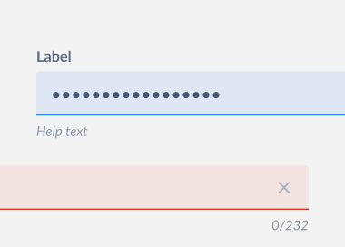

# PasswordInput

PasswordInput is an input field for entering passwords. The input is masked by default. On mobile devices the last typed letter is shown for a brief moment. The masking can be toggled using an optional reveal button.

This document outlines the API of `PasswordInput` component.



## Design

- [Figma - PasswordInput](https://www.figma.com/file/jubmQL9Z8V7881ayUD95ps/Blade---Payment-Light?node-id=10953%3A110176)

## API

`PasswordInput` is a wrapper over `BaseInput` fine tuned for entering passwords. Majority of API decisions are covered in `BaseInput` and `TextInput` decisions doc.

Sample usage:

```jsx
import { PasswordInput } from '@razorpay/blade';

<PasswordInput id="password" name="password" label="Label" />;
```

### PasswordInput

We'll expose an `PasswordInput` component with the following API:

| Prop                       | Type                                     | Default     | Description                                                                                                         | Required |
| -------------------------- | ---------------------------------------- | ----------- | ------------------------------------------------------------------------------------------------------------------- | -------- |
| label                      | `string`                                 | `undefined` | Label for the input field                                                                                           | ✅       |
| name                       | `string`                                 | `undefined` | `name` attribute for input field, useful for form submission                                                        |          |
| labelPosition              | `top`, `left`                            | `top`       | Position for the input label, `left` works only for larger screen size (fixed at `120px` width)                     |          |
| showRevealButton           | `boolean`                                | `true`      | Shows a reveal button to toggle visibility                                                                          |          |
| maxCharacters              | `number`                                 | `undefined` | Restricts max characters and shows a character counter under the input                                              |          |
| validationState            | `error` , `success`, `none`              | `none`      | Styles the input and decides whether to show `errorText`, `successText` or `helpText` respectively                  |          |
| errorText                  | `string`                                 | `undefined` | Displays a hint below the input in `error` validation state                                                         |          |
| successText                | `string`                                 | `undefined` | Displays a hint below the input in `success` validation state                                                       |          |
| helpText                   | `string`                                 | `undefined` | Displays a hint below the input in `none` validation state                                                          |          |
| isDisabled                 | `boolean`                                | `false`     | Disables the input field for user input when set to `true`                                                          |          |
| defaultValue               | `string`                                 | `undefined` | Sets the initial value of the input field                                                                           |          |
| placeholder                | `string`                                 | `undefined` | Sets the placeholder of the input field                                                                             |          |
| isRequired                 | `boolean`                                | `false`     | Marks the input field as required and adds `required` attribute to input                                            |          |
| necessityIndicator         | `required`, `none`                       | `none`      | Displays asterisk (`*`) when `required` is passed, only affects the visuals unlike `isRequired`                     |          |
| value                      | `string`                                 | `undefined` | Sets the value of input field, makes the input controlled                                                           |          |
| onChange                   | `({ name, value }) => {}`                | `undefined` | Input field `onChange` handler                                                                                      |          |
| onFocus                    | `({ name, value }) => {}`                | `undefined` | Input field `onFocus` handler                                                                                       |          |
| onBlur                     | `({ name, value }) => {}`                | `undefined` | Input field `onBlur` handler                                                                                        |          |
| autoFocus                  | `boolean`                                | `false`     | Automatically focusses the input field                                                                              |          |
| keyboardReturnKeyType      | _See reference below for web and native_ | `done`      | Determines how the return key should look on the keyboard on mobile devices or virtual keyboard                     |          |
| autoCompleteSuggestionType | `none`, `password`, `newPassword`        | `undefined` | Specifies autocomplete attribute for using a password manager or browser autofill. Defaults to platform heuristics. |          |

> **Note**
>
> Only one of `errorText`, `successText` or `helpText` is rendered at a time in the priority order: `errorText` ➡️ `successText` ➡️ `helpText`.

### Keyboard return key types for web and Native

| Key Type            | Web (`enterkeyhint`) | Native (`returnKeyType`)  |
| ------------------- | -------------------- | ------------------------- |
| <kbd>↵</kbd>        | `enter`              | `default`                 |
| <kbd>go</kbd>       | `go`                 | `go`                      |
| <kbd>Done</kbd>     | `done`               | `done`                    |
| <kbd>Next</kbd>     | `next`               | `next`                    |
| <kbd>Previous</kbd> | `previous`           | `previous` (android only) |
| <kbd>Search</kbd>   | `search`             | `search`                  |
| <kbd>Send</kbd>     | `send`               | `send`                    |

## a11y

- The password toggle button will have `aria-label` for showing or hiding the password

## Open questions

Q1. Does the password toggle button qualify for a disclosure pattern? I couldn't find anything significant on such a usecase. Content visibility toggles (like FAQ sections) do qualify for such a pattern but not sure if password fits the usecase because content is already on the screen, we just change the masked text to actual? For such a pattern we would need `aria-controls` and `aria-expanded` to be implemented correctly.

A1. Skipping for now.
