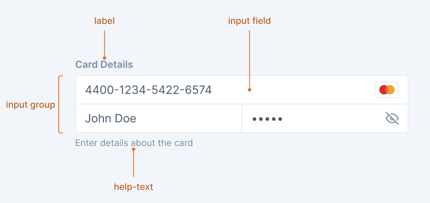

# PaymentInput Decisions <!-- omit in toc -->

PaymentInput extends existing TextInput and PasswordInput components with formatting capabilities for payment-related data including card numbers, expiry dates, and CVV codes.



- [Design](#design)
- [API](#api)
  - [TextInput with Formatting](#textinput-with-formatting)
  - [CVV Input (PasswordInput)](#cvv-input-passwordinput)
- [Usage Examples](#usage-examples)
- [Decisions](#decisions)
- [Open Questions](#open-questions)
- [References](#references)

## Design

[Figma Link](https://www.figma.com/design/jubmQL9Z8V7881ayUD95ps/Blade-DSL?node-id=10953-185841&p=f&m=dev) to all variants of the PaymentInput component

## API

### TextInput with Formatting

We extend existing TextInput with formatting capabilities using a generic approach:

```ts
type TextInputProps = BaseInputProps & {
  /**
   * Format pattern where # represents digits and other characters are delimiters
   * When provided, input will be automatically formatted
   * @example "#### #### #### ####" for card numbers
   * @example "##/##" for expiry dates
   * @example "(###) ###-####" for phone numbers
   */
  format?: string;

  /**
   * Trailing React component (e.g., Image, Icon)
   * When provided, component will be shown at the end of the input
   */
  trailing?: React.ComponentType<any>;

  /**
   * Enhanced onChange provides both formatted and raw values
   */
  onChange?: (event: {
    target: {
      value: string; // Formatted value (e.g., "1234 5678 9012 3456")
      rawValue: string; // Raw digits only (e.g., "1234567890123456")
      name?: string;
    };
  }) => void;
};
```

### CVV Input (PasswordInput)

For CVV, we keep it simple with just character limits:

```ts
type CVVInputProps = BaseInputProps & {
  /**
   * Maximum number of characters allowed
   * @default 4
   */
  maxLength?: number;
};
```

## Usage Examples

### Basic Payment Form

```jsx
import { TextInput, PasswordInput, Box } from '@razorpay/blade/components';

const [cardIcon, setCardIcon] = useState(null);

<Box display="flex" flexDirection="column" gap="spacing.4">
  <TextInput
    label="Card Number"
    format="#### #### #### ####"
    trailing={cardIcon}
    onChange={(event) => {
      const rawValue = event.target.rawValue;
      if (rawValue.length === 4) {
        const cardType = detectCardType(rawValue);
        setCardIcon(getCardIcon(cardType));
      }
    }}
  />

  <Box display="flex" gap="spacing.3">
    <TextInput label="Expiry Date" format="##/##" placeholder="MM/YY" />
    <PasswordInput label="CVV" maxLength={3} placeholder="123" />
  </Box>
</Box>;
```

### With InputGroup

```jsx
<InputGroup>
  <InputRow templateColumns="1fr">
    <TextInput label="Card Number" format="#### #### #### ####" trailing={cardIcon} />
  </InputRow>
  <InputRow templateColumns="1fr 1fr">
    <TextInput label="Expiry Date" format="##/##" />
    <PasswordInput label="CVV" maxLength={3} />
  </InputRow>
</InputGroup>
```

### Other Formatting Use Cases

```jsx
// Phone number
<TextInput
  label="Phone Number"
  format="(###) ###-####"
/>

// Social Security Number
<TextInput
  label="SSN"
  format="###-##-####"
/>
```

## Decisions

### Generic Formatting Approach

**Decision**: We chose a generic formatting API over payment-specific components.

**Rationale**:

- **Reusability**: The `format` prop can be used for phone numbers, SSN, dates, and other formatted inputs
- **Consistency**: Maintains API consistency with existing TextInput components
- **Flexibility**: Teams can use the same API for various formatting needs

### User-Managed Icon Handling

**Decision**: Users pass React components via `trailing` prop instead of built-in card type icons.

**Rationale**:

- **Flexibility**: Users can pass any React component (Image, Icon, custom components)
- **Control**: Teams have full control over icon appearance and behavior
- **Generic**: Works for non-payment use cases (bank icons, validation icons, etc.)

### Enhanced onChange with Dual Values

**Decision**: `onChange` provides both `value` (formatted) and `rawValue` (digits only) instead of separate formatting functions.

**Rationale**:

- **Simplicity**: Single event handler provides all needed data
- **Performance**: No additional function calls or state management needed
- **Familiarity**: Follows standard React event patterns
- **Flexibility**: Users can choose which value to use for validation, storage, or display

### Format-Based Constraints

**Decision**: `maxLength`, `minLength`, and input type are automatically derived from the `format` pattern.

**Rationale**:

- **Consistency**: Format pattern is the single source of truth
- **Simplicity**: Users don't need to specify redundant constraints
- **Error Prevention**: Eliminates mismatches between format and length constraints
- **Maintainability**: Changing format automatically updates all related constraints

### User-Managed Card Detection

**Decision**: Card type detection is handled by users in `onChange` callback rather than built-in detection.

**Rationale**:

- **Flexibility**: Teams can implement custom detection logic or use existing libraries
- **Bundle Size**: We don't bundle card detection patterns
- **Business Logic**: Card detection often involves business-specific rules
- **Generic Approach**: Keeps the component usable for non-payment formatting

### User-Controlled Format Values

**Decision**: Users determine format patterns based on detected card type rather than automatic format switching.

**Rationale**:

- **Predictability**: Format doesn't change unexpectedly during user input
- **Control**: Teams can implement custom format switching logic
- **Simplicity**: Component behavior is more predictable and testable
- **Edge Cases**: Avoids complex scenarios with format switching mid-input

## Open Questions

### Development

1. **Native Compatibility**: How to handle card scanning and autofill on native platforms?
   - Need to investigate if scanned card data can populate formatted inputs correctly
   - Ensure `textContentType` works properly with formatting

### Design

1. **Visual Feedback**: How should we indicate card type detection visually?
2. **Error States**: Should formatting errors be shown differently from validation errors?
3. **Icon Positioning**: Should trailing icons have consistent sizing and positioning?

## References

### Internal

- [Alternative Payment-Specific API Approach](https://docs.google.com/document/d/16k_3DEYSXSUeFEZGgL_bQ39GNKZMjE5ER8ouJvrd58o/edit?tab=t.0) - Payment-focused API with built-in behaviors

### External

- [Razorpay Checkout](https://github.com/razorpay/dashboard/pull/17299) - Payment input UX patterns
- [Stripe Elements](https://checkout.stripe.dev/checkout) - Payment input UX patterns
- [Ant Design Input](https://ant.design/components/input-number#input-number-demo-formatter) - Formatter function
  approach
- [Chakra UI Input](https://chakra-ui.com/docs/components/input) - Mask and format patterns
