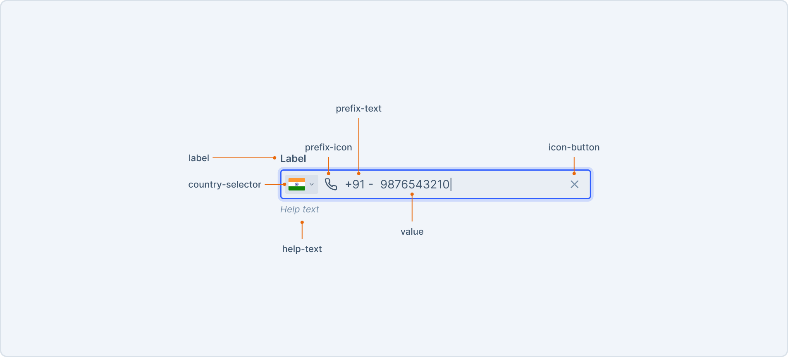

# PhoneNumberInput

A phone number input is an input field that allow users to input phone numbers with a keyboard. It supports entering phone numbers from different geographic locations.

This document outlines the API of `PhoneNumberInput` component.


## Design

- [Figma - PhoneNumberInput](https://www.figma.com/file/jubmQL9Z8V7881ayUD95ps/Blade-DSL?node-id=83906%3A15428&mode=dev)

## Anatomy




## Basic Usage

```jsx
import { PhoneNumberInput } from '@razorpay/blade';

<PhoneNumberInput
  countryCode="IN"
  defaultValue="123456789"
  onChange={({ phoneNumber, dialCode, countryCode, value }) => {
    phoneNumber; // "+91 123456789"
    dialCode; // 91
    countryCode; // "IN"
    value; // 123456789
  }}
/>;
```

## API

### PhoneNumberInput

PhoneNumberInput will extend the `BaseInput` and will have overlapping props such as: 

And for handling internationalization of phone numbers, we will use `@razorpay/i18nify-js`.

```ts
type CommonProps = Pick<
  BaseInputProps, 
  | 'label'
  | 'labelPosition'
  | 'name'
  | 'validationState'
  | 'errorText'
  | 'successText'
  | 'helpText'
  | 'defaultValue'
  | 'necessityIndicator'
  | 'isRequired'
  | 'isDisabled'
  | 'onFocus'
  | 'onBlur'
>

type PhoneNumberInputProps = CommonProps & {
  /**
   * Default value of the input, Used to set the default value of input field when it's uncontrolled
   */
  defaultValue?: string;
  /**
   * Value of the input, Used to turn the input field to controlled so user can control the value
   */
  value?: string;
  /**
   * The default country code to be used in the input.
   * 
   * @default "IN" or autodetect based on the user's locale
   */
  countryCode?: CountryCodeType;
  /**
   * Callback that is called when the value of the input changes.
   */
  onChange?: (event: { 
    /**
     * formatted phone number with dial code
     * 
     * @example: "+91 123456789"
     */
    phoneNumber: string; 
    /**
     * dial code of the country
     * 
     * @example: 91 for India
     */
    dialCode: string; 
    /**
     * country code of the country
     * 
     * @example: "IN" for India
     */
    countryCode: string; 
    /**
     * raw value of the input
     */
    value: string;
  }): void;
  /**
   * If true, the dial code text will be shown in the leading text.
   * 
   * @default true
   */
  showDialCode?: boolean;
  /**
   * If true, the country selector will be shown.
   * 
   * @default true
   */
  showCountrySelector?: boolean;
  /**
   * Callback that is called when the clear button is clicked.
   */
  onClearButtonClick?: (event: React.MouseEvent<HTMLButtonElement>) => void;
  /**
   * Icon to be shown on the leading side of the input.
   */
  leadingIcon?: IconComponent;
  /**
   * The size of the input field.
   * 
   * @default medium
   */
  size?: 'medium' | 'large'
}
```

## Accessibility

- The country selector will be accessible via keyboard navigation and be composed with blade's Dropdown component.
- The input field will have a `aria-label` attribute to describe the input field.

## Open questions

### MoM with i18n team

**Participants:** RK, Anurag, Tarun

**Concerns raised:**

1. How to get the flag icons of all the countries?
2. Should we format the phone number while typing?

**Discussion points:**

1. i18n team has exposed a function called [`getFlagOfCountry`](https://github.com/razorpay/i18nify/tree/master/packages/i18nify-js#getflagofcountrycountrycode-) which will return the flag svg via the [flagpedia CDN](https://flagpedia.net/download/api), we will have to render it as an image.
2. Discussed about the legitimacy and security of flagpedia CDN.
3. Formatting the phone number while typing will be a bit complicated on dev side and could cause edge cases. Thus as phase 1, we won't be formatting, Instead we will show the format in placeholder.
4. For validation of phone number we will do it on client side and add `validationState` prop based on the result.

**Action Items:**
1. RK will change the design to use the flags from the flagpedia CDN.
2. RK will update the design to show the format in placeholder and have non-formatted basic input field value.
3. Anurag will use the `getFlagOfCountry` function from i18n library.
4. Tarun to get security approval on the flagpedia CDN.
