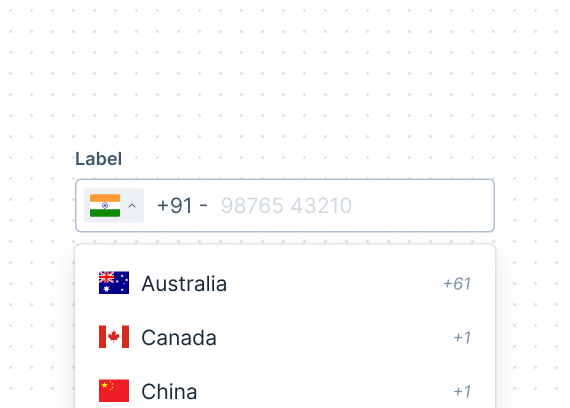

# PhoneNumberInput

A phone number input is an input field that allow users to input phone numbers with a keyboard. It supports entering phone numbers from different geographic locations.

This document outlines the API of `PhoneNumberInput` component.



## Design

- [Figma - PhoneNumberInput](https://www.figma.com/file/jubmQL9Z8V7881ayUD95ps/Blade-DSL?node-id=83906%3A15428&mode=dev)

## Anatomy


## Basic Usage

```jsx
import { PhoneNumberInput } from '@razorpay/blade';

<PhoneNumberInput
  defaultCountryCode="IN"
  defaultValue="123456789"
  onChange={({ phoneNumber, dialCode, countryCode, value }) => {
    phoneNumber; // "+91 123456789"
    dialCode; // 91
    countryCode; // "IN"
    value; // 123456789
  }}
/>;
```

## API

### PhoneNumberInput

PhoneNumberInput will extend the `BaseInput` and will have overlapping props such as: 

```ts
type CommonProps = Pick<
  BaseInputProps, 
  | 'label'
  | 'labelPosition'
  | 'name'
  | 'validationState'
  | 'errorText'
  | 'successText'
  | 'helpText'
  | 'defaultValue'
  | 'necessityIndicator'
  | 'isRequired'
  | 'isDisabled'
  | 'onFocus'
  | 'onBlur'
>

type PhoneNumberInputProps = CommonProps & {
  /**
   * Default value of the input, Used to set the default value of input field when it's uncontrolled
   */
  defaultValue?: string;
  /**
   * Value of the input, Used to turn the input field to controlled so user can control the value
   */
  value?: string;
  /**
   * The default country code to be used in the input.
   * 
   * @default "IN"
   */
  defaultCountryCode?: string;
  /**
   * Callback that is called when the value of the input changes.
   */
  onChange?: (event: { 
    /**
     * formatted phone number with dial code
     * 
     * @example: "+91 123456789"
     */
    phoneNumber: string; 
    /**
     * dial code of the country
     * 
     * @example: 91 for India
     */
    dialCode: string; 
    /**
     * country code of the country
     * 
     * @example: "IN" for India
     */
    countryCode: string; 
    /**
     * raw value of the input
     */
    value: string; 
  }): void;
  /**
   * If true, the dial code text will be shown in the leading text.
   * 
   * @default true
   */
  showDialCode?: boolean;
  /**
   * If true, the country selector will be shown.
   * 
   * @default true
   */
  showCountrySelector?: boolean;
  /**
   * Callback that is called when the clear button is clicked.
   */
  onClearButtonClick?: (event: React.MouseEvent<HTMLButtonElement>) => void;
  /**
   * Icon to be shown on the leading side of the input.
   */
  leadingIcon?: IconComponent;
  /**
   * The size of the input field.
   * 
   * @default medium
   */
  size?: 'medium' | 'large'
}
```

## Accessibility

- The country selector will be accessible via keyboard navigation and be composed with blade's Dropdown component.
- The input field will have a `aria-label` attribute to describe the input field.

## Open questions

- How can we get the flag icons of all the countries?
