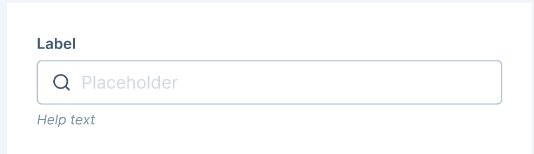
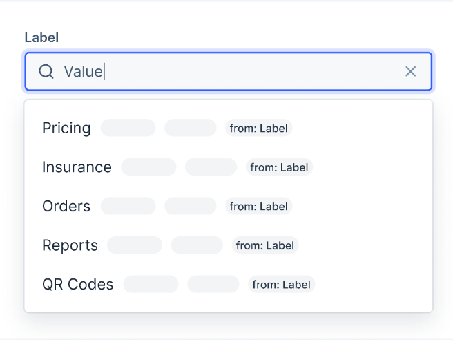
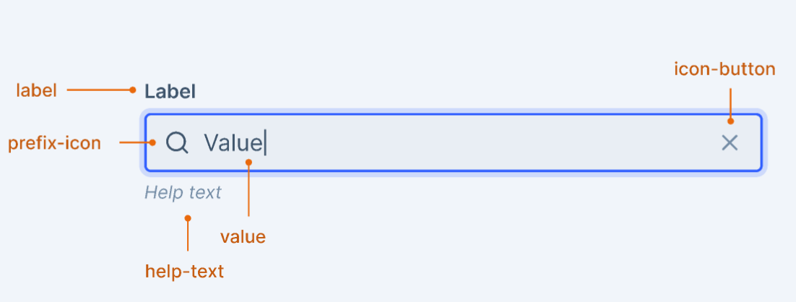

# SearchInput

The Search Input component enables users to input text and find relevant information within a diverse range of data or choices.

This document serves as an overview of the API for the `SearchInput` component.





## Design

- [Explore the design in Figma: SearchInput](https://www.figma.com/file/jubmQL9Z8V7881ayUD95ps/Blade-DSL?type=design&node-id=85072%3A160345&mode=design&t=Pv93G8LK6OtL4wwk-1)

## Anatomy



## API

The `SearchInput` component extends the `BaseInput` and shares common props:

```ts
type SearchInputCommonProps = Pick<
  BaseInputProps,
  | 'label'
  | 'accessibilityLabel'
  | 'labelPosition'
  | 'helpText'
  | 'placeholder'
  | 'defaultValue'
  | 'name'
  | 'onChange'
  | 'onFocus'
  | 'onBlur'
  | 'value'
  | 'isDisabled'
  | 'autoFocus'
  | 'onSubmit'
  | 'autoCapitalize'
  | 'testID'
  | 'onClick'
  | 'size'
> & {
  /**
   * Event handler to handle the onClick event for clear button.
   */
  onClearButtonClick?: () => void;

  /**
   * Decides whether to show a loading spinner for the input field.
   */
  isLoading?: boolean;
  /**
   * Toggle the visibility of the search icon.
   *
   * @default true
   */
  showSearchIcon?: boolean;
} & StyledPropsBlade;

/*
  Mandatory accessibilityLabel prop when label is not provided
*/
type SearchInputPropsWithA11yLabel = {
  /**
   * Label to be shown for the input field
   */
  label?: undefined;
  /**
   * Accessibility label for the input
   */
  accessibilityLabel: string;
};

/*
  Optional accessibilityLabel prop when label is provided
*/
type SearchInputPropsWithLabel = {
  /**
   * Label to be shown for the input field
   */
  label: string;
  /**
   * Accessibility label for the input
   */
  accessibilityLabel?: string;
};

type SearchInputProps = (SearchInputPropsWithA11yLabel | SearchInputPropsWithLabel) &
  SearchInputCommonProps;
};
```

## Usage

### With Dropdown

> **Note**
>
> The `event` parameter in the ActionListItem's `onClick` prop needs to be exposed to work with `react-router` for navigation handling.

```jsx
import React from 'react';
import {
  Dropdown,
  DropdownOverlay,
  SearchInput,
  ActionList,
  ActionListItem,
  Box,
} from '@razorpay/blade/components';

const App = () => {
  const [searchTerm, setSearchTerm] = useState('');
  const menuItems = [
    'Settings',
    'Profile',
    'Transactions',
    'Help',
    'Refunds',
    'Settlements',
    'Payouts',
  ];
  const popularItems = ['Transactions', 'Settlements'];

  return (
    <Dropdown>
      <SearchInput
        label="Search"
        onChange={({ value }) => setSearchTerm(value)}
        placeholder="Search here"
      />
      <DropdownOverlay>
        <ActionList>
          {searchTerm.length === 0
            ? popularItems.map((item, index) => (
                <ActionListItem key={index} title={item} value={item} />
              ))
            : menuItems
                .filter((item) => item.includes(searchTerm))
                .map((item, index) => <ActionListItem key={index} title={item} value={item} />)}
        </ActionList>
      </DropdownOverlay>
    </Dropdown>
  );
};
```

### With Table

```jsx
import React from 'react';
import { Box, SearchInput } from '@razorpay/blade/components';

const App = () => {
  const [searchTerm, setSearchTerm] = useState('');

  return (
    <Table
      data={data}
      toolbar={
        <TableToolbar>
          <TableToolbarActions>
            <SearchInput
              label="Search bank transactions"
              onChange={({ value }) => setSearchTerm(value)}
              placeholder="SBI, HDFC, ICICI, etc."
            />
          </TableToolbarActions>
        </TableToolbar>
      }
    >
      {(tableData) => (
        <>
          <TableHeader>
            <TableHeaderRow>
              <TableHeaderCell>Bank Name</TableHeaderCell>
              <TableHeaderCell>Amount</TableHeaderCell>
              <TableHeaderCell>Date</TableHeaderCell>
              <TableHeaderCell>Method</TableHeaderCell>
            </TableHeaderRow>
          </TableHeader>
          <TableBody>
            {tableData
              // Filter item based on the search input value
              .filter((tableItem) => tableItem.bankName.includes(searchTerm))
              .map((tableItem, index) => (
                <TableRow key={index} item={tableItem}>
                  <TableCell>
                    <Code size="medium">{tableItem.paymentId}</Code>
                  </TableCell>
                  <TableCell>
                    <Amount value={tableItem.amount} />
                  </TableCell>
                  <TableCell>
                    {tableItem.date?.toLocaleDateString('en-IN', {
                      year: 'numeric',
                      month: '2-digit',
                      day: '2-digit',
                    })}
                  </TableCell>
                  <TableCell>{tableItem.status}</TableCell>
                </TableRow>
              ))}
          </TableBody>
        </>
      )}
    </Table>
  );
};
```

## Accessibility

- The `SearchInput` component adheres to accessibility standards similar to `TextInput`.
- When used inside a dropdown, it will continue to follow the same [keyboard navigation as SelectInput](https://github.com/razorpay/blade/blob/master/packages/blade/src/components/Dropdown/_decisions/decisions.md#accessibility), ensuring a consistent and intuitive user experience.

## Open questions

NA.
