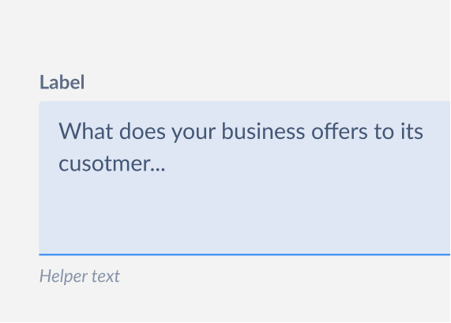

# TextArea

A textarea field is an input field that allow users to input custom text entries which spans over multiple lines with a keyboard.



## Design

- [Figma - Alerts](https://www.figma.com/file/jubmQL9Z8V7881ayUD95ps/Blade---Payment-Light?node-id=11115%3A166804)

## TextArea API

**Sample Usage**

```tsx
<TextArea
  label="Enter Message"
  labelPosition="left"
  placeholder="Enter your message"
  showClearButton
  helpText="Send message to author"
  errorText="Message cannot be blank"
  successText="Message sent"
  validationState={textareaValue.length < 10 ? 'error' : 'success'}
/>
```

| Props                | Type                      | Default | Description                                                                                                                                                                                                                                                  | Required |
| :------------------- | :------------------------ | :------ | :----------------------------------------------------------------------------------------------------------------------------------------------------------------------------------------------------------------------------------------------------------- | :------- |
| label                | `string`                  |         | Determines the label of an input field. Also used as aria-label                                                                                                                                                                                              | ✅       |
| labelPosition        | `top, left`               | `top`   | Used to identify if the label of the input field will be placed on the top of the input field or left. left is only available for large screen devices. When position is left then the width of the label is fixed to 120px and the content is aligned left. |          |
| placeholder          | `string`                  |         | Placeholder text to be displayed inside the text area                                                                                                                                                                                                        |          |
| value                | `string`                  |         | The value of the TextArea, if present will act as [controlled component](https://reactjs.org/docs/forms)                                                                                                                                                     |          |
| defaultValue         | `string`                  |         | The initial value of the TextArea                                                                                                                                                                                                                            |          |
| name                 | `string`                  |         | The name of the input, useful in form submissions                                                                                                                                                                                                            |          |
| onChange             | `({ name, value }) => {}` |         | Function called when the value of the input field changes                                                                                                                                                                                                    |          |
| onFocus              | `({ name, value }) => {}` |         | Function called when the input field receives focus                                                                                                                                                                                                          |          |
| onBlur               | `({ name, value }) => {}` |         | Function called when the input loses focus                                                                                                                                                                                                                   |          |
| isDisabled           | `boolean`                 | `false` | Marks the input field as disabled. It'll also set aria-disabled to true and hence the input field will loose keyboard focus                                                                                                                                  |          |
| isRequired           | `boolean`                 | `false` | Marks the input field as required. if the errorText is provided then that will be shown if the field is required                                                                                                                                             |          |
| necessityIndicator   | `required, optional`      |         | Indicator to be shown next to the label for emphasizing the necessity of the field. if optional is provided then it'll show `(optional)` and if required is provided then it'll show `*`                                                                     |          |
| showClearButton      | `boolean`                 | `true`  | Defines if we want to show the clear icon button on the right side of the password field                                                                                                                                                                     |          |
| onClearButtonClicked | `() => {}`                |         | Used in conjunction with showClearButton prop. If clicked it removes the contents of the TextArea. Users can also hook their own analytics code or do something else.                                                                                        |          |
| maxLines             | `number`                  | `2`     | Sets the number of lines (or rows) of the text area, minimum is `2` maximum is `5`                                                                                                                                                                           |          |
| maxCharacters        | `number`                  |         | Used to show a character counter under the input field                                                                                                                                                                                                       |          |
| validationState      | `error , success, none`   |         | Applies the style to the input field based on validation status and shows either errorText or successText respectively                                                                                                                                       |          |
| helpText             | `string`                  |         | Shown when we want to add some hint to the input field. Displayed under the input field. Only one of helpText, errorText or successText is shown at a time in the priority order as errorText, successText, helpText                                         |          |
| errorText            | `string`                  |         | Shown when the validationState of the input field is set to Error.                                                                                                                                                                                           |          |
| successText          | `string`                  |         | Shown when the validationState of the input field is set to Success                                                                                                                                                                                          |          |
| autoFocus            | `boolean`                 | `false` | The autofocus global attribute is a Boolean attribute indicating that an element should be focused on page load. Web Reference, Native Reference                                                                                                             |          |

## Open Questions:

- [x] Should the `onClearButton` by default clear the TextArea contents? Or should users handle that logic?
  - If the input is controlled then let the user handle the logic, if uncontrolled clear the contentes.
- [x] Does the `maxCharacters` just a suggestion or a hard limit? Like if it's set to 20 can users go above 20, like Twitter?
  - it's a hard limit unlike twitter. it basically sets maxLength on the input field natively
- [x] If the above is true, Should the textarea become invalid when `maxCharacters` count is exceeded?
  - Above is not true.
- [x] How will the `maxLines` behave? In design we set it to minimum of 2 and maximum of 5 lines, when we add `maxLines={4}` will it stay in `2` lines by default and then grow as needed based on the text content? or should it be just `4` lines. If it just stays in `4` lines no matter what then `numberOfLines` or `rows` (native html attribute like) would be a better name.
  - The textarea won't grow, It'll stay same as set by the prop exactly
- [x] In design we have that small resize handler on the bottom right corner of the textarea what would happen when user tries to resize the textarea given that we also want to enforce `maxLines`
  - We discussed to descope this for now because of trailing visual elements and it's visual issues

## References

- [Reshaped](https://reshaped.so/content/docs/components/text-area)
- [Polaris](https://polaris.shopify.com/components/text-field)
- [ChakraUI](https://chakra-ui.com/docs/components/textarea/props)
- [MaterialUI](https://mui.com/material-ui/react-textarea-autosize/#main-content)
