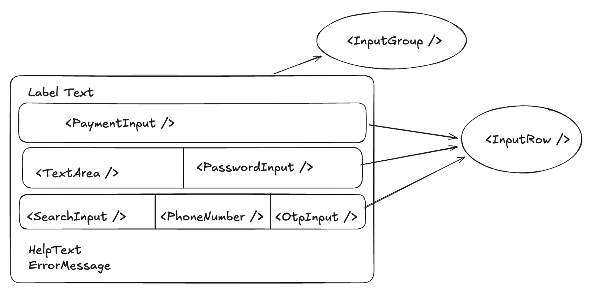
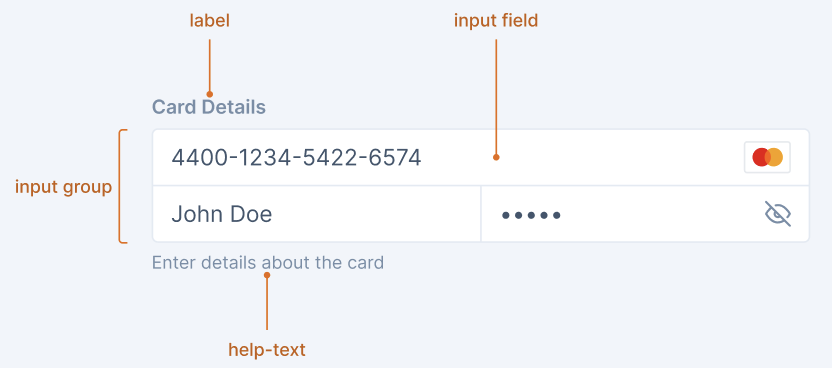

# InputGroup Decisions

The `InputGroup` component is used to group related input fields together under a common label, with shared help text and validation states.

This component provides a consistent way to organize multiple inputs that collect related information. InputGroup automatically handles proper spacing and visual connection between inputs to create a unified control.

### Input Group Anatomy



### Input Group Example Usage



- [Design](#design)
- [Component Hierarchy](#component-hierarchy)
- [`InputGroup` API](#inputgroup-api)
- [`InputRow` API](#inputrow-api)
- [Usage](#usage)
- [Component Behavior](#component-behavior)
  - [Validation State Handling](#validation-state-handling)
  - [Responsive Behavior](#responsive-behavior)
- [Accessibility](#accessibility)

## Design

[Figma Link](https://www.figma.com/design/jubmQL9Z8V7881ayUD95ps/Blade-DSL?node-id=104468-81766&m=dev) to all variants of the `InputGroup` component.

## Component Hierarchy

The `InputGroup` component is composed of the following components:

```
InputGroup
├── InputGroupLabel (internal)
├── InputRow(s)
│   └── Children (TextInput, PasswordInput, etc.)
└── InputGroupHelpText (internal)
└── InputGroupErrorText (internal)
```

## `InputGroup` API

The following props are supported by the InputGroup component:

### Prop Table

| Prop            | Type                           | Default  | Description                                                     |
| --------------- | ------------------------------ | -------- | --------------------------------------------------------------- |
| label           | string                         | -        | Label for the entire input group.                               |
| labelPosition   | 'top' \| 'left'                | 'top'    | Position of the label relative to the group.                    |
| size            | 'medium' \| 'large'            | 'medium' | Controls the size of the input group and its child inputs.      |
| helpText        | string                         | -        | Help text displayed at the bottom of the group.                 |
| validationState | 'error' \| 'success' \| 'none' | 'none'   | Controls which validation message is displayed.                 |
| errorText       | string                         | -        | Error message that appears when validationState is 'error'.     |
| successText     | string                         | -        | Success message that appears when validationState is 'success'. |
| isDisabled      | boolean                        | false    | Disables all inputs within the group.                           |
| children        | React.ReactNode                | -        | Should be InputRow components or other valid inputs.            |
| testID          | string                         | -        | Test ID for automation.                                         |

## `InputRow` API

### Prop Table

| Prop                | Type            | Default | Description                                                                                                               |
| ------------------- | --------------- | ------- | ------------------------------------------------------------------------------------------------------------------------- |
| gridTemplateColumns | string          | -       | CSS grid template columns value (e.g., "1fr 2fr" or "200px 1fr"). Controls how space is distributed between child inputs. |
| children            | React.ReactNode | -       | Input components to render in this row.                                                                                   |
| testID              | string          | -       | Test ID for automation.                                                                                                   |

## Usage

### Basic Usage

```jsx
import { InputGroup, InputRow, TextInput, PasswordInput } from '@razorpay/blade/components';

const App = () => {
  return (
    <InputGroup label="Card Details" helpText="Enter details about the card">
      <InputRow>
        <TextInput placeholder="4400-1234-5422-6574" />
      </InputRow>
      <InputRow gridTemplateColumns="1fr 2fr">
        <TextInput placeholder="John Doe" />
        <PasswordInput placeholder="•••••" />
      </InputRow>
    </InputGroup>
  );
};
```

### With Validation

```jsx
import { InputGroup, InputRow, TextInput, PasswordInput } from '@razorpay/blade/components';

const App = () => {
  return (
    <InputGroup
      label="Shipping Information"
      validationState="error"
      errorText="Please fill all required fields"
    >
      <InputRow>
        <TextInput placeholder="First Name" isRequired />
        <TextInput placeholder="Last Name" isRequired />
      </InputRow>
      <InputRow gridTemplateColumns="1fr 2fr">
        <TextInput placeholder="Street Number" />
        <TextInput validationState="error" placeholder="Street Name" isRequired />
      </InputRow>
      <InputRow gridTemplateColumns="2fr 1fr 1fr">
        <TextInput validationState="error" placeholder="City" isRequired />
        <TextInput placeholder="State" />
        <TextInput placeholder="Zip Code" isRequired />
      </InputRow>
    </InputGroup>
  );
};
```

## Component Behavior

### Validation State Handling

- The `InputGroup` component manages validation messages at the group level:

  - Only one message will be displayed at a time, with the following priority order:
    1. `errorText` (highest priority)
    2. `successText`
    3. `helpText` (lowest priority)
  - When `errorText` is provided, screen readers will be notified of the error state

- Individual inputs within the group:
  - Each input maintains its own validation state (`validationState="error"`, etc.)
  - Validation text from individual inputs is not displayed when wrapped in an InputGroup
  - Individual validation states are used only for visual indicators (red borders, etc.)
  - The group's validation message provides context for all errors in the group

This approach allows for highlighting specific inputs with errors while displaying a single, unified error message at the group level.

### Responsive Behavior

- On mobile screens:
  - Users need to handle mobile conditions themselves by adjusting `gridTemplateColumns` or component structure
  - Consider using single-column layouts or simplified grid structures for better mobile experience
  - `labelPosition` will automatically switch to 'top' even if 'left' is specified
- The vertical spacing between rows remains consistent across all viewport sizes

## Accessibility

### Role and Labeling

- The `InputGroup` component will have `role="group"` to indicate it's a logical collection of inputs
- The group label will be associated with the group using `aria-labelledby`
- Each input within the group maintains its own semantic role (e.g., `role="textbox"`)
- Help, error, or success text will be associated with the group using `aria-describedby`

### Keyboard Interaction

- When focus moves into the input group, focus is placed on the first focusable input element
- <kbd>Tab</kbd>: Moves focus to the next focusable element within the group
- <kbd>Shift + Tab</kbd>: Moves focus to the previous focusable element within the group
- Input elements within the group maintain their standard keyboard interactions as per their respective component types
