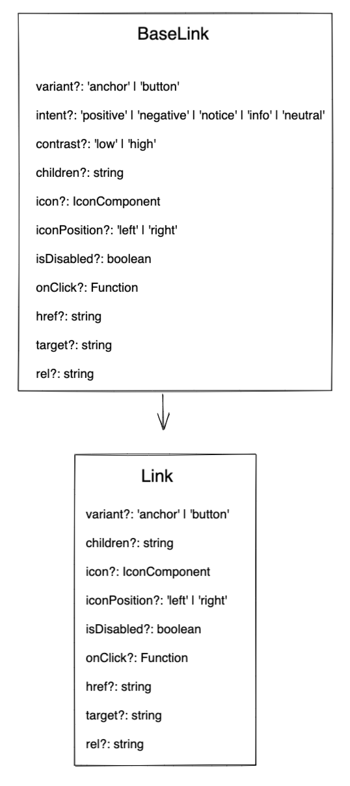

# Link Decisions <!-- omit in toc -->

- [Design](#design)
- [Internal BaseLink Component](#internal-baselink-component)
  - [BaseLink API](#baselink-api)
- [Link Component](#link-component)
  - [Link API](#link-api)
- [Component Breakdown](#component-breakdown)
- [Accessibility](#accessibility)
- [Open Questions](#open-questions)

## Design

[Figma Link](https://www.figma.com/file/jubmQL9Z8V7881ayUD95ps/Blade---Payment-Light?node-id=12699%3A147155) to the **Link** component

## Internal BaseLink Component

Internal component that exposes certain extra props to enable creation of Component Level Action Link like `positive`, `negative`, `neutral`, `information`, `notice`

### BaseLink API

| Prop               | Type                                                      | Required                                                                | Default   | Description                                                                                                                                                                                                                                             |
| ------------------ | --------------------------------------------------------- | ----------------------------------------------------------------------- | --------- | ------------------------------------------------------------------------------------------------------------------------------------------------------------------------------------------------------------------------------------------------------- | --------- |
| variant            | `anchor`, `button`                                        | _No_                                                                    | `anchor`  | The variant of the Link to be rendered.  Note: `button` will look like an inline Link component (no spacing; can be rendered alongside other text) but will be rendered as a `button` element.                                                    |
| intent             | `positive`,`negative`, `notice`, `information`, `neutral` | _No_                                                                    | undefined | The intent of the link to be rendered.   Note:   - We will use this to set the intent for internal Blade components that have positive, negative, notice, info, or neutral link buttons like an Alert component.                               |
| contrast           | `low`, `high`                                             | _No_                                                                    | `low`     | The contrast of the link to be rendered.   Note: We need this for internal Blade components since a `positive` intent could have a `high` as well as a `low` contrast link.                                                                       |
| children           | `string`                                                  | When `icon` is passed: _No_ When `icon` is not passed: _Yes_         | undefined | The text to be rendered within the link.                                                                                                                                                                                                                |
| icon               | `Icon`                                                    | When `children` is passed: _No_ When `children` is not passed: _Yes_ | undefined | The Blade `Icon` component to be rendered within the link.                                                                                                                                                                                              |
| iconPosition       | `left`, `right`                                           | _No_                                                                    | `right`   | The position of the rendered icon.                                                                                                                                                                                                                      |
| isDisabled         | `boolean`                                                 | _No_                                                                    | `false`   | Control whether the link is disabled or not.  Note: This prop is only valid for `button` variant.                                                                                                                                                 |
| onClick            | `Function`                                                | No                                                                      | undefined | The function to be called when the link is clicked.                                                                                                                                                                                                     |
| href               | `string`                                                  | No                                                                      | undefined | The href for the link component.  Note: This prop is only valid for `anchor` variant.                                                                                                                                                             |
| target             | `string`                                                  | No                                                                      | undefined | The target for the link component.  Note: This prop is only valid for `anchor` variant.                                                                                                                                                           |
| rel                | `string`                                                  | No                                                                      | undefined | The rel for the link component.  Note:  - This prop is only valid for `anchor` variant. -When `target` prop is set to `_blank`, `rel` will be automatically set to `noopener noreferrer` which can be overridden by passing the `rel` prop. |
| accessibilityLabel | `string`                                                  | No                                                                      | undefined | The `aria-label` (web) & `accessibilityLabel` (native) of the link component.                                                                                                                                                                           |
| size               | `small`                                                   | `medium`                                                                | No        | `medium`                                                                                                                                                                                                                                                | Font size |

## Link Component

A Link component that can act as a `<button>` as well as an `<anchor>` element. This will be the component exported to the consumers. This is a wrapper on top of `BaseLink` component to avoid exposing `intent` & `contrast` to consumers.

### Link API

| Prop               | Type               | Required                                                                | Default   | Description                                                                                                                                                                                                                                             |
| ------------------ | ------------------ | ----------------------------------------------------------------------- | --------- | ------------------------------------------------------------------------------------------------------------------------------------------------------------------------------------------------------------------------------------------------------- | --------- |
| variant            | `anchor`, `button` | _No_                                                                    | `anchor`  | The variant of the Link to be rendered.  Note: `button` will look like an inline Link component (no spacing; can be rendered alongside other text) but will be rendered as a `button` element.                                                    |
| children           | `string`           | When `icon` is passed: _No_ When `icon` is not passed: _Yes_         | undefined | The text to be rendered within the link.                                                                                                                                                                                                                |
| icon               | `Icon`             | When `children` is passed: _No_ When `children` is not passed: _Yes_ | undefined | The Blade `Icon` component to be rendered within the link.                                                                                                                                                                                              |
| iconPosition       | `left`, `right`    | _No_                                                                    | `right`   | The position of the rendered icon.                                                                                                                                                                                                                      |
| isDisabled         | `boolean`          | _No_                                                                    | `false`   | Control whether the link is disabled or not.  Note: This prop is only valid for `button` variant.                                                                                                                                                 |
| onClick            | `Function`         | No                                                                      | undefined | The function to be called when the link is clicked.                                                                                                                                                                                                     |
| href               | `string`           | No                                                                      | undefined | The href for the link component.  Note: This prop is only valid for `anchor` variant.                                                                                                                                                             |
| target             | `string`           | No                                                                      | undefined | The target for the link component.  Note: This prop is only valid for `anchor` variant.                                                                                                                                                           |
| rel                | `string`           | No                                                                      | undefined | The rel for the link component.  Note:  - This prop is only valid for `anchor` variant. -When `target` prop is set to `_blank`, `rel` will be automatically set to `noopener noreferrer` which can be overridden by passing the `rel` prop. |
| accessibilityLabel | `string`           | No                                                                      | undefined | The `aria-label` (web) & `accessibilityLabel` (native) of the link component.                                                                                                                                                                           |
| size               | `small`            | `medium`                                                                | No        | `medium`                                                                                                                                                                                                                                                | Font size |

## Component Breakdown

## Accessibility

- `role` will be `link` when variant is `anchor`
- `role` will be `button` when variant is `button`
- Accept `accessibilityLabel` from the consumer and set `aria-label` for web & `accessibilityLabel` for native

## Open Questions

NA
