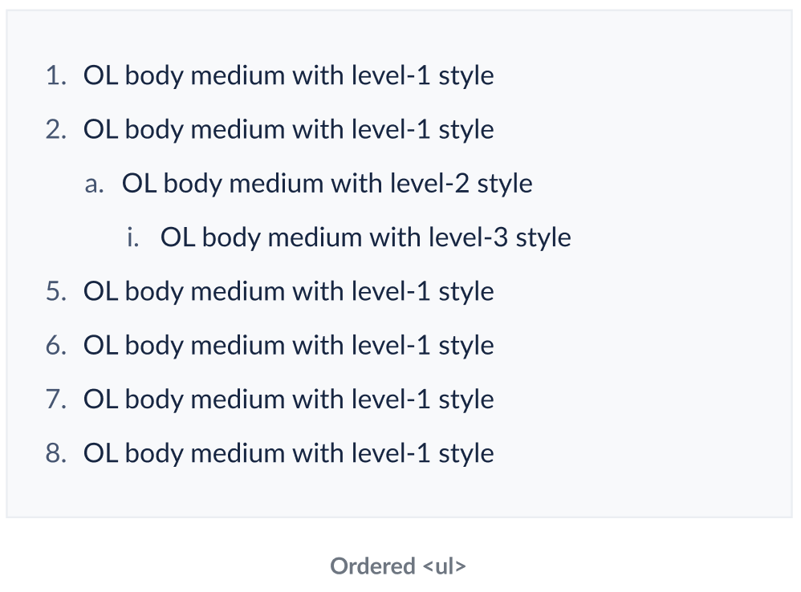

# List <!-- omit in toc -->
Lists display a set of related items that are composed of text/links. Each list item begins with a bullet or a number.


- [Design](#design)
  - [Unordered List](#unordered-list)
    - [Unordered List with 3 levels of nesting](#unordered-list-with-3-levels-of-nesting)
    - [Unordered List with custom icons for bullets](#unordered-list-with-custom-icons-for-bullets)
    - [Unordered List with inline Link in items](#unordered-list-with-inline-link-in-items)
  - [Ordered List](#ordered-list)
    - [Ordered List with 3 levels of nesting](#ordered-list-with-3-levels-of-nesting)
    - [Ordered List with _filled background_ numbers](#ordered-list-with-filled-background-numbers)
    - [Ordered List with inline Link in items](#ordered-list-with-inline-link-in-items)
- [API](#api)
  - [List Component](#list-component)
  - [ListItem Component](#listitem-component)
  - [ListItemLink Component](#listitemlink-component)
  - [Sample Usage](#sample-usage)
  - [Alternative APIs](#alternative-apis)
    - [Hierarchial with `variant` as `'ordered' | 'ordered-filled' | 'unordered'`](#hierarchial-with-variant-as-ordered--ordered-filled--unordered)
    - [Originally proposed API](#originally-proposed-api)
    - [Hierarchial with separate OrderedList \& UnorderedList Components](#hierarchial-with-separate-orderedlist--unorderedlist-components)
    - [Hierarchial without explicit nested `List` grouping](#hierarchial-without-explicit-nested-list-grouping)
    - [Hierarchial with a `nested` prop](#hierarchial-with-a-nested-prop)
    - [Non-Hierarchial with a `level` prop](#non-hierarchial-with-a-level-prop)
- [Accessibility](#accessibility)
- [Open Questions](#open-questions)
- [References](#references)


## Design
- [Figma - List](https://www.figma.com/file/jubmQL9Z8V7881ayUD95ps/Blade---Payment-Light?node-id=23205%3A446859&t=dT849yOxgX5WHgby-4)

### Unordered List
#### Unordered List with 3 levels of nesting


#### Unordered List with custom icons for bullets


#### Unordered List with inline Link in items


### Ordered List
#### Ordered List with 3 levels of nesting
> Level 1 will be 1, 2, 3,...

> Level 2 will be a, b, c,...

> Level 3 will be i, ii, iii,...



#### Ordered List with _filled background_ numbers
> No nesting will be allowed on this


#### Ordered List with inline Link in items


## API

### List Component
| Prop | Type | Default | Description | Required |
|---|---|---|---|---|
| children | `ListItem` | `undefined` | List items to render. | ✅ |
| variant | `ordered`, `ordered-filled`, `unordered` | `unordered` | Sets the list as ordered or unordered. |  |
| icon | `BladeIcon` | `undefined` | Icon to be used for the items in the list. This can only be set when `variant` is `unordered`. |  |
| size | `small`, `medium` | `medium` | Size of the list items. |  |

### ListItem Component
| Prop | Type | Default | Description | Required |
|---|---|---|---|---|
| children | `string`, `ListItemLink`, `List` | `undefined` | String to render in the list item. You may also pass a `ListItemLink` to render an inline link. You may also pass a `List` component which contains its own `ListItem` components to create a nested list.| ✅ |
| icon | `BladeIcon` | `undefined` | Icon to be used for the items in the list. This can only be set when `variant` is `unordered`. |  |

### ListItemLink Component
| Prop | Type | Default | Description | Required |
|---|---|---|---|---|
| children | `string` | `undefined` | The text to be rendered within the link.| ✅ |
| onClick | `Function` | `undefined` | The function to be called when the link is clicked. | |
| href | `string` | `undefined` | The href for the link component. | |
| target | `string` | `undefined` | The target for the link component. | |
| rel | `string` | `undefined` | The rel for the link component.<br>-When `target` prop is set to `_blank`, `rel` will be automatically set to `noopener noreferrer` which can be overridden by passing the `rel` prop. | |
| accessibilityLabel | `string` | `undefined` | The `aria-label` (web) & `accessibilityLabel` (native) of the link component. | |

Eg)
```jsx
<ListItem>
    For more information <ListItemLink href=''>Click here</ListItemLink>
</ListItem>
```

### Sample Usage
```jsx
import { List, InfoIcon, EditIcon } from '@razorpay/components';

<List variant='unordered' icon={InfoIcon} size='medium'>
  <ListItem icon={EditIcon}>
    Item 1
    <List variant='ordered'>
      <ListItem>
        Item 1.1
        <List variant='ordered-filled'>
          <ListItem>
            Item 1.1.1
          <ListItem/>
        <List/>
      <ListItem/>
    <List/>
  <ListItem/>
  <ListItem>
    Item 2		
  <ListItem/>
</List>
```

### Alternative APIs
#### Hierarchial with `variant` as `'ordered' | 'ordered-filled' | 'unordered'`
>Note: This will be the final API we will be going ahead with

```jsx
<List variant='unordered' icon={InfoIcon} size='medium'>
  <ListItem icon={EditIcon}>
    Item 1
    <List variant='ordered'>
      <ListItem>
        Item 1.1
        <List variant='ordered-filled'>
          <ListItem>
            Item 1.1.1
          <ListItem/>
        <List/>
      <ListItem/>
    <List/>
  <ListItem/>
  <ListItem>
    Item 2		
  <ListItem/>
</List>
```

**Pros:**
- This allows us to use `variant= 'ordered-filled'` instead of using `isOrderedFilled` as a boolean prop on `List` component

**Cons:**
- Adds an additional variant which strays away from what native html offers (only ordered & unordered)

#### Originally proposed API
```jsx
<List variant='unordered' icon={InfoIcon} size='medium'>
  <ListItem icon={EditIcon}>
    Item 1
    <List variant='ordered'>
      <ListItem>
        Item 1.1
        <List variant='ordered' isOrderedFilled={true}>
          <ListItem>
            Item 1.1.1
          <ListItem/>
        <List/>
      <ListItem/>
    <List/>
  <ListItem/>
  <ListItem>
    Item 2		
  <ListItem/>
</List>
```
**Reasons not to use it:**
- `isOrderedFilled` is specific to ordered list and would be more intuitive if its a separate variant in itself

#### Hierarchial with separate OrderedList & UnorderedList Components
```jsx
<UnorderedList icon={InfoIcon} size='medium'>
  <ListItem icon={EditIcon}>
    Item 1
    <OrderedList variant='filled'>
      <ListItem>
        Item 1.1
        <OrderedList>
          <ListItem>
            Item 1.1.1
          <ListItem/>
        <OrderedList />
      <ListItem/>
    <OrderedList />
  <ListItem/>
  <ListItem>
    Item 2		
  <ListItem/>
</UnorderedList>
```
**Pros:**
- This allows us to use `variant= 'filled' | 'default'` on `OrderedList` instead of using `isOrderedFilled` as a boolean prop on `List` component
- Much more closer to native html

**Reasons not to use this API:**
- Difficulty in discoverability of the `OrderedList` & `UnorderedList` components for consumers
  - Having a single `List` component is much more intuitive and easy to discover
- Slight maintenance overhead since we would need a `BaseList` where most logical implementation would lie and branch out `OrderedList` & `UnorderedList` for their own specific logical needs

#### Hierarchial without explicit nested `List` grouping
```jsx
<List variant='ordered'>
  <ListItem>
    Item 1
    <ListItem>
      Item 1.1		
      <ListItem>
        Item 1.1.1		
      <ListItem/>
    <ListItem>
      Item 1.2		
    <ListItem />		
  <ListItem/>		
  <ListItem/>
  <ListItem>
    Item 2		
  <ListItem/>
</List>
```

**Reasons to not use this API:**
- We cannot use this since we would need to support use-cases for Ordered List within Unordered List and vice-versa. This is why we would need a `List` component nested inside a `ListItem` component that can specify the variant of the list.

#### Hierarchial with a `nested` prop
```jsx
<List variant='ordered'>
  <ListItem 
    nested={
      <ListItem
        nested={
          <ListItem>
            Item 1.1.1
          <ListItem/>
        }
      >
        Item 1.1
      <ListItem/>
    }
  >
    Item 1
  <ListItem/>
  <ListItem>
    Item 2		
  <ListItem/>
</List>
```

**Reasons to not use this API:**
- Not very readable and hence doesn't pass our API standards

#### Non-Hierarchial with a `level` prop
```jsx
<List variant='ordered'>
  <ListItem level='1'>
    Item 1
  <ListItem/>
  <ListItem level='2'>
    Item 1.1
  <ListItem/>
  <ListItem level='2'>
    Item 1.2
  <ListItem/>
  <ListItem level='3'>
    Item 1.2.1
  <ListItem/>
  <ListItem level='1'>
    Item 2		
  <ListItem/>
</List>
```

**Reasons to not use this API:**
- Not very intuitive
- Hard to decipher the nesting just by looking at the code
- Could make looping through data (nested objects) dynamically to create a list component more difficult in this case

## Accessibility
- We will be using `<ol>`,`<ul>` & `<li>` directly instead of using `role` on a `<div>` for web since that's the recommended practice for lists and encompasses all the a11y needs.
  - We will be able to hide default styling & icons using `list-style-type: none; padding: 0px, margin: 0px`
  - [POC CodeSandbox Link](https://codesandbox.io/s/festive-sanne-2rb18j?file=/src/App.js)
- A11y for react-native is limited for lists and only a role of `list` is available which we will set on the `List` component
- ~Set `role` as `list` for the `List` component (only if we decided to not use `ol`, `ul` elements directly)~
  - ~This does not work well with screen readers. It doesn't announce the total number of items in the list.~
- ~Set `role` as `listitem` for the `ListItem` component (only if we decided to not use `ol`, `ul` elements directly)~
  - ~This does not work well with screen readers. It doesn't announce the item number, remaining number of items in the list and the current nesting level of the list.~

## Open Questions
- ~Discuss alternative APIs with the team~
- ~Would we allow different sizes within the same list?~ Nobody would use this but we also shouldn't add extra measures to restrict it
- ~onHover support for list items?~ No
- ~Do we allow ordered list within unordered list and vice versa?~ Yes, thats a valid use-case.
- ~Do we allow inline Code component?~ Yes
- ~Should we call it `ListItemLink` or `List.Link` or `ListItemLink`?~ We will call it `ListItemLink` to maintain consistency across other components where we made similar decisions and aid tree-shaking via this approach
- ~Bold ordered numbers?~ No bold numbers
- ~H1, H2, etc. for list items?~ No H1, H2 support from design
- ~Use-cases for List of level 1 with item that also contains list of level 1?~ No such support. The discovered use-cases in our product were incorrect usage.
- ~Ordered list with custom numbers?~ This won't be allowed
- ~What should we call `isOrderedFilled` instead?~ We will be using `variant='ordered-filled'` to satisfy this use-case
- ~Supporting images, GIFs, videos, custom components, bold text, non-bulleted text, and icons within list items.~ This is out of scope for now and might come in as an enhancement later on as per design decisions

## References
- [Polaris](https://polaris.shopify.com/components/list#list-items)
- [Chakra](https://chakra-ui.com/docs/components/list/)
- [Skyscanner Backpack](https://backpack.github.io/components/list/?platform=web#usage)
- [Mantine](https://mantine.dev/core/list/)
- [Carbon](https://carbondesignsystem.com/components/list/usage/)
- [PluralSight](https://design-system.pluralsight.com/components/text-list#lists)
- [Twilio Pase](https://paste.twilio.design/components/list/)
