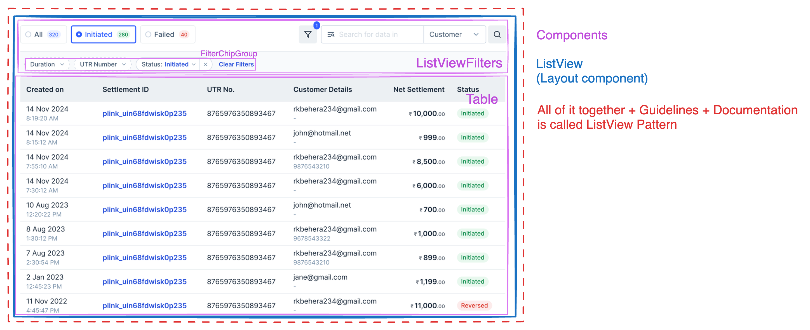
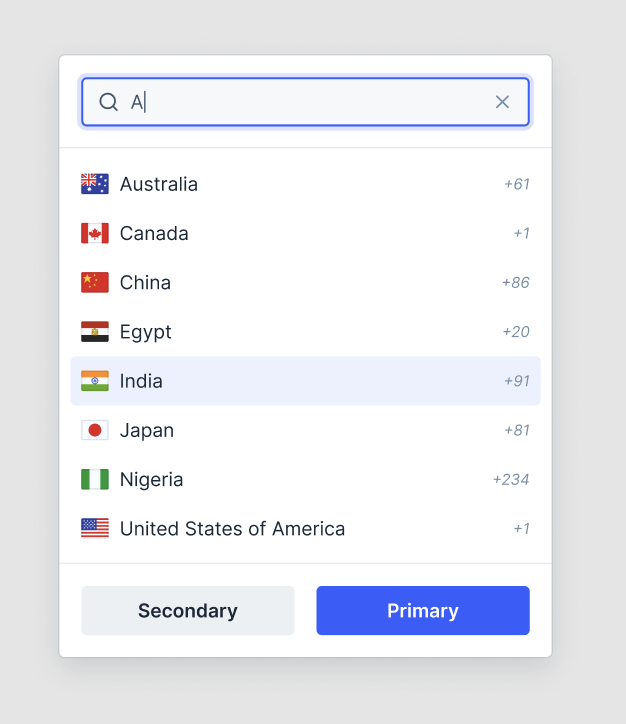
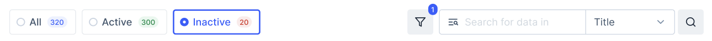

# List View Pattern API Decision

> [!NOTE]
>
> Questions like what is pattern, why are we building these patterns, and scope of pattern are answered in [pattern-terminology.md](./pattern-terminology.md)

List View Pattern is a UI pattern that includes Table, Filters, and Search of the table. It is a commonly used pattern on Razorpay dashboards to visualize data and help consumers filter / search through that data.



## API

### With Layout Component

```jsx
<ListView>
  <ListViewFilters
    quickFilters={
      <QuickFilterGroup onChange={({ values }) => console.log(values)}>
        <QuickFilter title="Status: Completed" value="completed" />
        <QuickFilter title="Status: Pending" value="pending" />
      </QuickFilterGroup>
    }
    onSearchChange={() => {
      /* filter on search */
    }}
  >
    <FilterChipGroup>
      <Dropdown>
        <FilterChip />
        <DropdownOverlay></DropdownOverlay>
      </Dropdown>

      <Menu>
        <FilterChip />
        <MenuOverlay>
          <TextInput />
        </MenuOverlay>
      </Menu>
    </FilterChipGroup>
  </ListViewFilters>
  <Table data={{ nodes: filteredNodes }} />
</ListView>
```

**Pros:**

- Layout can be controlled on design-system end which means in future if we decide to change layout of the list view pattern, consumers will only have to upgrade version
- Responsive layout can also be defined on design-system layer which other people might miss
- Consistent layout across all pages
- Functionality such as hide / show filters, placement of search, etc comes out of the box
- Less verbose compared to API without layout component

**Cons:**

- Restrictive API in what can be rendered inside the filters section. E.g. Search cannot be removed / moved to other-side (unless we give it as an option)
- Needs learning one more API with props like `quickFilters`, `onSearch`, etc compared to API without layout component where you use existing components and do custom layouts with Box.

### Alternate APIs

<details>
<summary>View alternate APIs like - API Without Layout Component, Config-driven filters, etc</summary>

#### Without Layout Component

```jsx
<Box>
  <Box display="flex" justifyContent="space-between">
    <QuickFilterGroup>
      <QuickFilter title="All" onClick={() => {}} />
      <QuickFilter title="Pending" onClick={() => {}} />
    </QuickFilterGroup>
    <Box>
      <Button icon={FilterIcon} />
      <InputGroup>
        <SearchInput />
        <Dropdown>
          <SelectInput />
          <DropdownOverlay></DropdownOverlay>
        </Dropdown>
      </InputGroup>
      <Button icon={SearchIcon} />
    </Box>
  </Box>
  <Box>
    <FilterChipGroup>
      <Dropdown>
        <FilterChip />
        <DropdownOverlay></DropdownOverlay>
      </Dropdown>

      <Menu>
        <FilterChip />
        <MenuOverlay>
          <TextInput />
        </MenuOverlay>
      </Menu>
    </FilterChipGroup>
  </Box>
  <Table data={{ nodes: filteredNodes }} />
</Box>
```

**Pros**

- No new layout component so consumers can use existing Box and existing components to create custom layouts
- More flexible API so consumers can add / remove / change items inside of filters section if needed

**Cons**

- No control over layout from design-system so tomorrow if we decide to change position of SearchInput for all filters in Razorpay, it cannot be done without a migration on consumer-side.
- Can lead to inconsistent spacings / responsive behaviours across pages if consumers don't handle it correctly.
- More verbose API as it requires handling layout manually
-

#### Config-driven filters

```jsx
<ListView>
  <ListViewFilterGroup
    quickFilters={[
      {
        title: 'All',
        onClick: () => setFilteredTableData(tableDefaultData),
      },
      {
        title: 'Pending',
        onClick: () =>
          setFilteredTableData(
            tableDefaultData.filter((tableData) => tableData.status === 'Pending'),
          ),
      },
    ]}
    filters={[
      {
        label: 'Status',
        options: ['All', 'Pending', 'Completed'],
        trigger: 'select-input',
        onChange: ({ name, value }) => {
          // filter on select
        },
      },
      {
        label: 'Customer Email',
        trigger: 'text-input',
        type: 'email',
        onBlur: () => {
          // filter on email change
        },
      },
      {
        label: 'Date',
        trigger: 'date-range',
        onChange: ({ name, value }) => {
          // filter on date range
        },
      },
    ]}
    onSearch={(searchValue, searchColumn = 'name') => {
      setFilteredTableData(
        tableDefaultData.filter((tableData) => searchValue.includes(tableData[searchColumn])),
      );
    }}
  />

  <Table data={{ nodes: filteredTableData }} />
</ListView>
```

**Pros**

- Less verbose compared to using dropdown and menu inside ListViewFilters

**Cons**

- Very strict API which might cause missing edge cases and rework on blade-side for every product change
- Will have bundle of Dropdown, Menu, DatePicker, BottomSheet, etc even if that particular filter is not used
- Less intuitive because it'll introduce new config. Compared to previous API where consumers will use filters using the components that they already know how to use like Dropdown, Menu, etc.

#### Extension of Table component

In this case, we add quickfilters, filters, search as an option to our existing Table component

Similar to [react-data-grid](https://mui.com/x/react-data-grid/filtering/quick-filter/) by MUI

```jsx
<Table
  data={{ nodes }}
  hasSearch
  quickFilters={[
    { title: 'All', onClick: (nodes) => nodes },
    {
      title: 'Pending',
      onClick: (nodes) => nodes.filter((node) => node.status === 'Pending'),
    },
  ]}
  filters={[
    {
      label: 'Status',
      options: ['All', 'Pending', 'Completed'],
      trigger: 'select-input',
      onChange: ({ name, value }) => {
        // filter on select
      },
    },
    {
      label: 'Customer Email',
      trigger: 'text-input',
      type: 'email',
      onBlur: () => {
        // filter on email change
      },
    },
    {
      label: 'Date',
      trigger: 'date-range',
      onChange: ({ name, value }) => {
        // filter on date range
      },
    },
  ]}
/>
```

**Pros**

- Less verbose API
- Consistent filtering experience on all tables

**Cons**

- Too strict with very little flexibility
- Adds up more things in tables which can make table difficult to maintain and will contain bundle of filters even when they are not used

</details>

## Enhancements / Components

- Enhancements:
  - Searchable Dropdown
  - InputGroup (Deprioritised for later)
- New Components
  - ListView (Layout Component)
  - FilterChip
  - QuickFilter

### Dropdown with AutoComplete in Overlay



```jsx
<Dropdown>
  <SelectInput />
  <DropdownOverlay>
    <DropdownHeader>
      <AutoComplete />
    </DropdownHeader>
    <ActionList>
      <ActionListItem />
      <ActionListItem />
      <ActionListItem />
    </ActionList>
</Dropdown>
```

### FilterChipGroup


#### Usage

```jsx
const [duration, setDuration] = React.useState();
const [utrNumber, setUtrNumber] = React.useState();
const utrNumberInputValueRef = React.useRef(null);

<FilterChipGroup>
  <FilterChipDatePicker
    label="Duration"
    selectionType="range"
    onChange={(date) => setDuration(date)}
  />

  {/* FilterChip as trigger for Menu will be released in future and not as part of initial development */}
  <Menu>
    <FilterChip value={utrNumber} onClearButtonClick={({ value }) => setUtrNumber(undefined)}>
      UTR Number
    </FilterChip>
    <MenuOverlay>
      <TextInput ref={utrNumberInputValueRef} />
      <Button onClick={() => setUtrNumber(utrNumberInputValueRef.current.value)}>Submit</Button>
    </MenuOverlay>
  </Menu>

  <Dropdown>
    <FilterChipSelectInput
      value={status}
      defaultValue="Initiated"
      onClearButtonClick={({ value }) => setStatus(undefined)}
      label="Status"
    />
    <DropdownOverlay>
      <ActionList>
        <ActionListItem title="All" onClick={({ name, value }) => setStatus(name)} />
        <ActionListItem title="Pending" onClick={({ name, value }) => setStatus(name)} />
        <ActionListItem title="Completed" onClick={({ name, value }) => setStatus(name)} />
      </ActionList>
    </DropdownOverlay>
  </Dropdown>
</FilterChipGroup>;
```

#### Props

##### FilterChipGroup

```ts
type FilterChipGroupProps = {
  /**
   * Children prop. Supports Dropdown, Menu components
   *
   */
  children: React.ReactNode;
};
```

##### FilterChip

FilterChip can be used as a trigger for Dropdown and Menu

```ts
type FilterChipProps = {
  /**
   * Controlled value of FilterChip.
   *
   * FilterChip is always a controlled component since selected state of it comes from other components like Menu, Dropdown.
   */
  value: string;

  /**
   * Change handler when FilterChip's value is cleared
   */
  onClearButtonClick: ({ value }: { value: string }) => void;

  /**
   * Children. Title of the Chip
   */
  children: string;

  /**
   * Disabled state for Chip
   */
  isDisabled?: boolean;
};
```

### ListView (Layout Component)

Layout Component for handling the overall layout of ListView and Filters. More about layout components at [pattern-terminology.md](./pattern-terminology.md)

```jsx
<ListView>
  <ListViewFilters
    quickFilters={
      <QuickFilterGroup onChange={({ values }) => console.log(values)}>
        <QuickFilter title="Status: Completed" value="completed" />
        <QuickFilter title="Status: Pending" value="pending" />
      </QuickFilterGroup>
    }
    onSearch={({ value, searchType }) => {
      /* filter on search */
    }}
  >
    <FilterChipGroup></FilterChipGroup>
  </ListViewFilters>
  <Table />
</ListView>
```

#### Props

##### ListView

```ts
type ListViewProps = {
  children: React.ReactNode;
};
```

##### ListViewFilters



```ts
type QuickFilter = {
  title: string;
  onClick: (e: React.MouseEvent) => void;
};

type OnSearchArgs = {
  /**
   * Value of the search input field
   */
  value: string;

  /**
   * Value of the Dropdown next to search input
   */
  searchType: string;
};

type ListViewFiltersProps = {
  /**
   * Slot for QuickFilterGroup
   */
  quickFilters: React.ReactElement;

  /**
   * Callback when user clicks search button
   *
   * This prop also controls whether search should be shown or not. When this is undefined, search is removed from layout
   */
  onSearch?: ({ value, searchType }: OnSearchArgs) => void;
};
```

### QuickFilterGroup

```jsx
<QuickFilterGroup onChange={({ values }) => console.log(values)}>
  <QuickFilter title="Status: Completed" value="completed" />
  <QuickFilter title="Status: Pending" value="pending" />
</QuickFilterGroup>
```

#### Props

##### QuickFilterGroup

```ts
export type QuickFilterGroupProps = {
  /**
   * Handler that returns selected values
   */
  onChange: ({ values }: { values: string[] }) => void;

  /**
   * Decides whether the filters are single select with radio or multiselect with checkboxes
   */
  selectionType?: 'single' | 'multiple';
};
```

##### QuickFilter

```ts
export type QuickFilterProps = {
  /**
   * Visible title
   */
  title: string;

  /**
   * Value that is returned in onChange callback of QuickFilterGroup
   */
  value: string;

  /**
   * Slot that comes after title. For Badge and Counter
   */
  titleSuffix: React.ReactElement;
};
```

## Accessibility

- All interactive items like Filters, Search, Button should be focussable
- Dropdown's keyboard navigation should continue to work the same way for FilterChip as it does for other triggers like Select

## Open Questions

- ### Naming `ListView` vs `TableFilterView`

  Currently we're calling it ListView because the terminology was used in Razorpay although this terminology is not really used anywhere outside of Razorpay and can cause confusion to new people who join.

  Alternate Options

  - ListView
  - FilterView
  - TableFilterView

  - **Conclusion:**
    - We decided to call it ListView due to its familiarity in Razorpay and confusion it can cause to existing developers and designers in razorpay

- ### Do we want to control layout or not?

  Currently proposed API assumes that we are controlling which item is placed where and thus proposes a Layout Component of ListView. I've mentioned the pros and cons of layout component. The API and alternate api is proposed above.

  #### Tradeoffs of Layout Component

  - If we go with Layout component, then the tradeoff is the educational effort of teaching consumer which part of the UI comes directly from blade as layout component.
  - If we go without Layout component, tradeoff is not being able to update the layout changes on consumer if something updates in dev.

  - **Conclusion:**
    - We decided to go ahead with layout components in this case because we see near-future usecases where we might have to move items / change visuals of internal components (e.g. going from 2 inputs to search to InputGroup component). Doing this without layout components would cause dev efforts on consumer-side everytime we decide to change the layout.
    - We discussed it against the tradeoff of introducing new components vs letting people use the existing components like SearchInput etc. Although technical limitations of not being able to ship layout changes takes more priority over the educational effort of teaching these new components.

- ### InputGroup

  Current designs have search input clubbed with the select input which is part of the scope of InputGroup component. Do we want to build InputGroup right now or leave that for later and go with intermediate UI?

  - **Conclusion:**
    - We will be building this later. Currently we'll ship it with 2 inputs instead.

## References

- [Filtering - Carbon](https://carbondesignsystem.com/patterns/filtering/)
- [Data Grid - Material UI ](https://mui.com/x/react-data-grid/filtering-recipes/)
- [Filter Pattern - Dell Design System](https://www.delldesignsystem.com/patterns/filter/)
- References for Patterns in [pattern-terminology.md#references](./pattern-terminology.md#references)
