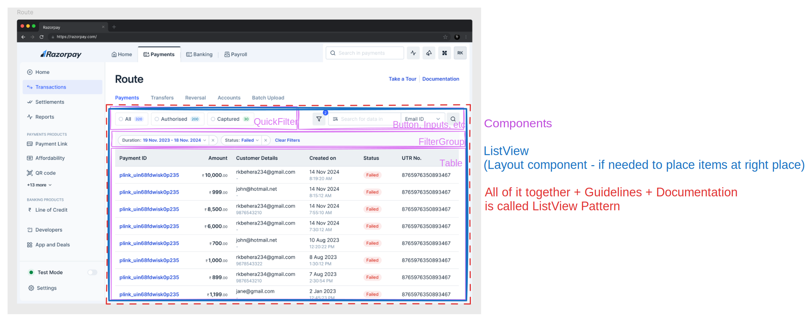

# UI Patterns

At blade, we have built tokens for consistent foundations, components for cosistent UIs, motion presets for consistent animations. Now its time to collect all these and build consistent experiences for our end-user using patterns.

## Why Patterns?

> "The elements of this language are entities called patterns. Each pattern describes a problem that occurs over and over again in our environment, and then describes the core of the solution to that problem, in such a way that you can use this solution a million times over..."
>
> ~ Christopher Alexander, Author of a Pattern Language

We have certain end-user interactions that are reused across multiple razorpay products such as-

- Filtering of the table
- Showing a quick view of the details of end-user
- A step-by-step form to get some information
- A group of form inputs

Currently these are solved differently for each product which means the end-consumer has to re-learn how to search a table, where to find relevant information, how to go to next step in form again and again.

By defining patterns, our goal is to bring consistent User Experience for our end-users for doing some of the common tasks that they do on Razorpay products.

## Terminologies

### What is a "Pattern" in design-systems?

- Nothing, really. There is nothing called as pattern. It's all components. Text, Button, Card, SideNav, DashboardLayout, ListView, QuickView, all of them in reality are components.
- Some components are more composable and flexible e.g. `SideNav`, `ListView` while others are more restrictive for consistency in UI e.g. `Text`, `Button`.
- "Patterns" can be used to refer to guidelines on how to use these components (especially more composable ones)
  - These guidelines can involve documentation on how to compose certain components
  - Dos and Donts'
  - Under which Indian law you will be jailed for breaking the pattern rules
  - Interaction guidelines
  - etc

But at the end, the way we build components, the way we create APIs won't change just because something is called as a pattern now.

#### Lets put this definition on some of the patterns that we are building

##### Pattern: List View

- **Components:**
  - QuickFilter
  - Filter
  - ListView (ListView can be built as parent component to control layout if we want to control layout otherwise be skipped)

##### Pattern: Quick View

- **Components:**
  - StepGroup ✅
  - Collapsible ✅
  - Drawer ✅
  - QuickView (QuickView can built as layout component to control layout of what is placed where)

Whether we want to build layout components like QuickView, ListView depends on the pros and cons of controlling layout from design-system. That call is independent of "pattern" terminology and can be taken case-by-case basis for each pattern.

"Layout component" is the term that is now used for components that don't have visual contribution to UI but decide which items is placed where. E.g. our TopNav can be called as layout component because it defines slots where TabNav and other items can be placed.

## Pros and Cons of building Layout Components

### Pros

- Layout components like ListView, QuickView give us (design system team) capability to define which item is placed where. E.g. it strictly enforces that SearchInput is always placed on right side of quick filters
- Gives us control over responsiveness
- Less verbose API for consumer
- Consistent spacings and paddings on all pages

## Cons

- Strict API so no flexibility over placing items somewhere else
- Introduces new API
- Layout might be dependent on overall page in some cases (e.g. if some page has sidebar in ipad and other ui does not, its the product that has the right context to take call on how UI looks on ipad)

## Conclusion

So one question is, what is the scope of patterns then. Based on pros and cons and terminologies we defined above, the scope of pattern would be-

- To build low-level components required to compose that pattern
- To build the layout component if needed depending on how much control is required for that particular pattern
- To define strict guidelines on which item should be placed where but not put restrictions from dev-side

