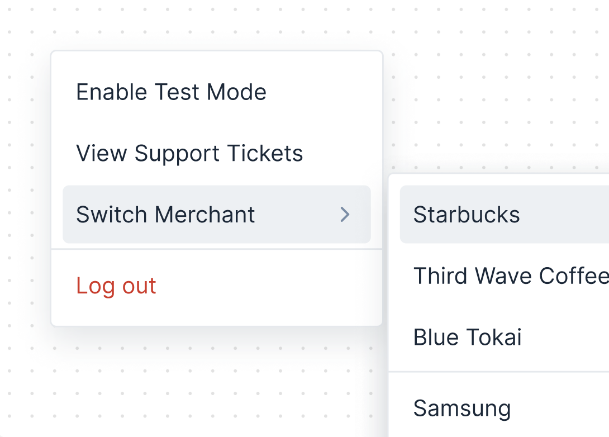
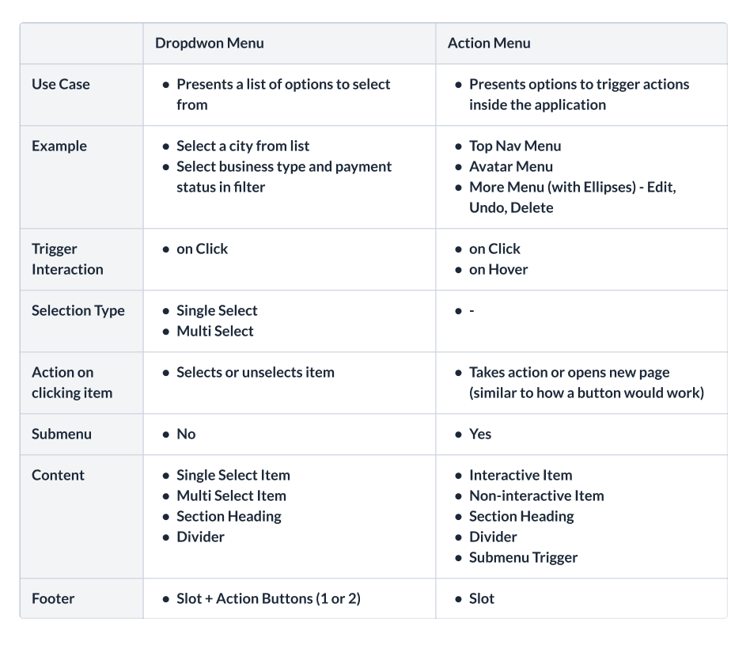

# Menu

Action Menu displays a list of actions on temporary surfaces. They allow users to action(s) from multiple options. They appear when users interact with a button, action, or other control.

Unlike Dropdown, they are specifically made to be non-selectable, clickable items and are more flexible with what they can contain. Checkout [Menu vs Dropdown](#menu-vs-dropdown) for more context.



## Design

- [Figma - Menu](https://www.figma.com/design/jubmQL9Z8V7881ayUD95ps/Blade-DSL?node-id=90082-41948&m=dev)

## API

```jsx
<Menu>
  {/* Any interactive item which has onClick, onMouseDown exposed */}
  <Button>Open Menu</Button>
  <MenuOverlay>
    <MenuHeader title="" />
    {/* All of this is a slot */}
    <Box display="flex" paddingY="spacing.4" gap="spacing.2">
      <Avatar name="Saurabh Daware" />
      <Text>Saurabh Daware</Text>
    </Box>
    <MenuDivider />
    <MenuItem title="Undo" onClick={() => console.log('Undo')} />
    <MenuItem title="Redo" isDisabled />
    <MenuItem title="Cut" />
    {/* Sub Menu */}
    <Menu>
      <MenuItem title="Copy" />
      <MenuOverlay>
        <MenuItem title="Text" />
        <MenuItem title="Video" />
        <MenuItem title="Audio" />
      </MenuOverlay>
    </Menu>
    <Menu>
      <MenuItem title="Share" />
      <MenuOverlay>
        <MenuItem title="Text" />
        <MenuItem title="Video" />
        <MenuItem title="Audio" />
      </MenuOverlay>
    </Menu>
    <MenuFooter>
      <Button>Apply</Button>
    </MenuFooter>
  </MenuOverlay>
</Menu>
```

## Props

### Menu

```ts
type MenuProps = {
  /**
   * First children is trigger and second children is MenuOverlay
   **/
  children: [React.ReactElement, React.ReactElement];

  /**
   * Open controlled state
   */
  isOpen?: boolean;

  /**
   * On Menu open change callback
   */
  onOpenChange?: ({ isOpen }: { isOpen: boolean }) => void;

  /**
   * Should menu open on click or hover
   *
   * @default 'click'
   */
  openInteraction?: 'hover' | 'click';
};
```

### MenuOverlay

This overlay will be flexible overlay which can have any component. Static / Non-Static / MenuItem / etc

```ts
type MenuOverlay = {
  /**
   * A slot inside Menu's overlay.
   *
   * Supports MenuItem or any other component
   */
  children: React.ReactElement[];
};
```

### MenuItem

```ts
type MenuItemProps = {
  /**
   * title of item
   */
  title: string;

  /**
   * Description text for the item
   */
  description?: string;

  /**
   * Click handler for MenuItem
   *
   * Absense of this prop and href will turn the item into non-interactive item
   */
  onClick?: (event: React.MouseEvent) => void;

  /**
   * Link to open when item is clicked.
   *
   * Absense of this prop and onClick will turn the item into non-interactive item
   */
  href?: string;

  /**
   * HTML target of the link
   */
  target?: string;

  /**
   * Item that goes on left-side of item.
   *
   * Will be overriden in multiselect
   */
  leading?: React.ReactNode;

  /**
   * Item that goes on right-side of item.
   */
  trailing?: React.ReactNode;

  /**
   * Item that goes immediately next to the title.
   */
  titleSuffix?: React.ReactElement;

  /**
   * disabled state of item
   */
  isDisabled?: boolean;

  /**
   * as prop to pass React Router's Link component for client-side navigation
   */
  as?: React.ReactComponent;

  /**
   * Color of item. set to negative for dangerous actions like Delete, Remove, etc
   */
  color?: 'negative';
};
```

### Menu Subcomponent Props

```ts
// Follows the standard header, footer types of Blade like DropdownHeader, ModalHeader, etc
type MenuHeaderProps = BaseHeaderProps;
type MenuFooterProps = BaseFooterProps;

// No props
type MenuDividerProps = {};
```

## Example APIs

### Basic API

```jsx
<Menu>
  <Button>Edit</Button> {/* Can be Link, Avatar, or any custom interactive item */}
  <MenuOverlay>
    {/* Supports any JSX */}
    <Box>Slot</Box>
    <Divider />
    <Box overflowY="auto">
      <MenuItem title="Profile" />
      <MenuItem>
        <Text>Custom Slot in Item</Text>
      </MenuItem>
    </Box>
  </MenuOverlay>
</Menu>
```

### SubMenu

```jsx
<Menu>
  <Button>Edit</Button>
  <MenuOverlay>
    <MenuItem title="Profile" />
    {/* You can nest menu and use MenuItem as trigger for the next submenu */}
    <Menu>
      <MenuItem title="Accounts" />
      <MenuOverlay>
        <MenuItem title="Business Account" />
        <MenuItem title="Personal Account" />
      </MenuOverlay>
    </Menu>
  </MenuOverlay>
</Menu>
```

### Custom Trigger

```jsx
<Menu>
  <CustomComponentTrigger />
  <MenuOverlay>{/* ... */}</MenuOverlay>
</Menu>
```

#### Menu Trigger Qualifications

For a component to be used as custom trigger-

- `ref` should be forwarded
- Following props should be exposed from your component
  - `aria-controls`
  - `aria-expanded`
  - `aria-haspopup`
  - `onClick`
  - `onFocus`
  - `onKeyDown`
  - `onKeyUp`
  - `onMouseDown`
  - `onPointerDown`

### Client-Side Navigation

Pass Router's Link from `as` prop for client-side navigation

```jsx
import { Link } from 'react-router-dom';

<MenuItem as={Link} href="/support" />;
```

## Questions you might have

### Menu vs Dropdown

#### 1. Comparison Table



#### 2. Why is this not just part of Dropdown?

We started Dropdown with SelectInput and AutoComplete-like usecases (basically Combobox usecases), so Dropdown includes all the code that's needed for selection, typeahead, arrow navigations, AutoComplete's filtering, etc.

Since our usecases of Menu were simple and small, we added triggers like DropdownButton, DropdownLink to also handle some of the menu cases inside our existing Dropdown.

But as we move into the next set of Menu usecases, we see the complexity of Menu increasing exponentially. Adding these usecases to Dropdown would mean- bloating dropdown with more unrelated code and bundle-size, ending up with inifinite edge cases, complex keyboard navigations for consumers, and bunch of if-else conditions internally to handle 2 very different usecases.

#### 3. Two Different Usecases

Normally you would see design-systems having 2 components. 1 for SelectInput, AutoComplete, etc and 2nd for Menu, ContextMenu, ActionMenu, etc

Examples

- [Primer SelectPanel](https://primer.style/components/selectpanel/react/alpha), [Primer ActionMenu](https://primer.style/components/action-menu/react/beta)
- [Ariakit Select](https://ariakit.org/components/select), [Ariakit Combobox](https://ariakit.org/components/combobox), [Ariakit Menu](https://ariakit.org/components/menu)

  > [!Note]
  >
  > AriaKit also has Select vs Menu usecases mentioned in their [Select vs Menu documentation](https://ariakit.org/components/menu#should-i-use-menu-or-select). You can check it out to understand their perspective

- [Radix Dropdown Menu](https://www.radix-ui.com/themes/docs/components/dropdown-menu), [Radix Context Menu](https://www.radix-ui.com/themes/docs/components/context-menu), [Radix Select](https://www.radix-ui.com/themes/docs/components/select)

Going forward, our Dropdown component will continue to cover SelectInput, AutoComplete, etc usecases where selections are happening.

And Menu will cover usecases which trigger certain actions, has complex interactive / non-interactive things inside the Overlay, requires submenus, custom triggers, etc.

#### 4. Impossible Scenarios

Putting menu usecases inside Dropdown also leads to more impossible scenarios in API. E.g-

- What does selection in submenu mean? Submenu items shouldn't be selectable
- What do custom components inside DropdownOverlay do? they can't be selected so shouldn't have selection logic code.
- How do you build more flexible menus with custom items? Dropdown relies on items inside of it to be selectable.

For these reasons, we are going ahead with Menu component which will be for more flexible, clickable menus that are not selectable.

## Is this a breaking change for Dropdown consumers?

**No**. Everything that works currently will continue to work. We will deprecate the DropdownButton, DropdownLink usage and recommend moving to Menu for those usecase but not break the usage of DropdownButton or DropdownLink.

How migration from deprecated API to recommended API will look like-

```diff
- <Dropdown>
-   <DropdownButton variant="tertiary" icon={UserIcon}>User</DropdownButton>
-   <DropdownOverlay>
-     <ActionList>
-       <ActionListItem title="Profile" />
-       <ActionListItem title="Account" />
-     </ActionList>
-   </DropdownOverlay>
- </Dropdown>
+ <Menu>
+   <Button variant="tertiary" icon={UserIcon}>User<Button>
+   <MenuOverlay>
+     <MenuItem title="Profile" />
+     <MenuItem title="Account" />
+   </MenuOverlay>
+ </Menu>
```

## Accessibility

- Menu will follow the accessibility of `dialog` since it can have anything inside the overlay.
- Unlike Dropdown, Menu will be accessed with TAB key and not arrow navigation since its dialog

## Open Questions

- ### Should we rename existing Dropdown component family?

  Our existing Dropdown component will be specific to Select and Combobox usecases now so should we rename existing components? (Will be a breaking change or deprecate existing names and re-export with new names)

  Proposed renames-

  1. Least Breaking- `ActionList*` --> `SelectList*`
  2. More Breaking- Rename Dropdown to Combobox

  ```jsx
  <Combobox>
    <SelectInput />
    <ComboboxOverlay>
      <ComboboxList />
        <ComboboxItem />
        <ComboboxItem />
      </ComboboxList>
    </ComboboxOverlay>
  </Combobox>
  ```

  #### Conclusion

  No. We won't tough the Dropdown right now to not break for existing consumers and only create new Menu component.

- ### Name Decision: Menu vs ActionMenu

  Currently calling it Menu because we have ActionList component. If we decide to rename that as mentioned in above question, we can rename this to ActionMenu as well.

  #### Conclusion

  Menu

- ### How much do we want to standardize design from code

  Currently I've built API with flexibility in mind where we just give item, overlay, and functionality from our end. But consumers can decide what goes inside the overlay and how to place items.

  - Should the header, footer be standardised?
  - Should non-interactive item be standardised?
  - Should section headings, dividers, etc be standardised?

  #### Conclusion

  We'll build header and footer component but rest things are left to consumer to implement since Menu has multiple usecases
