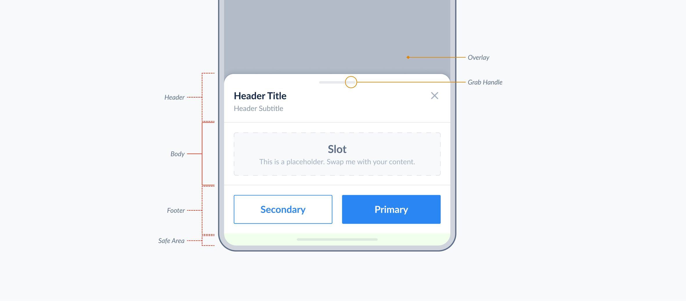

# Modal <!-- omit in toc -->

Modal components are often used to present information, notifications, or requests that require immediate attention or confirmation from the user. 

This document outlines the API of `Modal` component.

<!-- TODO: Add this -->
<!--  -->

- [Design](#design)
- [Anatomy](#anatomy)
  - [Modal Anatomy](#modal-anatomy)
  - [BottomSheet Anatomy](#bottomsheet-anatomy)
- [Animation](#animation)
- [API](#api)
  - [`Modal` API](#modal-api)
    - [Controlled State](#controlled-state)
  - [`ModalBody` API](#modalbody-api)
  - [`ModalHeader` API](#modalheader-api)
  - [`ModalFooter` API](#modalfooter-api)
- [Behaviors](#behaviors)
  - [Modal Closing](#modal-closing)
  - [Modal Stacking](#modal-stacking)
  - [Modal Sizes \& Responsiveness](#modal-sizes--responsiveness)
  - [Modal Height](#modal-height)
  - [Modal Usage on mWeb \& native apps](#modal-usage-on-mweb--native-apps)
    - [Using BottomSheet on mWeb](#using-bottomsheet-on-mweb)
  - [Modal for React Native](#modal-for-react-native)
- [Accessibility](#accessibility)
- [Open questions](#open-questions)
- [References](#references)

## Design

- [Figma - Modal](https://www.figma.com/file/jubmQL9Z8V7881ayUD95ps/Blade---Payment-Light?type=design&node-id=35860-607833&t=hEZsxB4yG6A3Gmib-0)

## Anatomy
Modal's Anatomy is similar to BottomSheet's Anatomy and we will keep the API decisions consistent to that of BottomSheet. You can find more details on [BottomSheet's API decisions here](https://github.com/razorpay/blade/blob/master/packages/blade/src/components/BottomSheet/_decisions/decisions.md).
### Modal Anatomy


### BottomSheet Anatomy
> Attached here only for reference



## Animation
**Entry:**


**Exit:**


## API

Sample usage:

```jsx
import { Modal, ModalHeader, ModalBody, ModalFooter, Button, Text } from '@razorpay/blade/components';

const [isOpen, setIsOpen] = useState(false);

<Modal isOpen={isOpen} onDismiss={() => setIsOpen(false)}>
  <ModalHeader title="Modal Title" />
  <ModalBody>
    <Text>This is the Modal Body</Text>
  </ModalBody>
  <ModalFooter>
    <Button variant='secondary'>Cancel</Button>
    <Button variant='primary'>Save</Button>
  </ModalFooter>
</Modal>
```

### `Modal` API

| Prop            | Type                       | Default             | Description                                                                                                                                                                | Required |
| --------------- | -------------------------- | ------------------- | -------------------------------------------------------------------------------------------------------------------------------------------------------------------------- | -------- |
| isOpen          | `boolean`                  | `false`             | Toggles modal state                                                                                                                                                 |          |
| size          | `small`, `medium`, `large`                  | `small`             | Size of the modal. Each size corresponds to a max-width for the Modal. Each size will have a fixed min-width of `320px`. See the [Modal Sizes & Responsiveness](#modal-sizes--responsiveness) section for more details.                                                                                                                                                 |          |
| onDismiss       | `Callback`                 | `undefined`         | Called when the modal is closed, either by user state, hitting `esc` or tapping backdrop                                                                            |          |
| initialFocusRef | `React.Ref`                | `undefined`         | ref element you want to get keyboard focus when opening the modal                                                                                                          |          |
| children | `React.ReactNode`                | `undefined`         | Accepts only Modal sub components like ModalHeader,ModalBody,ModalFooter                                                                                                          |          |

#### Controlled State
- Modal will always be a controlled component which means that the consumer will have to pass the `isOpen` prop and handle the state of the Modal themselves. 
- Internally we will call `onDismiss` when the user toggles the `isOpen` prop to `false` or hits `esc` or taps on the backdrop or clicks on the close icon on the Modal Header.

### `ModalBody` API

| Prop       | Type              | Default     | Description                 | Required |
| ---------- | ----------------- | ----------- | --------------------------- | -------- |
| `children` | `React.ReactNode` | `undefined` | Content of the Modal | ✅       |

### `ModalHeader` API
> `ModalHeader` API will be similar to [`BottomSheetHeader` API](https://github.com/razorpay/blade/blob/master/packages/blade/src/components/BottomSheet/_decisions/decisions.md#bottomsheetheader-api) with the exception of `showBackButton` & `onBackButtonClick` props.

| Prop      | Type            | Default     | Description                           | Required |
| --------- | --------------- | ----------- | ------------------------------------- | -------- |
| `title`   | `string`        | `undefined` | Title of the Header                   |       |
| `subtitle`   | `string`        | `undefined` | Subtitle of the Header                   |       |
| `leading` | `React.ReactNode` | `undefined` | leading asset or icon to be placed at the left most side of the ModalHeader |          |
| `trailing` | `Badge, Link, Text, IconButton`, `undefined` | undefined  |     trailing component to be placed at the right most side of the ModalHeader     |    |
| `titleSuffix` | `Counter` | `undefined` | A component to be placed adjacent to the title text |          |

### `ModalFooter` API
> `ModalFooter` API will be similar to [`BottomSheetFooter` API](https://github.com/razorpay/blade/blob/master/packages/blade/src/components/BottomSheet/_decisions/decisions.md#bottomsheetfooter-api).

| Prop       | Type              | Default     | Description                 | Required |
| ---------- | ----------------- | ----------- | --------------------------- | -------- |
| `children` | `React.ReactNode` | `undefined` | Contents of the ModalFooter | ✅       |

## Behaviors
### Modal Closing
- Modal can be closed by the user in 3 ways:
  - By clicking on the backdrop
  - By hitting the `esc` key
  - By clicking on the close icon on the Modal Header
- Each of these actions will call the `onDismiss` callback passed by the consumer.

### Modal Stacking
- We will be supporting stacking of Modals.
- As an initial implementation, we will have a basic stacking animation where the new Modal will have its own default entry and exit animation without affecting the existing Modal.
- As an enhancement post release, we will explore if we can have a more sophisticated stacking animation.


### Modal Sizes & Responsiveness


- We will offer Modal in 3 sizes - small, medium and large.
- Each size corresponds to a `max-width` for the Modal
- As of today these are the max-widths we're using for each size:
  - small: `400px`
  - medium: `760px`
  - large: `1024px`
- All the Modals will have a `width` of `100vw - 32px` (16px gap on left & right sides) so that there is always a gap between the Modal and the viewport.
- All the sizes of Modals will have a `min-width` of `320px`.
  - This would mean that the Modal will be responsive and will scale down to `320px` on smaller screens but will not scale up beyond the max-width as per its size mentioned above.
- **POC Link**: https://codesandbox.io/s/eloquent-lalande-jvxwno
  - This POC showcases the responsive behavior of the Modal component.
  - We've tried 2 approaches with a combination of different `max-width` & `width` values.
  - Since both of the approaches seem to work as expected, we will implemented the first approach of having `max-width` control the size and a fixed `width` of `100vw - 32px` for all the sizes.

### Modal Height
- Each Modal will have a max-height of `80vh` (80% of viewport height) and will be scrollable if the content exceeds this height.
- If the height of the content is less than `80vh`, the Modal's height will be equal to the height of the content.


### Modal Usage on mWeb & native apps
- We will **not be exposing** the Modal component on **mWeb** or native apps (this is a design guideline) instead we would encourage our teams be use BottomSheet for mWeb and native apps.
- Even though usage on mWeb is discouraged by our design guideline, our Modal will be responsive and will not visually break till 320px on mWeb.
- We will throw a warning when a Modal is opened on smaller screens as well as add this to our documentation.
- Designers would need to be mindful of this while designing for mWeb and native apps.
- On Figma, we have added guardrails to ensure that when screenSize is selected Mobile on Figma, Modal component will turn into a BottomSheet component.
- We are **not automatically changing** our **Modal to BottomSheet** on code to avoid bundle size overhead as well as to avoid any flow to break unless mindfully implemented with BottomSheet on code.

#### Using BottomSheet on mWeb
- As per our design guideline, we will be using BottomSheet on mWeb for all the use-cases where we would have used Modal on dWeb.
- This would require our consumers to add some logic to handle this switch from Modal to BottomSheet on mWeb.
- This decision also enables our consumers to save on bundle size so that the mWeb's bundle only contains BottomSheet and the dWeb's bundle only contains Modal.

**Example usage:**
```jsx
import { useTheme, BottomSheet, Modal } from '@razorpay/blade';

const App = () => {
  const { theme, platform } = useTheme();

  return (
    <>
      {platform === 'onMobile' ? (
        <BottomSheet>
          <BottomSheetHeader />
          <BottomSheetBody>
            /* BottomSheetBody content */
          </BottomSheetBody>
          <BottomSheetFooter />
        </BottomSheet>
      ) : (
        <Modal>
          <ModalHeader />
          <ModalBody>
            /* ModalBody content */
          </ModalBody>
          <ModalFooter />
        </Modal>
      )}
    </>
  );
};
```


### Modal for React Native
- Since we want to restrict the usage of Modals on native apps, we will not be implementing the Modal component for React Native.
- We will implement a dummy export which will only warn the consumer that this component is not supported on native apps.
- We will also add this to our documentation.

## Accessibility
- Trap keyboard focus within the modal.
- Close the modal when the user hits the `esc` key.
- Add `aria-modal='true'`
- Add `aria-role='dialog'`
- Expose `accessibilityLabel` prop
- Ref: https://www.w3.org/WAI/ARIA/apg/patterns/dialog-modal/

## Open questions
- Do we need a different animation for Modal stacking? Yet to explore on design
- Do we need a back button on Modal Header? Check with design

## References

- https://mui.com/material-ui/react-modal/
- https://reshaped.so/content/docs/components/modal
- https://carbondesignsystem.com/components/modal/usage/
- https://primer.style/react/drafts/Dialog
- https://atlassian.design/components/modal-dialog/examples
- https://design-system.pluralsight.com/components/dialog#modal
