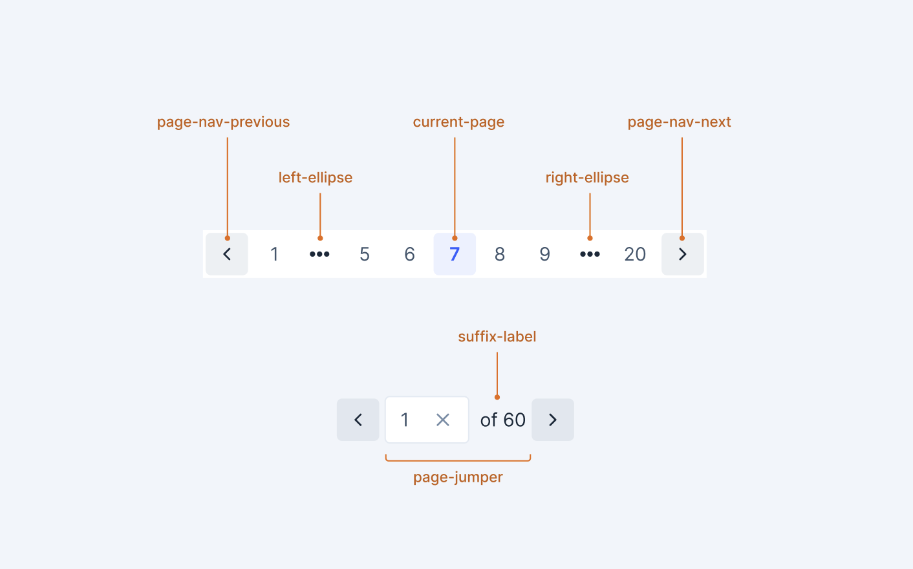

# Pagination

Pagination is a navigation component that allows users to navigate through multiple pages of content. It provides page number navigation, page size selection, and direct page jumping capabilities. This component is designed to be independent and reusable across different contexts, not just tables.



**Architecture**: The `Pagination` component is a fully-featured component with all pagination capabilities (page navigation, page size selection, labels, etc.). `TablePagination` is a wrapper component that uses `Pagination` internally and adds table-specific integrations (table context, paginationType for client/server modes).

## Design

- [Figma - Pagination](https://www.figma.com/design/jubmQL9Z8V7881ayUD95ps/Blade-DSL?node-id=75154-262065&m=dev)

## API

### Pagination Component

The `Pagination` component is a fully-featured component that handles all pagination functionality including page navigation, page size selection, and labels. This component can be used standalone or composed within `TablePagination`.

Overall structure showing the main usage pattern:

```jsx
import { Pagination } from '@razorpay/blade/components';

<Pagination
  totalPages={1000}
  selectedPage={1}
  onPageChange={({ page }) => setselectedPage(page)}
  showPageNumbers
  showPageSizePicker
/>;
```

### Props

#### Pagination

```typescript
// these props are same as props we have on TablePagination component

type PaginationCommonProps = {
  /**
   * Total pages in the pagination.
   */
  totalPages?: number;

  /**
   * Current active page (1-indexed).
   * When provided, the component is controlled.
   * When not provided, the component is uncontrolled and manages its own state.
   * @default undefined (uncontrolled)
   */
  selectedPage?: number;

  /**
   * Default page when uncontrolled (1-indexed, where 1 is the first page).
   * Only used when selectedPage is not provided.
   * @default 1
   */
  defaultSelectedPage?: number;

  /**
   * Callback fired when the page is changed.
   * The page parameter is 1-indexed.
   */
  onSelectedPageChange?: ({ page }: { page: number }) => void;

  /**
   * The default page size.
   * Page size controls how items are shown per page.
   * @default 10
   */
  defaultPageSize?: 10 | 25 | 50;

  /**
   * Current page size when controlled.
   * When provided, the page size is controlled.
   * When not provided, the component manages page size internally.
   * @default undefined (uncontrolled)
   */
  pageSize?: number;

  /**
   * Callback function that is called when the page size is changed.
   */
  onPageSizeChange?: ({ pageSize }: { pageSize: number }) => void;

  /**
   * Whether to show the page size picker. It will be always hidden on mobile.
   * Page size picker controls how items are shown per page.
   * @default false
   */
  showPageSizePicker?: boolean;

  /**
   * Whether to show the page number selector. It will be always hidden on mobile.
   * Page number selectors is a group of buttons that allows the user to jump to a specific page.
   * @default false
   */
  showPageNumbers?: boolean;

  /**
   * Content of the label to be shown in the pagination component.
   * If not provided, a default label will be shown based on current page and page size.
   */
  label?: string;

  /**
   * Whether to show the label. It will be always hidden on mobile.
   * @default false
   */
  showLabel?: boolean;

  /**
   * Whether the pagination component is disabled.
   * @default false
   */
  isDisabled?: boolean;
} & DataAnalyticsAttribute;

type PaginationProps = PaginationCommonProps & {
  /**
   * The label to be shown in the page size picker.
   * @default 'items / page'
   */
  pageSizeLabel?: string;
};
```

#### Controlled vs Uncontrolled Behavior

**Page Control:**

- **Controlled**: Pass `selectedPage` prop. Component will not update page internally, you must handle page changes via `onPageChange`.
- **Uncontrolled**: Omit `selectedPage` prop. Component manages page state internally. Use `defaultselectedPage` to set initial page.

**Page Size Control:**

- **Controlled**: Pass `selectedPageSize` prop. Component will not update page size internally, you must handle page size changes via `onPageSizeChange`.
- **Uncontrolled**: Omit `selectedPageSize` prop. Component manages page size internally using `defaultPageSize`.

**Examples:**

```jsx
// Controlled: Both page and page size are controlled
<Pagination
  totalPages={100}
  selectedPage={page}
  selectedPageSize={pageSize}
  showPageSizePicker
  showPageNumbers
  onPageChange={({ page }) => setPage(page)}
  onPageSizeChange={({ pageSize }) => setPageSize(pageSize)}
/>

// Uncontrolled: Component manages its own state
<Pagination
  totalPages={100}
  defaultselectedPage={0}
  defaultPageSize={10}
  onPageChange={({ page }) => console.log('Page changed:', page)}
  showPageSizePicker
  showPageNumbers
/>

// Mixed: Page is controlled, page size is uncontrolled
<Pagination
  totalPages={100}
  selectedPage={page}
  onPageChange={({ page }) => setPage(page)}
  defaultPageSize={10}
  showPageSizePicker={true}
  showPageNumbers={true}
/>
```

#### Usage Notes

- **All `Pagination` props are supported**: `TablePagination` accepts all props from `Pagination` and passes them through.
- **Table Context Integration**: When used within a `Table` component, `totalItemCount` may be automatically derived from the table's data if not explicitly provided.
- **Controlled/Uncontrolled**: Supports the same controlled/uncontrolled patterns as `Pagination` for both `selectedPage` and `selectedPageSize`.
- **Page Indexing**: Uses 0-indexed pages internally (page 0 is the first page).

## Component Architecture

### Relationship Between Components

The `Pagination` component is a **fully-featured standalone component** that contains all pagination functionality:

- Page navigation (previous/next buttons, page number selector, ellipsis handling)
- Page size selection (rows per page picker)
- Labels showing current range
- Controlled and uncontrolled behavior

**Key Points:**

- `Pagination` has **all the same props** as `TablePagination` (minus table-specific ones like `paginationType`)
- `TablePagination` is a **thin wrapper** that uses `Pagination` internally
- Both components support **controlled and uncontrolled** behavior
- Both components have **all features** (page size picker, labels, etc.)

### When to Use Which Component

**Use `Pagination` when:**

- You need pagination outside of a table context
- You want full control over pagination behavior
- You don't need table-specific integrations
- You want to use pagination in any context (not just tables)

## Examples

### Pagination Component Examples

#### Basic Usage (Uncontrolled)

Simple pagination with default settings, component manages its own state:

```jsx
<Pagination
  totalPages={100}
  defaultselectedPage={0}
  onPageChange={({ page }) => console.log('Page changed:', page)}
/>
```

#### Controlled Usage

Fully controlled pagination:

```jsx
<Pagination
  totalPages={100}
  selectedPage={page}
  selectedPageSize={pageSize}
  onPageChange={({ page }) => setPage(page)}
  onPageSizeChange={({ pageSize }) => setPageSize(pageSize)}
  showPageSizePicker
  showPageNumbers
/>
```

#### Advanced Usage with All Features

Full-featured pagination with all controls:

```jsx
<Pagination
  totalPages={1000}
  selectedPage={5}
  onPageChange={({ page }) => setselectedPage(page)}
  defaultPageSize={25}
  showPageSizePicker
  showPageNumbers
  showLabel
  label="Showing 126-150 of 1000 items"
/>
```

#### Using totalItemCount (Automatic Calculation)

Pagination with automatic totalPages calculation:

```jsx
<Pagination
  selectedPage={0}
  onPageChange={({ page }) => setselectedPage(page)}
  defaultPageSize={10}
  // totalPages will be calculated as Math.ceil(1000 / 10) = 100
/>
```

#### Mixed Controlled/Uncontrolled

Page is controlled, page size is uncontrolled:

```jsx
<Pagination
  totalPages={100}
  selectedPage={page}
  onPageChange={({ page }) => setPage(page)}
  defaultPageSize={10}
  showPageSizePicker
  // Page size is managed internally
/>
```

#### Disabled State

Pagination in disabled state:

```jsx
<Pagination
  totalPages={100}
  selectedPage={0}
  onPageChange={({ page }) => setselectedPage(page)}
  isDisabled
/>
```

## Accessibility

- **Keyboard Navigation**: All interactive elements (buttons, inputs) are keyboard accessible
- **ARIA Labels**: Proper ARIA labels and roles for screen readers
- **Focus Management**: Logical tab order through pagination controls
- **Screen Reader Support**: Clear announcements for page changes and current page state
- **High Contrast**: Support for high contrast mode
- **Page Announcements**: Screen readers announce page changes and current page information

## Open Questions

- Do we need props like `sibilings` and `boundariesCount` ?
