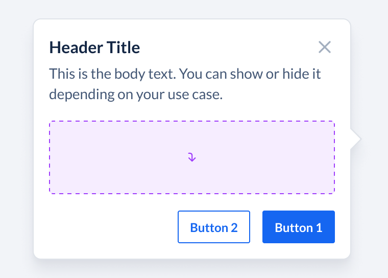

# Popover API Decisions <!-- omit in toc -->

The popover component is used to provide context as well as enable users to take certain actions on it. They are designed to display relevant information without requiring the user to navigate to a different page or dialog. Popovers are triggered on click or onload.



- [Design](#design)
- [`Popover` API](#popover-api)
  - [Examples:](#examples)
    - [Usage](#usage)
  - [Working with non-interactive triggers](#working-with-non-interactive-triggers)
  - [Custom Triggers](#custom-triggers)
- [Library](#library)
- [Motion](#motion)
- [Accessibility](#accessibility)
- [References](#references)

## Design

[Figma Link](https://www.figma.com/file/LSG77hEeVYDk7j7WV7OMJE/Blade-DSL---Components-Guideline?type=design&node-id=2875-40870&mode=design&t=mTbpUCQOr7kHk6UT-0) to all variants of the Popover component

## `Popover` API

| Prop            | Type                                                                                                                   | Default     | Description                                                                                                                           | Required |
| --------------- | ---------------------------------------------------------------------------------------------------------------------- | ----------- | ------------------------------------------------------------------------------------------------------------------------------------- | -------- |
| headerTitle     | `string`                                                                                                               | `undefined` | Title of the header                                                                                                                   | ✅        |
| headerLeading   | `React.ReactNode`                                                                                                      | `undefined` | Leading element to be placed before header title                                                                                      |          |
| content         | `string`                                                                                                               | `undefined` | Content of the popover                                                                                                                |          |
| children        | `React.ReactNode`                                                                                                      | `undefined` | Trigger component for popover, Accepts any interactive element or icons                                                               | ✅        |
| placement       | `top, top-start, top-end, left, left-start, left-end, right, right-start, right-end, bottom, bottom-start, bottom-end` | `top`       | Placement of popver, the popver avoid collision with the edge of the screen and flip to the oppisite side even when placement is set. |          |
| isOpen          | `boolean`                                                                                                              | `undefined` | Controlled state of the popover                                                                                                       |          |
| defaultIsOpen   | `boolean`                                                                                                              | `undefined` | Uncontrolled state of the popover                                                                                                     |          |
| onOpenChange    | `({ isOpen }) => void`                                                                                                 | `undefined` | Called when popover isOpen state is changed, this can be used to detect when popover opens or closed                                  |          |
| initialFocusRef | `React.RefObject`                                                                                                      | `undefined` | The ref of the element that should receive focus when the popover opens.                                                              |          |  |

### Examples:

#### Usage

```js
// basic example
<Popover
  placement="top"
  headerTitle="Header Title"
  headerLeading={<Icon />}
  content={<>Any content</>}
>
  <IconButton icon={InfoIcon} accessibilityLabel="Refund" />
</Popover>
```

### Working with non-interactive triggers

To make popover apear on hovering over non-interactive elements such as icons, badges, counters etc. We will provide a `PopoverInteractiveWrapper` component which will work as a minimal trigger:

```js
import { Popover, PopoverInteractiveWrapper } from '@razorpay/blade';

// non-interactive element as trigger
<Popover content="Amount reversed to customer bank account">
  <PopoverInteractiveWrapper>
    <Counter value={100} />
  </PopoverInteractiveWrapper>
</Popover>;
```

> Note: If users don't wrap the non-interactive elements the popover won't apear

### Custom Triggers

Users will be able to use their own custom components as triggers:

To make custom elements work the components needs to expose:

- ref
- Web:
  - onMouseDown
  - onMouseUp
  - onPointerDown
  - onPointerEnter
- Native:
  - onTouchStart
  - onTouchEnd

```jsx
import type { PopoverTriggerProps } from "@razorpay/blade/components";

type MyCustomButtonProps = {
  children: React.ReactNode
} & PopoverTriggerProps

const MyCustomButton = React.forwardRef<
  HTMLDivElement,
  MyCustomButtonProps
>(({ children, ...props }, ref) => {
  return (
    <button
      ref={ref}
      tabIndex={0}
      // you can either spread the props
      // or pick the onMouseDown, onMouseUp.. etc events and add them individually
      {...props}
    >
       {children}
    </button>
  );
});

// Custom trigger
<Popover content="Amount reversed to customer bank account">
  <MyCustomButton>Click me<MyCustomButton>
</Popover>
```

## Library

We will be using [FloatingUI](https://floating-ui.com/) to position the popover & handle the basic popover logic. Floating UI supports both Web & ReactNative.

## Motion

You can check the [popover motion here](https://www.figma.com/file/LSG77hEeVYDk7j7WV7OMJE/Blade-DSL---Components-Guideline?type=design&node-id=2875-43270&mode=design&t=mTbpUCQOr7kHk6UT-0).

And give relavant feedback for [motion in this thread](https://razorpay.slack.com/archives/C0274H7QRC1/p1691645251106119).

## Accessibility

- Popover will follow the [modaldialog](https://www.w3.org/WAI/ARIA/apg/patterns/dialog-modal/) WAI-ARIA pattern.
- This can be achived with FloatingUI's [`modal` prop](https://floating-ui.com/docs/popover#modal)

## References

- https://chakra-ui.com/docs/components/popover/usage
- https://ariakit.org/components/popover
- https://www.radix-ui.com/primitives/docs/components/popover
