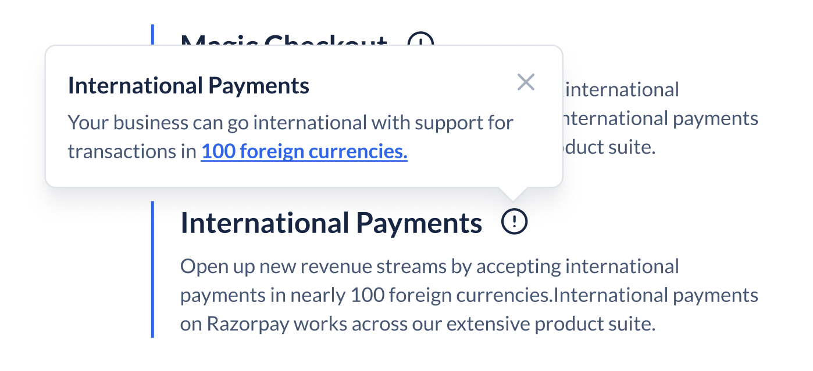

# Popover API Decisions <!-- omit in toc -->

The popover component is used to provide context as well as enable users to take certain actions on it. They are designed to display relevant information without requiring the user to navigate to a different page or dialog. Popovers are triggered on click or onload.


- [Design](#design)
- [Basic Features](#basic-features)
- [`Popover` API](#popover-api)
  - [Examples:](#examples)
    - [Usage](#usage)
    - [Controlled](#controlled)
    - [Uncontrolled](#uncontrolled)
    - [On initial load](#on-initial-load)
    - [Working with non-interactive triggers](#working-with-non-interactive-triggers)
  - [Custom Triggers](#custom-triggers)
- [Future Scope](#future-scope)
- [Tooltips vs Popovers vs Guided Popovers](#tooltips-vs-popovers-vs-guided-popovers)
- [Library](#library)
- [Motion](#motion)
- [Accessibility](#accessibility)
- [Open Question](#open-question)
- [References](#references)

## Design

[Figma Link](https://www.figma.com/file/LSG77hEeVYDk7j7WV7OMJE/Blade-DSL---Components-Guideline?type=design&node-id=2875-40870&mode=design&t=mTbpUCQOr7kHk6UT-0) to all variants of the Popover component

## Basic Features

- Controlled & Uncontrolled state
- Can be triggered on click or on load
- Can be placed on different placements (top, bottom, left, right)

## `Popover` API

| Prop            | Type                                                                                                                   | Default     | Description                                                                                                                           | Required |
| --------------- | ---------------------------------------------------------------------------------------------------------------------- | ----------- | ------------------------------------------------------------------------------------------------------------------------------------- | -------- |
| headerTitle     | `string`                                                                                                               | `undefined` | Title of the header                                                                                                                   | ✅        |
| headerLeading   | `React.ReactNode`                                                                                                      | `undefined` | Leading element to be placed before header title, recommended components are Icon or Asset. The icon's size will be set to large      |          |
| footer   | `React.ReactNode`                                                                                                      | `undefined` | Slottable content of the footer                                                                                                       |          |
| content         | `React.ReactNode`                                                                                                               | `undefined` | Content of the popover (can be any interactive or non-interactive elements)                                                                                                                |          |
| children        | `React.ReactNode`                                                                                                      | `undefined` | Trigger component for popover, Accepts any interactive element or icons                                                               | ✅        |
| placement       | `top, top-start, top-end, left, left-start, left-end, right, right-start, right-end, bottom, bottom-start, bottom-end` | `top`       | Placement of popver, the popver avoid collision with the edge of the screen and flip to the oppisite side even when placement is set. |          |
| isOpen          | `boolean`                                                                                                              | `undefined` | Controlled state of the popover                                                                                                       |          |
| defaultIsOpen   | `boolean`                                                                                                              | `undefined` | Uncontrolled state of the popover                                                                                                     |          |
| onOpenChange    | `({ isOpen }) => void`                                                                                                 | `undefined` | Called when popover isOpen state is changed, this can be used to detect when popover opens or closed                                  |          |
| initialFocusRef | `React.RefObject`                                                                                                      | `undefined` | The ref of the element that should receive focus when the popover opens.                                                              |          |  |

### Examples:

#### Usage

```js
// basic example
<Popover
  placement="top-end"
  headerTitle="International Payments"
  content={
    <Text>
      Your business can go international with support for transactions in 
      <Link href="#">100 foreign currencies.</Link>
    </Text>
  }
>
  <IconButton icon={InfoIcon} accessibilityLabel="Refund" />
</Popover>
```



#### Controlled 

```js
const ControlledPopover = () => {
  const [isOpen, setIsOpen] = React.useState(false);

  return (
    <>
    <Button onClick={()=> setIsOpen(prev => !prev)}>Trigger</Button>
    <Popover
      isOpen={isOpen}
      onOpenChange={({ isOpen }) => setIsOpen(isOpen)}
      content={<Text>Any content</Text>}
    >
      <IconButton icon={InfoIcon} accessibilityLabel="Refund" />
    </Popover>
    </> 
  )
}
```

#### Uncontrolled 

```js
const UncontrolledPopover = () => {
  return (
    <Popover
      defaultIsOpen={true}
      content={<Text>Any content</Text>}
    >
      <IconButton icon={InfoIcon} accessibilityLabel="Refund" />
    </Popover>
  )
}
```

#### On initial load 

To open the popover on initial load, consumers can just pass `defaultIsOpen` prop and whenever the popover mounts it will open.

```js
const InitialOpen = () => {
  return (
    <Popover
      defaultIsOpen={true}
      content={<Text>Any content</Text>}
    >
      <IconButton icon={InfoIcon} accessibilityLabel="Refund" />
    </Popover>
  )
}
```

#### Working with non-interactive triggers

To make popover apear on clicking a non-interactive elements such as icons, badges, counters etc. We will provide a `PopoverInteractiveWrapper` component which will work as a minimal trigger:

```js
import { Popover, PopoverInteractiveWrapper } from '@razorpay/blade';

// non-interactive element as trigger
<Popover content="Amount reversed to customer bank account">
  <PopoverInteractiveWrapper>
    <Counter value={100} />
  </PopoverInteractiveWrapper>
</Popover>;
```

> Note: If users don't wrap the non-interactive elements in `PopoverInteractiveWrapper` the popover won't apear

### Custom Interactive Triggers

Users will be able to use their own custom interactive components as triggers:

To make custom elements work, the component needs to expose its inner ref, this can be achieved by using `React.forwardRef`:

```jsx
import type { PopoverTriggerProps } from "@razorpay/blade/components";

type MyCustomButtonProps = {
  children: React.ReactNode
} & PopoverTriggerProps

const MyCustomButton = React.forwardRef<
  HTMLDivElement,
  MyCustomButtonProps
>(({ children, ...props }, ref) => {
  return (
    <button
      ref={ref}
      tabIndex={0}
      // you can either spread the props
      // or pick the onMouseDown, onMouseUp.. etc events and add them individually
      {...props}
    >
       {children}
    </button>
  );
});

// Custom trigger
<Popover headerTitle="Refund Status" content="Amount reversed to customer bank account">
  <MyCustomButton>Click me<MyCustomButton>
</Popover>
```

## Future Scope

Apart from normal Popovers while we audited the components used in Razorpay, we also found instances of Guided Popovers (Tour component), which can be used to guide users through a flow. 
We will be adding support for Guided Popovers in future.

Guided Popovers will have additional features like: 

- Ability to add multiple steps in a flow without juggling with state management
- Mask & backdrop support
- Proper guidelines on how to use the component

This will be a separate component and will be released in future, since the scope & complexity of Guided Popovers will be much larger than normal Popovers.

## Tooltips vs Popovers vs Guided Popovers

|                         	| Tooltip                                          	| Popover                                                        	| GuidedPopover                                                  	|
|-------------------------	|--------------------------------------------------	|----------------------------------------------------------------	|----------------------------------------------------------------	|
| **Use Case**            	| Set context                                      	| Set context<br>Let user take action                            	| Highlight new feature<br>Let users take action                 	|
| **Trigger Interaction** 	| Hover                                            	| onClick<br>onLoad                                              	| onClick<br>onLoad                                              	|
| **Triggered By**        	| Interactive elements<br>Non-interactive elements 	| On page load<br>Interactive elements<br>Non-interactive elements               	| On page load<br>Nav buttons of current popover                 	|
| **Content**             	| Heading<br>Body Text (Normal + Bold)            	| Heading<br>Rich Body Text<br>Links<br>Buttons<br>Assets/ Media 	| Heading<br>Rich Body Text<br>Links<br>Buttons<br>Assets/ Media 	|
| **Header**              	| Plain Text                                       	| Plain Text<br>Leading Icon<br>Leading Asset                     	| Plain Text<br>Leading Icon<br>Leading Asset                     	|
| **Footer**              	| No                                               	| Slot<br>Action Buttons(1 or 2)                                	| Action Buttons(1 or 2)<br>Nav Buttons (2)                     	|
| **Dismiss Button**      	| No                                               	| Yes                                                            	| Yes                                                            	|
| **Background Overlay**  	| No                                               	| No                                                             	| Yes                                                            	|


## Library

We will be using [FloatingUI](https://floating-ui.com/) to position the popover & handle the basic popover logic. Floating UI supports both Web & ReactNative.

## Motion

You can check the [popover motion here](https://www.figma.com/file/LSG77hEeVYDk7j7WV7OMJE/Blade-DSL---Components-Guideline?type=design&node-id=2875-43270&mode=design&t=mTbpUCQOr7kHk6UT-0).


https://github.com/razorpay/blade/assets/35374649/f774e28f-bbb7-4f44-a41d-71e9b873ec0c


And give relavant feedback for [motion in this thread](https://razorpay.slack.com/archives/C0274H7QRC1/p1691645251106119).

## Accessibility

- Popover will follow the [modaldialog](https://www.w3.org/WAI/ARIA/apg/patterns/dialog-modal/) WAI-ARIA pattern.
- This can be achived with FloatingUI's [`modal` prop](https://floating-ui.com/docs/popover#modal)

## Open Question

How should the footer API look like? 

- Should we keep footer flexible and accept React.ReactNode? 
- Or should we follow similar API like Alert? 

**Flexible API:**

```jsx
<Popover
  content={<Text>Any content</Text>}
  footer={
    <Box display="flex">
      <Button>Primary me</Button>
      <Button variant="secondary">Secondary me</Button>
    </Box>
  }
>
  <IconButton icon={InfoIcon} />
</Popover>
```

**Contrained API:** 

```jsx
<Popover
  content={<Text>Any content</Text>}
  footer={<Text>Slotted content of Footer</Text>}
  footerActions={{
    primary: {
      text: "Primary me",
      onClick: () => {},
    },
    secondary: {
      text: "Secondary me",
      onClick: () => {},
    },
  }}
>
  <IconButton icon={InfoIcon} />
</Popover>
```

**Conclusion:** We will go ahead with Flexible API as this will mostly be controlled by design and design has the slots and permutations and combinations in place of what is allowed and what is disallowed.

## References

- https://chakra-ui.com/docs/components/popover/usage
- https://ariakit.org/components/popover
- https://www.radix-ui.com/primitives/docs/components/popover
