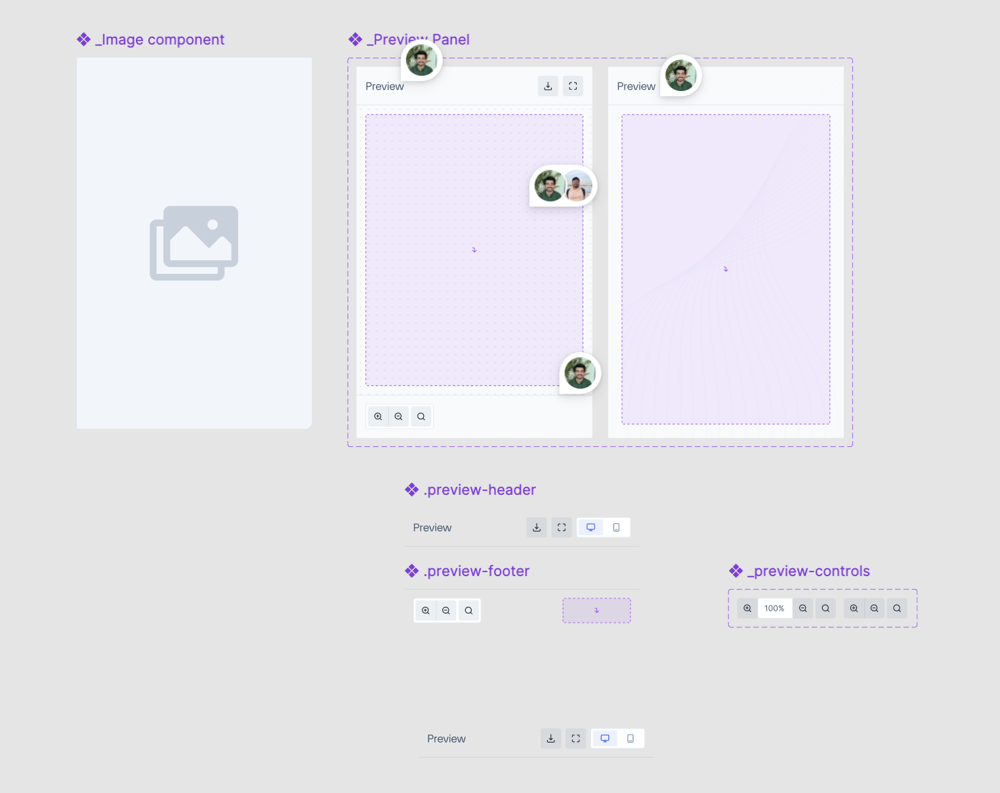
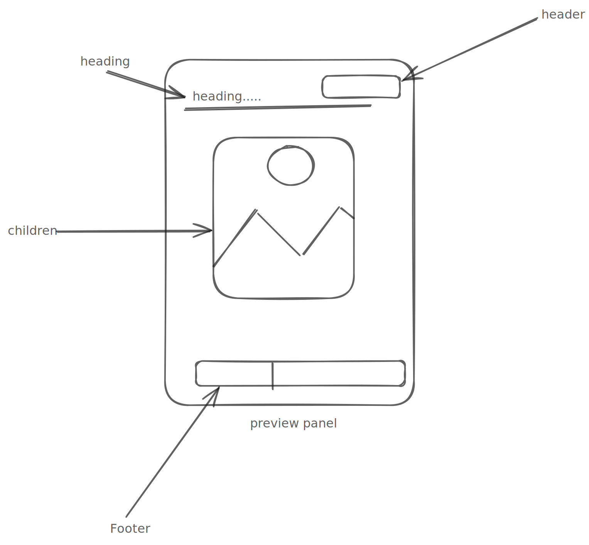

# Preview Decisions

A **Preview** is a component used to display a visual preview of an image or any other UI component.




---

- [Design](#design)
- [Preview Component](#preview-component)
  - [Preview API](#preview-api)
  - [Alternative API](#alternative-api)
- [Open Questions](#open-questions)

---

## Design

[Figma Link](https://www.figma.com/design/jubmQL9Z8V7881ayUD95ps/Blade-DSL?node-id=103462-52670&p=f&t=qC2NU4R56lEGsGFB-0)

---

## Preview Window Component

The `Preview` component is the primary component used to render a live preview of content with optional interactivity and controls.

---

## Preview Window API

| Prop                   | Type                                           | Default | Required | Description                                                        |
| ---------------------- | ---------------------------------------------- | ------- | -------- | ------------------------------------------------------------------ |
| `children`             | `React.Element`                                | —       | Yes      | The component to be rendered inside the preview window.            |
| `onFullScreen`         | `() => void`                                   | —       | No       | Callback invoked when the fullscreen button is clicked.            |
| `isDragAndZoomDisabled` | `boolean`                                      | —       | No       | Whether Drag and Zoom functionality is enabled.                    |
| `onZoomChange`         | `({ zoom }) => void`                           | —       | No       | Callback invoked when the zoom level changes.                      |
| `onDragChange`         | `(position: { x: number; y: number }) => void` | —       | No       | Callback invoked when the drag position changes.                   |
| `zoomScaleStep`        | `number`                                       | `10`    | No       | A number between 5 and 30 that determines the zoom step per click. |

```tsx
type PreviewProps = {
  children: React.ReactElement;
  onFullScreen?: () => void;
  isDragAndZoomDisabled?: boolean;
  onZoomChange?: (newZoom: number) => void;
  onDragChange?: (position: { x: number; y: number }) => void;
  defaultZoom?: number;
  zoomScaleStep?: number;
};
```

In addition, we will have three layout components:

- PreviewHeader
- PreviewBody
- PreviewFooter

```tsx
type PreviewHeader = {
  title?: string;
  trailing?: React.ReactElement;
};

type PreviewBody = {
  children: React.ReactElement;
};

type PreviewFooter = {
  trailing?: React.ReactElement;
  showZoomPercentage?: boolean;
};
```

Example Usage -

```tsx
<Preview>
  <PreviewHeader title="Preview" trailing={<DownloadButton />} />
  <PreviewBody>
  
  </PreviewBody>
  <PreviewFooter trailing={<DeviceToggle />} />
</Preview>

// Without zoom controls
<Preview>
  <PreviewBody>
  <ComponentToPreview />
  </PreviewBody>
</Preview>

// Without Drag & Zoom
<Preview isDragAndZoomDisabled={false}>
  <StaticComponent />
</Preview>
```

## Alternative API

- For Preview component
  ```tsx
  // Using prop-driven content instead of children
  <Preview content={<ImageComponent />} headingText="Preview" />
  ```
- For `additionalControls `

  we can provide a wrapper components like `<Header/>` and `<Footer/>` and consumers can pass their custom controls , we will add zoom reset automatically.

  ```tsx
  <PreviewPanel>
  <Header>
   <Controls/>
  </Header>
  <Footer>
       <Controls/>
  </Footer>
  ```

  we can also have a hook `usePreview` which will expose methods like `onZoomIncrementButtonClick` , `onZoomDecrementButtonClick` , `onFullScreenClick` , `onResetZoomResetClick` and consumers can use it like

  ```tsx
  <Preview>
    <Header>
      <FullScreenButton onClick={onFullScreenClick} />
      <CustomComponent />
    </Header>
    <PreviewFile />
    <Footer>
      <ZoomIncrementButton onClick={onZoomIncrementButtonClick} />
      <ZoomDecrementButton onClick={onZoomDecrementButtonClick} />
    </Footer>
  </Preview>
  ```

  Relevant API considerations and decisions taken during the discussion -

  - During the API discussion, we decided to use third-party libraries for implementing pinch, pan, and zoom functionality. Since we might miss out on edge cases, we chose to use `react-zoom-pan-pinch` after exploring libraries like `sasza/react-panzoom`, `react-quick-pinch-zoom`, and `react-map-interaction`.

  - Since most consumers may need to show previews of PDFs, documents, and other file formats, we will provide relevant examples of how to do that using the `<Preview />` component. Preview is a wrapper that provides interactions like zoom, pan, and pinch. For rendering files like PDFs, consumers will need to use custom renderers.

  - [Preview Panel Discussion Doc](https://docs.google.com/document/d/1jBir51pHmvYxFTL9Z4Tt0p2oo2oAVp4ttcrw938vgl4/edit?usp=sharing)
  - [Further Discussion – Slack Thread](https://razorpay.slack.com/archives/C01H13RTF8V/p1746701228400979)

## Open Questions

- Should we change it's name to PreviewPanel ?
