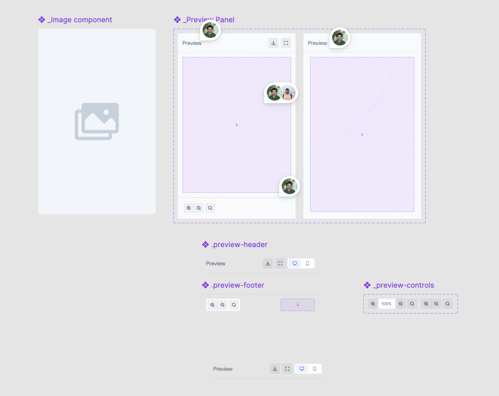

# Preview window Decisions

A **Preview window** is a component used to display a visual preview of an image or any other UI component.




---

- [Design](#design)
- [Preview window Component](#previewwindow-component)
  - [Preview window API](#previewwindow-api)
  - [Alternative API](#alternative-api)
- [Open Questions](#open-questions)

---

## Design

[Figma Link](https://www.figma.com/design/jubmQL9Z8V7881ayUD95ps/Blade-DSL?node-id=103462-52670&p=f&t=qC2NU4R56lEGsGFB-0)

---

## Preview window Component

The `Preview window` component will be the main component used to render a live preview of content with optional interactivity and controls.

---

## Preview window API

| Prop                        | Type             | Default                   | Required | Description                                                                  |
| --------------------------- | ---------------- | ------------------------- | -------- | ---------------------------------------------------------------------------- |
| `isInteractive`             | `boolean`        | `true`                    | No       | Determines whether to show preview controls and heading text.                |
| `children`                  | `React.Element`  | —                         | Yes      | The component to be rendered inside the preview window.                      |
| `headingText`               | `string`         | `""`                      | No       | If provided, displays a heading above the previewed component.               |
| `onFullScreen`              | `() => void`     | —                         | No       | Callback invoked when the fullscreen button is clicked.                      |
| `onZoomInClick`             | `({ zoomLevel }) => void` | —               | No       | Callback invoked when the zoom-in button is clicked.                         |
| `onZoomOutClick`            | `({ zoomLevel }) => void` | —               | No       | Callback invoked when the zoom-out button is clicked.                        |
| `onZoomChange`              | `() => void`     | —                         | No       | Callback invoked when zoom changes.                                          |
| `zoom`                      | `number`         | `50`                      | No       | A number between 1 to 100 which sets the zoom level.                         |
| `onDragChange`              | `() => void`     | —                         | No       | Callback invoked when drag changes.                                          |
| `additionalPreviewControls` | `React.Element`  | —                         | No       | If we want to show additional controls button or button group.               |
| `zoomStep`                  | `number`         | `10`                      | No       | A number between 5 to 30 that determines the zoom step percentage per click. |

```tsx
type PreviewwindowProps = {
  isInteractive?: boolean;
  children: React.ReactElement;
  headingText?: string;
  onFullScreen?: () => void;
  zoom: number;
  onZoomChange?: () => void;
  onDragChange?: () => void;
  additionalPreviewControls: React.ReactElement;
  initialZoom?: number;
  zoomStep?: number;
};
```

```tsx
<Previewwindow
  headingText="Image Preview"
  onFullScreen={() => console.log('Fullscreen triggered')}
  additionalPreviewControls={
    <CustomComponent/>
  }
>
  
</Previewwindow>

// With zoom controls
<Previewwindow
  isInteractive
  onZoomInClick={() => console.log('Zoom In')}
  onZoomOutClick={() => console.log('Zoom Out')}
  additionalPreviewControls={
    <CustomComponent/>
  }
  >
  <ComponentToPreview />
</Previewwindow>

// Without interactivity
<Previewwindow isInteractive={false}>
  <StaticComponent />
</Previewwindow>
```

## Alternative API
- For PreviewWindow component
    ```tsx
    // Using prop-driven content instead of children
    <Previewwindow content={<ImageComponent />} headingText="Preview" />
    ```
- For `additionalPreviewControls `

    we can provide a wrapper component  <PreviewControls> and consumers can pass their custom controls
    ```tsx
    <PreviewControls>
     <ZoomControls/>
     <ResponsiveControls /> 
    </PreviewControls>
    ```


 

## Open Questions

- Should we change it's name to PreviewPanel ?
