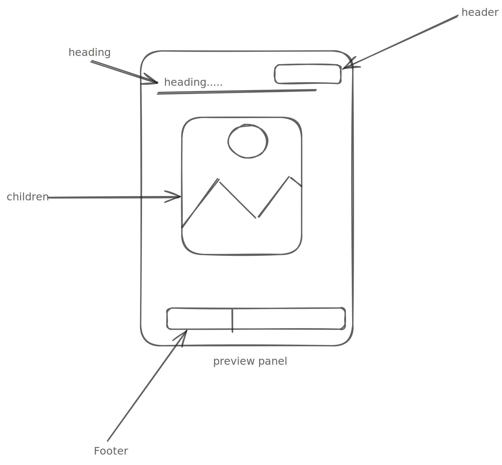

# Preview Window Decisions

A **Preview Window** is a component used to display a visual preview of an image or any other UI component.




---

- [Design](#design)
- [Preview Window Component](#preview-window-component)
  - [Preview Window API](#preview-window-api)
  - [Alternative API](#alternative-api)
- [Open Questions](#open-questions)

---

## Design

[Figma Link](https://www.figma.com/design/jubmQL9Z8V7881ayUD95ps/Blade-DSL?node-id=103462-52670&p=f&t=qC2NU4R56lEGsGFB-0)

---

## Preview Window Component

The `PreviewWindow` component is the primary component used to render a live preview of content with optional interactivity and controls.

---

## Preview Window API

| Prop             | Type                                                   | Default | Required | Description                                                                 |
|------------------|--------------------------------------------------------|---------|----------|-----------------------------------------------------------------------------|
| `children`       | `React.Element`                                        | —       | Yes      | The component to be rendered inside the preview window.                     |
| `onFullScreen`   | `() => void`                                           | —       | No       | Callback invoked when the fullscreen button is clicked.                     |
| `isDragEnabled`  | `boolean`                                              | —       | No       | Whether drag functionality is enabled.                                      |
| `onZoomChange`   | `(newZoom: number) => void`                            | —       | No       | Callback invoked when the zoom level changes.                               |
| `zoom`           | `number`                                               | `50`    | Yes      | A number between 1 and 100 that sets the zoom level.                        |
| `onDragChange`   | `(position: { x: number; y: number }) => void`         | —       | No       | Callback invoked when the drag position changes.                            |
| `zoomScaleStep`       | `number`                                               | `10`    | No       | A number between 5 and 30 that determines the zoom step per click.         |
| `defaultZoom`    | `number`                                               | `10`    | No       | A number between 1 and 100 that sets the initial zoom level.               |

```tsx
type PreviewWindowProps = {
  children: React.ReactElement;
  onFullScreen?: () => void;
  isDragEnabled?: boolean;
  zoom: number;
  onZoomChange?: (newZoom: number) => void;
  onDragChange?: (position: { x: number; y: number }) => void;
  defaultZoom?: number;
  zoomScaleStep?: number;
};
```


In addition, we will have three layout components:
 - PreviewHeader
 - PreviewBody
 - PreviewFooter


```tsx
type PreviewHeader = {
  title?: string;
  trailing?: React.ReactElement;
};

type PreviewBody = {
  children: React.ReactElement;
};

type PreviewFooter = {
  trailing?: React.ReactElement;
  showZoomPercentage?: boolean;
};
```

Example Usage - 

```tsx
<PreviewWindow>
  <PreviewHeader title="Preview" trailing={<DownloadButton />} />
  <PreviewBody>
  
  </PreviewBody>
  <PreviewFooter trailing={<DeviceToggle />} />
</PreviewWindow>

// Without zoom controls
<PreviewWindow
  additionalPreviewControls={<CustomComponent />}
>
  <PreviewBody>
  <ComponentToPreview />
  </PreviewBody>
</PreviewWindow>

// Without Drag
<PreviewWindow isDragEnabled={false}>
  <StaticComponent />
</PreviewWindow>
```

## Alternative API
- For PreviewWindow component
    ```tsx
    // Using prop-driven content instead of children
    <PreviewWindow content={<ImageComponent />} headingText="Preview" />
    ```
- For `additionalControls `

    we can provide a wrapper components  like `<Header/>` and  `<Footer/>` and consumers can pass their custom controls , we will add zoom reset automatically.
    ```tsx
    <PreviewPanel>
    <Header>
     <Controls/>
    </Header>
    <Footer>
         <Controls/>
    </Footer>
    ```

    we can also have a hook `usePreviewWindow` which will expose methods like `onZoomIncrementButtonClick` ,  `onZoomDecrementButtonClick` , `onFullScreenClick` , `onResetZoomResetClick` and consumers can use it like 
    ``` tsx
    <PreviewPanel>
      <Header>
        <FullScreenButton onClick={onFullScreenClick} />
        <CustomComponent/>
      </Header>
      <PreviewFile/>
      <Footer>
       <ZoomIncrementButton onClick={onZoomIncrementButtonClick} />
       <ZoomDecrementButton onClick={onZoomDecrementButtonClick} />
      </Footer>
    </PreviewPanel>
    ```


 

## Open Questions

- Should we change it's name to PreviewPanel ?
