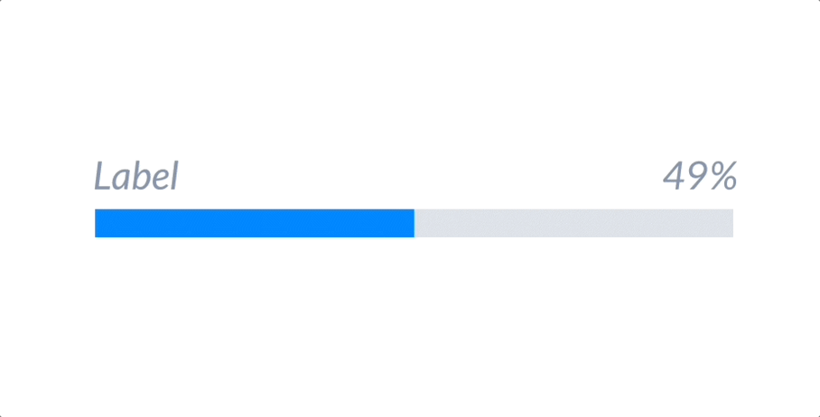

# ProgressBar <!-- omit in toc -->
A Progress bar is generally a branded element that indicates progress of process or task.


- [Design](#design)
- [API](#api)
  - [Sample Usage](#sample-usage)
  - [Accessibility](#accessibility)
- [Handling pulsating animation](#handling-pulsating-animation)
- [Open Questions](#open-questions)
- [References](#references)


## Design
- [Figma - ProgressBar](https://www.figma.com/file/jubmQL9Z8V7881ayUD95ps/Blade---Payment-Light?node-id=16430%3A256423)


## API

| Prop | Type | Default | Description | Required |
|---|---|---|---|---|
| label | `string` | `undefined` | The label to be rendered with the progress bar. |  |
| value | number | `undefined` | The current progress value for the progress bar. The progress bar would be in an indeterminate state if `value` is not passed. |  |
| contrast | `low`, `high` | `low` | The contrast of the progress bar to be rendered. |  |
| intent | `positive`,`negative`, `notice`, `information`, `neutral` | `undefined` | The intent of the progress bar to be rendered. | |
| size | `large`, `small` | `small` | The size of the progress bar to be rendered. |  |
| accessibilityLabel | `string` | `"Loading"` | The accessibility label (aria-label) for the progress bar. |
| isIndeterminate | `boolean` | `false` | Control whether the progress bar is indeterminate or not. The progress bar would be in an indeterminate state if `progress` is not passed.  |
| showPercentage | `boolean` | `true` | Control whether the progress bar should show the current progress percentage or not. Percentage would be automatically hidden when the progress bar is in an indeterminate state.  |

### Sample Usage
```jsx
import { ProgressBar } from '@razorpay/components';

<ProgressBar 
  label='Loading' 
  value={20} 
  contrast='low'
  size='large'
  accessibilityLabel='Loading Payments'
/>
```

### Accessibility
- We'll accept a prop `accessibilityLabel` which will be passed on as `aria-label` for web & `accessibilityLabel` for native to aide screen readers
- By default the value of `accessibilityLabel` will be the same as `label` prop with a fallback to `"Loading"` and can be overwritten with something more meaningful by the consumer.
- We will set `aria-role` as `progressbar`
- We will pass the value of `value` prop as `aria-valuenow`

## Handling pulsating animation
After `3000ms` the progress bar would start pulsating to indicate to the user that the process is slow but isn't stuck.


**Problem:**
- We have use-cases where a progress bar could be used:
  - 

- In such cases, we wouldn't want the progress bar to pulsate after `3000ms` since this will remain static.

**Possible Solutions:**
1. Use prop `variant` as `'static'` and `'default' | 'animated'`

- Pros:
   - `variant` is a commonly used prop and makes it easy to understand that a different variation of the component exists

- Cons:
   - When the variant would be `static`, it won't entirely be static. When the `value` is changed, it will animate (easing with duration for filling the bar) to the new value. Only the pulsating animation would be disabled.
   - Education effort would be needed to communicate exactly what we mean by a static variant and where should it be used.

2. Use prop `animation` as `'none'` and `'default' | 'pulse'`

- Pros:
   - `animation` is more specific than `variant` since the only change would be related to animation.

- Cons:
  - When the animation would be `none`, it won't entirely be none. When the `value` is changed, it will animate (easing with duration for filling the bar) to the new value. Only the pulsating animation would be disabled.
  - Education effort would be needed to communicate exactly what we mean by animation as none, pulse (or default) and where should it be used.
  
3. Use prop `showPulsatingAnimation` as `boolean`

- Pros:
   - It would be a single-purpose boolean and is easy to understand what it does.

- Cons:
   - Could be slightly misleading since `showPulsatingAnimation={true}` will only show the animation after a default delay of `3000ms`. By its name, a consumer might confuse it to show the pulsating animation immediately and report this as a bug.

## Open Questions
- Why not medium instead of large progress bar?
- What should be the default progress bar size?
- Animation for indeterminate state is pending from design

## References
- [Reshaped](https://reshaped.so/content/docs/components/progress)
- [Polaris](https://polaris.shopify.com/components/progress-bar)
- [Chakra](https://chakra-ui.com/docs/components/progress/usage/)
- [MUI](https://mui.com/material-ui/react-progress/)
- [Mantine](https://mantine.dev/core/progress/)
- [Primer](https://primer.style/react/ProgressBar)
- [Carbon](https://carbondesignsystem.com/components/progress-bar/usage/)
- [Atlassian](https://atlassian.design/components/progress-bar/examples)
- [PluralSight](https://design-system.pluralsight.com/components/linearprogress)
