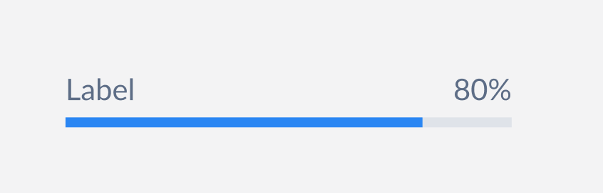

# ProgressBar <!-- omit in toc -->
A Progress bar is generally a branded element that indicates progress of process or task.



## Design
- [Figma - ProgressBar](https://www.figma.com/file/jubmQL9Z8V7881ayUD95ps/Blade---Payment-Light?node-id=16430%3A256423)


## API

| Prop | Type | Default | Description | Required |
|---|---|---|---|---|
| label | `string` | `undefined` | The label to be rendered with the progress bar. |  |
| progress | number | `undefined` | The current progress for the progress bar. The progress bar would be in an indeterminate state if `progress` is not passed. |  |
| contrast | `low`, `high` | `low` | The contrast of the progress bar to be rendered. |  |
| intent | `positive`,`negative`, `notice`, `information`, `neutral` | `undefined` | The intent of the progress bar to be rendered. | |
| size | `large`, `small` | `small` | The size of the progress bar to be rendered. |  |
| accessibilityLabel | `string` | `"Loading"` | The accessibility label (aria-label) for the progress bar. |
| isIndeterminate | `boolean` | `false` | Control whether the progress bar is indeterminate or not. The progress bar would be in an indeterminate state if `progress` is not passed.  |

### Sample Usage
```jsx
import { ProgressBar } from '@razorpay/components';

<ProgressBar 
  label='Loading' 
  progress={20} 
  contrast='low'
  size='large'
  accessibilityLabel='Loading Payments'
/>
```

## Open Questions
- Why not medium instead of large progress bar?
- What should be the default progress bar size?

## References
- [Reshaped](https://reshaped.so/content/docs/components/progress)
- [Polaris](https://polaris.shopify.com/components/progress-bar)
- [Chakra](https://chakra-ui.com/docs/components/progress/usage/)
- [MUI](https://mui.com/material-ui/react-progress/)
- [Mantine](https://mantine.dev/core/progress/)
- [Primer](https://primer.style/react/ProgressBar)
- [Carbon](https://carbondesignsystem.com/components/progress-bar/usage/)
- [Atlassian](https://atlassian.design/components/progress-bar/examples)
- [PluralSight](https://design-system.pluralsight.com/components/linearprogress)