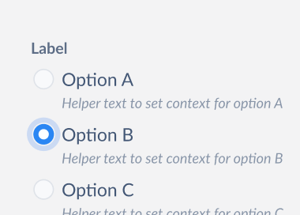

# Radio Decisions <!-- omit in toc -->

Radio is used to present each item in a list of options where users must make a single selection.

This document outlines the API of `Radio` & `RadioGroup` component.



- [Design](#design)
- [`Radio` API](#radio-api)
- [`RadioGroup` API](#radiogroup-api)
  - [Examples:](#examples)
    - [Basic](#basic)
    - [Controlled, Uncontrolled](#controlled-uncontrolled)
- [Accessibility](#accessibility)
- [Open Questions](#open-questions)

## Design

- [Figma Link - Radio](https://www.figma.com/file/jubmQL9Z8V7881ayUD95ps/Blade---Payment-Light?node-id=13133%3A160709)

## `Radio`

> Note: Radio component can't be used outside of RadioGroup.

| Prop                | Type                                    | Default     | Description                                                                                                                                                    | Required |
| ------------------- | --------------------------------------- | ----------- | -------------------------------------------------------------------------------------------------------------------------------------------------------------- | -------- |
| children            | `string`                                | `undefined` | The text to be rendered as label                                                                                                                          | ✅       |
| isDisabled          | `boolean`                               | `false`     | Control whether the radio is disabled or not.                                                                                                                  |          |
| helpText            | `string`                                | `undefined` | The helper text to be rendered                                                                                                                                 |          |
| value (html native) | `string`                                | `undefined` | The value of the input field in a radio, [useful in form submissions](https://developer.mozilla.org/en-US/docs/Web/HTML/Element/input/radio#value)             |          |

## `RadioGroup`

| Prop               | Type                                        | Default     | Description                                                                                                                      | Required |
| ------------------ | ------------------------------------------- | ----------- | -------------------------------------------------------------------------------------------------------------------------------- | -------- |
| children           | `React.ReactNode`                           | `undefined` | Accepts multiple radios                                                                                                          | ✅       |
| label              | `string`                                    | `undefined` | The label of the group                                                                                                           | ✅       |
| labelPosition      | `top \| left`                               | `top`       | The position of the rendered label                                                                                               |          |
| defaultValue       | `string`                                    | `undefined` | The initial value of the radio group                                                                                             |          |
| value              | `string`                                    | `undefined` | The value of the radio, if present will act as [controlled component](https://reactjs.org/docs/forms.html#controlled-components) |          |
| onChange           | `({ value: string, name: string }) => void` | `undefined` | The function to be called when any radio's state changes                                                                         |          |
| name               | `string`                                    | `undefined` | The name of the radio group, [useful in form submissions](https://developer.mozilla.org/en-US/docs/Web/HTML/Element/input#name)  |          |
| isDisabled         | `boolean`                                   | `false`     | Control whether the radio group is disabled or not.                                                                              |          |
| helpText           | `string`                                    | `undefined` | The helper text to be rendered                                                                                                   |          |
| errorText          | `string`                                    | `undefined` | The error text to be rendered                                                                                                    |          |
| validationState    | `'none' \| 'error'`                         | `none`      | Control whether the radio group is invalid or not.                                                                               |          |
| necessityIndicator | `'optional' \| 'required' \| 'none'`        | `none`      | Renders `${label} (optional)` for `optional` and `${label} *` for `required`. if set to `none` renders nothing                   |          |

### Examples:

#### Basic

```tsx
<RadioGroup
  name="developers"
  label="Developers"
  helpText="Pick preferred blade developer"
  defaultValue="anurag"
>
  <Radio value="anurag">Anurag</Radio>
  <Radio value="chaitanya">Chaitanya</Radio>
  <Radio value="divyanshu">Divyanshu</Radio>
  <Radio value="kamlesh">Kamlesh</Radio>
</RadioGroup>
```

#### Controlled, Uncontrolled

```tsx
const Controlled = () => {
  const [selected, setSelected] = React.useState('kamlesh');

  return (
    <RadioGroup
      name="developers"
      label="Developers (controlled)"
      value={selected}
      onChange={({ value }) => setSelected(value)}
    >
      <Radio value="anurag">Anurag</Radio>
      <Radio value="chaitanya">Chaitanya</Radio>
      <Radio value="divyanshu">Divyanshu</Radio>
      <Radio value="kamlesh">Kamlesh</Radio>
    </RadioGroup>
  );
};

const Uncontrolled = () => {
  return (
    <RadioGroup 
      name="developers" 
      label="Developers (uncontrolled)" 
      defaultValue="chaitanya"
    >
      <Radio value="anurag">Anurag</Radio>
      <Radio value="chaitanya">Chaitanya</Radio>
      <Radio value="divyanshu">Divyanshu</Radio>
      <Radio value="kamlesh">Kamlesh</Radio>
    </RadioGroup>
  );
};
```

## Accessibility

- Radio - https://www.w3.org/WAI/ARIA/apg/patterns/radio/

## Open Questions
