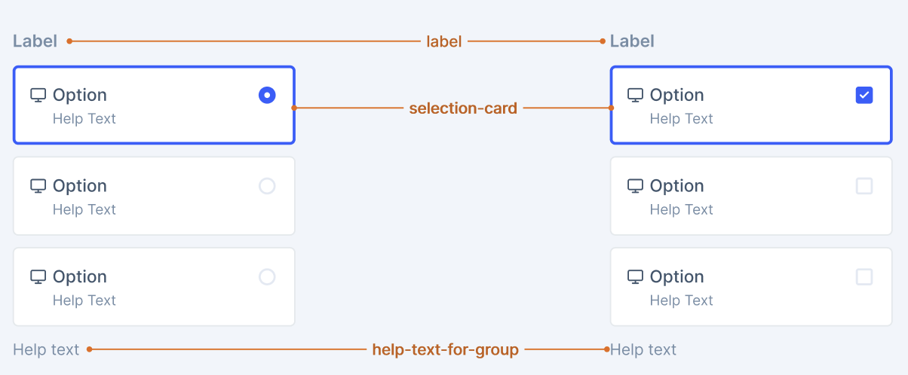

# SelectableCard

SelectableCard enhances the existing Card component to work seamlessly with form control groups (CheckboxGroup/RadioGroup). While we already have interactive cards that include form controls, this enhancement adds:

- **Automatic validation state inheritance** from parent CheckboxGroup/RadioGroup context to Card styling
- **Flexible wrapping behavior** for horizontal RadioGroup/CheckboxGroup layouts 

- [Design](#design)
- [Anatomy](#anatomy)
- [API](#api)
- [Enhancements](#enhancements)
- [Examples](#examples)
  - [Single Selection with RadioGroup](#single-selection-with-radiogroup)
  - [Multiple Selection with CheckboxGroup](#multiple-selection-with-checkboxgroup)
- [Benefits of This Approach](#benefits-of-this-approach)
- [Accessibility](#accessibility)

## Design

- [Figma - SelectableCard](https://www.figma.com/design/jubmQL9Z8V7881ayUD95ps/Blade-DSL?node-id=105706-19869&p=f&m=dev)

## Anatomy



## API

Using existing Card component with CheckboxGroup/RadioGroup for selection behavior:

```jsx
import {
  Card,
  CardBody,
  CheckboxGroup,
  RadioGroup,
  Checkbox,
  Radio,
  Box,
  Divider,
} from '@razorpay/blade/components';

// Single Selection Pattern (Radio-like behavior)
<RadioGroup
  name="plan-selection"
  onChange={({ values }) => console.log(values)}
  orientation="horizontal"
>
  <Card as="label" isSelected={selectedValue === 'starter'}>
    <CardBody>
      <Box display="flex" flexDirection="row" gap="spacing.3">
        <CardHeaderLeading title="Starter Plan" subtitle="₹999/month" prefix={<PlanIcon />} />
        <Radio value="starter" />
      </Box>
      <Divider />
      <Text>• Up to 1000 transactions</Text>
      <Text>• Basic dashboard</Text>
    </CardBody>
  </Card>

  <Card as="label" isSelected={selectedValue === 'growth'}>
    <CardBody>
      <Box display="flex" flexDirection="row" gap="spacing.3">
        <CardHeaderLeading title="Growth Plan" subtitle="₹2999/month" prefix={<PlanIcon />} />
        <Radio value="growth" />
      </Box>
      <Divider />
      <Text>• Up to 10,000 transactions</Text>
      <Text>• Advanced analytics</Text>
    </CardBody>
  </Card>
</RadioGroup>;

// Multiple Selection Pattern (Checkbox-like behavior)
<CheckboxGroup
  name="addon-selection"
  onChange={({ values }) => console.log(values)}
  orientation="horizontal"
  validationState="error"
  errorText="Please select at least one add-on"
>
  <Card as="label" isSelected={selectedValues.includes('smart_collect')}>
    {/* Card automatically inherits error validation state from CheckboxGroup */}
    <CardBody>
      <Box display="flex" flexDirection="row" gap="spacing.3">
        <CardHeaderLeading title="Smart Collect" subtitle="₹199/month" prefix={<CollectIcon />} />
        <Checkbox value="smart_collect" />
      </Box>
      <Divider />
      <Text>• Virtual account management</Text>
      <Text>• Automated reconciliation</Text>
    </CardBody>
  </Card>

  <Card as="label" isSelected={selectedValues.includes('route')}>
    <CardBody>
      <Box display="flex" flexDirection="row" gap="spacing.3">
        <CardHeaderLeading title="Route" subtitle="₹299/month" prefix={<RouteIcon />} />
        <Checkbox value="route" />
      </Box>
      <Divider />
      <Text>• Multi-vendor marketplace</Text>
      <Text>• Automated fund splits</Text>
    </CardBody>
  </Card>
</CheckboxGroup>;
```

## Enhancements

### Card Validation State via Group Context

Cards will automatically reflect validation states from their parent CheckboxGroup/RadioGroup context, similar to how individual Checkbox/Radio components currently work. No new Card props needed.

**Current Implementation:**

```tsx
// In Checkbox component
const _validationState = validationState ?? groupProps?.validationState;
```

**Proposed Implementation for Card:**

```tsx
// Card will consume validation state from CheckboxGroup/RadioGroup context
const groupValidationState =
  useCheckboxGroupContext()?.validationState || useRadioGroupContext()?.validationState;
const cardValidationState = groupValidationState; // Apply to border styling
```

**Usage Examples:**

```jsx
// Error state automatically applied to all cards in group
<CheckboxGroup validationState="error" errorText="Please select at least one option">
  <Card as="label" isSelected={isSelected}>
    {/* Card automatically gets error border styling from group context */}
  </Card>
</CheckboxGroup>

// Success state for RadioGroup
<RadioGroup validationState="success">
  <Card as="label" isSelected={isSelected}>
    {/* Card automatically gets success border styling from group context */}
  </Card>
</RadioGroup>
```

**Implementation needed:**

- Update Card component to consume validation state from CheckboxGroup/RadioGroup context
- Apply validation state styling (error/success border colors) when present
- Maintain existing `isSelected` styling when combined with validation states

### RadioGroup/CheckboxGroup Horizontal Wrapping

We extend existing RadioGroup and CheckboxGroup components with flex wrapping capabilities:

```ts
type RadioGroupProps = RadioGroupProps & {
  /**
   * Controls wrapping behavior for horizontal orientation
   * When set to 'wrap', items will wrap to next line instead of causing horizontal scrolling
   * @default "nowrap"
   */
  flexWrap?: 'wrap' | 'nowrap' | 'wrap-reverse';
};

type CheckboxGroupProps = CheckboxGroupProps & {
  /**
   * Controls wrapping behavior for horizontal orientation
   * When set to 'wrap', items will wrap to next line instead of causing horizontal scrolling
   * @default "nowrap"
   */
  flexWrap?: 'wrap' | 'nowrap' | 'wrap-reverse';
};
```

**Usage Examples:**

```jsx
// Wrapping horizontal RadioGroup
<RadioGroup
  orientation="horizontal"
  flexWrap="wrap"
>
  {/* Cards */}
</RadioGroup>

// Non-wrapping horizontal CheckboxGroup (default)
<CheckboxGroup
  orientation="horizontal"
  flexWrap="nowrap" // or omit prop
  label="Select features"
>
  {/* Cards */}
</CheckboxGroup>

// Vertical orientation (flexWrap has no effect)
<RadioGroup
  orientation="vertical"
  flexWrap="wrap" // Ignored for vertical orientation
>
  {/* Cards */}
</RadioGroup>
```

**Implementation needed:**

- Add `flexWrap?: 'wrap' | 'nowrap' | 'wrap-reverse'` prop to RadioGroup and CheckboxGroup component interfaces
- Update internal BaseBox layout to use `flexWrap={flexWrap}` when `orientation="horizontal"`
- Default to `flexWrap="nowrap"` to maintain current behavior and backward compatibility
- Ensure proper spacing between wrapped items using existing gap system

<details>
  <summary>Alternate APIs</summary>

### Alternate API 1: New SelectableCard Components

We could create dedicated SelectableCard and SelectableCardGroup components with built-in selection logic:

```jsx
<SelectableCardGroup
  selectionType="single" {/* single = radio behavior */}
  onChange={({ name, values }) => console.log(values)}
  validationState="error"
>
  <SelectableCard value="standard">
    <SelectableCardHeader title="Standard Gateway" leading={<PaymentIcon />} />
    <SelectableCardBody>
      <Text>Domestic payments only</Text>
    </SelectableCardBody>
  </SelectableCard>
  <SelectableCard value="premium">
    <SelectableCardHeader title="Premium Gateway" leading={<PaymentIcon />} />
    <SelectableCardBody>
      <Text>International payments</Text>
    </SelectableCardBody>
  </SelectableCard>
</SelectableCardGroup>
```

**Why we didn't choose this:**

- **Unnecessary Duplication**: Creates 2 new components (SelectableCard + SelectableCardGroup) that duplicate existing Card and RadioGroup/CheckboxGroup functionality
- **API Fragmentation**: Forces developers to learn new APIs when existing components already solve this
- **Maintenance Burden**: Double the components to maintain, test, and keep in sync with Card updates
- **Limited Flexibility**: Fixed component structure cannot handle all Card layout variations
- **Bundle Size**: Significant JavaScript overhead for functionality existing components already provide

### Alternate API 2: Prop-Based SelectableCard API

We could create simplified SelectableCard and SelectableCardGroup components with prop-based content instead of flexible children:

```jsx
<SelectableCardGroup
  selectionType="multiple" {/* multiple = checkbox behavior */}
  name="plan-selection"
  onChange={({ name, values }) => console.log(values)}
  validationState="error"
>
  <SelectableCard
    value="basic"
    title="Basic Plan"
    subtitle="Perfect for small teams"
    leading={<PlanIcon />}
  />
  <SelectableCard
    value="pro"
    title="Pro Plan"
    subtitle="For growing businesses"
  />
</SelectableCardGroup>
```

**What this means:**

- `SelectableCard` would be a NEW component (not the existing Card component)
- `SelectableCardGroup` would be a NEW group component (not using RadioGroup/CheckboxGroup)
- Content is defined through props like `title`, `subtitle`, `leading` instead of flexible children
- The components would internally render the card layout and manage selection state based on these props

**Why we didn't choose this:**

- **Unnecessary Duplication**: Creates 2 new components when existing Card + RadioGroup/CheckboxGroup already work
- **Breaks Single Responsibility**: SelectableCard handles both display and form control logic
- **Severely Limited Content**: Prop-based API (title, subtitle, leading) cannot handle:
  - Complex layouts with multiple sections, images, badges
  - Mixed content types (lists, buttons, dividers, custom elements)
  - Razorpay-specific designs (transaction details, payment methods)
- **Limited Composition**: Cannot use existing Card subcomponents (CardHeader, CardBody, CardFooter)
- **Maintenance Burden**: 2 additional components to maintain and keep accessible
- **Bundle Size**: Significant overhead for limited functionality

</details>

## Examples

### Single Selection with RadioGroup

Radio-like behavior using existing Card and RadioGroup components.

```jsx
function RazorpayPlanSelector() {
  const [selectedPlan, setSelectedPlan] = useState('starter');

  return (
    <RadioGroup
      value={selectedPlan}
      onChange={({ value }) => setSelectedPlan(value)}
      label="Choose your Razorpay plan"
      orientation="horizontal"
    >
      <Card as="label" isSelected={selectedPlan === 'starter'}>
        <CardBody>
          <Box display="flex" flexDirection="row" gap="spacing.3">
            <CardHeaderLeading title="Starter Plan" subtitle="₹999/month" prefix={<PlanIcon />} />
            <Radio value="starter" />
          </Box>
          <Divider />
          <Text>• Up to 1,000 transactions</Text>
          <Text>• Basic dashboard</Text>
          <Text>• Email support</Text>
        </CardBody>
      </Card>

      <Card as="label" isSelected={selectedPlan === 'growth'}>
        <CardBody>
          <Box display="flex" flexDirection="row" gap="spacing.3">
            <CardHeaderLeading title="Growth Plan" subtitle="₹2,999/month" prefix={<PlanIcon />} />
            <Radio value="growth" />
          </Box>
          <Divider />
          <Text>• Up to 10,000 transactions</Text>
          <Text>• Advanced analytics</Text>
          <Text>• Priority support</Text>
        </CardBody>
      </Card>
    </RadioGroup>
  );
}
```

### Multiple Selection with CheckboxGroup

Checkbox-like behavior for selecting multiple options with validation.

```jsx
function RazorpayAddOnSelector() {
  const [selectedAddOns, setSelectedAddOns] = useState(['smart_collect']);

  return (
    <CheckboxGroup
      value={selectedAddOns}
      onChange={({ values }) => setSelectedAddOns(values)}
      label="Select add-on features"
      validationState="error"
      errorText="Please select at least one add-on feature"
      orientation="horizontal"
      labelPosition="left"
    >
      <Card as="label" isSelected={selectedAddOns.includes('smart_collect')}>
        <CardBody>
          <Box display="flex" flexDirection="row" gap="spacing.3">
            <CardHeaderLeading
              title="Smart Collect"
              subtitle="₹199/month"
              prefix={<CollectIcon />}
            />
            <Checkbox value="smart_collect" />
          </Box>
          <Divider />
          <Text>• Virtual account management</Text>
          <Text>• Automated reconciliation</Text>
          <Text>• Real-time notifications</Text>
        </CardBody>
      </Card>

      <Card as="label" isSelected={selectedAddOns.includes('route')}>
        <CardBody>
          <Box display="flex" flexDirection="row" gap="spacing.3">
            <CardHeaderLeading title="Route" subtitle="₹299/month" prefix={<RouteIcon />} />
            <Checkbox value="route" />
          </Box>
          <Divider />
          <Text>• Multi-vendor marketplace</Text>
          <Text>• Automated fund splits</Text>
          <Text>• Commission management</Text>
        </CardBody>
      </Card>

      <Card as="label" isSelected={selectedAddOns.includes('payroll')}>
        <CardBody>
          <Box display="flex" flexDirection="row" gap="spacing.3">
            <CardHeaderLeading title="Payroll" subtitle="₹399/month" prefix={<PayrollIcon />} />
            <Checkbox value="payroll" />
          </Box>
          <Divider />
          <Text>• Employee salary management</Text>
          <Text>• Tax calculations</Text>
          <Text>• Compliance reporting</Text>
        </CardBody>
      </Card>
    </CheckboxGroup>
  );
}
```

## Benefits of This Approach

### **Leverages Existing Components**

- **Card**: Already has `isSelected` prop and all necessary styling
- **CheckboxGroup/RadioGroup**: Proven form control patterns with accessibility built-in
- **No New Components**: Reduces bundle size and maintenance overhead

### **Consistent with Blade Patterns**

- **Form Controls**: Uses established CheckboxGroup/RadioGroup patterns
- **Accessibility**: Inherits proper ARIA roles, keyboard navigation, and screen reader support
- **Validation**: Built-in validation states and error handling

### **Maximum Flexibility**

- **Any Card Layout**: Works with any Card configuration (header, body, footer)
- **Custom Content**: No restrictions on card content or structure
- **Responsive**: Inherits Card's responsive behavior

### **Developer Experience**

- **Familiar APIs**: Developers already know Card and form control patterns
- **Less Learning**: No new component APIs to learn
- **Composable**: Easy to combine with other Blade components

## Accessibility

- **Form Control Accessibility**: Inherits proper ARIA roles from CheckboxGroup/RadioGroup
- **Keyboard Navigation**: Standard form control keyboard behavior
- **Screen Reader Support**: Proper labeling and state announcements
- **Focus Management**: Clear focus indicators and logical tab order
