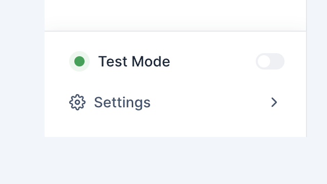

# SideNav - One Navigation Bar

The side navigation is positioned along the left side of the screen that provides quick access to different sections or functionalities of the application.


## Links

- [Figma - Side Navigation](https://www.figma.com/file/jubmQL9Z8V7881ayUD95ps/Blade-DSL?node-id=87921-138309&mode=dev)
- [Product Concept Note - Connected Navigation](https://docs.google.com/document/d/1MyCgIS8i3hfhYPiU94oNT0BwqFyNSa8fhVZLT1FlS3s/edit?usp=sharing) (Internal)
- [Stackblitz - One Nav Levels POC](https://stackblitz.com/edit/one-nav-poc?file=App.tsx)
- [Stackblitz - One Nav Router POC](https://stackblitz.com/edit/one-nav-poc-router?file=App.tsx,NavSubComponents.tsx,package.json,SideNav.tsx)

## API

```jsx
import { NavLink } from 'react-router-dom';

<SideNav routerLink={NavLink}>
  {/* L1 Items */}
  <SideNavLink title="Home" icon={HomeIcon} href="/" />
  <SideNavLink
    title="Create Payouts"
    trailing={<Button icon={PlusIcon} variant="tertiary" />}
    icon={HomeIcon}
    href="/create-payouts"
  />

  <SideNavLink title="Accounts" icon={AccountsIcon} href="/accounts/profile">
    {/* L2 */}
    <SideNavLevel title="Accounts">
      <SideNavLink title="Profile" icon={UserIcon} href="/accounts/profile" />
      <SideNavLink title="Settings" icon={UserIcon} href="/accounts/settings" />
      <SideNavLink title="Edit" icon={UserIcon} href="/accounts/settings">
        {/* L3 */}
        <SideNavLevel>
          <SideNavLink title="Password" icon={PassIcon} href="/accounts/edit/pass" />
          <SideNavLink title="Email" icon={EmailIcon} href="/accounts/edit/email" />
        </SideNavLevel>
      </SideNavLink>
    </SideNavLevel>
  </SideNavLink>

  {/* Section Heading */}
  <SideNavSection title="Products" maxVisibleItems={3}>
    <SideNavLink href="/payment-gateway" title="Payment Gateway" />
    <SideNavLink href="/payment-pages" title="Payment Pages" />
    <SideNavLink href="/payment-links" title="Payment Links" />
    <SideNavLink href="/qr-codes" title="QR Codes" />
    <SideNavLink href="/subscriptions" title="Subscriptions" />
  </SideNavSection>

  {/* Footer */}
  <SideNavFooter>
    <Box display="flex" paddingY="spacing.4" paddingX="spacing.3" justifyContent="spacing-between">
      <Box display="flex" gap="spacing.3">
        <Indicator color="positive" />
        <Text>Test Mode</Text>
      </Box>
      <Switch />
    </Box>
    <SideNavLink href="/settings" title="Settings" />
  </SideNavFooter>
</SideNav>;
```

## Alternate APIs

<details>
<summary>Config-driven API</summary>

### Config-driven API

**Example of Config-Driven API**

```jsx
<SideNav
  routerLink={NavLink}
  items={[
    {
      title: 'Home',
      href: '/',
      icon: HomeIcon,
    },
    {
      level: 2,
      headerTitle: 'Accounts',
      icon: AccountsIcon,
      href: '/accounts/',
      items: [
        {
          title: 'User Profile',
          icon: UserIcon,
          href: '/accounts/profile',
        },
        {
          title: 'Business Profile',
          icon: SuitcaseIcon,
          href: '/accounts/business-profile',
        },
      ],
    },
  ]}
/>
```

#### Why not config-driven API?

1. Config-Driven API requires you to have a low-level compound API anyways since compound APIs give higher flexibility into adding leading, trailing, descriptions, and other items when needed.
2. Component from Blade is better to kept independent of backend API schema since that schema can change, update, etc and shouldn't be blocked on blade.
3. Not binding it to merchant dashboard schema also allows us to use it outside of one dashboard products such admin dashboard, bank portals, products before migration to merchant dashboard

</details>

<details>
<summary>Alternate Levels API</summary>

### Alternate Levels API

Instead of nesting, we can have a trigger and L2 container separate. In trigger we can pass ref of its L2 container.

```jsx
const accountsL2Ref = React.useRef(null);

<SideNav>
  <SideNavL1>
    <SideNavLink title="Home" icon={HomeIcon} href="/" />
    <SideNavLink l2Ref={accountsL2Ref} title="Accounts" icon={UserIcon} href="/accounts" />
  </SideNavL1>

  <SideNavL2 ref={accountsL2Ref}>
    <SideNavLink title="Profile" icon={ProfileIcon} href="/accounts/profile" />
    <SideNavLink title="Business Profile" icon={BusinessIcon} href="/accounts/business">
      <SideNavL3>
        <SideNavLink title="Business Info" icon={ProfileIcon} href="/accounts/profile" />
        <SideNavLink title="Business Details" icon={ProfileIcon} href="/accounts/profile" />
      </SideNavL3>
    </SideNavLink>
  </SideNavL2>
</SideNav>;
```

#### Why not this API?

1. While its the easiest to implement considering how close it is to final DOM structure 🙈, it is complex in understanding and the backend schema we have has nested L1, L2 JSON. So its more complex to loop through a data like that and render this structure
2. When you go from L1 -> L2, SideNav slides from one nav level to other where this API makes sense. But when you go from L2 -> L3, L3 becomes a collapsed menu where nested API makes sense.

</details>

## Props

### SideNav

| **Props**  | **Description**                                                              | **Type**             | **Default Value** |
| ---------- | ---------------------------------------------------------------------------- | -------------------- | ----------------- |
| routerLink | Prop for passing NavLink of React Router                                     | NavLinkComponentType |                   |
| children   | children slot of SideNav, accepts SideNavLink, SideNavSection, SideNavFooter | JSX                  |                   |

```jsx
import { NavLink } from 'react-router-dom';

<SideNav routerLink={NavLink}>{/* children */}</SideNav>;
```

### SideNavLink

| **Props**   | **Description**                                                                                                              | **Type**                      | **Default Value**                                            |
| ----------- | ---------------------------------------------------------------------------------------------------------------------------- | ----------------------------- | ------------------------------------------------------------ |
| title       | title of SideNavLink                                                                                                         | string                        |                                                              |
| href        | URL to navigate to. Internally links to `to` attribute of router                                                             | string                        |                                                              |
| target      | anchor tag target attribute [target - MDN Documentation](https://developer.mozilla.org/en-US/docs/Web/HTML/Element/a#target) | AnchorTargetType              | \_self                                                       |
| rel         | anchor tag rel attribute [rel - MDN Documentation](https://developer.mozilla.org/en-US/docs/Web/HTML/Element/a#rel)          | AnchorRelType                 | target === ' \_blank ' ? ' noreferrer noopener ' : undefined |
| onClick     | Click handler on item                                                                                                        | (e: React.MouseEvent) => void |                                                              |
| icon        | Blade's Icon Component                                                                                                       | IconComponent                 |                                                              |
| trailing    | Trailing Slot of Item. Can be used for adding Quick Shortcut Button, Trailing Text                                           | JSX                           |                                                              |
| titleSuffix | Slot after the title to add Badge, Counter                                                                                   | JSX                           |                                                              |
| tooltip     | Object with props that are forwarded to tooltip                                                                              | TooltipProps                  | undefined                                                    |
| children    | SideNavLink children slot. Items inside children turn into next level item with parent as a trigger                          | JSX                           | undefined                                                    |

#### Example Nav Links

<table>

<tr><td>Code</td><td>Preview</td></tr>

<tr>
<td>

<!-- prettier-ignore -->
```jsx
<SideNavLink
  icon={BillIcon}
  title="Vendor Payments"
  href="/vendor-payments"
/>
```

</td>
<td></td>
</tr>

<tr>
<td>

<!-- prettier-ignore -->
```jsx
<SideNavLink
  icon={PayoutIcon}
  title="Create Payouts"
  href="/payouts"
  trailing={
    <Button
      href="/payouts/create"
      icon={PlusIcon}
      size="xsmall"
      variant="tertiary"
    />
  }
/>
```

</td>
<td></td>
</tr>

<tr>
<td>

<!-- prettier-ignore -->
```jsx
<SideNavLink
  icon={LayoutIcon}
  title="L1 Item Name"
  href="/new-item-link"
  titleSuffix={
    <Badge color="positive">New</Badge>
  }
/>
```

</td>
<td></td>
</tr>

<tr>

<td>

<!-- prettier-ignore -->
```jsx
<SideNavLink
  icon={LayoutIcon}
  title="L1 Item Name"
  href="/new-item-link"
  tooltip={{
    content: "Action Name (Cmd + P)"
  }}
/>
```

</td>
<td></td>
</tr>

<tr>

<td>

<!-- prettier-ignore -->
```jsx
<SideNavLink
  icon={ArrowUpRightIcon}
  title="Create Payout"
  href="/payouts"
  trailing={
    <Tooltip content="Action Name (Cmd + P)">
      <Button
        href="/payouts/create"
        icon={PlusIcon}
        size="xsmall"
        variant="tertiary"
      />
    </Tooltip>
  }
/>
```

</td>
<td></td>
</tr>

</table>

### SideNavLevel

Nested SideNavLevel components create new levels. This can be used to create L1 - L2 - L3 levels in your navbar

| **Props** | **Description**                                       | **Type** | **Default Value** |
| --------- | ----------------------------------------------------- | -------- | ----------------- |
| title     | Only applicable in L2. Becomes the title of the Level | string   |                   |
| children  | children slot. Accepts SideNavLink as children        | JSX      |                   |

<table>
<tr>
<td>

```jsx
<SideNav>
  {/* L1 Items */}
  <SideNavLink title="L1 Item" />

  <SideNavLink title="L2 Trigger">
    {/* L2 Level */}
    <SideNavLevel title="L2 Menu Heading">
      <SideNavLink />
      <SideNavLink />
      <SideNavLink title="L3 Trigger">
        {/* L3 Level */}
        <SideNavLevel>
          <SideNavLink />
          <SideNavLink />
        </SideNavLevel>
      </SideNavLink>
    </SideNavLevel>
</SideNav>
```

</td>

<td>

</td>
</tr>
</table>

### SideNavSection

| **Props**            | **Description**                                              | **Type**                      | **Default Value** |
| -------------------- | ------------------------------------------------------------ | ----------------------------- | ----------------- |
| title                | title of the section                                         | string                        |                   |
| maxVisibleItems      | Number of items visible (rest go inside +x more collapsible) | number                        | undefined         |
| onToggleVisibleItems | Callback when collapsed items are expanded or collapsed back | (isExpanded: boolean) => void | undefined         |
| children             | Children slot. For SideNavLink children items                | JSX                           |                   |

<table>
<tr>
<td>

<!-- prettier-ignore -->
```jsx
<SideNav>
  <SideNavSection 
    title="OFFERINGS SECTION" 
    maxVisibleItems={3}
    onToggleVisibleItems={(isExpanded) => {
      console.log("When +13 More is clicked")
    }}
  >
    {/* All SideNavLink items */}
  </SideNavSection>
</SideNav>
```

</td>

<td>

</td>
</tr>
</table>

### SideNavFooter

| **Props** | **Description** | **Type** | **Default Value** |
| --------- | --------------- | -------- | ----------------- |
| children  | Children slot   | JSX      |                   |

<table>
<tr>
<td>

<!-- prettier-ignore -->
```jsx
<SideNav>
  {/* ... Other Items */}
  <SideNavFooter>
    <Box 
      display="flex" 
      paddingY="spacing.4" 
      paddingX="spacing.3" 
      justifyContent="spacing-between"
    >
      <Box display="flex" gap="spacing.3">
        <Indicator color="positive" />
        <Text>Test Mode</Text>
      </Box>
      <Switch />
    </Box>
    <SideNavLink 
      icon={GearIcon}
      href="/settings" 
      title="Settings" 
    >
      {/* L2 SideNavLink items */}
    </SideNavLink>
  </SideNavFooter>
</SideNav>
```

</td>

<td>

</td>
</tr>
</table>

## Accessibility

1. All items should be accessible by `TAB`. Including going between levels L1, L2, L3
2. We should use Blade's `SkipNav` utility to provide option of skipping nav and going to content
3. React Router automatically handles `aria-current="page"`. Verify that it is working as expected.

## References

- [RazorpayX Navigation Bar](https://github.com/razorpay/x/blob/master/src/js/views/Home/ActionCenter/index.js#L21) (Internal)
- [Razorpay Merchant Dashboard Navigation Bar](https://github.com/razorpay/dashboard/blob/6f61a5909c5311c3be08a3ea28b920ed302f1e64/web/js/merchant/components/SidebarV2/Sidebar.tsx) (Internal)
- [SideNavigation - Atlassian DS](https://atlassian.design/components/side-navigation/examples)
- [SideNav - Primer / GitHub](https://primer.style/react/deprecated/SideNav#url)
- [SideNav - Carbon DS](https://react.carbondesignsystem.com/?path=/story/components-ui-shell-sidenav--fixed-side-nav)
- [SideNav - BaseWeb DS / Uber](https://baseweb.design/components/side-nav/#colors)
- [sidenav - Spectrum / Adobe](https://opensource.adobe.com/spectrum-web-components/components/sidenav/)

## Open Questions

### Dev

- #### Parent Component Name: `SideNav` vs `Sidebar` vs `Navbar` vs `Nav`

  TBD

- #### Navigation Item Naming Decision: `SideNavLink` vs `SideNavItem` vs `SideNavItemLink`

  TBD

- #### `<SideNav routerLink={NavLink} />` vs `<SideNavLink as={NavLink} />`

  1. We pass react router on parent SideNav component

  - Example
    ```jsx
    <SideNav routerLink={NavLink}>
      <SideNavLink />
      <SideNavLink />
    </SideNav>
    ```
  - Pros: Router Link defined at one place on top so less likely to be missed / changed between multiple items
  - Cons: Uncommon pattern

  2. We pass it from as prop on SideNavLink component

  - Example
    ```jsx
    <SideNav>
      <SideNavLink as={NavLink} />
      <SideNavLink as={NavLink} />
    </SideNav>
    ```
  - Pros: Common pattern
  - Cons: Requires defining NavLink at each item (for projects not part of One Dashboard like Admin Dashboard, Bank Portals, etc)

  ##### Conclusion

  TBD

### Design

- Should L2 trigger also change the route?

### Product

[Product Questions Discussion - Slack Thread](https://razorpay.slack.com/archives/C06F9MYVBR7/p1714635586127469?thread_ts=1713943186.663279&cid=C06F9MYVBR7)
