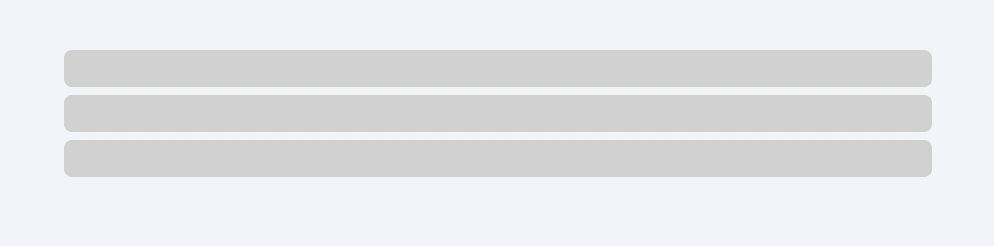
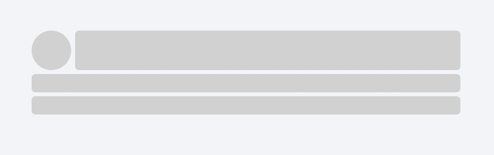
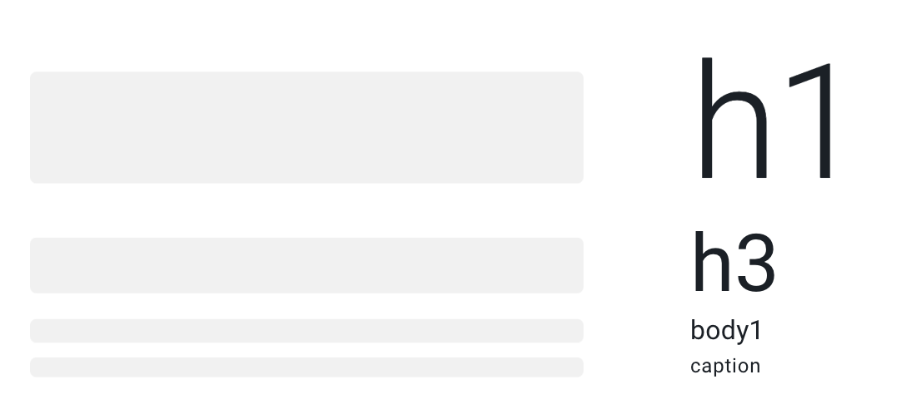
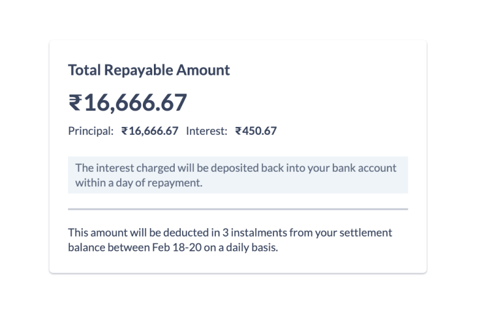
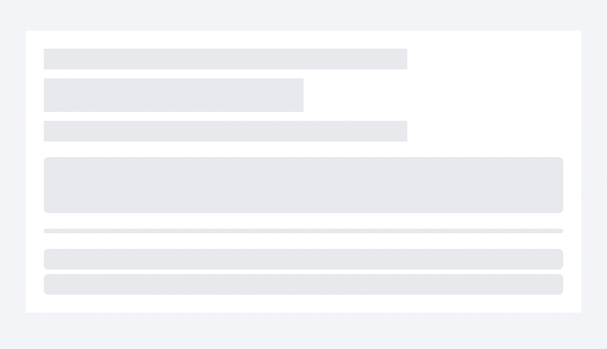

# Skeleton <!-- omit in toc -->
Skeleton Loader is a static / animated placeholder for the information that is still loading. It mimic the structure and look of the entire view. 

The skeleton blocks can have 3 types of shape
- circle 
- rectangle
- pill

Each of these shapes can be achieved by adjusting the width, height and border radius of the blocks. Properties of skeleton loaders.


## Design
- [Figma - Skeleton](https://www.figma.com/file/jubmQL9Z8V7881ayUD95ps/Blade---Payment-Light?node-id=16508%3A258522&mode=dev)


## API

| Prop     | Type     | Default     | Description | Required |
| -------- | -------- | ----------- | ----------- | -------- |
| children | `string` | `undefined` |             | ✅        |
| type     | `TBD`    | `undefined` |             |          |

Skeleton will also have subset of Box props to help users layout the Skeleton blocks accordingly. 

Layout: 

- borderRadius
- height
- minHeight
- maxHeight
- width
- minWidth
- maxWidth

Flex:

- flexGrow
- flexShrink
- flexBasis
- justifyContent
- justifySelf
- placeSelf
- order

Margin: 

- margin
- margin {top | bottom | left | right | x | y}

Position:

- position
- top
- right
- bottom
- left


### Sample Usage

Basic usage: 

```jsx
<Skeleton width="100%" height="20px" borderRadius="medium" marginY="spacing.1" />
<Skeleton width="100%" height="20px" borderRadius="medium" marginY="spacing.1" />
<Skeleton width="100%" height="20px" borderRadius="medium" marginY="spacing.1" />
```



Complex usage: 

```jsx
<Box
  display="flex"
  flexDirection="column"
  gap="spacing.2"
>
  <Box display="flex" flexDirection="row" gap="spacing.2">
    <Skeleton
      flexShrink={0}
      width="40px"
      height="40px"
      borderRadius="max"
    />
    <Skeleton width="100%" />
  </Box>
  <Box flexDirection="column" display="flex" gap="spacing.2">
    <Skeleton />
    <Skeleton />
  </Box>
</Box>
```




### Should we inferring dimensions?

Providing width, height works well when consumers want to have control over the layout of the Skeleton, but it also requires bit of manual tweaking and effort. 

Libraries like ChakraUI / MUI provides a way for consumers to infer dimensions based on exisiting components: 



**Inferring Typography components:**

```jsx
<Heading size="large">
  {isLoading ? <Skeleton /> : "Hello world this is blade"}
</Heading>
```

[Demo Codesandbox](https://codesandbox.io/s/blade-skeleton-text-infer-dim-tmm6dn?file=/App.tsx)

**Inferring block components:**

```jsx
<Skeleton isLoading={data.isLoading}>
  <Box
    display="flex"
    alignItems="center"
    justifyContent="center"
    width="200px"
    height="200px"
  >
    {data.title}
  </Box>
</Skeleton>
```

### Or provide predefined dimensions 

**Typography components:**

Similar to Amount component we can expose a `type` prop which will have predefined sizes & we also expose `numberOfLines` prop which will dictate how many skeletons it will map to.

```jsx
<Skeleton 
  type="
    | body-small
    | body-medium
    | body-large
    | heading-small
    | heading-medium
    | heading-large
    | title-small
    | title-medium
    | title-large
    | title-xlarge
  " 
  numberOfLines={5} />
```

A real world usecase might look something like:



```jsx
<Box
  padding="spacing.5"
  display="flex"
  flexDirection="column"
  gap="spacing.2"
  backgroundColor="surface.background.level2.lowContrast"
>
  <Box display="flex" flexDirection="column" gap="spacing.3">
    <Skeleton type="heading-medium" width="70%" borderRadius="max" />
    <Skeleton type="title-large" width="50%" />
    <Skeleton type="body-medium" width="70%" />
  </Box>
  <Skeleton marginTop="10px" height="50px" borderRadius="4px" />
  <Divider />
  <Skeleton type="body-medium" numberOfLines={2} />
</Box>
```



**Block components:**

And for block components we won't give any predefined sizes instead consumers can compose via width, height, borderRadius: 

```jsx
<Skeleton width="100px" height="100px" borderRadius="medium" />
```

## Motion

Check the motion [here](https://www.figma.com/proto/jubmQL9Z8V7881ayUD95ps/Blade---Payment-Light?type=design&node-id=16502-258345&scaling=min-zoom&page-id=16498%3A256331):


## Open Questions

- How will Skeleton loader work with existing components like ModalHeader/Footer etc?
- 

## References

- https://chakra-ui.com/docs/components/skeleton/usage
- https://ant.design/components/skeleton#skeleton
- https://mui.com/material-ui/react-skeleton/
