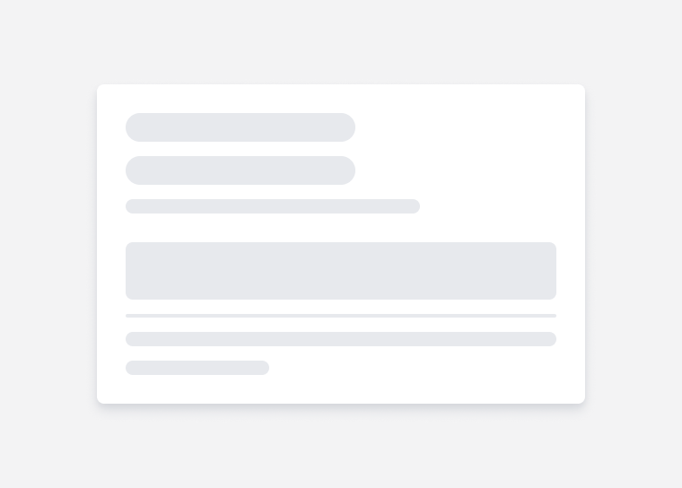

# Skeleton <!-- omit in toc -->
Skeleton Loader is a static / animated placeholder for the information that is still loading. It mimic the structure and look of the entire view. 

The skeleton blocks can have 3 types of shape
- circle 
- rectangle
- pill

Each of these shapes can be achieved by adjusting the width, height and border radius of the blocks. Properties of skeleton loaders.



## Design
- [Figma - Skeleton](https://www.figma.com/file/jubmQL9Z8V7881ayUD95ps/Blade---Payment-Light?node-id=16508%3A258522&mode=dev)


## API

Skeleton will have subset of Box props to help users layout the Skeleton blocks accordingly. 

Layout: 

- borderRadius
- height
- minHeight
- maxHeight
- width
- minWidth
- maxWidth

Flex:

- flexGrow
- flexShrink
- flexBasis
- justifyContent
- justifySelf
- placeSelf
- order

Margin: 

- margin
- margin {top | bottom | left | right | x | y}

Position:

- position
- top
- right
- bottom
- left


### Sample Usage

Basic usage: 

```jsx
<Skeleton width="100%" height="20px" borderRadius="medium" marginY="spacing.1" />
<Skeleton width="100%" height="20px" borderRadius="medium" marginY="spacing.1" />
<Skeleton width="100%" height="20px" borderRadius="medium" marginY="spacing.1" />
```


Complex usage: 

```jsx
<Box
  display="flex"
  flexDirection="column"
  gap="spacing.2"
>
  <Box display="flex" flexDirection="row" gap="spacing.2">
    <Skeleton
      flexShrink={0}
      width="40px"
      height="40px"
      borderRadius="max"
    />
    <Skeleton width="100%" />
  </Box>
  <Box flexDirection="column" display="flex" gap="spacing.2">
    <Skeleton />
    <Skeleton />
  </Box>
</Box>
```


### Working with existing components. 

To use Skeleton loader with existing blade components like Card, consumers can create custom skeleton templates as per their needs and usecases. 

**Example:** 

If the whole card needs to be loadable: 

```jsx
const App = () => {
  const { data, isLoading } = useQuery();

  return (
    <>
      {isLoading ? (
        <Box>
          <Box display="flex">
            <Box>
              <Skeleton width="40%" height="30px" />
              <Skeleton width="30%" height="20px" />
            </Box>
            <Skeleton width="30px" height="50px" />
          </Box>
          <Skeleton width="100%" height="100px" />
        </Box>
      ) : (
        <Card>
          <CardHeader>
            <CardHeaderLeading title={data.title} subtitle={data.subtitle} />
            <CardHeaderTrailing
              visual={<CardHeaderBadge variant="neutral">{data.badge}</CardHeaderBadge>}
            />
          </CardHeader>
          <CardBody>
            <Text>{data.content}</Text>
          </CardBody>
        </Card>
      )}
    </>
  );
};
```

If only body of the card needs to be lodable consumers can put the skeleton on the CardBody:

```jsx
const App = () => {
  const { data, isLoading } = useQuery();

  return (
    <Card>
      <CardHeader>
        <CardHeaderLeading title="Payment options" subtitle="Secured by Razorpay" />
        <CardHeaderTrailing visual={<CardHeaderBadge variant="neutral">PENDING</CardHeaderBadge>} />
      </CardHeader>
      <CardBody>
        {isLoading ? <Skeleton width="100%" height="100px" /> : <Text>{data.content}</Text>}
      </CardBody>
    </Card>
  );
};

```

A question that might arise is "Why not just give isLoading prop in the Card?"

Like: 

```jsx
<Card isLoading={isLoading}>
  <CardHeader>
    <CardHeaderLeading title={data.title} subtitle={data.subtitle} />
    <CardHeaderTrailing visual={<CardHeaderBadge variant="neutral">{data.badge}</CardHeaderBadge>} />
  </CardHeader>
  <CardBody>
    <Text>{data.content}</Text>
  </CardBody>
</Card>
```

We discussed this, while it might look simple this approach also has few downsides: 

- if we provide `isLoading` prop it might cause a lot of jumps and shifts on the page because we won't know until API responds if the CardHeader has title/prefix or subtitle set or not and it could be removed after the API is done loading.
- Providing `isLoading` prop for all Blade components (where applicable) might not be the most flexible approach.
- With `isLoading` prop consumers will anyways have to opt out and use custom Skeleton templates for the CardBody content so there's not much benefit to providing it out of the box.


## Motion

Check the motion [here](https://www.figma.com/proto/jubmQL9Z8V7881ayUD95ps/Blade---Payment-Light?type=design&node-id=16502-258345&scaling=min-zoom&page-id=16498%3A256331):

https://github.com/razorpay/blade/assets/35374649/8298efde-f977-4aa3-bc2d-92fb50a8c830


## Accessibility

- All Skeleton nodes will have aria-hidden to hide them from screen readers
- All Skeleton nodes will have `cursor: progress`
- Consumers will have to add aria-busy in the respective container which is being rendered
  - We cannot automatically added this because we will end up adding multiple aria-busy atts to all the <Skeleton \/> nodes.
- Or: consumers can also use the <VisuallyHidden \/> element to add hidden `loading...` text in DOM.

> Reference: https://adrianroselli.com/2020/11/more-accessible-skeletons.html

## Open Questions

- How will Skeleton loader work with existing components like ModalHeader/Footer etc?
  - Ans: we will let the consumer handle the skeleton loading for Card components


<details>

  <summary>
    Should we infer dimensions or provide predefined variants?
  </summary>


  #### Conclusion

  Given the complexity of inferring the dimensions and how it differs from component to component, where for Typography components we need to render the skeleton inside and for block level components we need to wrap it with Skeleton, Plus the complexities that might arise with react-native implementation, we won't be automatically inferring the dimensions. 

  For providing predefined `type` prop, we discussed this internally and decided not to do this for now because: 

  - On design side there is no 1:1 api for the type prop so even if we provide this prop designers might not use it and just use the Skeleton's width/height.
  - There is a increased maintaince overhead in maintaining a map of lineHeight for all the typography components in Skeleton.
  
  Although we are not doing this right now, We will consider this `type` prop as an enhancement later on depending on usage patterns and pain points of how Skeleton components get used.

  
  #### Inferring Dimensions

  Providing width, height works well when consumers want to have control over the layout of the Skeleton, but it also requires bit of manual tweaking and effort. 

  Libraries like ChakraUI / MUI provides a way for consumers to infer dimensions based on exisiting components: 

  

  **Inferring Typography components:**

  ```jsx
  <Heading size="large">
    {isLoading ? <Skeleton /> : "Hello world this is blade"}
  </Heading>
  ```

  [Demo Codesandbox](https://codesandbox.io/s/blade-skeleton-text-infer-dim-tmm6dn?file=/App.tsx)

  **Inferring block components:**

  ```jsx
  <Skeleton isLoading={data.isLoading}>
    <Box
      display="flex"
      alignItems="center"
      justifyContent="center"
      width="200px"
      height="200px"
    >
      {data.title}
    </Box>
  </Skeleton>
  ```

  #### Predefined dimensions 

  **Typography components:**

  Similar to Amount component we can expose a `type` prop which will have predefined sizes & we also expose `numberOfLines` prop which will dictate how many skeletons it will map to.

  > numberOfLines prop can also be used to add a trailing effect to the last line of the skeleton
  > Say we have `numberOfLines={5}` then we can render the 5th Skeleton a bit shorter than the others to convey the text is trailing.

  ```jsx
  <Skeleton 
    type="
      | body-small
      | body-medium
      | body-large
      | heading-small
      | heading-medium
      | heading-large
      | title-small
      | title-medium
      | title-large
      | title-xlarge
    " 
    numberOfLines={5} 
  />
  ```

  A real world usecase might look something like:

  

  ```jsx
  <Box
    padding="spacing.5"
    display="flex"
    flexDirection="column"
    gap="spacing.2"
    backgroundColor="surface.background.level2.lowContrast"
  >
    <Box display="flex" flexDirection="column" gap="spacing.3">
      <Skeleton type="heading-medium" width="70%" borderRadius="max" />
      <Skeleton type="title-large" width="50%" />
      <Skeleton type="body-medium" width="70%" />
    </Box>
    <Skeleton marginTop="10px" height="50px" borderRadius="4px" />
    <Divider />
    <Skeleton type="body-medium" numberOfLines={2} />
  </Box>
  ```

  

  **Block components:**

  And for block components we won't give any predefined sizes instead consumers can compose via width, height, borderRadius: 

  ```jsx
  <Skeleton width="100px" height="100px" borderRadius="medium" />
  ```

</details>

## References

- https://chakra-ui.com/docs/components/skeleton/usage
- https://ant.design/components/skeleton#skeleton
- https://mui.com/material-ui/react-skeleton/
