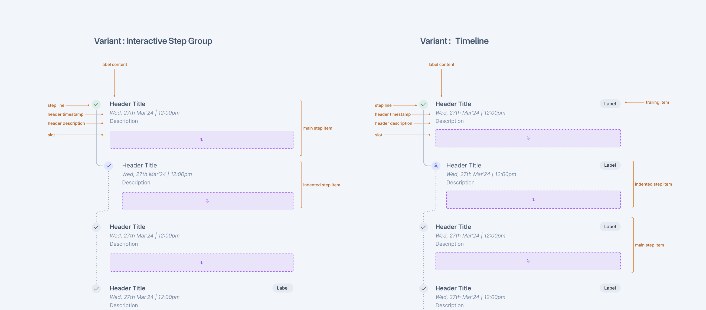
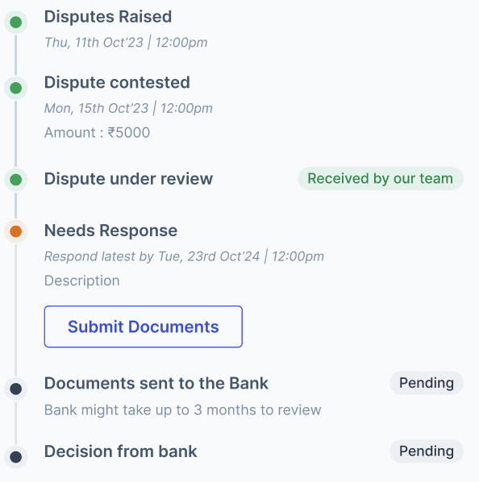
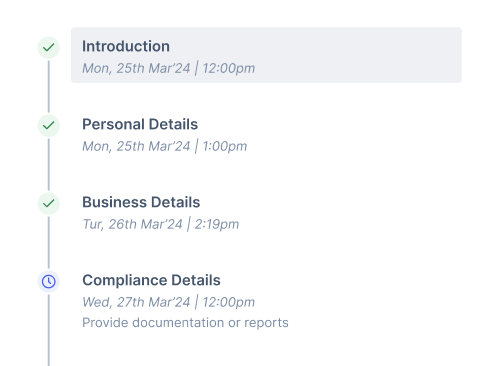
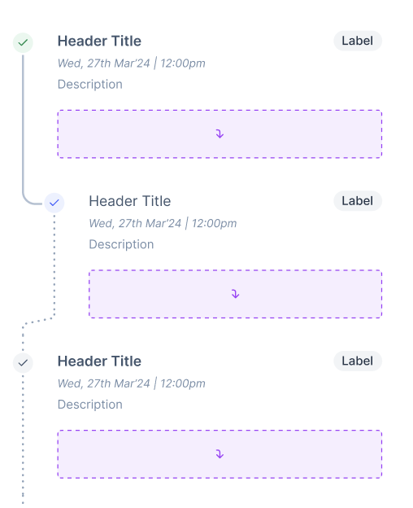
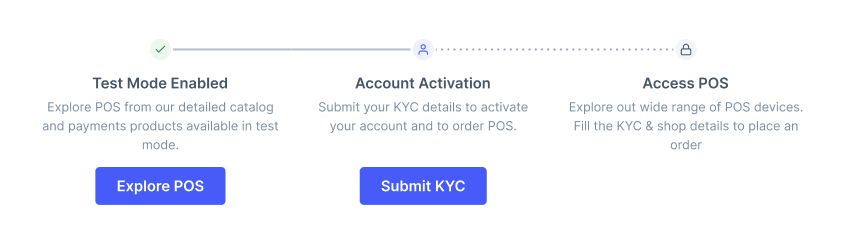

# StepGroup

Step Group visualises sequential processes with a consistent structure. It can be interactive, guiding users through steps, or function as a timeline for reference.



## Design

- [Figma - StepGroup](https://www.figma.com/file/jubmQL9Z8V7881ayUD95ps/Blade-DSL?type=design&node-id=85892%3A80483&mode=design&t=hDxqVI91SqGGed4b-1)

## Props

### StepGroup

| **Props**   | **Description**            | **Type**                   | **Default Value**     |
| ----------- | -------------------------- | -------------------------- | --------------------- |
| size        | Size of StepGroup          | 'medium' \| 'large'        | 'medium'              |
| orientation | Orientation of StepGroup   | 'horizontal' \| 'vertical' | 'vertical'            |
| children    | Children slot for StepItem | ReactNode                  | undefined             |
| width       | width of StepGroup         | BoxProps['width']          | Takes content's width |
| minWidth    | Minimum width of StepGroup | BoxProps['minWidth']       | undefined             |
| maxWidth    | Maximum width of StepGroup | BoxProps['maxWidth']       | 100%                  |

### StepItem

| **Props**    | **Description**                                                                                   | **Type**                                                           | **Default Value**                     |
| ------------ | ------------------------------------------------------------------------------------------------- | ------------------------------------------------------------------ | ------------------------------------- |
| title        | Title of StepItem                                                                                 | string                                                             |                                       |
| timestamp    | A string that renders in italic font. Made for adding timestamp values                            | string                                                             |                                       |
| description  | Description of StepItem                                                                           | string                                                             |                                       |
| stepProgress | Progress line of step. When its `start` only starting part is highlighted and rest is kept dotted | 'start' \| 'end' \| 'full' \| 'none'                               | 'none'                                |
| marker       | JSX for Marker element                                                                            | ReactElement (StepItemIcon or StepItemIndicator components as JSX) | <StepItemIndicator color="neutral" /> |
| trailing     | Trailing element                                                                                  | ReactElement (Badge components as JSX)                             | undefined                             |
| isSelected   | Selected state of item                                                                            | boolean                                                            | undefined                             |
| href         | Anchor tag's href value. Turns StepItem into interactive item and render it as anchor             | string                                                             | undefined                             |
| onClick      | StepItem's click handler. Turns StepItem into interactive item and render it as button tag        | () => void                                                         | undefined                             |
| children     | Slot                                                                                              | ReactNode                                                          | undefined                             |

### StepItemIcon

| **Props** | **Description** | **Type**                                                                        | **Default Value** |
| --------- | --------------- | ------------------------------------------------------------------------------- | ----------------- |
| icon      | icon component  | IconComponent                                                                   |                   |
| color     | color of icon   | 'positive' \| 'negative' \| 'neutral' \| 'notice' \| 'information' \| 'primary' | 'neutral'         |

### StepItemIndicator

| **Props** | **Description**    | **Type**                                                                        | **Default Value** |
| --------- | ------------------ | ------------------------------------------------------------------------------- | ----------------- |
| color     | color of indicator | 'positive' \| 'negative' \| 'neutral' \| 'notice' \| 'information' \| 'primary' | 'neutral'         |

## Usage

### Static StepGroup

Static StepGroup does not have any hover, focus, and active states. It can't be selected or clicked. It is for static steps only.



```jsx
<StepGroup>
  <StepItem
    marker={<StepItemIndicator color="positive" />}
    title="Disputes Raised"
    timestamp="Thu, 11th Oct23 | 12:00pm"
    stepProgress="full"
  />
  <StepItem
    marker={<StepItemIndicator color="notice" />}
    title="Needs Response"
    timestamp="Respond latest by Tue, 23rd Oct'24 | 12:00pm"
    description="Description"
    stepProgress="start"
  >
    <Button variant="secondary">Submit Documents</Button>
  </StepItem>
  <StepItem
    marker={<StepItemIndicator color="neutral" />}
    title="Decision from Bank"
    trailing={<Badge color="neutral">Pending</Badge>}
  />
</StepGroup>
```

### Interactive StepGroup

Interactive StepGroup can be used to add clickable items in StepGroup. When StepItem has `onClick` or `href` prop, it becomes interactive.



```jsx
const InteractiveStepGroup = () => {
  const [selectedIndex, setSelectedIndex] = React.useState(-1);

  return (
    <StepGroup>
      <StepItem
        marker={<StepItemIcon icon={CheckIcon} color="positive" />}
        title="Introduction"
        timestamp="Thu, 11th Oct23 | 12:00pm"
        isSelected={selectedIndex === 0}
        // `onClick` prop turns item into Interactive item
        onClick={() => {
          setSelectedIndex(0);
        }}
      />
      <StepItem
        marker={<StepItemIcon icon={ClockIcon} color="primary" />}
        title="Compliance Details"
        description="Provide documentation of reports"
        isSelected={selectedIndex === 1}
        onClick={() => {
          setSelectedIndex(1);
        }}
      />
    </StepGroup>
  );
};
```

### Nested StepGroup



```jsx
<StepGroup>
  <StepItem
    marker={<StepItemIcon icon={CheckIcon} color="positive" />}
    title="Disputes Raised"
    timestamp="Thu, 11th Oct23 | 12:00pm"
    stepProgress="full"
    trailing={<Badge>Label</Badge>}
  />
  {/* Nested StepGroup */}
  <StepGroup>
    <StepItem
      marker={<StepItemIcon icon={CheckIcon} color="primary" />}
      title="Needs Response"
      timestamp="Respond latest by Tue, 23rd Oct'24 | 12:00pm"
      description="Description"
      stepProgress="start"
    />
    <StepItem
      marker={<StepItemIcon icon={CheckIcon} color="neutral" />}
      title="Needs Response"
      timestamp="Respond latest by Tue, 23rd Oct'24 | 12:00pm"
      description="Description"
    />
  </StepGroup>
  <StepItem
    marker={<StepItemIcon icon={CheckIcon} color="neutral" />}
    title="Decision from Bank"
    trailing={<Badge color="neutral">Pending</Badge>}
  />
</StepGroup>
```

### Horizontal Orientation



```jsx
<StepGroup orientation="horizontal">{/* StepItem components */}</StepGroup>
```

## Accessibility

- Make all steps visitable with `TAB` in interactive StepGroup
  - Render StepItem as `a` tag when `href` is used
  - Render StepItem as `button` tag when `onClick` is used without `href`
- StepGroup does not need any separate role to be defined or special tag to be used.

## References

- [ProgressSteps - Baseweb](https://baseweb.design/components/progress-steps/)
- [React Stepper - MUI](https://mui.com/material-ui/react-stepper/)
- [Stepper - ZenDesk](https://garden.zendesk.com/components/stepper)

All follow a similar compound API.

## Open Questions

- ### Should we add `isInteractive` prop?

  In the proposed API, I have proposed that we can turn item into interactive or static based on whether it has `onClick` or `href` or nothing. Is it intuitive enough? or should we add more explict prop called `isInteractive` like we have in design

  - **Ans:** We decided to go with `onClick` and `href` to decide interactivity of item without isInteractive prop. We follow similar thing in interactive Card as well as its intuitive that hover interactions will be added when item is actually interactive with click and href

- ### Alternative to `leading`

  Currently I have proposed `leading` prop where we can add Icon or indicator. Although in horizontal orientation, its not exactly "leading". It comes on top. Its also not very equivalent to leading we have in other components.

  - Alternative: `marker={<StepItemIndicator color="positive" />}`
  - **Ans:** We decided to go with `marker` since `leading` represents something that is leading the title. Marker is more intuitive as this is what it is.

- ### onClick and isSelected on StepItem vs selected and onItemClick on StepGroup

  This is what I proposed primarily in this doc. To handle selections and clicks on Item alone

  ```jsx
  <StepItem
    isSelected={selectedIndex === 0}
    onClick={() => setSelectedIndex(0)}
  >
  ```

  Another approach to this would be -

  ```jsx
  <StepGroup selected={selectedIndex} onItemClick={({ clickedItemIndex }) => {}}>
    <StepItem />
    <StepItem />
  </StepGroup>
  ```

  An approach that MUI takes is mix of above 2 approaches -

  ```jsx
  <StepGroup selected={selectedIndex}>
    <StepItem onClick={() => setSelecteIndex(0)} />
    <StepItem onClick={() => setSelecteIndex(1)} />
  </StepGroup>
  ```

  Q. Should we go with 1st, 2nd, or 3rd approach?

  - **Ans:** We decided to go with 1st approach only because the approach 2 and 3 become less intuitive in case of nested StepGroup.
    - It raises questions like, in nested StepGroup, should earlier StepGroup child handle clicks on its items. Or should parent StepGroup handle clicks on all the items including items from nested StepGroup
    - The same confusion also happens in selections. Should parent StepGroup handle selection for all items inside of it. Or should closest StepGroup handle selection
    - If parent StepGroup handles all selections, how would the nested items be represented
    - To avoid such confusions, we went with 1st approach where selection and click states are isolated to StepItem which also provides more flexibility to consumers on how they want to handle state
