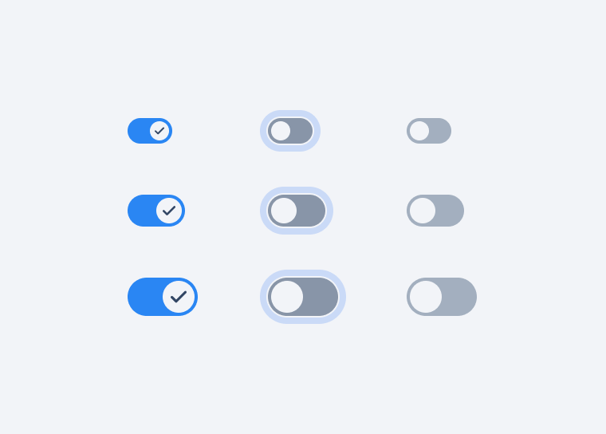

# Switch API Decisions <!-- omit in toc -->

A switch component is used to quickly switch between two possible states. These are only used for binary actions that occur immediately after the user turn the switch on/off.



- [Design](#design)
- [`Switch` API](#switch-api)
  - [Examples:](#examples)
    - [Basic](#basic)
    - [Controlled, Uncontrolled](#controlled-uncontrolled)
- [Accessibility](#accessibility)
- [Open Questions](#open-questions)

## Design

[Figma Link](https://www.figma.com/file/jubmQL9Z8V7881ayUD95ps/Blade---Payment-Light?node-id=31366-831710&t=qzTLJeIDluL4Ps23-0) to all variants of the Switch component


## `Switch` API

| Prop                | Type       | Required | Default   | Description                                                                                                                                              |
| ------------------- | ---------- | -------- | --------- | -------------------------------------------------------------------------------------------------------------------------------------------------------- |
| isChecked           | `boolean`  | No       | false     | state of the switch, if explicitly set the switch will become [controlled component](https://reactjs.org/docs/forms.html#controlled-components)                                                                                 |
| defaultChecked      | `boolean`  | No       | false     | default state of the switch, if isChecked is not provided the switch will become [uncontrolled component](https://reactjs.org/docs/uncontrolled-components.html)                                                            |
| onChange            | `({ event, isChecked, value }) => void` | No       | `undefined` | The function to be called when the switch state changes.                                                                                               |
| isDisabled          | `boolean`  | No       | `false`   | Control whether the checkbox is disabled or not.                                                                                                         |
| accessibilityLabel          | `string`  | No       | `undefined`   | Provides accessible label for internal checkbox component that sets the aria-label prop for screen readers.                                                                                                         |
| name (html native)  | `string`   | No       | `undefined` | The name of the input field in a switch, [useful in form submissions](https://developer.mozilla.org/en-US/docs/Web/HTML/Element/input#name)            |
| value (html native) | `string`   | No       | `undefined` | The value of the input field in a switch, [useful in form submissions](https://developer.mozilla.org/en-US/docs/Web/HTML/Element/input/checkbox#value) |

### Examples:

#### Basic

```js
// basic
<Switch value="dark-mode" />
```

#### Controlled, Uncontrolled

```js
const Controlled = () => {
  const [chceked, setChecked] = React.useState(false);

  return (
    <Switch isChecked={checked} onChange={({isChecked}) => setChecked(isChecked)} value="dark-mode" />
  );
};

const Uncontrolled = () => {
  return (
    <Switch defaultChecked={true} value="dark-mode" />
  );
};
```

## Accessibility

Switch will follow the exact same accessibility pattern as Checkbox

- Checkbox - https://www.w3.org/WAI/ARIA/apg/patterns/checkbox/

## Open Questions

N/A

