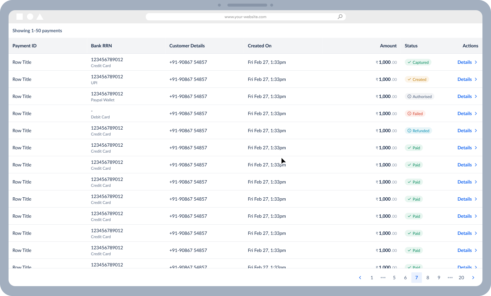
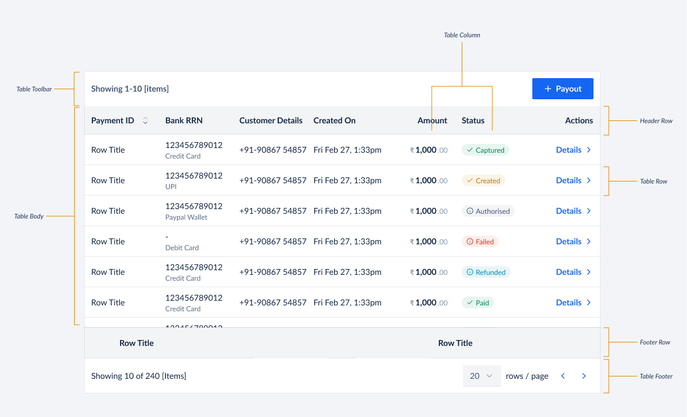

# Table API Decisions <!-- omit in toc -->

A table component helps in displaying data in a grid format, through rows and columns of cells. Table facilitates data organisation and allow users to: scan, sort, compare, and take action on large amounts of data.



- [Features](#features)
- [Out of scope](#out-of-scope)
- [Anatomy](#anatomy)
- [API](#api)
  - [Example Usage](#example-usage)
  - [Detailed API](#detailed-api)
    - [Table](#table)
      - [`TableData`](#tabledata)
      - [`SortFunctionsType`](#sortfunctionstype)
      - [`SortChangeEvent`](#sortchangeevent)
      - [`SelectionChangeEvent`](#selectionchangeevent)
    - [TableToolbar](#tabletoolbar)
    - [TableToolbarActions](#tabletoolbaractions)
    - [TableHeader](#tableheader)
    - [TableHeaderRow](#tableheaderrow)
    - [TableHeaderCell](#tableheadercell)
    - [TableBody](#tablebody)
    - [TableRow](#tablerow)
    - [TableCell](#tablecell)
    - [TableFooter](#tablefooter)
    - [TableFooterRow](#tablefooterrow)
    - [TableFooterCell](#tablefootercell)
    - [TablePagination](#tablepagination)
      - [`PageChangeEvent`](#pagechangeevent)
      - [`onPageSizeChange`](#onpagesizechange)
  - [API Design Decisions](#api-design-decisions)
    - [1. Composable API](#1-composable-api)
      - [Pros](#pros)
      - [Cons](#cons)
    - [2. Compact API](#2-compact-api)
      - [Pros](#pros-1)
      - [Cons](#cons-1)
    - [Comparison](#comparison)
    - [Decision](#decision)
      - [1. Only Composable API](#1-only-composable-api)
      - [2. Only Compact API](#2-only-compact-api)
      - [3. Both Composable \& Compact API](#3-both-composable--compact-api)
      - [Current API Usage Across Razorpay Projects](#current-api-usage-across-razorpay-projects)
      - [Conclusion](#conclusion)
- [Table Library Evaluation](#table-library-evaluation)
  - [Why a library?](#why-a-library)
  - [What are we looking for in a library?](#what-are-we-looking-for-in-a-library)
  - [Libraries evaluated](#libraries-evaluated)
    - [Heavy sized library - AG Grid](#heavy-sized-library---ag-grid)
    - [Medium sized library - Tanstack's React Table](#medium-sized-library---tanstacks-react-table)
    - [Small sized library - React Table Library](#small-sized-library---react-table-library)
    - [Comparison](#comparison-1)
- [Accessibility](#accessibility)

## Features

- Column Sorting
- Row Selection - Single & Multiple
- Pagination
- Bulk Actions Toolbar
- Horizontally Scrollable
- Sticky Columns
- Sticky Header
- Sticky Footer
- Cell Density - Normal & Comfortable

## Out of scope

We don't have enough use-cases for the following features at Razorpay and hence scoped them out of our Table component. If you are aware of any of these features being used at Razorpay, please let us know by creating an issue - we will evaluate it and scope it for future releases.

- Column Reordering
- Column Resizing
- Column Filtering
- Search
- Row Expansion
- Nested Tables
- Hiding Columns
- Editable Rows
- Table for React Native
  - Mobile Apps will be using Lists instead of Tables to convey information

## Anatomy



## API

### Example Usage

```jsx
<Table
    data={data} // This contains the actual data to be rendered in the table which would be retrieved from some API
    selectionType='single'
    onSelectionChange={onSelectionChange}
    sortFunctions={sortFunctions}
    onSortChange={onSortChange}
    isLoading={false}
    isStickyHeader={true}
    isStickyFooter={true}
    isStickyFistColumn={true}
    rowDensity='normal'
    showStripedRows={true}
    pagination={()=>(
        <TablePagination
          defaultPageSize={10}
          label='1-10 of 100'
          showLabel='left'
          showPageSizePicker
          showPageNumberSelector
          onPageChange={console.log}
          onPageSizeChange={console.log}
        />
      )}
   toolbar={()=>(
        <TableToolbar title="Users" itemsSelectedTitle={`${selectedUsersCount} Users selected`}>
            <ToolbarActions>
                <Button>Export</Button>
            </ToolbarActions>
        </TableToolbar>
      )}
>
{(tableData) => (
  <>
    <TableHeader>
      <TableHeaderRow>
         <TableHeaderCell headerKey='firstName'>
          First Name
        </TableHeaderCell>
        <TableHeaderCell headerKey='lastName'>
          Last Name
        </TableHeaderCell>
        <TableHeaderCell headerKey='balance'>
          Balance
          <Tooltip content='Current bank balance'>
            <InfoIcon size='medium' />
          </Tooltip>
        </TableHeaderCell>
       </TableHeaderRow>
     </TableHeader>

    <TableBody>
      {tableData.map((row) => (
        <TableRow onClick={console.log} isDisabled={false}>
          <TableCell>
            {row.firstName}
          </TableCell>
          <TableCell>
            {row.lastName}
          </TableCell>
          <TableCell>
            {row.balance}
            <Badge>Low</Badge>
          </TableCell>
        <TableRow>
      )}
    </TableBody>

    <TableFooter>
      <TableFooterRow>
        <TableFooterCell>
          Total
        </TableFooterCell>
        <TableFooterCell>
          {computedTotalBalance}
        </TableFooterCell>
      </TableFooterRow>
    </TableFooter>
   </>
  )
}
</Table>
```

### Detailed API

> We will be using Composable API for Table

#### Table

| Prop               | Type                                          | Default     | Description                                                                                                                                                                                                                                                                                                                              | Required |
| ------------------ | --------------------------------------------- | ----------- | ---------------------------------------------------------------------------------------------------------------------------------------------------------------------------------------------------------------------------------------------------------------------------------------------------------------------------------------- | -------- |
| data               | TableData                                     | `undefined` | This contains the actual data to be rendered in the table which would be retrieved from some API                                                                                                                                                                                                                                         | ✅       |
| children           | `(tableData: TableData) => React.ReactNode[]` | undefined   | Expects a function that returns Table composition components like `TableHeader`, `TableBody` & `TableFooter`. The function provides the tableData as an argument which can be used to render the table. The provided tableData will update based on pagination and sort states.                                                          | ✅       |
| selectionType      | `single`, `multiple`                          | `single`    | This defines the type of selection that is allowed in the table. Possible values are 'single' & 'multiple'                                                                                                                                                                                                                               |
| onSelectionChange  | `SelectionChangeEvent`                        | `undefined` | This is a callback function that is called when the selection changes. It is called with the selected items as an array                                                                                                                                                                                                                  |
| sortFunctions      | `SortFunctionsType`                           | `undefined` | This is an object that contains the sort functions for each column. The key of the object should be the `headerKey` of the column and the value is a function that takes in an array of items and returns a sorted array of items. A column will be made automatically sortable by adding its headerKey along with a sort function here. |
| onSortChange       | `SortChangeEvent`                             | `undefined` | This is a callback function that is called when the sort changes. It is called with the headerKey & sortType as arguments                                                                                                                                                                                                                |
| isLoading          | `boolean`                                     | `false`     | This defines whether the table is in a loading state or not                                                                                                                                                                                                                                                                              |
| isRefreshing       | `boolean`                                     | `false`     | This defines whether the table is in a refreshing state or not                                                                                                                                                                                                                                                                           |
| rowDensity         | `normal`, `comfortable`                       | `normal`    | This defines the density of the cells in the table. Possible values are 'normal' & 'comfortable'                                                                                                                                                                                                                                         |
| showStripedRows    | `boolean`                                     | `false`     | This defines whether the table should show zebra stripes or not                                                                                                                                                                                                                                                                          |
| pagination         | `React.ReactElement`                          | `undefined` | Expects the TablePagination Component                                                                                                                                                                                                                                                                                                    |
| toolbar            | `React.ReactElement`                          | `undefined` | Expects the TableToolbar Component                                                                                                                                                                                                                                                                                                       |
| isStickyHeader     | `boolean`                                     | `false`     | This defines whether the table header should be sticky or not                                                                                                                                                                                                                                                                            |
| isStickyFooter     | `boolean`                                     | `false`     | This defines whether the table footer should be sticky or not                                                                                                                                                                                                                                                                            |
| isStickyFistColumn | `boolean`                                     | `false`     | This defines whether the first column of the table should be sticky or not                                                                                                                                                                                                                                                               |
| surfaceLevel       | `1`, `2`, `3`                                 | `2`         | This defines the surface level of the table. Possible values are `1`, `2` & `3`                                                                                                                                                                                                                                                          |

##### `TableData`

```ts
type TableNode = {
  id: Identifier;
  nodes?: null;
  [key: string]: unknown;
};

// we might want to add more meta information here in the future (could need some for pagination. Will update this as we go.)
type TableData = {
  nodes: TableNode[];
};
```

##### `SortFunctionsType`

```ts
type SortFunctionsType = {
  [key: string]: (array: TableNode[]) => TableNode[];
};
```

##### `SortChangeEvent`

```ts
type SortChangeEvent = {
  sortKey: string;
  isSortReversed: boolean;
};
```

##### `SelectionChangeEvent`

```ts
type SelectionChangeEvent = (selectedItems: TableNode[]) => void;
```

#### TableToolbar

| Prop               | Type              | Default   | Description                                                         | Required |
| ------------------ | ----------------- | --------- | ------------------------------------------------------------------- | -------- |
| title              | `string`          | undefined | This defines the title of the table toolbar                         |          |
| itemsSelectedTitle | `string`          | undefined | This defines the title of the table toolbar when items are selected |          |
| children           | `React.ReactNode` | undefined | This defines the actions to be shown in the table toolbar           |          |

#### TableToolbarActions

| Prop     | Type              | Default   | Description                                               | Required |
| -------- | ----------------- | --------- | --------------------------------------------------------- | -------- |
| children | `React.ReactNode` | undefined | This defines the actions to be shown in the table toolbar |

#### TableHeader

| Prop     | Type              | Default   | Description                        | Required |
| -------- | ----------------- | --------- | ---------------------------------- | -------- |
| children | `React.ReactNode` | undefined | This defines the table header rows | ✅       |

#### TableHeaderRow

| Prop     | Type              | Default   | Description                         | Required |
| -------- | ----------------- | --------- | ----------------------------------- | -------- |
| children | `React.ReactNode` | undefined | This defines the table header cells | ✅       |

#### TableHeaderCell

| Prop      | Type                         | Default   | Description                                                                  | Required |
| --------- | ---------------------------- | --------- | ---------------------------------------------------------------------------- | -------- |
| headerKey | `string`                     | undefined | This defines the header key of the column                                    | ✅       |
| children  | `React.ReactNode` , `string` | undefined | This defines the content of the table header cell. Can be a JSX or a string. | ✅       |

#### TableBody

| Prop     | Type              | Default   | Description                      | Required |
| -------- | ----------------- | --------- | -------------------------------- | -------- |
| children | `React.ReactNode` | undefined | This defines the table body rows | ✅       |

#### TableRow

| Prop       | Type              | Default   | Description                                     | Required |
| ---------- | ----------------- | --------- | ----------------------------------------------- | -------- |
| children   | `React.ReactNode` | undefined | This defines the table body cells               | ✅       |
| isDisabled | `boolean`         | false     | This defines whether the row is disabled or not |

#### TableCell

| Prop     | Type                        | Default   | Description                                                    | Required |
| -------- | --------------------------- | --------- | -------------------------------------------------------------- | -------- |
| children | `React.ReactNode`, `string` | undefined | This defines the content of the cell. Can be a JSX or a string | ✅       |

#### TableFooter

| Prop     | Type              | Default   | Description                        | Required |
| -------- | ----------------- | --------- | ---------------------------------- | -------- |
| children | `React.ReactNode` | undefined | This defines the table footer rows | ✅       |

#### TableFooterRow

| Prop     | Type              | Default   | Description                         | Required |
| -------- | ----------------- | --------- | ----------------------------------- | -------- |
| children | `React.ReactNode` | undefined | This defines the table footer cells | ✅       |

#### TableFooterCell

| Prop     | Type                        | Default   | Description                                                                  | Required |
| -------- | --------------------------- | --------- | ---------------------------------------------------------------------------- | -------- |
| children | `React.ReactNode`, `string` | undefined | This defines the content of the table footer cell. Can be a JSX or a string. | ✅       |

#### TablePagination

| Prop               | Type                  | Default                          | Description                                                                                                                                                           | Required |
| ------------------ | --------------------- | -------------------------------- | --------------------------------------------------------------------------------------------------------------------------------------------------------------------- | -------- |
| currentPage        | `number`              | undefined                        | This defines the current page of the table. If you pass currentPage, this becomes a controlled component and you will have to manage page selection state on your own |          |
| defaultPageSize    | `number`              | 10 (to be confirmed with design) | This defines the default number of items to be shown per page                                                                                                         |          |
| label              | `string`              | undefined                        | This defines the label to be shown in the pagination                                                                                                                  |
| showLabel          | `boolean`             | `false`                          | This defines whether the label should be shown or not                                                                                                                 |
| showPageSizePicker | `boolean`             | `false`                          | This defines whether the page size picker should be shown or not                                                                                                      |
| onPageChange       | `PageChangeEvent`     | undefined                        | This is a callback function that is called when the currentPage changes                                                                                               |
| onPageSizeChange   | `PageSizeChangeEvent` | undefined                        | This is a callback function that is called when the pageSize changes                                                                                                  |

##### `PageChangeEvent`

```ts
type PageChangeEvent = ({ page: number }) => void;
```

##### `onPageSizeChange`

```ts
type PageSizeChangeEvent = ({ pageSize: number }) => void;
```

### API Design Decisions

> You can skip this section and go to [Table Library Evaluation](#table-library-evaluation) if you are not interested in the API design process. The [Final API](#api) has already been documented above.
> The decision was made to go ahead with Composable API after consulting with the frontend leads

While evaluating what kind of API we want for our table, we discovered 2 approaches:

#### 1. Composable API

Composable API is a pattern where we have a set of components that can be composed together to create a table. This approach allows us to stitch together a table very similar to how you would do it with native HTML. However, it is also more verbose and requires more effort to create a table.

```jsx
// Mock data & functions

const data = [
  {
    firstName: 'John',
    lastName: 'Doe',
    balance: 1000,
  },
  {
    firstName: 'Jane',
    lastName: 'Doe',
    balance: 2000,
  },
];

const sortFunctions = {
  firstName: (array) => array.sort((a, b) => a.name.localeCompare(b.name)),
};

const onSelectionChange = (selectedItems) => {
  console.log(selectedItems);
};

const onSortChange = ({ headerKey, sortType }) => {
  console.log({ headerKey, sortType });
};
```

```jsx
// Composable Table

<Table
    data={data} // This contains the actual data to be rendered in the table which would be retrieved from some API
    selectionType='single'
    onSelectionChange={onSelectionChange}
    sortFunctions={sortFunctions}
    onSortChange={onSortChange}
    isLoading={false}
    rowDensity='normal'
    showStripedRows={true}
    pagination={()=>(
        <TablePagination
          defaultPageSize={10}
          label='1-10 of 100'
          showLabel='left'
          showPageSizePicker
          showPageNumberSelector
          onPageChange={console.log}
          onPageSizeChange={console.log}
        />
      )}
   toolbar={()=>(
        <TableToolbar title="Users" itemsSelectedTitle={`${selectedUsersCount} Users selected`}>
            <ToolbarActions>
                <Button>Export</Button>
            </ToolbarActions>
        </TableToolbar>
      )}
>
{(tableData) => (
  <>
    <TableHeader>
      <TableHeaderRow>
         <TableHeaderCell headerKey='firstName'>
          First Name
        </TableHeaderCell>
        <TableHeaderCell headerKey='lastName'>
          Last Name
        </TableHeaderCell>
        <TableHeaderCell headerKey='balance'>
          Balance
          <Tooltip content='Current bank balance'>
            <InfoIcon size='medium' />
          </Tooltip>
        </TableHeaderCell>
       </TableHeaderRow>
     </TableHeader>

    <TableBody>
      {tableData.map((row) => (
        <TableRow onClick={console.log} isDisabled={false}>
          <TableCell>
            {row.firstName}
          </TableCell>
          <TableCell>
            {row.lastName}
          </TableCell>
          <TableCell>
            {row.balance}
            <Badge>Low</Badge>
          </TableCell>
        <TableRow>
      )}
    </TableBody>

    <TableFooter>
      <TableFooterRow>
        <TableFooterCell>
          Total
        </TableFooterCell>
        <TableFooterCell>
          {computedTotalBalance}
        </TableFooterCell>
      </TableFooterRow>
    </TableFooter>
   </>
  )
}
</Table>
```

##### Pros

- Composable API is more intuitive and resembles the native HTML structure of a table
- It is easier to understand since the API design is similar to rest of the Blade components
- It is easier to extend and add new feature to individual table components
- We could leverage tree-shaking to only import the components that are being used in the consumer's table

##### Cons

- Composable API is more verbose and requires more effort to create a table by composing together multiple components
- Most popular table libraries like AG Grid, React Table, etc. use a compact API which is battle tested and developers are more familiar with the same

#### 2. Compact API

Compact API is a pattern where we have a single component that takes in all the data and renders a table. This approach is more concise and requires less effort to create a table. However, it is also less intuitive and does not resemble the native HTML structure of a table.

```jsx
// Mock data & functions
const data = [{
    firstName: 'John',
    lastName: 'Doe',
    balance: 1000
},
{
    firstName: 'Jane',
    lastName: 'Doe',
    balance: 2000
}];


const sortFunctions = {
  firstName: (array) => array.sort((a, b) => a.name.localeCompare(b.name)),
};

const onSelectionChange = (selectedItems) => {
  console.log(selectedItems);
};

const columnDefinition = [
    {
        header: 'First Name',
        headerKey: 'firstName',
        cell: (row) => row.firstName,
    },
    {
        header: 'Last Name',
        headerKey: 'lastName',
        cell: (row) => row.lastName,
    },
    {
        header: () => (
            <>
                Balance
                <Tooltip content='Current bank balance'>
                    <InfoIcon size='medium' />
                </Tooltip>
            </>),
        headerKey: 'balance',
        cell: (row) => (
            <>
                {row.balance}
                <Badge>Low</Badge>
            </>),
    }
];

const footerDefinition = [
    {
        footer: 'Total',
    },
    {
        footer: computedTotalBalance,
    }
];

const pagination = {
  label?: string,
  defaultPageSize?: number,
  currentPage?: number,
  showLabel?: boolean,
  showPageNumberSelector?: boolean,
  showPageSizePicker?: boolean,
  onPageChange?: ({ page }) => void,
  onPageSizeChange?: ({ pageSize }) => void,
};
```

```jsx
// Compact Table

<Table
  data={data} // This contains the actual data to be rendered in the table which would be retrieved from some API
  columns={columns} // This contains the column definition for the table
  footerRow={footerRow} // This contains the footer definition for the table
  selectionType="single"
  onSelectionChange={onSelectionChange}
  sortFunctions={sortFunctions}
  onSortChange={onSortChange}
  isLoading={false}
  rowDensity="normal"
  showStripedRows={true}
  toolbarTitle="Users"
  toolbarItemsSelectedTitle={`${selectedUsersCount} Users selected`}
  toolbarActions={<Button>Export</Button>}
  isStickyHeader={true}
  isStickyFooter={true}
  isStickyFistColumn={true}
/>
```

##### Pros

- Compact API is more concise and requires less effort to create a table
- Most popular table libraries like AG Grid, React Table, etc. use a compact API which is battle tested and developers are more familiar with the same
- It would be relatively easier to swap out the table library in the future if we decide to do so since the API design is similar to other popular table libraries

##### Cons

- Compact API is less intuitive and does not resemble the native HTML structure of a table
- It is harder to extend and add new feature to the table component since it is a single component
- We would have to import the entire table component even if we are using only a few features of the table resulting in a higher bundle size for the consumer
- Internally, we would have to use a composable API to create the compact API anyway since the library we have chosen has a composable API

#### Comparison

| Aspect                  | Composable API                                                                                                                                     | Compact API                                                                                    |
| ----------------------- | -------------------------------------------------------------------------------------------------------------------------------------------------- | ---------------------------------------------------------------------------------------------- |
| **API Design**          | Multipe components composed together                                                                                                               | Single component that takes all data                                                           |
| **Ease of Use**         | Resembles native HTML table but requires more efforts to write                                                                                     | More concise and requires less effort                                                          |
| **Learning Curve**      | Requires developers to learn about all available Table components & features to compose their own                                                  | Easier to understand what is feasible since its a single component along with TypeScript hints |
| **Extensibility**       | Easier to extend and add new features on individual components                                                                                     | Harder to extend and add new features without making the prop list too large                   |
| **Library Familiarity** | Different than most of the popular table libraries                                                                                                 | Similar to most of the popular table libraries                                                 |
| **Bundle Size**         | Can leverage tree-shaking for smaller bundles (Only components like Pagination & Footer could be omitted, rest of it might still always be needed) | Bundle size would be unaffected regardless of features used within the table by consumer       |
| **Future Library Swap** | May require reworking with different library                                                                                                       | Easier to swap out the library in the future                                                   |

#### Decision

##### 1. Only Composable API

- We could expose only the Composable API to the consumers
- This would take the least amount of implementation time and effort
- Strong reasons to go with this approach would be the composability and tree-shaking benefits
- Strong reasons to not go with this approach would be the verbosity and the fact that it is not the most popular approach within Table libraries ecosystem

##### 2. Only Compact API

- We could expose only the Compact API to the consumers
- This would take the relatively more time and effort since internally we will have to build individual components and stitch them together to create the compact API
- Internally we might not need to put in heavy efforts to ensure composable API is very well structured since we will not be exposing it to the consumers. We would use the composable API internally only to derive the final outcome of a compact API.
- Strong reasons to go with this approach would be the popularity of the compact API within the Table libraries ecosystem
- Strong reasons to not go with this approach would be the lack of composability and tree-shaking benefits

##### 3. Both Composable & Compact API

- We could expose both the Composable & Compact API to the consumers
- This would take the most amount of implementation time and effort since we will have to build both the APIs
- This will add a lot of complexity to the library and will make it harder to maintain. Any changes to the Table component, we will have to ensure both APIs are updated accordingly and always maintain parity
- Swapping out the table library in the future would be challenging since any library we choose we will have to ensure that its feasible to build both kinds of APIs
- Strong reasons to go with this approach would be to give our consumers complete flexibility to choose the API that they are most comfortable with
- Strong reasons to not go with this approach would be the complexity and maintainability issues as well as education efforts required to educate the consumers about both the APIs

##### Current API Usage Across Razorpay Projects

> This is an approximate usage count. We identified this by searching through the codebase. Actual numbers may vary slightly.

| Project         | Composable API Table Instances | Compact API Table Instances |
| --------------- | ------------------------------ | --------------------------- |
| PG Dashboard    | 101                            | 81                          |
| Admin Dashboard | 19                             | 196                         |
| X Dashboard     | 6                              | 11                          |

##### Conclusion

- We took inputs from Frontend Leads across the org and the majority of them were in favour of the **Composable API** for its **composability** and **tree-shaking benefits**
- Compact API can be built on top of composable API if needed in the future
- We will be going ahead with the **Composable API** for now and will evaluate the need for Compact API in the future

## Table Library Evaluation

### Why a library?

- The primary reason for using a library is to use a battle-tested solution that has been used by a lot of people and has been proven to work well instead of figuring out all the edge cases ourselves
- On a long term we could evaluate swapping it out and building our own solution when the bandwidth and requirements align but until then using an open source library would be the best option

### What are we looking for in a library?

We had a few requirements that we were looking for in a library:

- Well maintained and has a good community around it
- Reasonable bundle size
- Supports all the features that we need today and in the future (including features marked out of scope)
- Flexible styling to ensure we can match the Razorpay's design language
- Flexible API to ensure we can build both the Composable & Compact APIs

### Libraries evaluated

While evaluating multiple libraries we identified 3 categories:

- **Heavy sized library** with every feature under the sun
- **Medium size library** with all of the features we could need plus some more
- **Small size library** with all the core features we could need

#### Heavy sized library - AG Grid

- [AG Grid](https://www.ag-grid.com/) is the best example of a heavy sized library. It has a lot of features and is very well maintained. However, it is also very heavy and has a lot of features that we don't need.
- As of today, AG Grid's bundle size is 75kb (15kb gzipped) but along with this we also need to install some additional dependency libraries like ag-grid-community which would eventually increase the overall bundle size
- Replicating the Composable API would be a challenging task with React Table since it internally uses API similar to the Compact API. We would have to build a lot of abstractions to ensure we can build the Composable API on top of the Compact API.
- AG Grid is possibly the most battle-tested library but has a ton of features that we won't need and hence would be an overkill for us as of now

#### Medium sized library - Tanstack's React Table

- [Tanstack's React Table](https://react-table.tanstack.com/) is the best example of a medium sized library. It has all the features we need and is very well maintained. However, it is also relatively heavy and has a lot of features that we don't need.
- As of today, React Table's bundle size is 60kb (14kb gzipped).
- Tanstack's React Table has been around for a longer duration and is extremely well maintained. It has relatively less features than AG Grid but also has a lot of features that we don't need.
- Tanstack's React Table is built in a framework agnostic manner which meant they had to use a lot of abstractions to ensure it works well with all the frameworks. This makes it harder to understand, maintain and extend the library.
- Replicating the Composable API would be a challenging task with React Table since it internally uses API similar to the Compact API. We would have to build a lot of abstractions to ensure we can build the Composable API on top of the Compact API.
- React Table is possibly our 2nd best option if we ever need more complex tables in the future but as of now it would be an overkill for us

#### Small sized library - React Table Library

- [React Table Library (@table-library/react-table-library)](https://github.com/table-library/react-table-library) is the best example of a small sized library. It has all the features we need and is relatively well maintained.
- It contains all the features we need today as well as the ones we can forsee needing in the future
- As of today, React Table Library's bundle size is 23kb (7kb gzipped).
- React Table Library has a Composable API using which we can build our Composable as well as Compact API
- React Table Library also exposes a minimal Compact API but we cannot use that directly to build our Compact API since there isn't a parity between their own Composable & Compact APIs
- React Table Library is our best option as of today since it has all the features we could need and is relatively lightweight

#### Comparison

| Library                                                                     | Features                                                      | Bundle Size                                             | Composable API       | Compact API   | Maintenance                                             | Our Choice |
| --------------------------------------------------------------------------- | ------------------------------------------------------------- | ------------------------------------------------------- | -------------------- | ------------- | ------------------------------------------------------- | ---------- |
| [AG Grid](https://www.ag-grid.com/)                                         | Very heavy and has a lot of features we don't need            | 75kb (15kb gzipped) (+ additional supporting libraries) | Challenging to build | Easy to build | Extremely well maintained. Has paid Enterprise support. |
| [Tanstack's React Table](https://react-table.tanstack.com/)                 | Relatively heavy and has a lot of features we don't need      | 60kb (14kb gzipped)                                     | Challenging to build | Easy to build | Very well maintained                                    |
| [React Table Library](https://github.com/table-library/react-table-library) | Relatively lightweight and has all the features we could need | 23kb (7kb gzipped)                                      | Easy to build        | Easy to build | Relatively well maintained                              | ✅         |

## Accessibility

- We will be following the [WAI-ARIA Table Practices](https://www.w3.org/WAI/ARIA/apg/patterns/table/) to ensure our table is accessible
- We will be using native HTML elements like `<table>`, `<thead>`, `<tbody>`, `<tfoot>`, `<tr>`, `<th>` & `<td>` to ensure our table is accessible

# Virtualization

Virtaulized table is a table component that renders only the visible rows and columns. This is useful when you have a large dataset and you want to render only the visible rows and columns to improve the performance of the table.

## Approach

Out implementation of virtualized table is an wrapper on top of react-table-library 's implementation. It provides a simple API to create a virtualized table.
alternatively we can use react-window or react-virtualized to create a virtualized table wrapper. but that would require more effort to create a virtualized table. plus their is a lot of boilerplate code to create a virtualized table using react-window or react-virtualized.
also their is high chance of bugs and performance issues in the implementation of virtualized table using react-window or react-virtualized. if we need more features in the future then we can expore react-window or react-virtualized.

## Decision

1. We have made a wrapper on top of react-table-library's implementation to create a virtualized table.
2. if virtualization is enabled we have a wrapper component and we are not passing TableBody, so this breaks a lot of existing styles and features of the table component like hoverAction, rowSelection, etc. so we have to move these styles to table component.
3. we have to pass a ref to the table container to calculate the height and width of the table to render only the visible rows and columns.

## Props

most of props are same as Table component. we have added following table component.

```ts

isVirtualized = false, // default value is false , it is used to enable virtualization in table

ref = React.Ref<HTMLDivElement> | undefined, // ref to the table container  , since in virtualized table we need to calculate the height and width of the table to render only the visible rows and columns


```

but their is a change in children prop of Table component. In virtualized table we need to pass a component named TableVirtulized that takes TableHeader, TableBody components.
VirtualizedTable is a wrapper on top of react-table-library's [Virtualized](https://github.com/table-library/react-table-library/blob/master/src/virtualized/Virtualized.tsx) component. It provides a simple API to create a virtualized table.

```ts
type VirtualizedWrapperProps<Item> = {
  /**
   *   <TableComponent
   *      data={data}
   *      isVirtualized
   *      rowDensity="compact"
   *      selectionType="multiple"
   *      height="700px"
   *      toolbar={
   *        <TableToolbar>
   *          <TableToolbarActions>
   *            <Button variant="secondary" marginRight="spacing.2">
   *              Export
   *            </Button>
   *            <Button>Payout</Button>
   *          </TableToolbarActions>
   *        </TableToolbar>
   *      }
   *    >
   *      {(tableData) => (
   *        <TableVirtualizedWrapper tableData={tableData}>
   *          <TableHeader>
   *            <TableHeaderRow>
   *              <TableHeaderCell>ID</TableHeaderCell>
   *              <TableHeaderCell>Amount</TableHeaderCell>
   *              <TableHeaderCell>Account</TableHeaderCell>
   *              <TableHeaderCell>Date</TableHeaderCell>
   *              <TableHeaderCell>Method</TableHeaderCell>
   *              <TableHeaderCell>Status</TableHeaderCell>
   *            </TableHeaderRow>
   *          </TableHeader>
   *          <TableBody<Item>>
   *            {(tableItem, index) => (
   *              <TableRow
   *                key={index}
   *                item={tableItem}
   *                hoverActions={
   *                  <>
   *                    <IconButton
   *                      accessibilityLabel="Copy"
   *                      isHighlighted
   *                      icon={CopyIcon}
   *                      onClick={() => console.log('copy', tableItem)}
   *                    />
   *                    <IconButton
   *                      accessibilityLabel="Delete"
   *                      isHighlighted
   *                      icon={TrashIcon}
   *                      onClick={() => console.log('delete', tableItem)}
   *                    />
   *                  </>
   *                }
   *              >
   *                <TableCell>
   *                  <Code size="medium">{tableItem.paymentId}</Code>
   *                </TableCell>
   *                <TableCell>
   *                  <Amount value={tableItem.amount} />
   *                </TableCell>
   *                <TableCell>{tableItem.account}</TableCell>
   *                <TableCell>
   *                  {tableItem.date?.toLocaleDateString('en-IN', {
   *                    year: 'numeric',
   *                    month: '2-digit',
   *                    day: '2-digit',
   *                  })}
   *                </TableCell>
   *                <TableCell>{tableItem.method}</TableCell>
   *                <TableCell>
   *                  <Badge
   *                    size="medium"
   *                    color={
   *                      tableItem.status === 'Completed'
   *                        ? 'positive'
   *                        : tableItem.status === 'Pending'
   *                        ? 'notice'
   *                        : tableItem.status === 'Failed'
   *                        ? 'negative'
   *                        : 'default'
   *                    }
   *                  >
   *                    {tableItem.status}
   *                  </Badge>
   *                </TableCell>
   *              </TableRow>
   *            )}
   *          </TableBody>
   *        </TableVirtualizedWrapper>
   *      )}
   *    </TableComponent>
   *
    /**
   * The tableData prop is an array of objects.
   */
  tableData: TableNode<Item>[];
  /**
   * headerHeight is the height of the header
   **/
  headerHeight?: number;
  /**
   * rowHeight is the height of each row, it can be a fixed number or a function that returns a number
   **/
  rowHeight?: (item: TableLibraryTableNode, index: number) => number;
  children: React.ReactNode;
};
```
