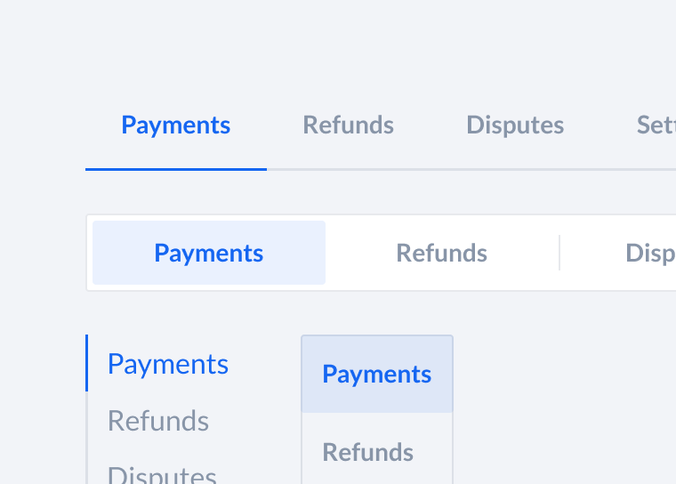
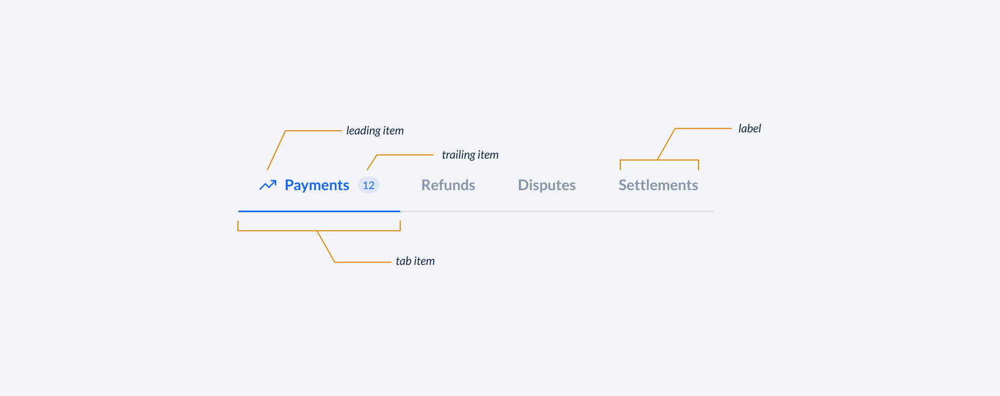
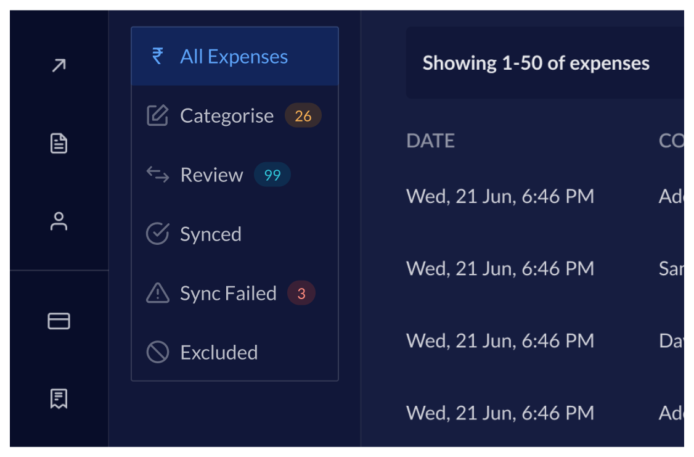
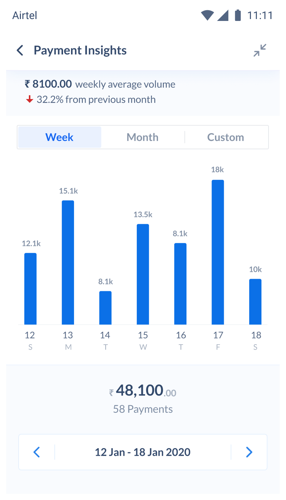
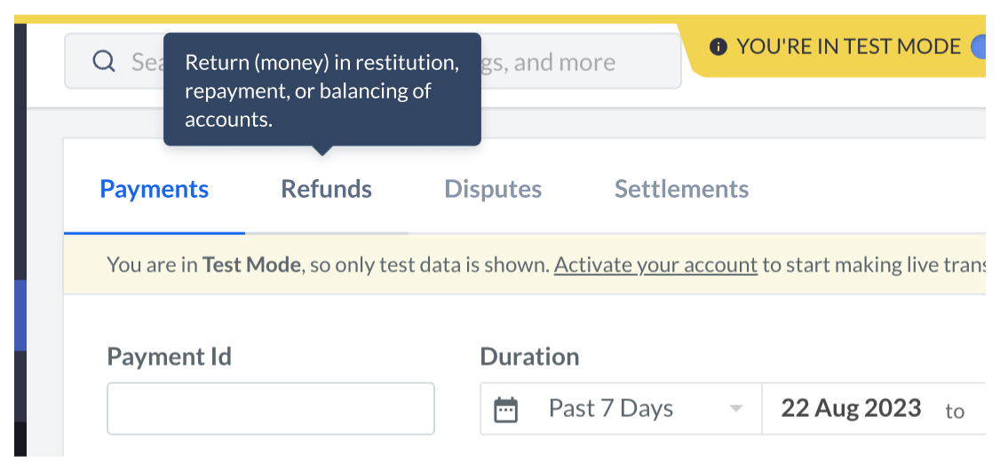

# Tabs API Decisions <!-- omit in toc -->

A tab is a navigation component used in the interface to switch between different views in the same context. Tabs are contextual to the section or the page and are triggered by user interaction.



- [Design](#design)
- [Features](#features)
- [Anatomy](#anatomy)
- [`Tabs` API](#tabs-api)
- [`TabItem` API](#tabitem-api)
- [`TabPanel` API](#tabpanel-api)
  - [Examples:](#examples)
- [Basic](#basic)
    - [Controlled, Uncontrolled](#controlled-uncontrolled)
- [Vertical Orientation](#vertical-orientation)
- [Filled Variant](#filled-variant)
- [With Tooltip](#with-tooltip)
- [Alternative APIs](#alternative-apis)
  - [1. Quite tricky/hack to implement](#1-quite-trickyhack-to-implement)
  - [2. The JSX doesn't map well with the visual hierarchy / the HTML structure](#2-the-jsx-doesnt-map-well-with-the-visual-hierarchy--the-html-structure)
  - [3. Extensibility](#3-extensibility)
  - [4. API Familiarity](#4-api-familiarity)
- [Motion](#motion)
- [Accessibility](#accessibility)
- [Open Questions](#open-questions)

## Design

[Figma Link](https://www.figma.com/file/LSG77hEeVYDk7j7WV7OMJE/Blade-DSL---Components-Guideline?node-id=3733%3A8981&mode=dev) to all variants of the Tabs component

## Features

- Controlled and Uncontrolled
- Filled and Bordered variants
- Horizontal and Vertical orientation
- Medium and Large size

## Anatomy



```jsx
<Tabs>
  <TabList>
    <TabItem />
  </TabList>
  <TabPanel />
</Tabs>
```

## `Tabs` API

```ts
type TabsProps = {
  /**
   * The content of the component, accepts `TabList` and `TabPanel` components.
   */
  children: React.ReactNode;
  /**
   * The value of the selected tab, If set the component will be controlled.
   */
  value?: string;
  /**
   * The default value of the selected tab, in case the Tabs component is uncontrolled.
   */
  defaultValue?: string;
  /**
   * Callback fired when the value changes.
   */
  onChange?: (value: string) => void;
  /**
   * The orientation of the tabs.
   */
  orientation?: 'horizontal' | 'vertical';
  /**
   * The size of the tabs.
   */
  size?: 'medium' | 'large';
  /**
   * The variant of the tabs.
   */
  variant?: 'bordered' | 'filled';
  /**
   * If `true`, the TabItems will grow to use all the available space.
   */
  autoWidth?: boolean;
};
```

## `TabItem` API

```ts
type TabItemProps = {
  /**
   * The label of the tab item.
   */
  children: string;
  /**
   * The value of the tab item.
   */
  value: string;
  /**
   * Leading element of the tab item.
   * Can be used to render an icon.
   */
  leading?: React.ReactNode;
  /**
   * Trailing element of the tab item.
   * Can be used to render an badge/counter.
   */
  trailing?: React.ReactNode;
  /**
   * If `true`, the tab item will be disabled.
   */
  isDisabled?: boolean;
};
```

## `TabPanel` API

```ts
type TabPanelProps = {
  /**
   * The value of the tab panel. This will be used to match the selected tab.
   */
  value: string;
  /**
   * The content of the tab panel.
   */
  children: React.ReactNode;
};
```

### Examples:

## Basic

```js
<Tabs>
  <TabList>
    <TabItem value="payments">Payments</TabItem>
    <TabItem value="refunds">Refunds</TabItem>
    <TabItem value="disputes">Disputes</TabItem>
    <TabItem value="settlements">Settlements</TabItem>
  </TabList>

  <TabPanel value="payments">
    <Payments />
  </TabPanel>
  <TabPanel value="refunds">
    <Refunds />
  </TabPanel>
  <TabPanel value="disputes">
    <Disputes />
  </TabPanel>
  <TabPanel value="settlements">
    <Settlements />
  </TabPanel>
</Tabs>
```


#### Controlled, Uncontrolled

```js
const Controlled = () => {
  const [selected, setSelected] = React.useState('payments');

  return (
    <Tabs value={selected} onChange={(value) => setSelected(value)}>
      <TabList>
        <TabItem value="payments">Payments</TabItem>
        <TabItem value="refunds">Refunds</TabItem>
      </TabList>

      <TabPanel value="payments">
        <Payments />
      </TabPanel>
      <TabPanel value="refunds">
        <Refunds />
      </TabPanel>
    </Tabs>
  );
};

const Uncontrolled = () => {
  return (
    <Tabs defaultValue="refunds">
      <TabList>
        <TabItem value="payments">Payments</TabItem>
        <TabItem value="refunds">Refunds</TabItem>
      </TabList>

      <TabPanel value="payments">
        <Payments />
      </TabPanel>
      <TabPanel value="refunds">
        <Refunds />
      </TabPanel>
    </Tabs>
  );
};
```

## Vertical Orientation

```jsx
<Tabs orientation="vertical">
  <TabList>
    <TabItem value="all-expenses" leading={RupeeIcon}>
      All Expenses
    </TabItem>
    <TabItem
      value="categories"
      leading={EditIcon}
      trailing={<Counter value={26} variant="notice" />}
    >
      Categorise
    </TabItem>
    <TabItem
      value="review"
      leading={TransactionIcon}
      trailing={<Counter value={99} variant="information" />}
    >
      Review
    </TabItem>
    <TabItem value="synced" leading={CheckCircleIcon}>
      Synced
    </TabItem>
    <TabItem
      value="synced-fail"
      leading={WarningIcon}
      trailing={<Counter value={3} variant="negative" />}
    >
      Synced Failed
    </TabItem>
    <TabItem value="excluded" leading={SlashIcon}>
      Excluded
    </TabItem>
  </TabList>
  ...
</Tabs>
```



## Filled Variant

```jsx
<Tabs defaultValue="refunds">
  <TabList>
    <TabItem value="week">Week</TabItem>
    <TabItem value="month">Month</TabItem>
    <TabItem value="custom">Custom</TabItem>
  </TabList>

  <TabPanel value="week">
    <WeekGraph />
  </TabPanel>
  <TabPanel value="month">
    <MonthGraph />
  </TabPanel>
  <TabPanel value="custom">
    <CustomGraph />
  </TabPanel>
</Tabs>
```



## With Tooltip

```jsx
<Tabs>
  <TabList>
    <TabItem value="payments">Payments</TabItem>
    <TabItem value="refunds">
      <Tooltip content="Return (money) in restitution, repayment, or balancing of accounts.">
        <TooltipInteractiveWrapper>Refunds</TooltipInteractiveWrapper>
      </Tooltip>
    </TabItem>
    <TabItem value="disputes">Disputes</TabItem>
    <TabItem value="settlements">Settlements</TabItem>
  </TabList>
  ...
</Tabs>
```



## Alternative APIs

We [discussed](https://github.com/razorpay/blade/pull/1693#discussion_r1345677600) another potential API: 

```jsx
<Tabs>
  <Tab title="Payments" value="" leading={} trailing={}>
    <Text>Tab Panel Content For Payments</Text>
  </Tab>
  <Tab title="Refunds" value="" leading={} trailing={}>
    <Text>Tab Panel Content For Refunds</Text>
  </Tab>
  <Tab title="Disputes" value="" leading={} trailing={}>
    <Text>Tab Panel Content For Disputes</Text>
  </Tab>
</Tabs>
```

We decided not to go with this API because of these downsides: 

#### 1. Quite tricky/hack to implement

With the API that you proposed it will be quite tricky to map the JSX to the HTML structure that a typical tab requires. 

A tab's HTML structure is as follows

```html
<div>
  <div role="tablist">
    <button role="tab">tab item 1</button>
    <button role="tab">tab item 2</button>
    <button role="tab">tab item 3</button>
  </div>
  
  <div>
    <section role="tabpanel"></section>
    <section role="tabpanel"></section>
    <section role="tabpanel"></section>
  </div>
</div>
```

We need to achieve the above HTML structure, and to do this with the API that you proposed will get very hacky since now we need to use React.cloneElement and save those JSX nodes in state and render them in appropriate place. 

```html
<Tabs>
  // this will be the button with role="tab", need to React.cloneElement and move it to the right place, and while placing also need to make sure it has a parent of role="tablist"
  <Tab value={} leading={} trailing={} title={}>  
    // this is role="tabpanel" need to React.cloneElement and move it to the right place
    {...the jsx content for the content of the tab} 
  </Tab>
</Tabs>
```

#### 2. The JSX doesn't map well with the visual hierarchy / the HTML structure

If you notice the HTML structure pointed out in point #1 you'll see that it's 1:1 with the JSX API that i'm proposing. 

The current API that is proposed also maps 1:1 with the visual hierarchy of the component, but the second one doesn't map very well.  


#### 3. Extensibility

The current API is also much more easier to extend in case any future usecase arises, for example let's say we want to use these tabs like a segmented control (which works like radio buttons but doesn't associate with any "tabpanels" we can simply remove the tabpanels and change the underlying html structure to accommodate for any future usecases. 

Check how reshaped is allowing this [extensibility](https://reshaped.so/content/docs/components/tabs#using-in-forms) - if you pass `name` prop it will convert the tabs to work like a Radio. 

#### 4. API Familiarity 

The current API that is proposed is also much more familiar and is similar to how many other design systems are approaching compared to the second one: 

- [Reshaped](https://reshaped.so/content/docs/components/tabs)
- [Chakra](https://chakra-ui.com/docs/components/tabs/usage)
- [MUI](https://mui.com/material-ui/react-tabs/#experimental-api)
- [Atlassian](https://atlassian.design/components/tabs/examples)
- [RadixUI](https://www.radix-ui.com/primitives/docs/components/tabs)
- [HeadlessUI](https://headlessui.com/react/tabs)


## Motion

Check the motion [documentation](https://www.figma.com/proto/LSG77hEeVYDk7j7WV7OMJE/Blade-DSL---Components-Guideline?type=design&node-id=4005-31894&t=b3OlPHxPuFH1BAIZ-0&scaling=min-zoom&page-id=3698%3A13772) here.

## Accessibility

Tabs will follow the [WAI-ARIA Tabs](https://www.w3.org/WAI/ARIA/apg/patterns/tabs/) pattern.

- [Keyboard navigation](https://www.w3.org/WAI/ARIA/apg/patterns/tabs/#keyboardinteraction)

## Open Questions

N/A
