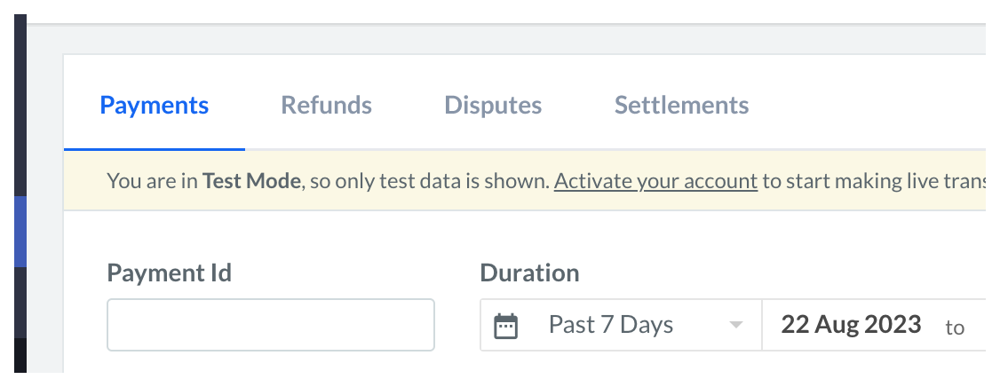

# Tabs API Decisions <!-- omit in toc -->

A tab is a navigation component used in the interface to switch between different views in the same context. Tabs are contextual to the section or the page and are triggered by user interaction.


- [Design](#design)
- [Features](#features)
- [Anatomy](#anatomy)
- [`Tabs` API](#tabs-api)
- [`TabsItem` API](#tabsitem-api)
- [`TabsPanel` API](#tabspanel-api)
  - [Examples:](#examples)
- [Basic](#basic)
  - [Controlled, Uncontrolled](#controlled-uncontrolled)
- [Filled Variant](#filled-variant)
- [With Tooltip](#with-tooltip)
- [Motion](#motion)
- [Accessibility](#accessibility)
- [Open Questions](#open-questions)

## Design

[Figma Link](https://www.figma.com/file/LSG77hEeVYDk7j7WV7OMJE/Blade-DSL---Components-Guideline?node-id=3733%3A8981&mode=dev) to all variants of the Tabs component

## Features

- Controlled and Uncontrolled
- Filled and Bordered variants
- Horizontal and Vertical orientation
- Medium and Large size

## Anatomy


```jsx
<Tabs>
  <TabsList>
    <TabsItem />
  </TabsList>
  <TabsPanel />
</Tabs>
```

## `Tabs` API

```ts
type TabsProps = {
  /**
   * The content of the component, accepts `TabsList` and `TabsPanel` components.
   */
  children: React.ReactNode;
  /**
   * The value of the selected tab, If set the component will be controlled.
   */
  value?: string;
  /**
   * The default value of the selected tab, in case the Tabs component is uncontrolled.
   */
  defaultValue?: string;
  /**
   * Callback fired when the value changes.
   */
  onChange?: (value: string) => void;
  /**
   * The orientation of the tabs.
   */
  orientation?: 'horizontal' | 'vertical';
  /**
   * The size of the tabs.
   */
  size?: 'medium' | 'large';
  /**
   * The variant of the tabs.
   */
  variant?: 'bordered' | 'filled';
  /**
   * If `true`, the TabItems will grow to use all the available space.
   */
  autoWidth?: boolean;
};
```

## `TabsItem` API

```ts
type TabsItemProps = {
  /**
   * The label of the tab item.
   */
  children: string;
  /**
   * The value of the tab item.
   */
  value: string;
  /**
   * Leading element of the tab item.
   * Can be used to render an icon.
   */
  leading?: React.ReactNode;
  /**
   * Trailing element of the tab item.
   * Can be used to render an badge/counter.
   */
  trailing?: React.ReactNode;
};
```

## `TabsPanel` API

```ts
type TabsPanelProps = {
  /**
   * The value of the tab panel. This will be used to match the selected tab.
   */
  value: string;
  /**
   * The content of the tab panel.
   */
  children: React.ReactNode;
};
```

### Examples:

## Basic

```js
<Tabs>
  <TabsList>
    <TabsItem value="payments">Payments</TabsItem>
    <TabsItem value="refunds">Refunds</TabsItem>
    <TabsItem value="disputes">Disputes</TabsItem>
    <TabsItem value="settlements">Settlements</TabsItem>
  </TabsList>

  <TabsPanel value="payments">
    <Payments />
  </TabsPanel>
  <TabsPanel value="refunds">
    <Refunds />
  </TabsPanel>
  <TabsPanel value="disputes">
    <Disputes />
  </TabsPanel>
  <TabsPanel value="settlements">
    <Settlements />
  </TabsPanel>
</Tabs>
```



#### Controlled, Uncontrolled

```js
const Controlled = () => {
  const [selected, setSelected] = React.useState('payments');

  return (
    <Tabs value={selected} onChange={(value) => setSelected(value)}>
      <TabsList>
        <TabsItem value="payments">Payments</TabsItem>
        <TabsItem value="refunds">Refunds</TabsItem>
      </TabsList>

      <TabsPanel value="payments">
        <Payments />
      </TabsPanel>
      <TabsPanel value="refunds">
        <Refunds />
      </TabsPanel>
    </Tabs>
  );
};

const Uncontrolled = () => {
  return (
    <Tabs defaultValue="refunds">
      <TabsList>
        <TabsItem value="payments">Payments</TabsItem>
        <TabsItem value="refunds">Refunds</TabsItem>
      </TabsList>

      <TabsPanel value="payments">
        <Payments />
      </TabsPanel>
      <TabsPanel value="refunds">
        <Refunds />
      </TabsPanel>
    </Tabs>
  );
};
```

## Vertical Orientation

```jsx
<Tabs orientation="vertical">
  <TabsList>
    <TabsItem value="all-expenses" leading={RupeeIcon}>
      All Expenses
    </TabsItem>
    <TabsItem
      value="categories"
      leading={EditIcon}
      trailing={<Counter value={26} variant="notice" />}
    >
      Categorise
    </TabsItem>
    <TabsItem
      value="review"
      leading={TransactionIcon}
      trailing={<Counter value={99} variant="information" />}
    >
      Review
    </TabsItem>
    <TabsItem value="synced" leading={CheckCircleIcon}>
      Synced
    </TabsItem>
    <TabsItem
      value="synced-fail"
      leading={WarningIcon}
      trailing={<Counter value={3} variant="negative" />}
    >
      Synced Failed
    </TabsItem>
    <TabsItem value="excluded" leading={SlashIcon}>
      Excluded
    </TabsItem>
  </TabsList>
  ...
</Tabs>
```


## Filled Variant

```jsx
<Tabs defaultValue="refunds">
  <TabsList>
    <TabsItem value="week">Week</TabsItem>
    <TabsItem value="month">Month</TabsItem>
    <TabsItem value="custom">Custom</TabsItem>
  </TabsList>

  <TabsPanel value="week">
    <WeekGraph />
  </TabsPanel>
  <TabsPanel value="month">
    <MonthGraph />
  </TabsPanel>
  <TabsPanel value="custom">
    <CustomGraph />
  </TabsPanel>
</Tabs>
```


## With Tooltip

```jsx
<Tabs>
  <TabsList>
    <TabsItem value="payments">Payments</TabsItem>
    <TabsItem value="refunds">
      <Tooltip content="Return (money) in restitution, repayment, or balancing of accounts.">
        <TooltipInteractiveWrapper>Refunds</TooltipInteractiveWrapper>
      </Tooltip>
    </TabsItem>
    <TabsItem value="disputes">Disputes</TabsItem>
    <TabsItem value="settlements">Settlements</TabsItem>
  </TabsList>
  ...
</Tabs>
```


## Motion

TBD

## Accessibility

Tabs will follow the [WAI-ARIA Tabs](https://www.w3.org/WAI/ARIA/apg/patterns/tabs/) pattern.

- [Keyboard navigation](https://www.w3.org/WAI/ARIA/apg/patterns/tabs/#keyboardinteraction)

## Open Questions

N/A
