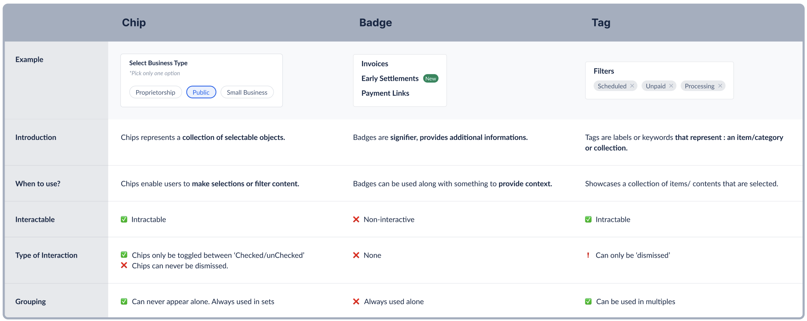

# Tag 🏷️

These are set of interactive keywords that help organise & categorise objects. Tags can be added or removed from an object by the users.


## Design

- [Tags - Figma Design](https://www.figma.com/file/jubmQL9Z8V7881ayUD95ps/Blade---Payment-Light?type=design&node-id=29210-567576&t=HLRjz3OTofBtFdDl-0)
- [Tags - Motion](https://www.figma.com/file/jubmQL9Z8V7881ayUD95ps/Blade---Payment-Light?type=design&node-id=29744-568562&mode=design&t=KI2KRJMzUpz8Ymr8-0)

## Proposed API

```jsx
<Tag
  icon={CheckIcon}
  size="medium"
  onDismiss={() => {
    console.log('Close Icon Clicked');
  }}
>
  Unpaid
</Tag>
```

### Props

```ts
type TagProps = {
  /**
   * Decides the size of Tag
   *
   * @default medium
   */
  size?: 'medium' | 'large';

  /**
   * Any icon from Blade
   */
  icon?: IconComponent;

  /**
   * Callback when close icon on Tag is clicked
   *
   */
  onDismiss?: () => void;

  /**
   * Text that renders inside Tag
   */
  children: ReactText;

  /**
   * Disable tag
   */
  isDisabled?: boolean;
};
```

_Didn't consider any alternate API. Kept `size` and `children` similar to `<Badge />` and `onDismiss` similar to `<Alert />` and `<Dropdown />`_

## Integration with Inputs


Tags can be added inside other input components such as -

- TextArea
- SelectInput (in Dropdown)
- TextInput
- AutoComplete

<details>
<summary>Implementation Details</summary>

This will require some refactor in BaseInput to add a slot before the actual Input element.

E.g. This is AutoComplete from Primer where the tags go into a slot and input gets pushed forward. We will be implementing something similar in our BaseInput.


</details>

### Integration with SelectInput and AutoComplete

SelectInput and AutoComplete are not expected to have any changes in consumer API as rendering of tags will be handled internally based on the selected value.

### Integration with TextInput and TextArea

> **Note**
>
> This implementation is out of scope for initial release of Tag.
>
> Have added considered approaches below which we can refer back and confirm the feasibility while implementation. (Feel free to review and suggest any changes here though. We can consider them while imeplementation in future)

On consumer end, the APIs would look like -

#### New `tags` prop on `TextInput` and `TextArea`

- Can only be used in Controlled Input
  - Why?
    - This is comparitively a rare usecase so don't see any need of having another `hasTags` props that handles adding tags internally.

```jsx
<TextInput tags={} value="" onChange={} />
```

##### Alternate Prop Name

- `leading` (felt confusing because it is leading to the invisible input tag and not the actual visible TextInput)
- `valuePrefix` (Similar to `titleSuffix` from BaseHeader)

<details>
<summary>Full Controlled Example</summary>

```jsx
function App() {
  const [inputValue, setInputValue] = React.useState('');
  const [tags, setTags] = React.useState([]);

  const addTag = () => {
    // Add input value to tags and clear the input value
    setTags([...tags, inputValue]);
    setInputValue('');
  }

  const removeTag = (tagName) => {
    setTags(tags.filter(tagNameValue) => tagNameValue !== tagName);
  }

  return (
    <TextInput
      tags={tags.map((tagName, index) => (
        <Tag onDismiss={() => removeTag(tagName)}>{tagName}</Tag>
      ))}
      value={inputValue}
      onChange={({ value }) => setInputValue(value)}
      onKeyDown={(e) => {
        if (e.key === 'ENTER') {
          addTag();
        }
      }}
    />
  );
}
```

</details>

<details>
<summary>Alternate Approach</summary>

#### Alternate Approach: `value` prop

We can extend our `value` prop to accept JSX

```jsx
<TextInput
  value={
    <>
      <Tag onDismiss={}>kamlesh.chandnani@razorpay.com</Tag>
      <Tag onDismiss={}>divyanshu.maithani@razopay.com</Tag>
      saurabhdaw
    </>
  }
  onChange={}
/>
```

**Cons**

- Requires us to loop on children and separate out Tags from written word and this will run on every `onChange` event.
- Have not seen any other library handle it this way

</details>

## Tag Differentiation



## Accessibility

- Ensure Close Icon is focussable
- Close Icon to have appropriate `aria-label`
- Special keyboard interaction when used inside Input components
  - Pressing `Tab` should move focus into the input and not Tag
  - Tag is focussable with Left and Right Arrow Keys
  - Pressing `Backspace` on Tag should remove it
  - Clicking on Tag should bring focus on Input
- Tag should be disabled when used inside a disabled input

Refer to Keyboard Interactions of [react-select](https://react-select.com/home#getting-started) for reference. Other Input components with Tag also follow similar keyboard interactions.

## References

- [react-select](https://react-select.com/home#getting-started)
- [`TagsInput` component by PluralSight Design System](https://design-system.pluralsight.com/components/tagsinput)
- [`tokens` prop by Primer AutoComplete.Input](https://primer.style/react/Autocomplete/)
- [Carbon just putting everything outside of Inputs](https://carbondesignsystem.com/components/tag/usage)
- [`elemBeforeInput` prop on Atlassian TextField](https://atlassian.design/components/textfield/examples#elements-before-and-after-input)

## Open Questions

- Do we want to discuss Tag's integration with TextInput and TextArea? or should I remove it from API decision altogether?
  - We can discuss here
- ~`<Tag />` or `<Tags />` 😅~ `<Tag />`
  - We went with `<Tag />`
- [`tagsSlot` vs `tagSlot` vs `valuePrefix` vs `leading` vs `tags` on Input components](#alternate-prop-name)
  - We went with `tags`
- Should we support `value` prop that allows us to set unique identifier value for Tag?
  ```jsx
  <Tag value="red">Red</Tag>
  ```
  - We decided not to support it right now as it can be statically handled by passing any id you like from `onDismiss`. Can be evaluated in future if required.
  ```jsx
  onDismiss={() => removeTag('red')}
  ```
