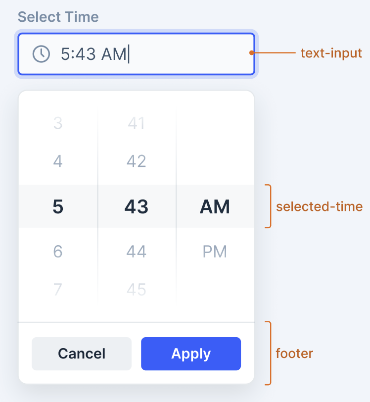
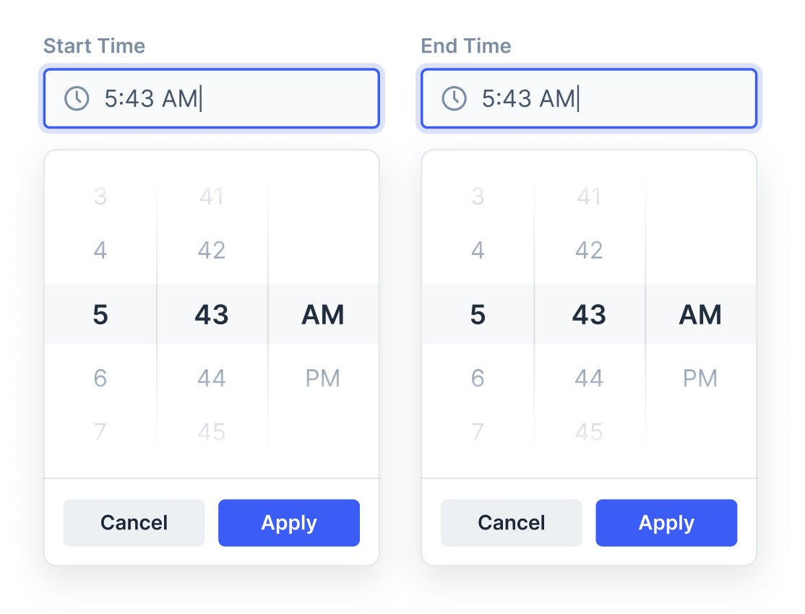
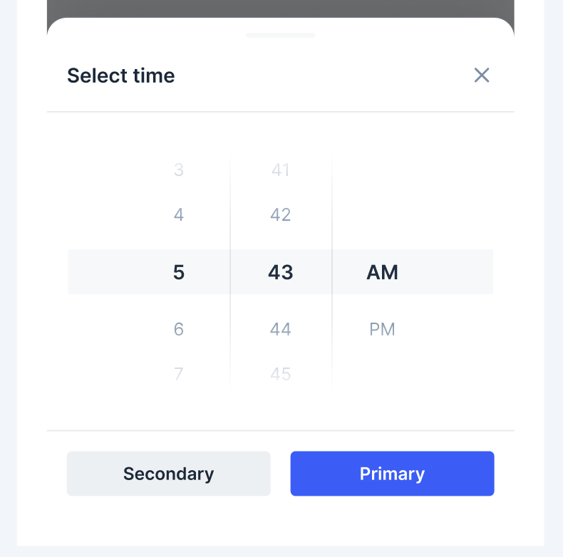

# TimePicker

The TimePicker component allows users to select a specific time from a customizable time interface. It supports both 12-hour and 24-hour formats and provides an intuitive picker interface.



## Design

[Figma Link](https://www.figma.com/design/jubmQL9Z8V7881ayUD95ps/Blade-DSL?node-id=XXXXX) to all variants of the TimePicker component

## Anatomy



## Components

- TimePickerInput (internal)
- TimePickerDropdown (internal)
- TimePicker (main component)

## Basic Usage

```jsx
<TimePicker
  label="Select time"
  value={new Date('2024-01-01T14:30:00')}
  onChange={({ value }) => {
    console.log('time selected', value);
  }}
/>
```

## API

### TimePicker API

```typescript
type BaseInputProps = Pick<
  TextInputProps,
  | 'labelPosition'
  | 'validationState'
  | 'errorText'
  | 'successText'
  | 'helpText'
  | 'necessityIndicator'
  | 'isRequired'
  | 'isDisabled'
  | 'onFocus'
  | 'onBlur'
  | 'size'
  | 'autoFocus'
  | 'name'
>;

type TimePickerValue = {
  value: Date;
  // Future extensibility - can add more properties here
};

type TimePickerProps = BaseInputProps & {
  /**
   * Label for the time input
   */
  label?: string;

  /**
   * Current time value as Date object
   */
  value?: Date;

  /**
   * Default time value as Date object
   */
  defaultValue?: Date;

  /**
   * Callback fired when time value changes
   * @param timeValue - Object containing the selected time and future extensible properties
   */
  onChange?: ({ value }: TimePickerValue) => void;

  /**
   * Time format for display
   * @default "12h"
   */
  timeFormat?: '12h' | '24h';

  /**
   * Step interval for minutes
   * @default 1
   * @example 15 // allows 00, 15, 30, 45
   */
  minuteStep?: 1 | 5 | 15 | 30;

  /**
   * Controls dropdown open state (for controlled usage)
   */
  isOpen?: boolean;

  /**
   * Default open state (for uncontrolled usage)
   */
  defaultIsOpen?: boolean;

  /**
   * Callback fired when dropdown open state changes
   */
  onOpenChange?: ({ isOpen }: { isOpen: boolean }) => void;

  /**
   * Callback fired when user applies time selection
   * @param timeValue - Object containing the confirmed time value
   */
  // onApply?: ({ value }: TimePickerValue) => void; // Future prop - add when footer design is finalized

  /**
   * Whether to show the apply/cancel buttons
   * @default true
   *
   * When false:
   * - Clicking outside the dropdown will automatically select the time
   * - Pressing Enter on any focused item immediately selects and closes
   * - More streamlined interaction experience
   */
  // showActions?: boolean; // Future prop - add when footer design is finalized
};
```

<details>

<summary>Alternative Approaches</summary>

## 1. Composition-based API (Not Recommended)

```jsx
<TimePicker isOpen={isOpen} onOpenChange={setIsOpen}>
  <TimePickerTrigger>
    <TextInput label="Time" value={formatTime(selectedTime)} />
  </TimePickerTrigger>
  <TimePickerDropdown>
    <TimePickerHours />
    <TimePickerMinutes />
    <TimePickerPeriod />
    <TimePickerActions />
  </TimePickerDropdown>
</TimePicker>
```

**Pros:**

- High flexibility for customization
- Clear separation of concerns
- Easy to extend with additional components

**Cons:**

- More complex API for simple use cases
- Harder to ensure consistent UX across implementations
- Mobile bottomsheet behavior harder to implement
- State management becomes consumer responsibility

## 2. Multiple Component API (Not Recommended)

```jsx
// Separate components for different use cases
<TimeInput />           // Simple input only
<TimeSelector />        // Dropdown only
<TimePicker />          // Combined input + dropdown
```

**Pros:**

- Clear component boundaries
- Can reuse TimeSelector in other contexts

**Cons:**

- API fragmentation
- Inconsistent patterns compared to DatePicker
- More components to maintain

## 3. Native Input Wrapper (Not Recommended)

```jsx
<TimePicker
  native={true} // Uses HTML time input on web
  custom={false} // Falls back to custom picker
/>
```

**Pros:**

- Leverages native browser controls
- Consistent with OS patterns

**Cons:**

- Inconsistent UX across browsers/platforms
- Limited styling capabilities
- Different behavior on mobile vs desktop

### Conclusion

Given the issues with alternative approaches and the need for consistent UX across platforms, we should go with the `<TimePicker />` component approach, where we have total control over the UX/behaviour of the component & can automatically handle focus management, accessibility, mobile bottomsheet etc.

But still we could expose TimeSelector as a standalone component for advanced usecases.

</details>

## Examples

### Basic Usage

```jsx
<TimePicker
  label="Meeting time"
  value={new Date('2024-01-01T14:30:00')}
  onChange={({ value }) => console.log(value)}
/>
```

### 12-Hour Format

```jsx
<TimePicker
  label="Appointment time"
  timeFormat="12h"
  defaultValue={new Date('2024-01-01T14:30:00')}
  onChange={({ value }) => console.log(value)}
/>
```

### Time Range Support

TimePicker **does not support built-in range selection**. This design decision ensures:

- **Simpler API**: Single responsibility principle
- **Better UX**: Clear individual time selection
- **Flexibility**: Users can implement custom range validation
- **Consistency**: Aligns with DatePicker patterns

For time range scenarios, implement two separate TimePickers:

```jsx
function TimeRangeSelector() {
  const [startTime, setStartTime] = useState(new Date('2024-01-01T09:00:00'));
  const [endTime, setEndTime] = useState(new Date('2024-01-01T17:00:00'));

  const handleStartTimeChange = ({ value }) => {
    setStartTime(value);
    // Auto-adjust end time if it's before start time
    if (value >= endTime) {
      const newEndTime = new Date(value);
      newEndTime.setHours(newEndTime.getHours() + 1);
      setEndTime(newEndTime);
    }
  };

  return (
    <>
      <TimePicker label="Start time" value={startTime} onChange={handleStartTimeChange} />
      <TimePicker
        label="End time"
        value={endTime}
        onChange={({ value }) => setEndTime(value)}
        validationState={endTime <= startTime ? 'error' : 'none'}
        errorText="End time must be after start time"
      />
    </>
  );
}
```

> **Storybook Examples**: We will provide comprehensive Storybook examples showing time range implementation patterns with validation, auto-adjustment, and different use cases.

### Controlled State

```jsx
function ControlledTimePicker() {
  const [selectedTime, setSelectedTime] = useState(new Date('2024-01-01T10:30:00'));
  const [isOpen, setIsOpen] = useState(false);

  return (
    <TimePicker
      label="Select time"
      value={selectedTime}
      isOpen={isOpen}
      onChange={({ value }) => setSelectedTime(value)}
      onOpenChange={({ isOpen }) => setIsOpen(isOpen)}
      onApply={({ value }) => {
        console.log('User confirmed:', value);
        setIsOpen(false);
      }}
    />
  );
}
```

### Custom Step Intervals

```jsx
<TimePicker
  label="Timer interval"
  minuteStep={15} // Only 00, 15, 30, 45 minutes
  defaultValue={new Date('2024-01-01T12:00:00')}
  onChange={({ value }) => console.log('Selected:', value)}
/>
```

### Keyboard Navigation Example

```jsx
<TimePicker
  label="Meeting time"
  timeFormat="12h"
  minuteStep={5}
  value={new Date('2024-01-01T14:30:00')}
  onChange={({ value }) => console.log('Selected:', value)}
  // Full keyboard support:
  // - Arrow keys in input: increment/decrement values
  // - Arrow keys in dropdown: navigate options
  // - Tab/Arrow Left/Right: switch columns
  // - Enter: select, Escape: cancel
/>
```

### Mobile UX

On mobile devices, the TimePicker automatically converts to a BottomSheet with the same time picker interface. Consumers do not need to handle anything manually for this transition.



## Time Value Standardization

**Date Object Approach:** All time values use JavaScript Date objects for consistency:

- Input/Output: Always Date objects
- Display: Adapts based on `timeFormat` prop (12h/24h)
- Internal processing: Uses Date methods for time manipulation

**Benefits:**

- Native JavaScript Date handling
- Timezone-aware when needed
- Easy integration with date libraries (dayjs, date-fns)
- Type safety with TypeScript
- Simplified state management and validation

## Keyboard Navigation

The TimePicker provides comprehensive keyboard support for enhanced accessibility and user experience:

### Input Field Focus

When the input field is focused:

- **Arrow Up/Down**: Increment/decrement time values like a digital input
  - Hours: Arrow up increases hour by 1, arrow down decreases by 1
  - Minutes: When cursor is on minutes, arrows change minute values
  - Automatic time format handling (12h/24h)
  - Respect `minuteStep` prop for minute increments

### Dropdown Focus

When the dropdown is open and focused:

- **Arrow Up/Down**: Navigate through time options in active column
- **Arrow Left/Right**: Switch between columns (Hours → Minutes → AM/PM)
- **Tab/Shift+Tab**: Navigate between columns
- **Enter**: Select the highlighted time value
- **Escape**: Close dropdown without selecting
- **Focus animations**: Visual indicators show which column and value is active
- **Auto-scroll**: Selected values automatically scroll into view
- **Smooth transitions**: Focus changes include subtle animations for better UX

### Example Keyboard Flow

```
1. Focus input → Arrow keys change time values directly
2. Click or Space → Opens dropdown with first column focused
3. Arrow Left/Right → Switch between Hour/Minute/Period columns
4. Arrow Up/Down → Navigate within active column
5. Enter → Select current value and close dropdown
6. Escape → Cancel and close dropdown
```

## Accessibility

Accessibility will mostly be handled by mantine,
We will just need to make sure the TimePicker component is working correctly & is usable/accessible with proper focus management, keyboard navigation, and screen reader support.

## Future Integrations

### ListView Integration

TimePicker is designed to integrate seamlessly with ListView patterns for time-based filtering and data display.

This integration will provide:

- Consistent time filtering across data tables
- Automatic query parameter generation
- Built-in validation for time ranges
- Responsive time selection on all devices

## Open Questions

### Design Decisions

- **Input vs Dropdown Format**: Should the text input always show 24h format while the dropdown shows 12h/AM-PM format, or should both sync to the same format?
- **Footer Actions**: Do we need to show apply/cancel footer buttons? If yes, should we add `showActions` prop along with `onApply`?

### Feature Scope

- How should we approach locale support?
- Do we need preset time options for common scenarios (Morning, Afternoon, etc.)?
- Should we support automatic time constraints validation?

## Integration with i18nify

We need to figure out how to integrate the time picker with i18nify,

```js
// Consumer will have to handle locale-specific time formatting
<TimePicker locale="my" timeFormat="12h" />
```

## References

- [TimePicker - Mantine Upgrade Exploration](https://razorpay.slack.com/archives/C01H13RTF8V/p1753818366922869)
  - We will be using [mantine](https://mantine.dev/dates/time-input/) for the TimeInput component as it provides cross-platform consistency and is highly customizable.
