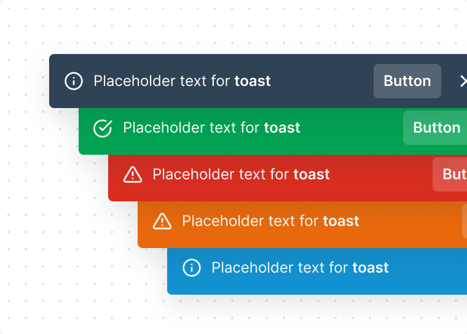
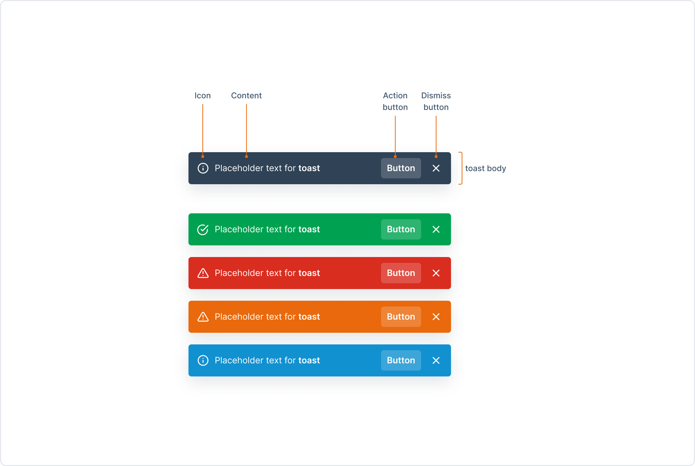
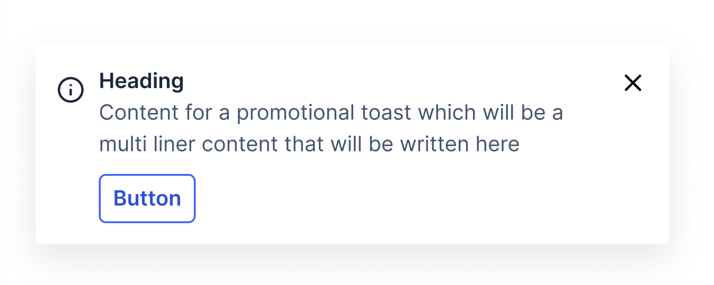

# Toast 🏷️

Toasts are used to provide feedback to the user after an important action has been performed. 
Toasts can also be used to provide feedback to the user when a system event occurs, such as when a file is saved.



## Design

- [Toast - Figma Design](https://www.figma.com/file/jubmQL9Z8V7881ayUD95ps/Blade-DSL?type=design&node-id=7665-27414&mode=design&t=UNInCMmP1iFCu9je-0)

## Features

- Stackable
- Auto dismissable / manual dismissable
- Positioning
- `informational` or `promotional` types

## Anatomy



## Simple Usage

The blade toasts will use [react-hot-toast](https://react-hot-toast.com/) under the hood with a similar imperative API to show, dismiss and create new toasts without needing for consumer to handle positional or stacking logic. 

```jsx
import { BladeProvider, ToastContainer, useToast } from "@razorpay/blade/components"

const HomePage = () => {
  const { showToast } = useToast();

  return (
    <Button
      onClick={() => {
        showToast({
          type: 'informational',
          color: 'success',
          content: 'Payment Successful',
          leading: <DollarIcon />,
          autoDismiss: true,
          onDismissButtonClick: () => {
            console.log('Toast dismissed');
          },
          action: {
            text: 'View',
            onClick: () => {
              console.log('Toast action clicked');
            }
          }
        });
      }}
    >
      Show Toast
    </Button>
  );
};

const App = () => {
  return (
    <BladeProvider>
      <ToastContainer position="bottom-left" />
      <HomePage />
    </BladeProvider>
  )
}
```

## Props

### ToastContainer

```ts
type ToastContainer = {
  position: 'top-left' | 'top-right' | 'bottom-left' | 'bottom-right';
}
```

```ts
type Toast = {
  /**
   * @default `informational`
   */
  type: 'informational' | 'promotional';

  /**
   * @default `neutral`
   */
  color: 'neutral' | 'positive' | 'negative' | 'warning' | 'information'

  /**
   * If the type is `promotional`, the content will be `React.ReactNode`
   */
  content: string | React.ReactNode;

  /**
   * Can be used to render an icon
   */
  leading?: IconComponent;

  /**
   * If true, the toast will be dismissed after few seconds
   * 
   * @default true - for informational toast
   * @default false - for promotional toast
   */
  autoDismiss?: boolean;

  /**
   * Duration after which the toast will be dismissed (in ms)
   * 
   * Duration for promotional toast is 8s
   * Duration for informational toast is 4s
   */
  duration?: 8000 | 4000;

  /**
   * Called when the toast is dismissed or duration runs out
   */
  onDismissButtonClick?: () => void;

  /**
   * Primary action of toast
   */
  action?: {
    text: string;
    onClick?: () => void;
    isLoading? boolean;
  }

  /**
   * Forwarded to react-hot-toast
   * 
   * This can be used to programatically update toasts by providing an id
   */
  toastId?: string; 
}
```

### useToast

The useToast hook will return few modified methods from [react-hot-toast](https://react-hot-toast.com/docs/toast): 

```ts
type useToastReturnType = {
  /**
   * @returns id of the toast
   */
  showToast: (toast: Toast) => string;

  /**
   * id of the toast to be dismissed
   * 
   * if id is not provided, all the toasts will be dismissed
   */
  dismissToast: (toastId?: string) => void;
}
```

## Examples

#### Removing a toast

react-hot-toast provides this functionality, for more info see [react-hot-toast docs](https://react-hot-toast.com/docs/toast#dismiss-toast-programmatically)

```jsx
import { BladeProvider, ToastContainer, useToast } from "@razorpay/blade/components"

const Example = () => {
  const toastId = React.useRef(null);
  const { showToast, dismissToast } = useToast();

  return (
    <Box>
      <Button
        onClick={() => {
          toastId.current = showToast({
            color: 'success',
            content: 'Payment Successful',
          });
        }}
      >
        Show Toast
      </Button>
      <Button onClick={() => dismissToast(toastId.current)}>Dismiss Toast</Button>
    </Box>
  );
};
```

### Promotional Toast

```jsx
import { BladeProvider, ToastContainer, useToast } from "@razorpay/blade/components"

const Example = () => {
  const { showToast } = useToast();

  return (
    <Button
      onClick={() => {
        showToast({
          type: 'promotional',
          content: (
            <Box>
              <Heading>Payment Successful</Heading>
              <Text>Amount: ₹100</Text>
            </Box>
          ),
          leading: <DollarIcon />,
          action: {
            text: 'Okay'
          }
        });
      }}
    >
      Do payment
    </Button>
  );
};
```




## Motion

You can checkout the toast motion [here](https://www.figma.com/proto/jubmQL9Z8V7881ayUD95ps/Blade-DSL?type=design&node-id=75848-1063056&t=QZkki0ZrlcG4sKzw-0&scaling=min-zoom&page-id=7665%3A27414).

## Accessibility

- Toast components will follow the WAI-ARIA guidelines for [alert](https://www.w3.org/WAI/ARIA/apg/patterns/alert/examples/alert/). For error toast we will use the `alert` role and for informational toast we will use the `status` role.


## References

- https://react-hot-toast.com/docs
- https://chakra-ui.com/docs/components/toast/usage

## Open Questions

- Q. What should be the default duration for auto dismissable toasts?
  - A. 4s for informational toasts and 6s for promotional toasts

- Q. Should we call it `onDismissButtonClick` or `onDismiss`? 
  
- Q. Should the dismiss handler be called even when the toast is auto dismissed? Or should we have different handlers for auto dismiss and manual dismiss? (eg: `onAutoDismiss` `onDismissButtonClick`)

- Q. In the `useToast` hook should we call the returned functions `showToast`/`dismissToast` or `show`/`dismiss`?

If we call them `show` & `dismiss` consumer can do this and might look more cleaner:

```jsx
const App = () => {
  const toast = useToast();

  toast.show(); // <-- they will also get auto complete when writing `toast.`
  toast.dismiss();
}
```

- Q. In design we are restricting the Toast position to be bottom-left. In that case should we also do the same or should we allow all the positions & set the default to bottom-left? (If we allow all the positions, we will have to add some additional logic to handle stacking/animation of toasts coming from top instead of bottom)

- Q. Should we keep the ToastContainer inside BladeProvider? 

The problem is if we keep it inside BladeProvider, given our new light/dark mode setup where consumers will need to nest BladeProviders it would cause ToastContainer to render [multiple times](https://github.com/razorpay/blade/pull/1990#discussion_r1470796627).
