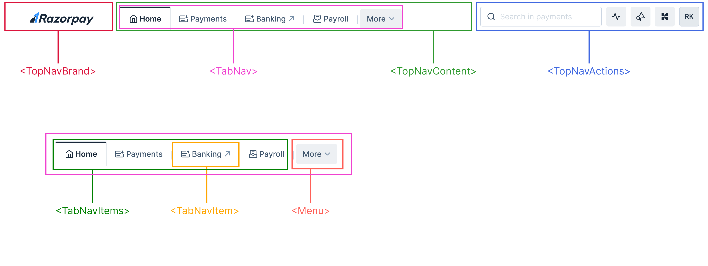
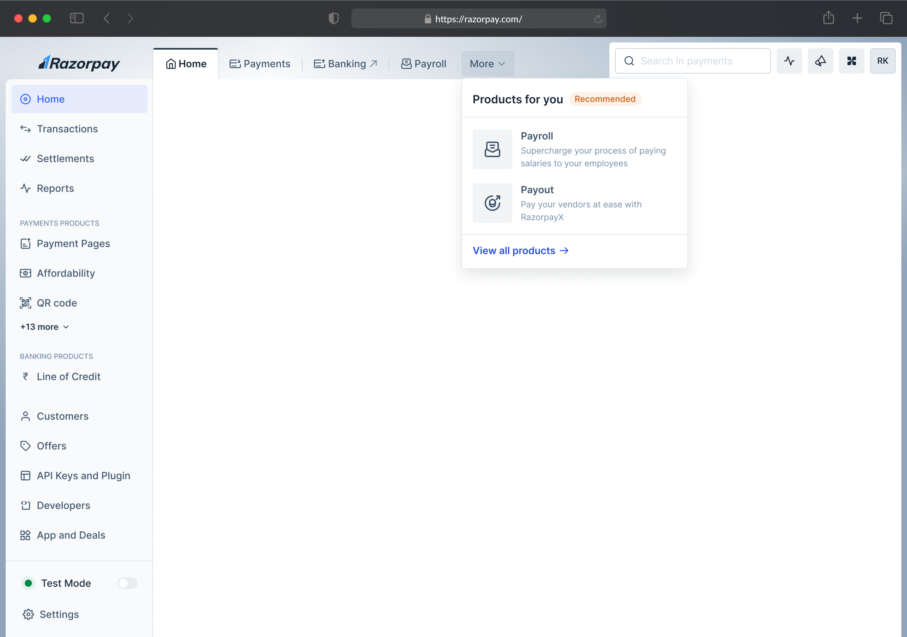

# TopNav - One Top Navigation Bar

The navigation bar is positioned at the top of the screen that provides quick access to different products, search & user profile. 


## Links

- [Figma - Top Navigation Bar](https://www.figma.com/design/jubmQL9Z8V7881ayUD95ps/Blade-DSL?node-id=90311-235393&m=dev)
- [Product Concept Note - Connected Navigation](https://docs.google.com/document/d/1MyCgIS8i3hfhYPiU94oNT0BwqFyNSa8fhVZLT1FlS3s/edit?usp=sharing) (Internal)

## Anatomy & Components

- TopNav
  - TopNavBrand *(Logo or Brand Name)*
  - TopNavContent *(Can contain any JSX)*
    - TabNav *(Horizontal Navigation Bars)*
      - TabNavItem
  - TopNavActions *(Right Aligned Actions)*
    - SearchInput
    - Button
    - Tooltip
    - Menu
      - Avatar
      - MenuOverlay



## Basic Usage

```jsx
// Desktop Navigation Bar
<TopNav>
  <TopNavBrand>
    
  </TopNavBrand>
  <TopNavContent>
    <TabNav
      items={[
        { href: '/home', title: 'Home' },
        { href: '/payroll', title: 'Payroll' },
        { href: '/payments', title: 'Payments', isAlwaysOverflowing: true, },
      ]}
    >
      {({ items, overflowingItems }) => {
        return (
          <>
            <TabNavItems>
              {items.map((item) => (
                <TabNavItem href={item.href} title={title} />
              ))}
            </TabNavItems>
            <Menu>
              <TabNavItem title="More" />
              {overflowingItems.map((item) => {
                return (
                  <MenuItem key={item.title}>
                    <CustomExploreItem
                      icon={item.icon}
                      title={item.title}
                      description={item.description}
                    />
                  </MenuItem>
                );
              })}
            </Menu>
          </>
        );
      }}
    </TabNav>
  </TopNavContent>
  <TopNavActions>
    <SearchInput />
    <Tooltip content="View Ecosystem Health">
      <Button icon={ActivityIcon} />
    <Tooltip>
    <Tooltip content="View Announcements">
      <Button icon={AnnouncementIcon} />
    </Tooltip>
    <Tooltip content="Ask Ray">
      <Button icon={RayIcon} />
    </Tooltip>
    <Menu>
      <Avatar />
      <MenuOverlay>
        { /* Avatar Menu Items */ }
      </MenuOverlay>
    </Menu>
  </TopNavActions>
</TopNav>

// Mobile Navigation Bar
<TopNav>
  <TopNavContent>
    <Button icon={MenuIcon} variant="secondary" accessibilityLabel="Toggle side navigation" />
    <Text>{currentPageTitle}</Text>
  </TopNavContent>
  <TopNavActions>
    <SearchInput />
    <Button icon={ActivityIcon} accessibilityLabel="View Ecosystem Health" />
    <Button icon={AnnouncementIcon} accessibilityLabel="View Announcements" />
    <Button icon={RayIcon} accessibilityLabel="Ask Ray" />
    <Avatar onClick={openBottomSheet} />
    <BottomSheet>
      { /* Avatar BottomSheet Content */ }
    </BottomSheet>
  </TopNavActions>
</TopNav>
```

## Design

Desktop Navigation Bar:



Mobile Navigation Bar:


## API

All the top level components like `TopNav`, `TopNavBrand`, `TopNavContent`, `TopNavActions` accepts `children` prop which can be any JSX element.

```ts
type TopNavX = {
  children: React.ReactNode;
};
```

### TopNav

The top-level container for the navigation bar.

### TopNavBrand

The brand logo or name that appears on the left side of the navigation bar.

### TopNavContent

The container for the main navigation items.

### TopNavActions

The container for the right-aligned actions like search, buttons, and user profile.

### TabNav

The horizontal navigation bar that contains multiple navigation items, each represented by TabNavItem. 

TabNav's interaction is as follows: 

1. There might already be items under More even at the highest screen size. These items might need a custom order.
2. Once the screen size starts getting reduced, more items will start moving into More.
3. The order of these items would follow a logical order. They keep getting added ahead of the already existing items. So the last item to go into More is the first item that you see when you click on More.

TabNav automatically handles all these edge cases & responsiveness and let's you focus on the rendering of the items via the [render props](https://reactpatterns.js.org/docs/function-as-child-component/) pattern.

```jsx
<TabNav
  items={[
    { href: '/home', title: 'Home' },
    { href: '/payroll', title: 'Payroll' },
    { href: '/payments', title: 'Payments' },
    {
      href: '/rize',
      title: 'rize',
      description: 'rize description',
      icon: RizeIcon,
      // force this item to always be inside "more" regardless of screen size
      isAlwaysOverflowing: true,
    },
  ]}
>
  {({ items, overflowingItems }) => {
    return (
      <>
        <TabNavItems>
          {items.map((item) => (
            <TabNavItem title={item.title} href={item.href} />
          ))}
        </TabNavItems>
        <Menu>
          <TabNavItem title="More" />
          {overflowingItems.map((item) => {
            return (
              <MenuItem key={item.title}>
                <CustomExploreItem
                  icon={item.icon}
                  title={item.title}
                  description={item.description}
                />
              </MenuItem>
            );
          })}
        </Menu>
      </>
    );
  }}
</TabNav>
```

#### TabNav Props

Main tab navigation component that will contain multiple navigation items and will handle the responsiveness of the items.

```ts
type TabNav = {
  children: React.ReactNode;
  /**
   * Array of navigation items
   */
  items: Array<
    TabNavItem & {
      /**
       * force this item to always be inside "more" regardless of screen size
       */
      isAlwaysOverflowing?: boolean;
    }
  >;
};
```

#### TabNavItem Props

The individual navigation item that will be rendered inside the TabNav component.

```ts
type TabNavItem = {
  /**
   * href of the link
   */
  href?: LinkProps['href'];
  /**
   * Anchor tag `target` attribute
   */
  target?: LinkProps['target'];
  /**
   * as prop to pass ReactRouter's Link component.
   *
   * @default 'a'
   *
   * @example
   * ```jsx
   * import { Link } from 'react-router-dom';
   *
   * <TabNavItem as={Link} />
   * ```
   */
  as: React.ComponentType<any>;
  /**
   * Selected state of the navigation item.
   *
   * @default false
   */
  isActive?: boolean;
  /**
   * Icon to render before the navigation item.
   * 
   * @default undefined
   */
  icon?: IconComponent;
  /**
   * Title of the navigation item.
   */
  title?: React.ReactNode;
  /**
   * Accessibility label for the navigation item.
   */
  accessibilityLabel?: string;
};
```

#### TabNavItems Props

The container for the navigation items.

```ts
type TabNavItems = {
  children: React.ReactNode;
};
```

#### Why was this prop-based API chosen over the old compound component API?

The old component's interaction was much simpler compared to this new TabNav, the old TabNav was just a horizontal navigation bar that contained multiple navigation items and it scrolled horizontally when the items could no longer fit in the available space.

But the new TabNav is much more complex, it needs to accomodate for screen real estate, automagically move items to the "More" menu when they can't fit, and also handle responsiveness. This is why we chose to go with a prop-based API for the new TabNav.

The prop based API allows us to have the data for the whole TabNav in one place so we can internally move things around as needed but still allow the consumer to have full control over the rendering of the items.

For more detail please read the Alternatives section.

<details>

<summary>Old API</summary>

The horizontal navigation bar that contains multiple navigation items, each represented by `TabNavItem`.
Inspired from [Primer TabNav](https://primer.style/components/tab-nav/react/alpha).

> The TabNav will also support responsiveness by horizontally scrolling when the items can no longer fit in the available space.

```ts
type TabNav = {
  children: React.ReactNode;
};

type TabNavItem = {
  /**
   * href of the link
   */
  href?: LinkProps['href'];
  /**
   * Anchor tag `target` attribute
   */
  target?: LinkProps['target'];
  /**
   * as prop to pass ReactRouter's Link component.
   *
   * @default 'a'
   *
   * @example
   * ```jsx
   * import { Link } from 'react-router-dom';
   *
   * <TabNavItem as={Link} />
   * ```
   */
  // eslint-disable-next-line @typescript-eslint/no-explicit-any
  as: React.ComponentType<any>;
  /**
   * Selected state of the navigation item.
   *
   * @default false
   */
  isActive?: boolean;
  /**
   * Element to render before the navigation item.
   *
   * @default undefined
   */
  leading?: IconComponent;
  /**
   * Element to render inside the navigation item.
   *
   * This can either be a string or JSX element (eg: Menu component)
   */
  children?: React.ReactNode;
  /**
   * Accessibility label for the navigation item.
   */
  accessibilityLabel?: string;
};
```

TabNav can also contain a `Menu` component which will render a menu when hovered.

```jsx
const WithMenu = () => {
  const [isOpen, setOpen] = React.useState(false);
  const [selected, setSelected] = React.useState<string | null>(null);

  return (
    <TabNav>
      <TabNavItem as={RouterLink} isActive href="/home" icon={HomeIcon} />
      <Menu interactionType="hover">
        <TabNavItem 
          title={selected ? `More: ${selected}` : "More"}
          trailingIcon={isOpen ? ChevronDown : ChevronUp}
        />
        <MenuOverlay>
          <MenuItem onClick={() => setSelected("Engage")}>Engage</MenuItem>
          <MenuItem onClick={() => setSelected("Payroll")}>Payroll</MenuItem>
        </MenuOverlay>
      </Menu>
    </TabNav>
  );
}
```

### TabNav overflow behaviour

Once the available space for TabNavItems are less, the TabNav will start to horizontally scroll and will show a chevron icon to indicate that there are more items to the left or right.

https://github.com/razorpay/blade/assets/35374649/8a0fb6ae-cedd-4065-80ed-27647938453c

</details>

## Mobile UX


On mobile, most of the components from desktop aren't visible due to the lack of screen real estate.
Thus, we will let consumers decide what components they want to show on mobile and what they want to hide.

Given the simplicity of the mobile navigation bar, consumers can conditionally render the components based on the screen size.

Example: 

```jsx
const isMobile = useIsMobile();

return (
  <>
    <TopNav>
        <TopNav>
          {isMobile ? (
            <>
              <Link icon={HomeIcon} size="medium" href="/home">
                Home
              </Link>
              <Heading textAlign="center" size="small" weight="semibold">
                Payments
              </Heading>
              <AvatarWithMenu />
            </>
          ) : (
            <>
              <TopNavBrand />
              <TopNavContent />
              <TopNavActions />
            </>
          )}
    </TopNav>
  </>
);
```

**Q:** So where will the product navigation items go? 
**Ans:** The product navigation items will be moved to the bottom of the screen, but this will be part of a separate component called `BottomNavigation` which we will ship in phase 2.

Mobile Navbar example:

```jsx
const Dashboard = () => {
  const { isMobile } = useBreakpoint();

  if (isMobile) {
    return (
      <TopNav>
        <TopNavBrand />
        <TopNavContent>
          <Button icon={MenuIcon} variant="tertiary" accessibilityLabel="Toggle side navigation" />
          <Text>{currentPageTitle}</Text>
        </TopNavContent>
        <TopNavActions>
          <Button icon={ActivityIcon} accessibilityLabel="View Ecosystem Health" />
          <Button icon={AnnouncementIcon} accessibilityLabel="View Announcements" />
          <Button icon={RayIcon} accessibilityLabel="Ask Ray" />
          <Avatar onClick={openBottomSheet} />
          <BottomSheet>
            { /* Avatar BottomSheet Content */ }
          </BottomSheet>
        </TopNavActions>
      </TopNav>
    )
  }

  return (
    // ... desktop navigation bar jsx
  )
}
```

## Accessibility

- TabNav
  - Tab items will have `role=link` instead of `tab` because they don't contain any related tab panels.
  - Tab nav items will be a set of links that will be navigable using the keyboard.
  - The selected tab will have an `aria-selected` attribute set to `true`.

- TopNav
  - The navigation bar will have `role=navigation` to indicate that it is a navigation landmark.
  - TopNav sub components will only compose other components and will not have any ARIA roles or attributes.


### Alternatives considered for new TabNav API

<details>

<summary>Go inside rabbit hole</summary>


### The Problem

The new interaction that we have gotten for top nav is a bit more trickier to implement than it seems while ensuring flexibility of the component. 

For example, we want users to: 

1. Be able to add a “More” dropdown with custom items (It’s just a Menu)
2. When the screen size reduces, automatically inject extra items into “More” menu
3. Have the flexibility to customize the what’s inside “More” menu

**Our current API looks like this:**

```jsx
<TabNav>
  <TabNavItemLink icon={HomeIcon} accessibilityLabel="Home" href="/home" />
  <TabNavItemLink title="Payroll" href="/payroll" />
  <TabNavItemLink title="Payments" href="/payments" />
  <Menu>
    <TabNavItemLink title="More" href="/more" />
    <MenuOverlay>
      {overflowingItems.map((item) => {
        // ??
      })}
      <MenuItem>
        <ExploreItem title="Magic Checkout" description="Some product description" />
      </MenuItem>
      <MenuItem>
        <ExploreItem title="RazorX" description="Some product description" />
      </MenuItem>
    </MenuOverlay>
  </Menu>
</TabNav>
```

**This API has few issues:**

1. While it lets you add the “More” Menu and choose initial ordering of Magic Checkout & RazorX, when screen size reduces there is no straightforward or intuitive way to move the overflowing items into the “More” Menu
2. Even if we could somehow magically get the overflowingItems what data will item contain that will enable us to render the <ExploreItem />? We need title, description, icon etc data for rendering which the <TabNavItemLink> may not even need or be provided with since we don’t need to render description or icon. 

----


> NOTE: If you want to go into the rabbit hole you can read the alternatives below.

### Alternative APIs

**Table Like Data API (Accepted approach):**

A data driven API where we pass the data for the items and use render props to render the items and the overflowingItems.

**Pros:**
1. Users have easy access to the overflowingItems via props
2. Intuitive and faimilar API, similar to Table API
3. Users have the flexibility to render TabNavItemLinks or any other component.
4. Users can easily control the order of the items inside the "More" dropdown
5. We have the data of the items so we can handle the responsiveness internally

**Cons:**
1. More verbose than compound API

```jsx
<TabNav
  items={[
    { href: '/home', title: 'Home' },
    { href: '/payroll', title: 'Payroll' },
    { href: '/payments', title: 'Payments' },
    {
      href: '/rize',
      title: 'rize',
      description: 'rize description',
      icon: RizeIcon,
      // force this item to always be inside "more" regardless of screen size
      isAlwaysOverflowing: true,
    },
  ]}
>
  {({ items, overflowingItems }) => {
    return (
      <>
        <TabNavItems>
          {items.map((item) => (
            <TabNavItem title={item.title} href={item.href} />
          ))}
        </TabNavItems>
        <Menu>
          <TabNavItem title="More" />
          {overflowingItems.map((item) => {
            return (
              <MenuItem key={item.title}>
                <CustomExploreItem
                  icon={item.icon}
                  title={item.title}
                  description={item.description}
                />
              </MenuItem>
            );
          })}
        </Menu>
      </>
    );
  }}
</TabNav>
```

**Config Based API:**

Use config driven API to define the data and the rendering of the items and internally let TabNav handle rendering. 

**Pros:**

1. Users have easy access to the overflowingItems via props
We have the data of the item inside the overflowingItems and can render it inside the Menu with any custom menu item component.
1. Users still have the flexibility to render TabNavItemLinks or any other component.

**Cons:**

1. More verbose than compound API
2. Not as intuitive very intuitive to use
3. Totally new API from the previous API that we had

```jsx
const renderTabNavItem = (props) => {
  return <TabNavItemLink title={props.title} icon={props.icon} href={props.href} />
}

<TabNav
  items={[
    { href: '/home', title: 'Home', render: renderTabNavItem },
    { href: '/payroll', title: 'Payroll', render: renderTabNavItem },
    { href: '/payments', title: 'Payments', render: (props) => {} },
    {
      href: '/capital',
      title: 'Capital',
      // description/icon etc extra props can later be rendered inside <ExploreItem />
      description: 'Description',
      icon: CapitalIcon, 
      render: renderTabNavItem,
    },
    {
      href: '/more',
      render: (props) => (
        <Menu>
          <TabNavItemLink title="More" trailing={<ChevronDownIcon />} />
          <MenuOverlay>
            {props.overflowingItems.map((item) => {
              return (
                <MenuItem key={item.title}>
                  // custom explore item
                  <ExploreItem
                    icon={item.icon}
                    title={item.title}
                    description={item.description}
                  />
                </MenuItem>
              );
            })}
            <MenuItem>
              <ExploreItem
                icon={MagicCheckoutIcon}
                title="Magic Checkout"
                description="Some product description"
              />
            </MenuItem>
            <MenuItem>
              <ExploreItem
                icon={RazorXIcon}
                title="RazorX"
                description="Some product description"
              />
            </MenuItem>
          </MenuOverlay>
        </Menu>
      ),
    },
  ]}
/>
```


**Alternative Approach: JSX with MetaData:**

Another approach where we can pass a new overflowMetadata prop to TabNavItem components and use that to render the overflowingItems later on.

**Pros:**
1. Familiar compound like API & less verbose
2. Arguably less confusing than other alternative approaches

**Cons:**
1. Odd indirection & data flow, where the overflowMetadata gets indirectly passed to the overflowingItems
2. Introduces 1 extra component TabNavItems which wraps all other TabNavItemLink

```jsx
const { overflowingItems, setOverflowingItems } = React.useState([]);

<TabNav>
  <TabNavItems
    onOverflow={(items) => {
      setOverflowingItems(items);
    }}
  >
    <TabNavItemLink icon={HomeIcon} accessibilityLabel="Home" href="/home" />
    <TabNavItemLink title="Payroll" href="/payroll" />
    <TabNavItemLink
      title="Payments"
      href="/payments"
      icon={MagicCheckoutIcon}
      // this meta data will be passed to `items` array
      overflowMetadata={{
        icon: MagicCheckoutIcon,
        href: '/payment',
        title: 'Payments',
        description: 'Some product description',
      }}
    />
  </TabNavItems>
  <Menu>
    <TabNavItemLink title="More" trailing={<ChevronDownIcon />} />
    <MenuOverlay>
      // render the overflowing items
      {overflowingItems.map((item) => {
        return (
          <MenuItem key={item.title}>
            <ExploreItem icon={item.icon} title={item.title} description={item.description} />
          </MenuItem>
        );
      })}
      <MenuItem>
        <ExploreItem
          icon={MagicCheckoutIcon}
          title="Magic Checkout"
          description="Some product description"
        />
      </MenuItem>
      <MenuItem>
        <ExploreItem icon={RazorXIcon} title="RazorX" description="Some product description" />
      </MenuItem>
    </MenuOverlay>
  </Menu>
</TabNav>
```

**Alternative Approach: JSX as Data:**

Another approach is this, where we treat the JSX as the Data.
This is similar to Dropdown where on initial render we loop over all the JSX elements build a list and store it and from that list we render.

**Not leaning towards this API mainly because:**
1. JSX as Data gets very [complicated](https://github.com/razorpay/blade/blob/2e4b2cb309cdf3e87982cda9252e9ce97747c475/packages/blade/src/components/ActionList/actionListUtils.ts#L137-L159) as seen on Dropdown, and most of the time breaks composition, like it looks like the component is flexible and composable but in reality it isn’t.
2. Sets a odd expectation, where users need to pass the description/icon etc props to TabNavItemLink which that component may not even use but rather they are treated as “data” attributes for the overflowingItems 
3. We need to get the overflowingItems from somewhere, it will either be as a controlled state or we may need to introduce a render prop inside <TabNav>

**Pros**
1. Retains the original API that we had intact and doesn’t introduces a new API

```jsx
const [overflowingItems, setOverflowingItems] = useState([]);

<TabNav onOverflow={(items) => setOverflowingItems(items)}>
  <TabNavItemLink icon={HomeIcon} href="/home" />
  <TabNavItemLink title="Payroll" href="/payroll" description="Some product description" />
  <TabNavItemLink title="Payments" href="/payments" description="Some product description" />
  <Menu>
    <TabNavItemLink title="More" />
    <MenuOverlay>
      {overflowingItems.map((item) => {
        return (
          <MenuItem>
           <ExploreItem title={item.title} icon={item.icon} description={item.description} />
          </MenuItem>
 );
      })}
      <MenuItem>
        <ExploreItem title="Magic Checkout" description="Some product description" />
      </MenuItem>
      <MenuItem>
        <ExploreItem title="RazorX" description="Some product description" />
      </MenuItem>
    </MenuOverlay>
  </Menu>
</TabNav>
```

</details>

## References

- [NavBar - NextUI](https://nextui.org/docs/components/navbar)
- [AppBar - MUI](https://mui.com/material-ui/react-app-bar/)
- [FullscreenNav - Shopify](https://polaris.shopify.com/components/navigation/fullscreen-bar)
- [Navigation - Atlassian DS](https://atlassian.design/components/atlassian-navigation/examples)
- [PageHeader - Primer](https://primer.style/components/page-header/react/draft)
- [TabNav - Primer](https://primer.style/components/tab-nav/react/alpha)
- [HeaderNav - Carbon DS](https://react.carbondesignsystem.com/?path=/story/components-ui-shell-header--header-w-navigation-and-actions)
- [HeaderNav - BaseWeb DS / Uber](https://baseweb.design/components/header-navigation/#basic-link1)
- [TopNav - Spectrum / Adobe](https://opensource.adobe.com/spectrum-web-components/components/top-nav/)

## Open Questions

### Dev

1. How will the Menu component integrate with the BottomSheet?
2. How will the TabNav component handle the chevron icon for the Menu component?
3. Should we call this component `TopNav`/`TopNavigationBar` instead of `NavigationBar`?
   1. We will call it `TopNav` since we will also have a `BottomNav` in the future.
4. For the responsive behavior, should we just hide the `TopNavBrand` and `TopNavContent` with CSS media queries? instead of asking consumers to do conditional rendering?

### Design

### Product
