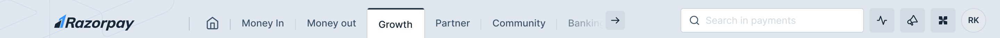
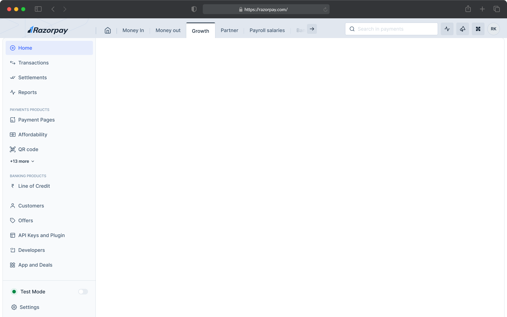
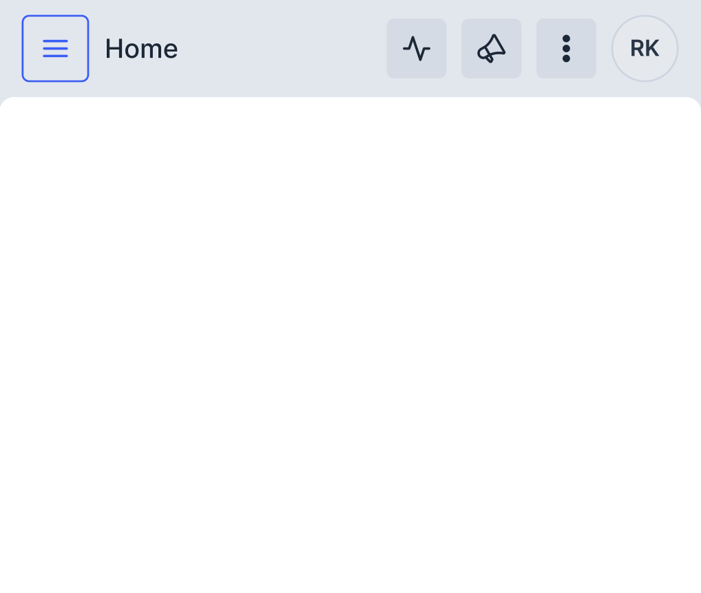

# TopNav - One Top Navigation Bar

The navigation bar is positioned at the top of the screen that provides quick access to different products, search & user profile. 



## Links

- [Figma - Top Navigation Bar](https://www.figma.com/design/jubmQL9Z8V7881ayUD95ps/Blade-DSL?node-id=90311-235393&m=dev)
- [Product Concept Note - Connected Navigation](https://docs.google.com/document/d/1MyCgIS8i3hfhYPiU94oNT0BwqFyNSa8fhVZLT1FlS3s/edit?usp=sharing) (Internal)

## Anatomy & Components

- TopNav
  - TopNavBrand *(Logo or Brand Name)*
  - TopNavContent *(Can contain any JSX)*
    - TabNav *(Horizontal Navigation Bars)*
      - TabNavItem
  - TopNavActions *(Right Aligned Actions)*
    - SearchInput
    - Button
    - Tooltip
    - Menu
      - Avatar
      - MenuOverlay

## Basic Usage

```jsx
// Desktop Navigation Bar
<TopNav>
  <TopNavBrand>
    
  </TopNavBrand>
  <TopNavContent>
    <TabNav>
      <TabNavItem as={RouterLink} isSelected href="/home" icon={HomeIcon} />
      <TabNavItem as={RouterLink} href="/money">Money</TabNavItem>
      <TabNavItem as={RouterLink} href="/payroll">Payroll</TabNavItem>
      <Menu>
        <TabNavItem trailingIcon={ChevronDown}>Payroll</TabNavItem>
        <MenuOverlay>
          { /* Other Menu Items */ }
        </MenuOverlay>
      </Menu>
    </TabNav>
  </TopNavContent>
  <TopNavActions>
    <SearchInput />
    <Tooltip content="View Ecosystem Health">
      <Button icon={ActivityIcon} />
    <Tooltip>
    <Tooltip content="View Announcements">
      <Button icon={AnnouncementIcon} />
    </Tooltip>
    <Tooltip content="Ask Ray">
      <Button icon={RayIcon} />
    </Tooltip>
    <Menu>
      <Avatar />
      <MenuOverlay>
        { /* Avatar Menu Items */ }
      </MenuOverlay>
    </Menu>
  </TopNavActions>
</TopNav>

// Mobile Navigation Bar
<TopNav>
  <TopNavContent>
    <Button icon={MenuIcon} variant="secondary" accessibilityLabel="Toggle side navigation" />
    <Text>{currentPageTitle}</Text>
  </TopNavContent>
  <TopNavActions>
    <SearchInput />
    <Button icon={ActivityIcon} accessibilityLabel="View Ecosystem Health" />
    <Button icon={AnnouncementIcon} accessibilityLabel="View Announcements" />
    <Button icon={RayIcon} accessibilityLabel="Ask Ray" />
    <Avatar onClick={openBottomSheet} />
    <BottomSheet>
      { /* Avatar BottomSheet Content */ }
    </BottomSheet>
  </TopNavActions>
</TopNav>
```

## Design

Desktop Navigation Bar:



Mobile Navigation Bar:



## API

All the top level components like `TopNav`, `TopNavBrand`, `TopNavContent`, `TopNavActions` accepts `children` prop which can be any JSX element.

```ts
type TopNavX = {
  children: React.ReactNode;
};
```

### TopNav

The top-level container for the navigation bar.

### TopNavBrand

The brand logo or name that appears on the left side of the navigation bar.

### TopNavContent

The container for the main navigation items.

### TopNavActions

The container for the right-aligned actions like search, buttons, and user profile.

### TabNav

The horizontal navigation bar that contains multiple navigation items, each represented by `TabNavItem`.
Inspired from [Primer TabNav](https://primer.style/components/tab-nav/react/alpha).

> The TabNav will also support responsiveness by horizontally scrolling when the items can no longer fit in the available space.

```ts
type TabNav = {
  children: React.ReactNode;
};

type TabNavItem = {
  /**
   * The element to render as.
   * 
   * This can be used to render React Router Link for client side navigation.
   * 
   * @default 'a'
   */
  as?: React.ElementType;
  /**
   * Selected state of the navigation item.
   * 
   * @default false
   */
  isActive?: boolean;
  /**
   * Element to render before the navigation item.
   * 
   * @default undefined
   */
  leading?: React.ReactNode;
  /**
   * Element to render inside the navigation item.
   * 
   * This can either be a string or JSX element (eg: Menu component)
   */
  children: React.ReactNode;
};
```

TabNav can also contain a `Menu` component which will render a menu when hovered.

```jsx
const WithMenu = () => {
  const [isOpen, setOpen] = React.useState(false);
  const [selected, setSelected] = React.useState<string | null>(null);

  return (
    <TabNav>
      <TabNavItem as={RouterLink} isSelected href="/home" icon={HomeIcon} />
      <Menu interactionType="hover">
        <TabNavItem 
          trailingIcon={isOpen ? ChevronDown : ChevronUp}
        >
          {selected ? `Others: ${selected}` : "Others"}
        </TabNavItem>
        <MenuOverlay>
          <MenuItem onClick={() => setSelected("Engage")}>Engage</MenuItem>
          <MenuItem onClick={() => setSelected("Payroll")}>Payroll</MenuItem>
        </MenuOverlay>
      </Menu>
    </TabNav>
  );
}
```

## Mobile UX

On mobile, the TabNav component will no longer be present and the TopNavContent will contain a single button to toggle the side navigation. The TopNavActions will contain the search input, buttons, and user profile.

**Q:** So where will the product navigation items go? 
**Ans:** The product navigation items will be moved to the bottom of the screen, but this will be part of a separate component called `BottomNavigation` which we will ship in phase 2.

Mobile Navbar example:

```jsx
const Dashboard = () => {
  const { isMobile } = useBreakpoint();

  if (isMobile) {
    return (
      <TopNav>
        <TopNavContent>
          <Button icon={MenuIcon} variant="secondary" accessibilityLabel="Toggle side navigation" />
          <Text>{currentPageTitle}</Text>
        </TopNavContent>
        <TopNavActions>
          <SearchInput />
          <Button icon={ActivityIcon} accessibilityLabel="View Ecosystem Health" />
          <Button icon={AnnouncementIcon} accessibilityLabel="View Announcements" />
          <Button icon={RayIcon} accessibilityLabel="Ask Ray" />
          <Avatar onClick={openBottomSheet} />
          <BottomSheet>
            { /* Avatar BottomSheet Content */ }
          </BottomSheet>
        </TopNavActions>
      </TopNav>
    )
  }

  return (
    // ... desktop navigation bar jsx
  )
}
```

## Accessibility

- TabNav
  - Tab items will have `role=link` instead of `tab` because they don't contain any related tab panels.
  - Tab nav items will be a set of links that will be navigable using the keyboard.
  - The selected tab will have an `aria-selected` attribute set to `true`.

- TopNav
  - The navigation bar will have `role=navigation` to indicate that it is a navigation landmark.
  - TopNav sub components will only compose other components and will not have any ARIA roles or attributes.

## References

- [NavBar - NextUI](https://nextui.org/docs/components/navbar)
- [AppBar - MUI](https://mui.com/material-ui/react-app-bar/)
- [FullscreenNav - Shopify](https://polaris.shopify.com/components/navigation/fullscreen-bar)
- [Navigation - Atlassian DS](https://atlassian.design/components/atlassian-navigation/examples)
- [PageHeader - Primer](https://primer.style/components/page-header/react/draft)
- [TabNav - Primer](https://primer.style/components/tab-nav/react/alpha)
- [HeaderNav - Carbon DS](https://react.carbondesignsystem.com/?path=/story/components-ui-shell-header--header-w-navigation-and-actions)
- [HeaderNav - BaseWeb DS / Uber](https://baseweb.design/components/header-navigation/#basic-link1)
- [TopNav - Spectrum / Adobe](https://opensource.adobe.com/spectrum-web-components/components/top-nav/)

## Open Questions

### Dev

1. How will the Menu component integrate with the BottomSheet?
2. How will the TabNav component handle the chevron icon for the Menu component?
3. Should we call this component `TopNav`/`TopNavigationBar` instead of `NavigationBar`?
4. For the responsive behavior, should we just hide the `NavigationBarBrand` and `NavigationBarContent` with CSS media queries? instead of asking consumers to do conditional rendering?

### Design

### Product
