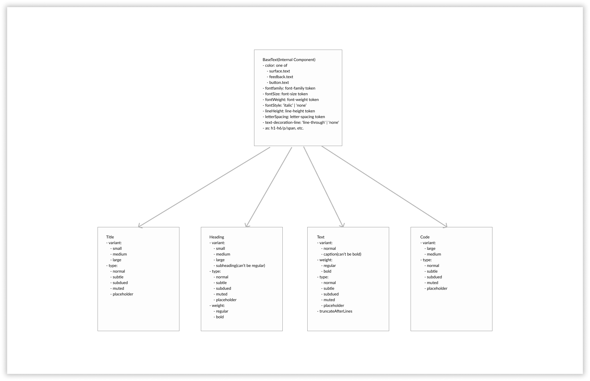

The text component is categorised into multiple parts

- BaseText - Internal Component, not published to consumers
- Title - Public Component
- Heading - Public Component
- Text - Public Component
- Code - Public Component

Here's how the hierarchy will looks like


The APIs for all the above component will look something like below

- `BaseText`

  This component is just meant to be used for internal purposes for Blade
  Here's how the API will look like

  ```jsx
  <BaseText
    color="surface.text | feedback.text | button.text"
    fontFamily="fontfamily.name"
    fontSize="fontSize.name"
    fontWeight="fontWeight.name"
    lineWeight="lineWeight"
    letterSpacing="letterSpacing"
    formatting="bold/italic/strike"
    as="h1-h6/p/span"
  >
    Some Text
  </BaseText>
  ```

Type of `children: React.ReactNode`

- Children are mandatory
- We could accept any valid ReactNode which is one of `ReactElement | ReactText | ReactFragment | ReactPortal | boolean | null | undefined`.
- The reason to accept `ReactNode` for `BaseText` is since this is a raw structure for the consumers they can satisfy their use case of building anything custom for rare use cases. For example, composing BaseText components by nesting them to make one word bold in a sentence.

```
<BaseText>
	<BaseText weight="bold">Current <BaseText/>
	  Accounts supercharged by RazorpayX come with integrated tools and integrations that make financial management and accounting simple
</BaseText>
```

- This gives flexibility and also makes sure people are still under the boundaries of DS

* `Title`

  This component is meant to be used for Titles(bigger banner style kind of text) mostly on landing pages or page level headings.

  Title will internally use `BaseText` to render. We'll use native html heading tags to render title and native text element for react-native to render the Title.

  ```jsx
  <Title
    variant="small | medium | large"
    type="normal | subtle | subdued | muted | placeholder"
    contrast="low | high"
  >
    Some Title
  </Title>
  ```

Type of `children: string`

- Children are mandatory
- We would accept only String for Title components since there's no use case where people would want to have special formatting in Title.
- There are use cases on our landing pages where we highlight or animate certain parts of the word or even add a logo inside the title. For those use cases, I guess consumers have to use two components and place them side by side regardless of using some layout utilities(of course since heading and title are block elements).

* `Heading`

  As the name indicates these will be used for headings on the page.

  Heading will internally use `BaseText` to render. Natively we'll use html heading tags for web and native text element for react-native to render the headings.

  ```jsx
  <Heading
    variant="small | medium | large | subheading"
    type="normal | subtle | subdued | muted | placeholder"
    contrast="low | high"
  >
    Some Heading
  </Heading>
  ```

Type of `children: string`

- Children are mandatory
- We would accept only String for Heading components since there's no use case where people would want to have special formatting in Heading.
- There are use cases on our landing pages where we highlight or animate certain parts of the word or even add a logo inside the title. For those use cases, I guess consumers have to use two components and place them side by side regardless of using some layout utilities(of course since heading and title are block elements).

Why prop name `variant`?

We decided to call the prop `variant` instead of `size` since `size` restricts you to a unit of "size" whereas variant is a free form prop that can be actually a variant of something so it conveys intent.

We have other variants for other typography components like `caption`, `normal` for `Text`.

Another option would be having a `size` prop that would lead us to have a "large subheading" which is a combination we never want to support. Even though `variant` doesn't seem very familiar when we see `small`, `medium`, `large` it allows us to add constraints to ensure "large subheading" never happens.

- `Text`

  This component is the one that we'll use to render normal text on the screen(a.k.a as paragraphs or body text)

  Text will internally use `BaseText` to render. Natively we'll use html `<p></p>` tag for web and native `<Text></Text>` react-native to render the headings.

  ```jsx
  <Text
    variant="body | caption"
    weight="regular | bold"
    size="small | medium"
    type="normal | subtle | subdued | muted | placeholder"
    contrast="low | high"
    truncateAfterLines={3}
  >
    Some Text
  </Text>
  ```

Type of `children: React.ReactNode`

- Children are mandatory
- We could accept any valid ReactNode which is one of `ReactElement | ReactText | ReactFragment | ReactPortal | boolean | null | undefined`.
- The reason to accept `ReactNode` and not `string` for `Text` is since it's a body text which will mostly be used in paragraphs and the main content on the page so it's better to have the flexibility for consumers because usually in the body text there are use cases to add some code snippets inline or highlight a word within the paragraph without explicitly building the `Text` component from scratch using `BaseText`.

- `Code`

  This component will be used to highlight code content in the paragraph. This not the actual code block component. the scope is to just highlight inline content which can refer code.

  Text will internally use `BaseText` to render. Natively we'll use html `<code></code>` tag for web and native `<Text></Text>` react-native to render the code text.

  ```jsx
  <Code size="large | medium" type="normal | subtle | subdued | muted | placeholder">
    SENTRY_AUTH_TOKEN:xyz
  </Code>
  ```

  Using `size` here because that is what we use in `Text` as well and semantically `size="large"` makes a lot more sense.

  In future, we want to make `size` as a consistent prop for sizing all components and use `variant` for values that can't be added to size.
