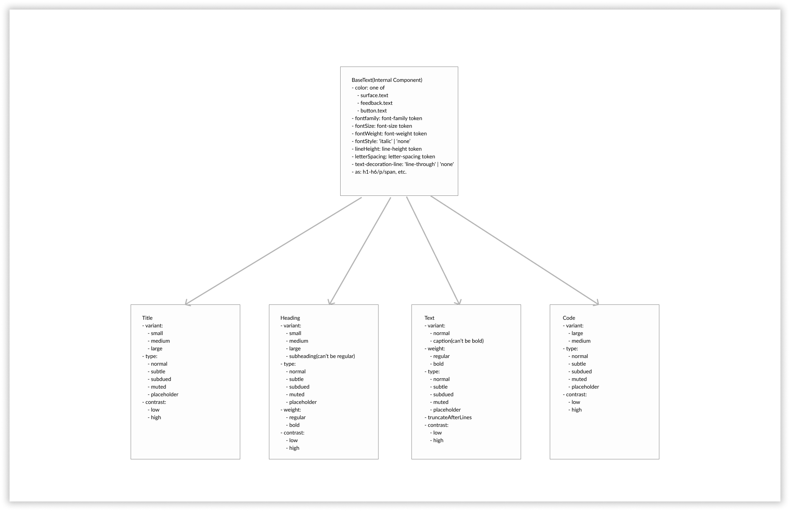

The text component is categorised into multiple parts

- BaseText - Internal Component, not published to consumers
- Title - Public Component
- Heading - Public Component
- Text - Public Component
- Code - Public Component

Here's how the hierarchy will looks like


The APIs for all the above component will look something like below

- `BaseText`

  This component is just meant to be used for internal purposes for Blade
  Here's how the API will look like

  ```jsx
  <BaseText
    color="surface.text | feedback.text | button.text"
    fontFamily="fontfamily.name"
    fontSize="fontSize.name"
    fontWeight="fontWeight.name"
    lineWeight="lineWeight"
    letterSpacing="letterSpacing"
    formatting="bold/italic/strike"
    as="h1-h6/p/span"
  />
  ```

- `Title`

  This component is meant to be used for Titles(bigger banner style kind of text) mostly on landing pages or page level headings.

  Title will internally use `BaseText` to render. We'll use native html heading tags to render title and native text element for react-native to render the Title.

  ```jsx
  <Title variant="small | medium | large" type="normal | subtle | subdued | muted | placeholder">
    Some Title
  </Title>
  ```

- `Heading`

  As the name indicates these will be used for headings on the page.

  Heading will internally use `BaseText` to render. Natively we'll use html heading tags for web and native text element for react-native to render the headings.

  ```jsx
  <Heading
    variant="small | medium | large | subheading"
    type="normal | subtle | subdued | muted | placeholder"
  >
    Some Heading
  </Heading>
  ```

We decided to call the prop `variant` instead of `size` since `size` restricts you to a unit of "size" whereas variant is a free form prop that can be actually a variant of something so it conveys intent.

We have other variants for other typography components like `caption`, `normal` for `Text`.

Another option would be having a `size` prop that would lead us to have a "large subheading" which is a combination we never want to support. Even though `variant` doesn't seem very familiar when we see `small`, `medium`, `large` it allows us to add constraints to ensure "large subheading" never happens.

- `Text`

  This component is the one that we'll use to render normal text on the screen(a.k.a as paragraphs or body text)

  Text will internally use `BaseText` to render. Natively we'll use html `<p></p>` tag for web and native `<Text></Text>` react-native to render the headings.

  ```jsx
  <Text
    variant=" medium | large | caption"
    weight="regular | bold"
    type="normal | subtle | subdued | muted | placeholder"
    truncateAfterLines={3}
  >
    Some Text
  </Text>
  ```

- `Code`

  This component will be used to highlight code content in the paragraph. This not the actual code block component. the scope is to just highlight inline content which can refer code.

  Text will internally use `BaseText` to render. Natively we'll use html `<code></code>` tag for web and native `<Text></Text>` react-native to render the code text.

  ```jsx
  <Code variant="large | caption" type="normal | subtle | subdued | muted | placeholder">
    SENTRY_AUTH_TOKEN:xyz
  </Code>
  ```
