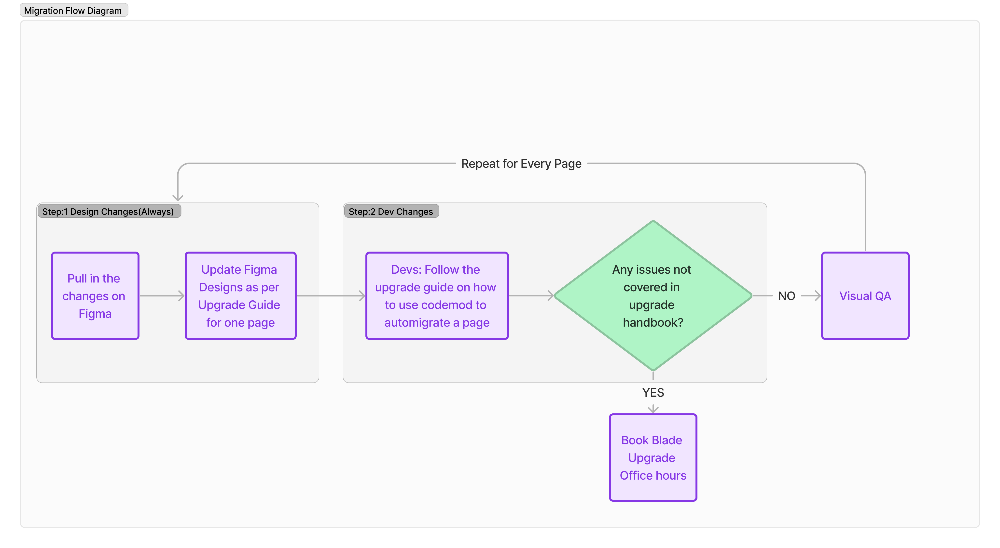
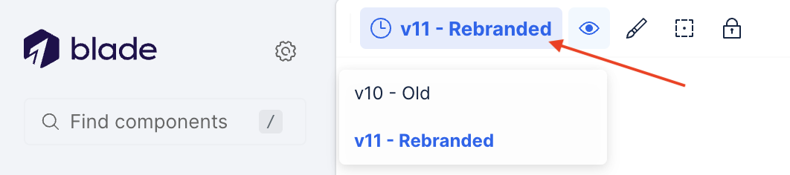

# Upgrade Guide for v11 (Brand Refresh)

## Upgrade Workflow Overview

All the rebranding upgrade activity starts at the design end and is then followed by engineering



## Migration with Codemod

**Step 1:** Install this version of Blade as `yarn add @razorpay/blade-rebranded@npm:@razorpay/blade@v11.0.0`.

**Step 2:** Install new fonts (Inter & Tasa) by following [this file](https://blade.razorpay.com/?path=/docs/guides-installation--docs#-installing-fonts).

**Step 3:** The codemod will update the components to the new version of Blade. Execute the codemod on the file/directory that needs to be migrated for the page via the following command:

> Need help? Check out [jscodeshift docs](https://github.com/facebook/jscodeshift) for CLI usage tips.

```sh
npx jscodeshift ./PATH_TO_YOUR_DIR --extensions=tsx,ts,jsx,js -t ./node_modules/@razorpay/blade-rebranded/codemods/brand-refresh/transformers/index.ts --ignore-pattern="**/node_modules/**"
```

### 🚧 Watch Out for Limitations & Edge Cases

> [!IMPORTANT]
>
> There might be some situations where the codemod falls short. If you encounter errors, handle those cases manually by following up with your designer.

- The codemod doesn't handle the migration of conditionally rendered props. Take a moment to manually inspect and update such cases. The codemod will also log a warning for such cases with the line number & path to the file. For example: `Expression found in the "size" attribute, please update manually: src/pages/ResumeWithRazorpay/sections/WhyResumeSection.tsx:20`

  ```diff
  - <Title size={isMobile ? "small" : "medium"}> Hello </Title>
  + <Heading size={isMobile ? "large" : "xlarge"}> Hello </Heading>
  ```

- With Blade v11, we have removed `highContrast` & `lowContrast` terminology from color tokens. If you have used any color token which has `highContrast` in its name or `contrast="high"` prop in typography components, the codemod will replace it with `"UPDATE_THIS_VALUE_WITH_A_NEW_COLOR_TOKEN"` string. You will have to discuss these instances with designers & manually update this value with a new color token that matches the contrast you need.

  ```diff
  - <Text color="surface.text.subtle.highContrast"> Lorem ipsum </Text>
  + <Text color="UPDATE_THIS_VALUE_WITH_A_NEW_COLOR_TOKEN"> Lorem ipsum </Text>
  ```

- In a move towards internationalization, the default formatting of number in Amount component has now changed. It relies on locale state managed by [@razorpay/i18nify-js](https://www.npmjs.com/package/@razorpay/i18nify-js) library and fallbacks to browser locale to drive formatting. To maintain the previous formatting experience of the Amount component, ensure you follow the steps outlined in this [section](https://github.com/razorpay/blade/blob/master/packages/blade/upgrade-v11.md#amount).

**Step 5**: Test your page and make sure everything works as expected. Once the migration is complete for all pages, you can remove the old version of Blade from your project.

## Documentation

By default, `blade.razorpay.com` will show documentation for the latest version of Blade. To view the documentation for an older version, you can use the version selector in the top-left corner of the page.



## Available Rebranded Components

To check out the list of available components, visit [Blade Component Status](https://blade.razorpay.com/?path=/docs/guides-component-status--docs).

## Manual Migration Guide

Only use this if you're unable to run the codemod described above.

### Theme Tokens

- **`paymentTheme` & `bankingTheme` have been removed. Use `bladeTheme` instead.**

  ```diff
    import { BladeProvider } from '@razorpay/blade/components';
  - import { paymentTheme, bankingTheme } from "@razorpay/blade/tokens";
  + import { bladeTheme } from "@razorpay/blade/tokens";

    const AppWrapper = () => {
      return (
  -     <BladeProvider themeTokens={paymentTheme|bankingTheme} colorScheme="light">
  +     <BladeProvider themeTokens={bladeTheme} colorScheme="light">
          <App />
        </BladeProvider>
      );
    }

    export default AppWrapper;
  ```

- **The `color` tokens have been updated. You may need to update your custom component styles to map with new tokens:**

  - [color tokens mapping](https://docs.google.com/spreadsheets/d/14p3QqubqkTe2K0701EYY_Ehia4fzFMOIzOo8exCguUA/edit#gid=877366376)

- **The `font-size` and `line-height` tokens have been updated to a new scale. You may need to update your custom component styles to match the new scale:**
  - [font-size scale](https://www.figma.com/file/5BZsOpNjbUHqgVh850yPBW/%5BResearch%5D-Typography-%26-Spacing-Refresh?type=design&node-id=244%3A188858&mode=design&t=vpFlyrSzO1jdpAPu-1)
  - [line-height scale](https://www.figma.com/file/5BZsOpNjbUHqgVh850yPBW/%5BResearch%5D-Typography-%26-Spacing-Refresh?type=design&node-id=244%3A188858&mode=design&t=vpFlyrSzO1jdpAPu-1)

### ActionList

- **The `surfaceLevel` prop has been removed without replacement.**

  ```diff
  - <ActionList surfaceLevel={2/3} >
  + <ActionList >
  ```

### Amount

- **Amount component is now internationalized via [@razorpay/i18nify-js](https://www.npmjs.com/package/@razorpay/i18nify-js).**

1. The `<Amount />` component will now automatically format numbers based on the user's browser locale. For example, `<Amount value={123456.789} currency="INR">` will render `₹1,23,456.79` for browsers with the `en-IN` default locale, whereas it will render `₹123,456.79` for browsers with the `en-US` locale.

2. If you want to enable users to change the locale of your page, add the `@razorpay/i18nify-react` package and wrap your app inside the `I18nProvider`. Utilize the `setI18nState` utility to modify the locale. For more details, please refer to the [documentation](https://www.npmjs.com/package/@razorpay/i18nify-react).

3. Additionally, if you prefer to maintain a fixed locale for your page and amount component, enclose your app within `<I18nProvider initData={{locale: 'locale-you-want'}}>..`. For more details, please refer to the [documentation](https://www.npmjs.com/package/@razorpay/i18nify-react).

Example with `@razorpay/i18nify-react`

```jsx
import React, { useEffect } from 'react';
import { I18nProvider, useI18nContext } from '@razorpay/i18nify-react';
import { BladeProvider, Amount } from '@razorpay/blade/components';

const ToggleAmount = ({ value }) => {
  const { setI18nState } = useI18nContext();

  function onLocaleChange() {
    setI18nState({ locale: 'de-DE' });
  }

  return (
    <>
      <Amount value={value} />
      <button onClick={onLocaleChange}>change locale to German</button>
    </>
  );
};

const App = () => {
  return (
    <I18nProvider initData={{ locale: 'en-IN' }}>
      <BladeProvider>
        <ToggleAmount value={2000000} />
      </BladeProvider>
    </I18nProvider>
  );
};
```

- **The accepted values for the `size` prop has been updated.**

  ```diff
  - <Amount size="body-small" value={123456.789} />
  + <Amount value={123456.789} type="body" size="small" />

  - <Amount size="body-small-bold" value={123456.789} />
  + <Amount value={123456.789} type="body" size="small" weight="semibold" />

  - <Amount size="body-medium" value={123456.789} />
  + <Amount value={123456.789} type="body" size="medium" />

  - <Amount size="body-medium-bold" value={123456.789} />
  + <Amount value={123456.789} type="body" size="medium" weight="semibold" />

  - <Amount size="heading-small" value={123456.789} />
  + <Amount value={123456.789} type="body" size="large" />

  - <Amount size="heading-small-bold" value={123456.789} />
  + <Amount value={123456.789} type="body" size="large" weight="semibold" />

  - <Amount size="heading-large" value={123456.789} />
  + <Amount value={123456.789} type="heading" size="medium" />

  - <Amount size="heading-large-bold" value={123456.789} />
  + <Amount value={123456.789} type="heading" size="medium" weight="semibold" />

  - <Amount size="title-small" value={123456.789} />
  + <Amount value={123456.789} type="heading" size="large" />

  - <Amount size="title-medium" value={123456.789} />
  + <Amount value={123456.789} type="heading" size="xlarge" />
  ```

- **The `intent` prop has been removed in favor of the `color` prop.**

  ```diff
  - <Amount intent="positive" value={123456.789} />
  + <Amount color="feedback.text.positive.intense" value={123456.789} />

  - <Amount intent="negative" value={123456.789} />
  + <Amount color="feedback.text.negative.intense" value={123456.789} />

  - <Amount intent="information" value={123456.789} />
  + <Amount color="feedback.text.information.intense" value={123456.789} />

  - <Amount intent="notice" value={123456.789} />
  + <Amount color="feedback.text.notice.intense" value={123456.789} />
  ```

- **The `prefix` prop has been removed in favor of the new `currencyIndicator` prop.**

  ```diff
  - <Amount prefix="currency-symbol" value={123456.789} />
  + <Amount currencyIndicator="currency-symbol" value={123456.789} />

  - <Amount prefix="currency-code" value={123456.789} />
  + <Amount currencyIndicator="currency-code" value={123456.789} />
  ```

### Alert

- **The `contrast` prop has been removed in favor of the new `emphasis` prop.**

  ```diff
  - <Alert description="Hello World" contrast="low" />
  + <Alert description="Hello World" emphasis="subtle" />

  - <Alert description="Hello World" contrast="high" />
  + <Alert description="Hello World" emphasis="intense" />
  ```

- **The `intent` prop has been removed in favor of the `color` prop.**

  ```diff
  - <Alert description="Hello World" intent="positive|negative|information|notice|neutral" />
  + <Alert description="Hello World" color="positive|negative|information|notice|neutral" />
  ```

### Typography Components

- **The `Title` component has been removed in favor of the `Heading` component.**

  ```diff
  - <Title size="xlarge"> Hello </Title>
  + <Heading size="2xlarge"> Hello </Heading>

  - <Title size="large"> Hello </Title>
  + <Heading size="xlarge"> Hello </Heading>

  - <Title size="medium"> Hello </Title>
  + <Heading size="xlarge"> Hello </Heading>

  - <Title size="small"> Hello </Title>
  + <Heading size="large"> Hello </Heading>
  ```

- **The `type` prop has been removed from the `Text`, `Heading`, & `Display` components in favor of the `color` prop.**

  ```diff
  - <Text type="normal"> Hello </Text>
  + <Text color="surface.text.gray.normal"> Hello </Text>

  - <Text type="subtle"> Hello </Text>
  + <Text color="surface.text.gray.subtle"> Hello </Text>

  - <Text type="muted"> Hello </Text>
  + <Text color="surface.text.gray.muted"> Hello </Text>

  - <Text type="subdued"> Hello </Text>
  + <Text color="surface.text.gray.muted"> Hello </Text>

  - <Text type="placeholder"> Hello </Text>
  + <Text color="surface.text.gray.disabled"> Hello </Text>
  ```

- **The `contrast` prop has been removed from the `Text`, `Heading`, & `Display` components.**

  ```diff
  - <Text contrast="low"> Hello </Text>
  + <Text> Hello </Text>

  // contrast="high" doesn't exist anymore, so you will need to manually update these cases a new color token that matches the contrast you need.
  - <Text contrast="high"> Hello </Text>
  + <Text> Hello </Text>
  ```

- **The `variant` prop has been removed from the `Heading` component.**

  ```diff
  - <Heading variant="regular"> Hello </Heading>
  + <Heading> Hello </Heading>

  - <Heading variant="subheading"> Hello </Heading>
  + <Text size="small"> Hello </Text>
  ```

- **The `size` prop scale has been updated in the `Heading` component**

  ```diff
  - <Heading size="large"> Hello </Heading>
  + <Heading size="medium"> Hello </Heading>

  - <Heading size="medium"> Hello </Heading>
  + <Heading size="small"> Hello </Heading>

  - <Heading size="small"> Hello </Heading>
  + <Text size="large"> Hello </Text>
  ```

- **The `caption` variant of the `Text` component now accepts only `size="small"`.**

  ```diff
  - <Text variant="caption" size="medium"> Hello </Text>
  + <Text variant="caption" size="small"> Hello </Text>
  ```

- **The `weight` prop now accepts `"semibold"` instead of `"bold"` in the ` Text`, `Heading` , & `Display` components. The `Code` component continues to accept `"bold"`.**

  ```diff
  - <Text weight="bold"> Hello </Text>
  + <Text weight="semibold"> Hello </Text>

  - <Heading weight="bold"> Hello </Heading>
  + <Heading weight="semibold"> Hello </Heading>

  - <Display weight="bold"> Hello </Display>
  + <Display weight="semibold"> Hello </Display>
  ```

### Badge

- **The `fontWeight` prop has been removed.**

  ```diff
  - <Badge fontWeight="regular|bold"> Hello </Badge>
  + <Badge> Hello </Badge>
  ```

- **The `contrast` prop has been removed in favor of the new `emphasis` prop.**

  ```diff
  - <Badge contrast="low"> Hello </Badge>
  + <Badge emphasis=”subtle”> Hello </Badge>

  - <Badge contrast="high"> Hello </Badge>
  + <Badge emphasis="intense"> Hello </Badge>
  ```

- **The `variant` prop has been removed in favor of the `color` prop.**

  ```diff
  - <Badge variant="blue"> Hello </Badge>
  + <Badge color="primary"> Hello </Badge>

  - <Badge variant="positive|negative|information|notice|neutral"> Hello </Badge>
  + <Badge color="positive|negative|information|notice|neutral"> Hello </Badge>
  ```

- **The `"default"` value for the `color` prop has been removed in favor of the new `"primary"` value.**

  ```diff
  - <Badge color="default"> Hello </Badge>
  + <Badge color="primary"> Hello </Badge>
  ```

### Button & Link

- **The `"default"` value for the `color` prop has been removed in favor of the new `"primary"` value.**

  ```diff
  - <Button color="default"> Hello </Button>
  + <Button color="primary"> Hello </Button>

  - <Link color="default" href="https://razorpay.com/"> Hello </Link>
  + <Link color="primary" href="https://razorpay.com/"> Hello </Link>
  ```

### Card

- **The `surfaceLevel` prop has been removed in favor of the new `backgroundColor` prop.**

  ```diff
  - <Card surfaceLevel={2}> Hello </Card>
  + <Card backgroundColor="surface.background.gray.moderate"> Hello </Card>

  - <Card surfaceLevel={3}> Hello </Card>
  + <Card backgroundColor="surface.background.gray.intense"> Hello </Card>
  ```

- The `CardHeaderBadge`, `CardHeaderCounter`, `CardHeaderAmount`, `CardHeaderText`, `CardHeaderLink`, and `CardHeaderIconButton` components have the same changes as `Badge`, `Counter`, `Amount`, `Text`, `Link`, and `Button` components respectively.

### Chip & ChipGroup

- **The `intent` prop has been removed in favor of the `color` prop.**

  ```diff
  - <Chip intent="none"> Hello </Chip>
  + <Chip color="primary"> Hello </Chip>

  - <Chip intent="positive|negative"> Hello </Chip>
  + <Chip color="positive|negative"> Hello </Chip>

  - <ChipGroup intent="none">
  + <ChipGroup color="primary">

  - <ChipGroup intent="positive|negative">
  + <ChipGroup color="positive|negative">
  ```

### Counter

- **The `contrast` prop has been removed in favor of the new `emphasis` prop.**

  ```diff
  - <Counter contrast="low"> Hello </Counter>
  + <Counter emphasis=”subtle”> Hello </Counter>

  - <Counter contrast="high"> Hello </Counter>
  + <Counter emphasis="intense"> Hello </Counter>
  ```

- **The `variant` prop has been removed in favor of the `color` prop.**

  ```diff
  - <Counter variant="blue"> Hello </Counter>
  + <Counter color="primary"> Hello </Counter>

  - <Counter variant="positive|negative|information|notice|neutral"> Hello </Counter>
  + <Counter color="positive|negative|information|notice|neutral"> Hello </Counter>
  ```

- **The `intent` prop has been removed in favor of the `color` prop.**

  ```diff
  - <Counter intent="positive|negative|information|notice|neutral"> Hello </Counter>
  + <Counter color="positive|negative|information|notice|neutral"> Hello </Counter>
  ```

- **The `"default"` value for the `color` prop has been removed in favor of the new `"primary"` value.**

  ```diff
  - <Counter color="default"> Hello </Counter>
  + <Counter color="primary"> Hello </Counter>
  ```

### Divider

- **The `"normal"` value for the `variant` prop has been updated with new styles, if you need the old styles, use the `"muted"` value.**

  ```diff
  - <Divider variant="normal"> Hello </Divider>
  + <Divider variant="muted"> Hello </Divider>
  ```

### Dropdown

- **The `onDismiss` prop has been removed in favor of the `onOpenChange` prop.**

  ```diff
  - <Dropdown onDismiss={() => console.log("Dismissed!!!)}> Hello </Dropdown>
  + <Dropdown
  +   onOpenChange={(isOpen) => {
  +     if (!isOpen) {
  +       console.log("Dismissed!!!");
  +     }
  +   }}
  + >

  - <Dropdown onDismiss={handleDropdownDismiss}> Hello </Dropdown>
  + <Dropdown
  +   onOpenChange={(isOpen) => {
  +     if (!isOpen) {
  +       handleDropdownDismiss();
  +     }
  +   }}
  + >
  ```

### Indicator

- **The `intent` prop has been removed in favor of the `color` prop.**

  ```diff
  - <Indicator intent="positive|negative|information|notice|neutral" />
  + <Indicator color="positive|negative|information|notice|neutral" />

  - <Indicator intent="positive|negative|information|notice|neutral"> Hello </Indicator>
  + <Indicator color="positive|negative|information|notice|neutral"> Hello </Indicator>
  ```

### IconButton

- **The `contrast` prop has been removed in favor of the new `emphasis` prop.**

  ```diff
  - <IconButton contrast="low"> Hello </IconButton>
  + <IconButton emphasis="intense"> Hello </IconButton>

  - <IconButton contrast="high"> Hello </IconButton>
  + <IconButton emphasis="subtle"> Hello </IconButton>
  ```

### ProgressBar

- **The `contrast` prop has been removed without replacement.**

  ```diff
  - <ProgressBar contrast="low|high" value={20} />
  + <ProgressBar value={20} />
  ```

- **The `intent` prop has been removed in favor of the `color` prop.**

  ```diff
  - <ProgressBar intent="positive|negative|information|notice|neutral" value={20} />
  + <ProgressBar color="positive|negative|information|notice|neutral" value={20} />
  ```

### Skeleton

- **The `contrast` prop has been removed without replacement.**

  ```diff
  - <Skeleton contrast="low|high" />
  + <Skeleton />
  ```

### Spinner

- **The `contrast` prop has been removed in favor of the `color` prop.**

  ```diff
  - <Spinner contrast="low" />
  + <Spinner color="primary" />

  - <Spinner contrast="high" />
  + <Spinner color="white" />
  ```

- **The `"default"` value for the `color` prop has been removed in favor of the new `"primary"` value.**

  ```diff
  - <Spinner color="default" />
  + <Spinner color="primary" />
  ```

### Table

- **The `surfaceLevel` prop has been removed without replacement.**

  ```diff
  - <Table data={tableData} surfaceLevel={1/2/3} >
  + <Table data={tableData} >
  ```
