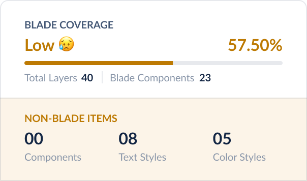

# Blade Coverage Plugin

This is a figma plugin that will give us Blade coverage for a particular design file.

It calculates the coverage and puts a tiny coverage card on top of each frame with following metrics.

## The Intro

[![Watch the video]](https://github.com/razorpay/blade/assets/11384858/5fe0f3de-37c4-4967-9024-e798ea8ff0f0)

 

## The Why?

> _Design system adoption really begins in the design phase. If designers don’t know that components exist, we shouldn’t expect our engineers to know either. For our designers, the design phase happens in Figma.
> ~ Pinterest_

As of today our typical Design ↔️ Dev lifecycle looks like this
Designer designs the feature ➡️ Hand-off to Dev ➡️ Dev analyses the design and raises asks Designer to build it Blade ➡️ Designer claims they have used Blade and the cycle repeats.

Now, in this entire process there's no way to identify where are the actual gaps, what is built using Blade, what is not built using Blade, etc.

To address all of the above problems, designers before doing a hand-off to dev can run this plugin and the plugin will put a card with the coverage and highlight the non-blade parts. This will make it easier for:

1. **Designers** - To always get an instant feedback to validate if the designs are cohesive and inline with our design language.
2. **Devs** - To quickly spot what is built using Blade and what isn't and act/plan accordingly for their feature deliveries.

## What does this plugin do?

The plugin identifies each top level frame in a Figma page and scans the frame's layers(recursively), calculates the metrics, renders the coverage card on top of each frame and finally highlights the non-blade items with a border

It excludes the following nodes from coverage calculation:

- `GROUP`
- `SECTION`
- `VECTOR`
- `FRAME`

## Running the plugin

> Note: This plugin is only published to Razorpay org and not to the community

- Visit the Figma plugin store or download the plugin from [this link](https://www.figma.com/community/plugin/1257996034575607686) and install it
- Go to any page or select any frame on the page and hit <kbd>⌘ + P</kbd>.
- Wait for few seconds and all your selected frames will have a nice little Blade Coverage Card on the top left corner.

### Hiding Highlighter Nodes

- The plugin by default highlights the non-blade items with a red box, if you feel to toggle the visibility then you can simply navigate to the **`Layers`** tab on the Left Panel and look for **`Non Blade Items`** group and toggle its visibility.

[![Watch the video]](https://github.com/razorpay/blade/assets/11384858/79a9f5e9-42fe-48f8-b011-38d45d22140a)

 

## Reading the Coverage Card

### Blade Items

- **Total Layers:** Total number of layers excluding `Section`, `Group` and `Vector` nodes.
- **Components:** Total number of Blade component's instances used from Blade library.

- **Progress Bar Coverage:** The percentage of progress bar is calculated as: **`(Total Blade Components / Total Layers)*100`**
  - If the coverage is **<50%** we display a message saying its "Very Low" and you need to work on it
  - If the coverage is **>50% and <70%** we display a message saying its "Low" and you shall improve to reach at least 70%
  - If the coverage is **>70%** we display a message saying its "Good" and the design is acceptable but there's still room for improvement

### Non Blade Items

- **Components:** Number of components which are **not** used from Blade but used from other libraries or they are local components.
- **Text Styles:** Number of typography styles not used from Blade.
- **Color Styles:** Number of color styles not used from Blade.

 

## Local Development

### Setup

- Clone the Repository: `git clone https://github.com/razorpay/blade`
- Install Dependencies: `yarn install`
- Navigate to the Plugin Directory: `cd packages/plugin-figma-blade-coverage`
- Start the Development Server: `yarn watch`
- Open The Figma Desktop App:
  - Go to `Plugins` -> `Development` -> `New Plugin`
  - Click on `Click to choose a manifest.json file` and select the `manifest.json` file from the repo.
  - The plugin will now be listed under **Development** section.

### Running the Plugin

- Open the Figma desktop app, create a new file and enable Blade library.
- Import the components to be tested from the assets panel.
- Import components to be tested from the assets panel.
- Run the plugin: Go to `Plugins -> Development -> Blade Coverage`.

### Getting Component IDs

- We provide a utility script to get the component IDs from the Blade library.
- Navigate to the `getComponentKeyToNameMap.ts` file.
- Refer to the `getComponentKeyToNameMap`` function's JSDoc for detailed instructions on how to use it.

## TODO

- [ ] number of times plugin is run - send to segment
- [ ] background color in non blade - frame, rectangles, etc

  - can't because it'll create too much noise esp for landing pages

### post v1 release

- [ ] show plugin ui config
- [ ] send analytics randomly once or twice a day
- [ ] way to fix the Non Blade Items
- [ ] identify how to differentiate between a layout node and custom component node(right now all the frame nodes are ignored from coverage, only children are counted)
- [ ] audit other styles - border-radius, space, etc.

### Known Issues:

- If you create a component-set with blade components for prototype purpose then the plugin will highlight the component set(parent) as non-blade because its a local instance.
- Can't identify things like Amount component if they don't use amount component but it passes since it uses typography tokens
- We are not highlighting the gradients/background colors which are non-blade on Frame background, rectangle background, etc. because we don't have a fixed pattern yet so highlighting them won't help us fix it regardless.
