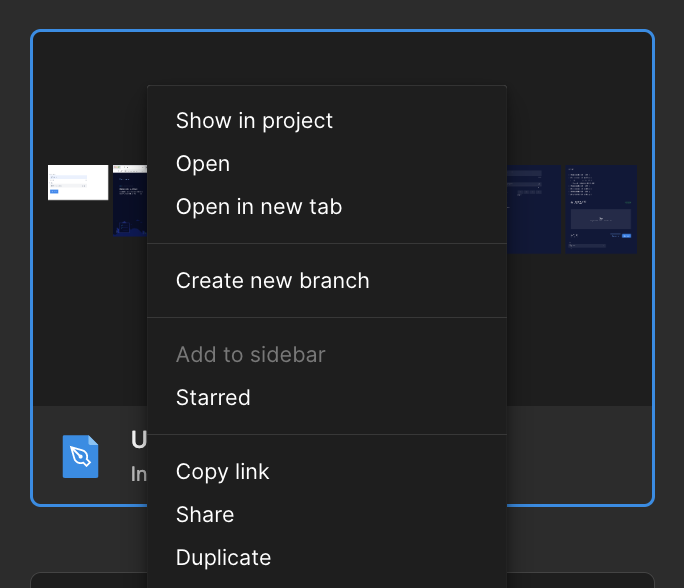
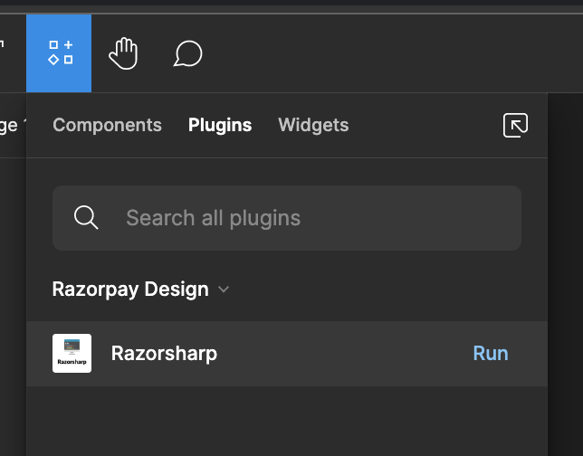
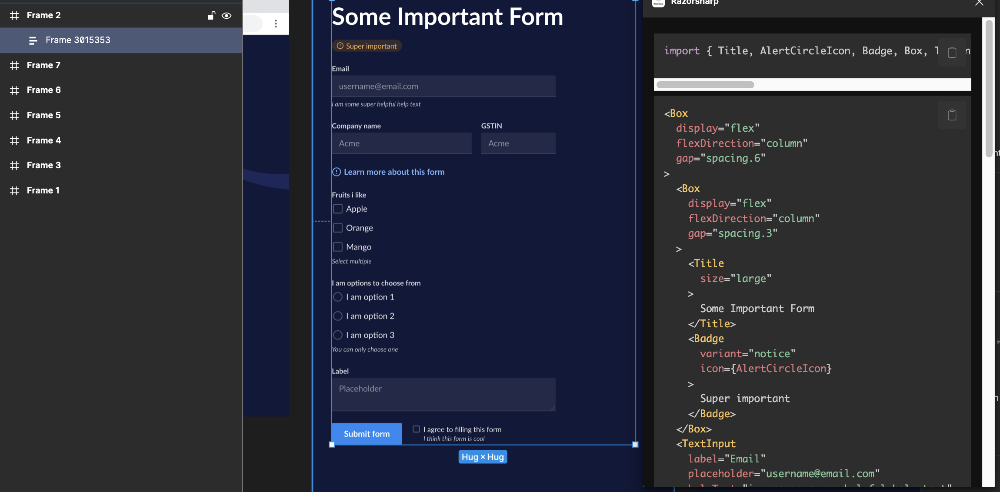

# Usage guide for developers

How to install and use Razorsharp

## Installation

The plugin is published on Figma private for Razorpay employees for now. If you are a Razorpay employee, you can install the plugin from [here](https://www.figma.com/community/plugin/1200806396995792369/Razorsharp).

If you are not a Razorpay employee, you can download and build the project locally.

## Usage

### Running the plugin

Figma allows plugins to be run only when the user has edit access to the file. Most developers wont have edit access to the file. So, you will have to create a copy of the file and then run the plugin on that file.

You can duplicate the file by right-clicking on the thumbnail and clicking on "Duplicate".

Open the duplicate file. You should be able to see it in the "Drafts" section in the sidebar. Once you have opened the duplicate file, you can run the plugin.

To run the plugin, click on the "Plugins" menu and then click on "Razorsharp" then click on "Run".

### Generating code

Once you have opened the plugin, you can click on any UI section to generate code. You can also click on the copy button to copy the code to your clipboard.

### Facing an issue?

Tag @Burhan on #design-system on the Razorpay Slack workspace.
