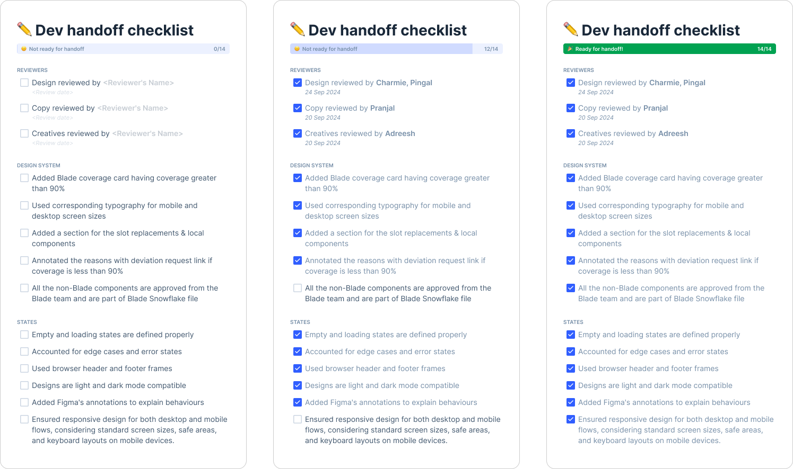

# Dev Handoff Checklist (Figma widget)

The Design Handoff Checklist for Figma is a comprehensive tool designed to streamline the final design review process for designers and design leaders before handing off projects to developers. This widget ensures that all edge cases are considered and nothing is overlooked in the final stages of the design process.

## Features
* Design reviews
* Edge-case scenario checklist
* Blade design system checklist

## How to use?
* Open quick search on your Figma workspace (use shortcut `cmd + /`).
* Search for *`Dev handoff checklist`* widget.
* Insert Dev handoff checklist widget to your workspace (on `Handoff` page).
* Complete the checklist along with the reviews before handing it off to developers.

*PS: Developers will not accept designs until the checklist is completed*

##
For more information on Figma widgets, check here
https://www.figma.com/widget-docs/setup-guide/