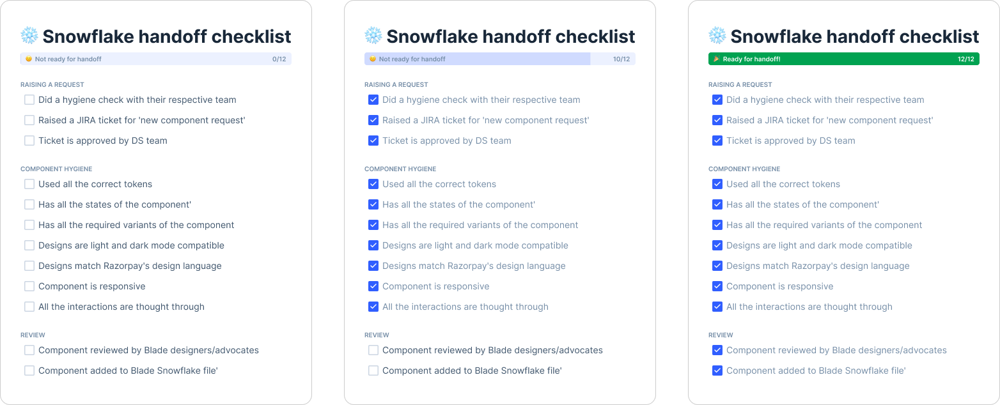

# Dev Handoff Checklist (Figma widget)

The Design Handoff Checklist for Figma is a comprehensive tool designed to streamline the final design review process for designers and design leaders before handing off projects to developers. This widget ensures that all edge cases are considered and nothing is overlooked in the final stages of the design process.

## Features
* Raising requests
* Component hygiene
* Reviews

## How to use?
* Open quick search on your Figma workspace (use shortcut `cmd + /`).
* Search for *`Snowflake handoff checklist`* widget.
* Insert Snowflake handoff checklist widget to your workspace (inside `Snowflake` file, next to your component on a specific page wrapped into a section).
* Complete the checklist along with the reviews before handing it off to designers/developers.

*PS: Blade team will not accept designs until the checklist is completed*

##
For more information on Figma widgets, check here
https://www.figma.com/widget-docs/setup-guide/