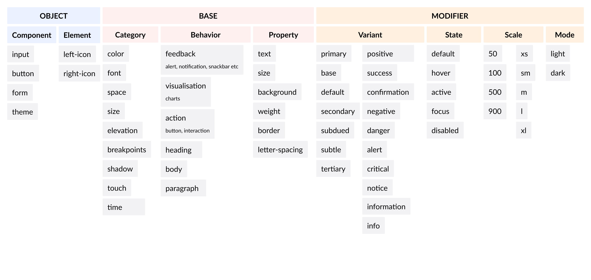
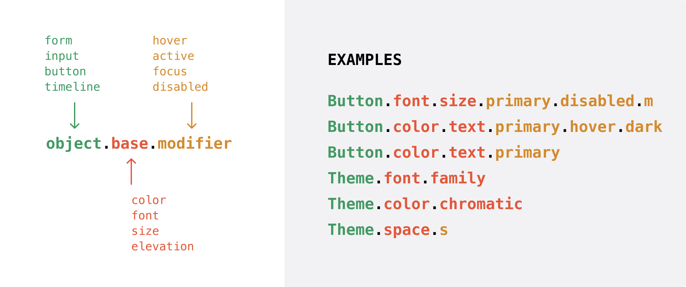

# Tokens Naming Convention <!-- omit in toc -->

### Table Of Contents <!-- omit in toc -->
- [Summary](#summary)
  - [What are design tokens?](#what-are-design-tokens)
- [Motivation](#motivation)
    - [Why are we doing this?](#why-are-we-doing-this)
    - [The current state](#the-current-state)
    - [What is the expected outcome?](#what-is-the-expected-outcome)
- [Detailed Design](#detailed-design)
  - [Proposed Structure](#proposed-structure)
    - [Object](#object)
      - [TL;DR](#tldr)
    - [Base](#base)
      - [Category](#category)
      - [Property](#property)
      - [Behavior](#behavior)
      - [TL;DR](#tldr-1)
    - [Modifier](#modifier)
      - [Variant](#variant)
      - [State](#state)
      - [Scale](#scale)
      - [Mode](#mode)
      - [TL;DR](#tldr-2)
    - [In a nutshell](#in-a-nutshell)
  - [Creating a new token](#creating-a-new-token)
  - [Overlapping Decisions](#overlapping-decisions)
  - [Principles Used](#principles-used)
    - [Specificity over Flexibility](#specificity-over-flexibility)
    - [Start within, then promote across](#start-within-then-promote-across)
    - [Theme ≠ Mode](#theme--mode)
  - [How/Where will we store these tokens?](#howwhere-will-we-store-these-tokens)
    - [Storing theme tokens](#storing-theme-tokens)
    - [Storing component tokens](#storing-component-tokens)
- [Drawbacks/Constraints](#drawbacksconstraints)
- [Alternatives](#alternatives)
- [Adoption strategy](#adoption-strategy)
- [How do we educate people?](#how-do-we-educate-people)
- [Open Questions](#open-questions)
- [References](#references)

# Summary
## What are design tokens?
* Design tokens are pieces of data that take the place of hard-coded properties. They are the consistent colors, fonts, sizing, and spacing that developers use to create applications. 
* Design tokens are the design decisions stored at a central place and are agnostic of any underlying implementation/consumer framework.

This RFC discusses about the naming convention and strategies for tokens in our Design System. There are different types of tokens - global, local etc. and in order to build a scalable system we need to define some convention and strategies.

# Motivation
### Why are we doing this?
As our system is scaling we are seeing a lot of ambiguities about how to name certain things. Hence, this RFC will propose certain conventions that we need to set before going to build the components.

### The current state
We just have global tokens until now in our systems. We don't have component level tokens specifically and all the values for properties of a component are derived with hardcoded values inside `if..else` blocks
```js
fontColor({ variant, variantColor, disabled }) {
  switch (variant) {
    case 'primary':
      if (disabled) {
        return 'light.950';
      }
      return 'light.900';
    case 'secondary':
      if (disabled) {
        return 'shade.940';
      }
      return `${variantColor}.800`;
    case 'tertiary':
      if (disabled) {
        return 'shade.940';
      }
      return `${variantColor}.800`;
    default:
      if (disabled) {
        return 'light.950';
      }
      return 'light.900';
  }
}

// and then we use it like this
<Icon
  name={icon}
  size={styles.iconSize({ size, children })}
  fill={styles.fontColor({ variant, variantColor, disabled })}
  testID="Button-left-icon"
/>
```

We don't have any naming framework or guidelines that defines how we shall name things. For eg:
>If I have to refer what's stored in `theme` object I've to manually lookup the structure of the theme file and then identify that color is at the first level so I can access `theme.color.primary.800`

Similarly, If I need to add any new object inside theme I don't know what shall be the structure. For eg:
> If I have to add fontFamily as a token in the theme I don't know what structure shall I follow? `theme.fontFamily.name` or `theme.font.family.name` or `theme.typography.fontFamily` . All of them look correct at a first glance but the decision making becomes difficult.

There's no guideline or framework to decide the grouping criteria. What to group, how to group. For eg:
> Assume I've a Button component and I want to set the text color of a Button when it's in hovered state. Now I don't know whether `Button.color.text.hover` is the right way or `Button.hover.color.text` is the right way

As you can see with the current system there are a lot of issues with the naming structure since there's no guideline or a framework because of which we can't establish a standard way of naming things and the consumers of this design system can't understand what they are accessing at what level and what value they'll get at a particular level. Because of this our token naming and accessing them becomes unpredictable.

### What is the expected outcome?
- A well defined naming framework that we can use to name and access tokens at any level in our design system.
- A structured system which makes accessing our tokens predictable.

# Detailed Design
Tokens are the core foundation of our design system since tokens are something that dictates our design decisions.

We'll discuss about the proposed structure in this section but before that let's look at some example and their issues in the current system:
1. If I have to refer stored in a `theme` object I've to manually lookup the structure of the theme file and then identify that color is at the first level so I can access `theme.color.primary.800`
2. If I have to add `fontFamily` as a token in the theme I don't know what structure shall I follow? `theme.fontFamily.name` or `theme.font.family.name` or `theme.typography.fontFamily`. All of them look correct at a first glance but the decision making becomes difficult.
3. I've a Button component and I want to set the text color of a Button when it's in hovered state. Now I don't know whether `Button.color.text.hover` is the right way or `Button.hover.color.text` is the right way.

It's quite evident that we need a system that's flexible and also specific. 

We need a well descriptive tokenized language that incorporates all these concerns and gives us a structure in a hierarchical manner. The language should be elaborative enough that accessing the tokens almost becomes self explanatory. This means we need to start defining some kind of groups.

## Proposed Structure
The proposed grouping that will fit our use case would look something like `object.base.modifier`.
<br/>
<br/>
A picture worth thousand words 😄




Let's look at the breakdown for each of the group:

### Object
An object level classifies tokens specific to a component, element nested within a component, or a component group or even a theme to differentiate whether it's a theme level global token or component level local token. `Object` level will become the first level of classification in our new token structure.

For example if we don't use this specifier then we might end up creating a token like `color.background` for let's say a `Button` component. But this leads to an ambiguity since we we don't have any context attached to the color and we don't know what color we are referring to. 

Rather if we start the token naming with a `Base` which means prefixing the component name then things might become more clear and contextual. For eg: `Button.color.background`

But now if we want to refer a component within a component for example we need to refer to the `color` of an `icon` component inside a `Button` component then how shall we do that? An object can also split further and can have sub-component nesting to it as well. Eg: `Button.leftIcon.color.background` 

Similarly, if we want to refer to a token value within a theme like `font.family` we can't do it alone since it doesn't has any context attached to it and we don't even know if what are we referring to? a theme token or a component token?

But as soon as we attach the context our problem will be solved. For eg: `theme.font.family` tells us that we are trying to refer to font family token inside our theme.

#### TL;DR
**Object** refers to
  1. **component** - `Button`, `theme` etc.
  2. **sub-component** - one or more component within a component - `left-icon`, `right-icon` etc.

### Base
Base acts as a token’s backbone. Once we have `Object` as the first level classification the next level is `Base`. For example `color`, `font`, `size` etc becomes the `Base` i.e `Button.color`, `Button.font`, `theme.color` etc. 

But as our collection grows the `Base` alone can't serve the purpose and it literally doesn't mean anything. For eg: `Button.color` itself is ambiguous becuase a color could be `textColor`, `backgroundColor`, `borderColor` or anything else, so instead we need a further level of pairing. Hence, the `Base` itself can be categorised into `category`, `property` and `behavior`.

#### Category
Categories span visual style concerns and may overlap at times

Common categories includes but not limited to:
- `color`
- `font` (aka type, typography, text)
- `space` (aka units, dimension, spacing)
- `size` (aka sizing)
- `elevation` (aka z-index, layer, layering)
- `breakpoints` (aka media-query, responsive)
- `shadow` (aka depth)
- `time` (aka animation, duration)

#### Property
Property is something that attach some meaning to the category in such a way that a meaningful value can be derived

Common properties includes but not limited to:
- `text`
- `background`
- `border`
- `weight`

Usually a property is paired up with category to form a meaningful token value. For eg:
- `color.text`
- `color.background`
- `color.border`
- `font.weight`

Some meaningful token name examples:
```jsonc
// Object.Base<category.property>
Button.color.text
Button.color.background 
Button.color.border 
Button.font.weight
Button.font.size
```

#### Behavior
Category-property pairs are exceedingly general and not purposefully useful when we want to create few generalised global tokens. 

For example if we need to create a global token which applies to all the actionable elements i.e `Button`, `Link` etc. then we can't create something general by just using `category.property` pairing(`color.text`) or if we want to have a token which applies to the `body` or maybe just elements which give feedbacks `snackbar`, `alerts` etc. Hence, we need another level in between which is `behavior`.

Common behavior includes but not limited to:
- `action`
- `feedback`
- `heading`
- `body`

We can combine concepts with categories and properties to form more generalised tokens:
```
color.action.background
color.feedback.text
font.heading.size
font.body.weight
```

#### TL;DR
**Base** refers to a token’s backbone that combines
  1. **category** - `color`, `space`, `size`, `font` etc.
  2. **behavior** - `action`, `feedback` etc.
  3. **property** - `size`, `weight`, `border` etc.
> 📝 Note: It's not mandatory to use all the three sub levels of the `Base` i.e `category.behavior.property` always. You can use them as per the use case by skipping some of the grouping levels if required.
### Modifier
Whenever we will build components we will always come across use cases like defining token for a particular `variant`(primary, secondory, success, error, information etc.) of a component in a particular `state`(hover, click, active, state etc.). 

To achieve the above use case we will use modifiers.

Modifiers are the last level in our token naming hierarchy.

Modifiers can be used independently or can be paired with levels like category, behavior and property to form a purposeful decision(a.k.a meaningful self explanatory token). For eg: 
- `Button.color.text.primary`
  - `Button` - Object
  - `color` - Base(category)
  - `text` - Base(property)
  - `primary` - Modifier(variant)
- `theme.color.action.background.hover`
  - `theme` - Object
  - `color` - Base(category)
  - `action` - Base(behavior)
  - `background` - Base(property)
  - `hover` - Modifier(state)

Modifiers can further be categorised into `variant`, `state`, `scale`, and `mode`. 
#### Variant
A variant distinguishes alternative use cases.

For example different variants of a `Button`
* `primary`
* `secondary`
* `tertiary`

Similarly, different variant of `Notification`
* `success` - to indicate a successful action
* `error` - to indicate that an action errored out
* `information` - to nudge the user with information
* `warning` - to indicate a warning

For example: `theme.color.action.text.primary`
#### State
Tokens can specify properties based on interactive states, like:
* `default`
* `hover` - when a pointer is positioned above an object
* `click` - when a user presses an object
* `focus` - when an object is able to accept input
* `disabled` - when an object is not able to accept input
* `visited` - when a link is already visited
* `error` - when an object is in an error state

For example: `theme.color.action.text.primary.focus`

#### Scale
Scale serves as a mofifer to create more granular token name in scenarios where we want to create a token which work differently on different scales

* Linear Scale: `1`, `2`, `3`, `4` and so on
* T-shirt Size Scale: `s`, `m`, `l`, `xl` and so on

For example: `theme.font.size.s`, `Button.space.paddingLeft.primary.hover.m`

#### Mode
Mode is usually a modifier to help us create tokens to distinguish values across two or more surface/background settings on which elements appear 

* `dark`
* `light`
* `midNight`

For example: `theme.color.action.text.primary.focus.dark`, `Button.color.text.primary.hover.dark`
#### TL;DR
**Modifier** refers to one or more of
  1. **variant** - `primary`, `secondary` etc.
  2. **state** - `hover`, `click`, `active` etc.
  3. **scale** - `100`, `200`, `1`, `2`, `s`, `m`, `l` etc.
  4. **mode** - `dark`, `light` etc.

### In a nutshell
- **Object** refers to
  1. **component** - `Button`, `theme` etc.
  2. **sub-component** - one or more component within a component - `left-icon`, `right-icon` etc.
- **Base** refers to a token’s backbone that combines
  1. **category** - `color`, `space`, `size`, `font` etc.
  2. **behavior** - `action`, `feedback` etc.
  3. **property** - `size`, `weight`, `border` etc.
- **Modifier** refers to one or more of
  1. **variant** - `primary`, `secondary` etc.
  2. **state** - `hover`, `pressed`, `active` etc.
  3. **scale** - `100`, `200`, `1`, `2` etc.
  4. **mode** - `dark`, `light` etc.

A visual example demonstrating above terminology


## Creating a new token
We have covered all the base concepts involved in structring or creating a token so put it together this what we have got so far:
`Object.Base.Modifier`

Let's break it down to what does this mean?
* All the parts of the structure are optional and should be used only when applicable.
* If either of the above is used in combination then the hierarchy needs to be followed as:
  1. **Object**
  2. **Base**
  3. **Modifer**

An `Object` can be either of the following(at the moment):
* `theme`
* `componentName`

A `Base` can be further split into following sub-categories based on the granularity of informatin we want to store in our token and follows the hierarchy as:
1. **category** - `color`, `space`, `size`, `font` etc.
2. **behavior** - `action`, `feedback` etc.
3. **property** - `size`, `weight`, `border` etc.

You can use multiple `base` in the same token to add more granularity and you can even skip any of the sub-categories but the hierarchical levels needs to be intact as mentioned above. For example you can construct a token by pairing the sub-categories of `base` as `category.behavior.property` or `category.property`

A `Modifier` can be further split into following sub-categories based on the granularity of informatin we want to store in our token and follows the hierarchy as:
1. **variant** - `primary`, `secondary` etc.
2. **state** - `hover`, `click`, `active` etc.
3. **scale** - `100`, `200`, `1`, `2`, `s`, `m`, `l` etc.
4. **mode** - `dark`, `light` etc.

You can use multiple `modifier` in the same token to add more granularity and you can even skip any of the sub-categories but the hierarchical levels needs to be intact as mentioned above. For example you can construct a token by pairing the sub-categories of `modifier` as `variant.state.scale.mode` or `variant.scale.mode` or `variant.state.mode` or `variant.mode` and so on.

You can basically use any/all of the above categories and their sub-categories and pair them up to form a very specific self explanatory token. Below are some examples:
```js
Button.font.size.primary.disabled.m
Button.color.text.primary.hover.dark
Button.color.text.primary
theme.font.family
theme.font.size
theme.font.weight
theme.color.chromatic.azure.100
theme.space.s
```

With this system If I take the example mentioned earlier about the usage this is how it will look
```js
const IconTokens = {
  color: {
    text: {
      primary: {
        value: theme.color.light[900],
        disabled: {
          value: theme.color.light[950],
        },
      },
      secondary: {
        value: theme.color.shade[800],
        disabled: {
          value: theme.color.shade[940],
        },
      },
      tertiary: {
        value: theme.color.shade[800],
        disabled: {
          value: theme.color.shade[940],
        },
      },
      value: theme.color.light[900],
      disabled: {
        value: theme.color.light[950],
      },
    },
  },
};
fontColor({ variant, variantColor, disabled }) {
  switch (variant) {
    case 'primary':
      if (disabled) {
        return IconTokens.color.text.primary.disabled.value;
      }
      return IconTokens.color.text.primary.value;
    case 'secondary':
      if (disabled) {
        return IconTokens.color.text.secondary.disabled.value;
      }
      return IconTokens.color.text.secondary.value;
    case 'tertiary':
      if (disabled) {
        return IconTokens.color.text.tertiary.disabled.value;
      }
      return IconTokens.color.text.tertiary.value;
    default:
      if (disabled) {
        return IconTokens.color.text.disabled.value;
      }
      return IconTokens.color.text.value;
  }
}
// and then we use it like this
<Icon
  name={icon}
  size={styles.iconSize({ size, children })}
  fill={styles.fontColor({ variant, variantColor, disabled })}
  testID="Button-left-icon"
/>
```

>P.S Some work still needs to be done. I need to figure out if we can completely get rid of styles.fontColor function
## Overlapping Decisions

*behavior*, *category*, *variant* and other levels can overlap and compete. For example, an “error red” can be both generic(*category.behavior.variant*) i.e. `color.feedback.error` and specific(*object.category.propery.variant*) i.e. `Notification.color.text.error`. This forces us to decide:

> At what level(s) do I store this purposeful decision? Is it ok to store the same decision in two different locations? If purpose of two different choices is nearly identical, should it be 1 or 2 tokens?

Both `color.feedback` and `Notification.color.text` concepts have other variants (`warning`, `success`, `info` and `label`, `value`, and `helper-text`, respectively) for which `error` completes a set. Even if the actual red value is the same, we would consider aliasing the specific one to the generic one

```js
// specific = generic
Notification.color.text.error = color.feedback.error
```
This also gives us flexibility to change the `Notification.color.text.error` color anytime without impacting other uses of `color.feedback.error`.

## Principles Used
There are certain principles that were kept in mind while creating this naming framework
### Specificity over Flexibility
Tokens like `theme.color.success` combine *category* (`color`) and *variant* (`success`) but leaves the interpretation to the user to apply `theme.color.success` to any of `background`, `border` or `text`.

Flexibility comes at the expense of specificity. A `success` color may only be intended for `text` or `background` but not both. Even more, an object reflecting `success` may require distinct colors for `text` versus `background` versus `border`. In this case, including a *property* level in a token results in a more specific yet less flexiblity eg: `theme.color.background.success` or `theme.color.text.success`.

### Start within, then promote across

Start with making the tokens `local` to the components, then follow the usage pattern, if used more than twice then promote it to `global` token. This is a healthy way to add tokens gradually without adding things blindly to local components or globally.
### Theme ≠ Mode

A theme may eventually require `light`, `dark` modes. PG might require a `light` and `dark` mode but their theme is different from Razorpay X. Similarly, Razorpay X may require `dark` and `light` mode but their dark and light could be different from any other product's theme
## How/Where will we store these tokens?
### Storing theme tokens
The theme tokens shall we created under `packages/blade/themes`
### Storing component tokens
The component tokens can be created in 2 ways:
1. Co-located inside the component file.
2. Create a token file under the component's directory i.e `packages/blade/components/Button/tokens.ts`.
3. Create component tokens under `packages/blade/tokens`.

Until now I believe that if we store the component level tokens under the components directory that'll be better because:
1. We can refer them from a central token file in all the platform level implementation of a particular component(React/React Native/Svelte etc.)
2. We can declare the typings easily so all other platform level implementation can utilise the typings easily


document all the possible ways to create a token name
document the dont's in the naming
# Drawbacks/Constraints
- Introducing a new guidelines/framework to name certain things means more time to understand on how to get this right.
- The meaning of each and every category or the entire hierachical structure might not be intuitive to someone looking it at a glance.
- Few concepts are overlapping, for example `size` is a category(base) as if used in the context of sizing and it is a property(base) if paired along with category like `font` i.e `font.size`. Even though these are rare scenarios but it needs a careful consideration whenever some new token is being created.
# Alternatives
One approach which was very close to fit in our use case and inspired from [Infor Design System](https://design.infor.com/resources/design-tokens) looked something like below:

For Theme-level tokens, the naming convention is roughly like this:
`theme.attributeType.attribute.attributeVariant`

For component-level tokens, the naming convention is roughly like this:
`componentName.attributeType.componentVariant.componentState.attribute`

This worked for basic categories like `Button.color.primary.hover.background` but it fails as soon as there are some more granular details which we want to capture with respect to theme mode, state, scale, behavior etc. For example:
* `Button.color.text.primary.hover.dark` - says that this token points to the text color of a primary Button when in hovered state on a dark mode
* `Button.font.size.primary.disabled.m` - says that this token points to the font size medium of a primary Button when in disabled state.

I had tried other ways to form a reasonably simpler structure but all of them broke as the complexity increased. Hence we needed a verbose framework which covers current as well as future scenarios.
# Adoption strategy
* Immediately, this won't impact any existing consumers of the design system.
* This is being built in isolation(though merged into master regularly as we follow Trunk based development) and hence nothing will break on the projects using blade design system directly from git commit.
* Since this is being built as an activity of re-architecture of our design system the migration of the old system to the new will be a breaking change which is out of the scope of this RFC and will be handled separately.

# How do we educate people?
* The best way to educate people is to put more and more visual representation of this staruture with contextual examples.
* All the examples written in this RFC along with hierarchical representational images can be pulled out and put it in our *future* documentation website
* Until we have our documentation site in place, this RFC can serve the purpose of documentation.

# Open Questions
- Maybe a better name for `behavior` which is defined as the the sub level in `Base`?
- I'm still not able to visualise if creating component tokens under `packages/blade/tokens` makes sense at all? 
  - Will we gain anything on the consumer side if we just consume the tokens? Didn't come across any use case yet.
  - This has an upside though, for example all our tokens can be referenced from just one package. Again can't visualise what will we gain.
- Tooling to ensure the naming convention when developers are building components in design system. Typescript will do the helping, but maybe a custom lint rule?
# References
- [Naming Tokens in Design Systems](https://medium.com/eightshapes-llc/naming-tokens-in-design-systems-9e86c7444676)
- [Design Tokens](https://spectrum.adobe.com/page/design-tokens/)
- [Tokens in Design System](https://medium.com/eightshapes-llc/tokens-in-design-systems-25dd82d58421)
