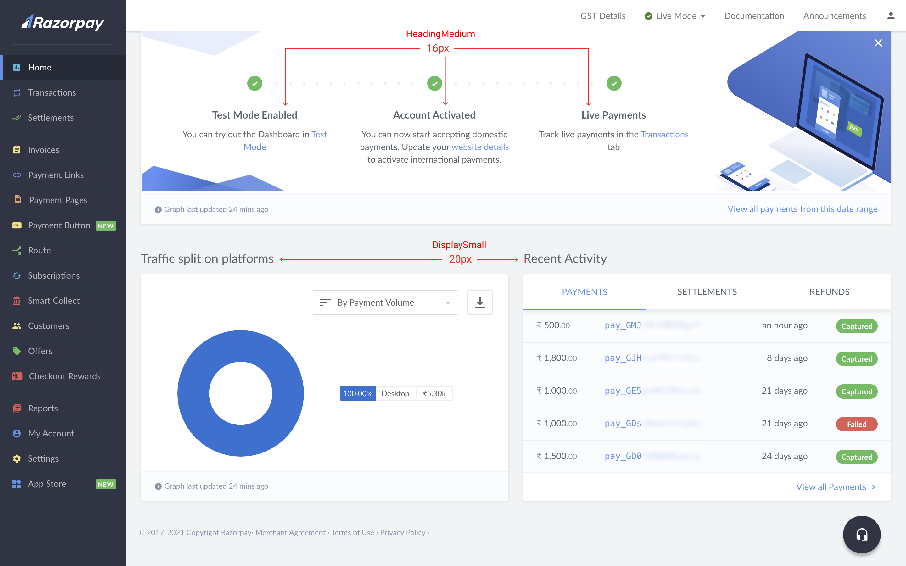
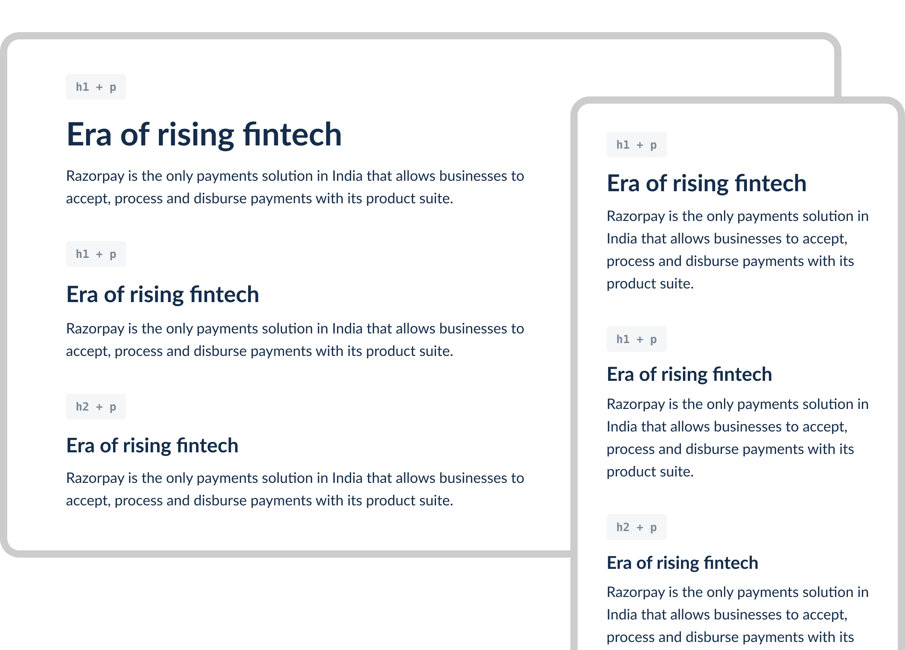

# Typography scaling across multiple devices <!-- omit in toc -->

### Table Of Contents <!-- omit in toc -->
- [Summary](#summary)
- [Basic Example](#basic-example)
  - [On Desktop](#on-desktop)
  - [On Mobile](#on-mobile)
- [Motivation](#motivation)
  - [Why do we need a type scale?](#why-do-we-need-a-type-scale)
  - [Use Cases](#use-cases)
  - [Examples from the current system](#examples-from-the-current-system)
  - [Expected Outcome](#expected-outcome)
- [Detailed Design](#detailed-design)
  - [Introduction](#introduction)
  - [Typeface](#typeface)
  - [Base font size](#base-font-size)
  - [Line Height](#line-height)
  - [Storage of Units](#storage-of-units)
  - [Current Limitations](#current-limitations)
  - [Our Approach](#our-approach)
  - [Example](#example)
- [Drawbacks/Constraints](#drawbacksconstraints)
- [Alternatives](#alternatives)
  - [Multiple type-scaling across breakpoints](#multiple-type-scaling-across-breakpoints)
  - [No type-scaling across breakpoints](#no-type-scaling-across-breakpoints)
  - [Fluid Typography](#fluid-typography)
  - [Custom Scaling](#custom-scaling)
- [Adoption strategy](#adoption-strategy)
- [How do we educate people?](#how-do-we-educate-people)
- [Open Questions](#open-questions)
- [References](#references)

# Summary
Typography is an integral part of web design. The user who is consuming information from our dashboard should not face any challenges while reading/analyzing data. Therefore we need to make sure that the type element should scale well across multiple devices (desktops/mobile/tablets/etc.).

# Basic Example
This is how the typography will look after the implementation of type scales.

#### **On Desktop**


---

#### **On Mobile**


<br>

# Motivation
### **Why do we need a type scale?**
We need our users to access our products anywhere, anytime. To make sure they can do so, we need to be present on almost every device possible especially on portables (mobiles & tablets). Every device offers a different experience and we need to make sure that we are flexible in that case. One of the major aspects of that experience is **readability** and therefore we are focusing on **typography scaling** across multiple devices.

### **Use Cases**
There can be several use-cases when a user wants to access the dashboard on multiple devices. Few of those can be,
- **On Mobiles** (user can check for settlement numbers while commuting/traveling in a metro/bus)
- **On Tablets** (user can capture a payment while on-the-go to their home back from the office)
- **On Desktops** (user can request for access to the international payment via the dashboard)

Or in-general a user can visit the company's marketing/landing page and consume information about us and our offerings.

### **Examples from the current system**
Here are a few examples in the current system.
- **Dashboard Route - Desktop vs. Mobile:**


- **Dashboard Invoices - Desktop vs. Mobile:**


- **Dashboard Invoices (Mobile) - Font Ratios:**


In the above examples, you can see there is no scaling across different devices/screens. Which is not considered as a good experience as we are compromising on the readability of things on different devices.
### **Expected Outcome**
A typography system that is more readable/consumable across different devices (mobiles/tablets/desktops).

# Detailed Design

### **Introduction**
We are following a [**Major Second**](https://type-scale.com/?size=14&scale=1.125&text=A%20Visual%20Type%20Scale&font=Lato&fontweight=400&bodyfont=Poppins&bodyfontweight=400&lineheight=1.65&backgroundcolor=white&fontcolor=%23333&preview=false) modular scale (`1.125`) for our typography system on larger screens (desktops/tablets). And [**Custom**](https://type-scale.com/?size=14&scale=1.125&text=A%20Visual%20Type%20Scale&font=Lato&fontweight=400&bodyfont=Poppins&bodyfontweight=400&lineheight=1.65&backgroundcolor=white&fontcolor=%23333&preview=false) modular scale (`1.1`) for our typography system on smaller screens (mobiles). Simply put, the font-sizes will be derived in multiples of 1.125 & 1.1 for large screens and small screens respectively.

### **Typefaces**
**Base:** We will be using [**Lato**](https://fonts.google.com/specimen/Lato?sidebar.open=true&selection.family=Lato:wght@400;700) as our base font family having two weights, **Regular(400)** & **Bold(700)**.

**Code:** For code modules/snippets we'll use [**Menlo**](https://en.wikipedia.org/wiki/Menlo_(typeface)) font family throughout the system having two weights, **Regular** & **Bold**.

**Fallbacks:** We'll use default system fonts (according to platform) as a fallback,
```
“Lato”, -apple-system, BlinkMacSystemFont, San Francisco, Segoe UI, Roboto, Helvetica Neue, sans-serif
```

### **Base font size**
After auditing the whole product it came out that we are mostly using `13px` & `14px` as a base font-size on the body text. For the internal products, it is better to go with **`14px`** as a base font-size. And for small screens (mobile) it is better to go with **`15px`** as a base font-size. Because for dashboards the content is pretty dense and we need to maintain a small font-size ratio compared to marketing/landing pages. This will help the users to consume more content into a readable format. Although, we can still play with spacings so that it doesn't feel much complex.

### **Line Height**
Line heights also plays a significant role in the whole typography spectrum. If the font-size is smaller the text will be cramped and difficult to read, instead if it is larger the eyes can get lost. According to [WCAG](https://www.w3.org/WAI/WCAG21/Understanding/text-spacing.html), the line-height should be between `150% - 200%` of the font-size. But instead of blindly copying these values, we should also consider the font-face and platform on which this is getting rendered. Therefore, for optimal readability & accessibility aim for about `125% - 160%` line-height.

For example,
```
.headingXXL-Desktop {
  line-height: 1.25; /* looks good on large screens */
  font-size: 40px;
}

.headingXXL-Mobile {
  line-height: 1.5; /* looks good on small screens */
  font-size: 28px;
}
```

General Formula,

>**`line-height = font-size * height-factor`**

And will round-off the resulting value.

### **Storage of Units**

Units such as `line-height`, `letter-spacing`, `case` should not be stored separately. As the implementation doesn't have any logic to it. It is too much dependent on the type of font or the font-family we are using. So I'd suggest that we should store everything inside the typography scale itself.

### **Current Limitations**
There are two major limitations while scaling typography to multiple breakpoints,
1. **It does not cater to landing/marketing pages.** Which are generally much larger compared to the size-ratio on the dashboard (Maybe a [Major Third](https://type-scale.com/?size=14&scale=1.125&text=A%20Visual%20Type%20Scale&font=Lato&fontweight=400&bodyfont=Poppins&bodyfontweight=400&lineheight=1.65&backgroundcolor=white&fontcolor=%23333&preview=false) scale will work better). This is currently being looked at by the comm. design team based on the same principles.
2. **Same type scaling across all devices/breakpoints.** After the type scale is defined, we also need to define the scale across multiple device sizes. There are few approaches that we've came up with and after research from other DS/products like *GitHub*, *Eightshapes*, *Paystack*, *Stripe*, and a few more we've observed that for dashboards generally tweaking the **heading** sizes works best and the base font-size will remain same for all other devices/breakpoints.

We'll look into the responsive type scale and see what approach fits best for our use case.

>📝 Note: **Responsive Typography** will scale in segments. Which means if `h1` at `1440px` is `40px`, then at `991px` it will become `32px` directly rather than going from `40px -> 38px -> 36px -> 34px -> 32px...`.

### **Our Approach**
>**Multiple type-scaling across breakpoints**

Our product is majorly used on mobiles/tablets/desktops. Therefore, We'll  consider only two breakpoints for the typography scale, one for mobiles & one for both desktops & tablets. Which is for devices having width `>=991px` (approx.)


In this type of scaling the modular scale changes on every breakpoint. For example: **mobiles** will use `Minor Third (1.2)` and **desktops/tablets** will use `Custom Scale (1.1)`.

>📝 Note: Here we're rounding-off all the numbers for the sake of simplicity and to align the content according to the grid-system. Also, various browsers treat fractional font sizes differently.

### **Example:**
This is how it will look like across desktop & mobile.

- **Type Unit Scale**


- **Typography Scale**


- **Another visual indicator**



# Drawbacks/Constraints
Few things to consider here:
- As we are moving towards adaptive-layout so we need to consider - should we also support responsive layout? For both cases, I don't see any challenges as the typography system remains the same.
- How will this be managed on the tech-side? This might create more work as we'll have to maintain more scales,
  - Landing/Marketing page (mobile & desktop/tablets)
  - Product/Dashboard (mobile & desktop/tablets)
  - Emails

# Alternatives
Few other things we considered:

### **Similar vertical & horizontal ratio across multiple breakpoints**
In this approach, we use the same ratio of `1.125` (Major Second) down across each breakpoint. Pretty straightforward, we multiply everything down and across by the same ratio.

This doesn't suit our product use case, as on mobile we want a different scale which is specifically designed for mobile experience. For example:

For devices like, **desktops/tablets** if font-size for `<h6> = 16px` than, for **mobiles** font-size for `<h6> = (16 / 1.125) = 14px`.


### **No type-scaling across breakpoints**
As the name suggests, there will be no scaling across all breakpoints, which is not at all recommended as all the font sizes will remain the same across all breakpoints, which will degrade the readability and overall experience. For example:


> [Read here](https://medium.com/sketch-app-sources/exploring-responsive-type-scales-cf1da541be54) for more info on the above two.

### **Fluid Typography**
This is viewport-based scaling and uses the `calc()` CSS function, which allows you to perform mathematical operations using a combination of different CSS units. Viewport units, specifically the viewport width (`vw`) units. For example:


This type of scale is a bit complex and very dynamic, as per our use case we don't need that much of flexibility in typography across devices.

> [Read here](https://blog.logrocket.com/the-elements-of-responsive-typography/) for more info on fluid typography.

### **Custom Scaling**
As the name suggests this type of scaling is preferred based on visual assumptions and is very custom in nature. The decisions around the type scale here doesn't hold any principles and are best suited for fancy marketing/landing pages.

> [Read here](https://eightshapes.com/articles/typography-in-design-systems/) for more info on responsive typography.

# Adoption strategy
We need to implement this type-scale as a core part of DS. This will automatically drive adoption.
- This will be implemented as tokens in the new version of DS.
- This won't impact the existing DS.
- It is a part of the new version of DS whenever the new version of DS is implemented the whole typography across all devices and pages will be affected.

# How do we educate people?
Two types of people need to be educated (**designers & developers**).
- Designers will use pre-made components (from the DS) on Figma for their daily workflow.
- Similarly, those components will also be used by the developers and that will be already present in the DS library.
- For some cases, we might also need usage guidelines to help the consumers go-through before implementing anything based on content.

# Open Questions
- How are we going to implement this type-scale? Using styled-components or CSS?
- Marketing/Landing pages will need their own responsive type-scale as the scale ratio for such sites is more compared to the product. This is already in progress from the Comm. design team. Should we include that as well in the current system? Just for reference, Figma uses [FLEGO](https://www.figma.com/file/MVngi9fGdUpkEmjQ5WOqHX/FLEGO-%E2%80%94-Figma-Web-LEGOs-2019-(DS.com)?node-id=0%3A5) *(Figma file)* - this is how they are using the same system for the overall product/marketing/landing pages.

# References
- [Typography in Design Systems](https://eightshapes.com/articles/typography-in-design-systems/) by *Nathan Curtis*
- [Exploring Responsive Type Scales](https://medium.com/sketch-app-sources/exploring-responsive-type-scales-cf1da541be54) by *Joseph Mueller*
- [The elements of responsive typography](https://blog.logrocket.com/the-elements-of-responsive-typography/) by *Logrocket*
- [A guide to responsive typography](https://uxdesign.cc/responsive-web-design-rwd-guide-to-responsive-typography-7c4836e9df0e) by *Augustine Thomas*
- [Responsive typography](https://htmlstream.com/preview/awesome-dashboard-ui-kit/documentation/base/typography.html#responsive-typography) by *Awesome Kit*
