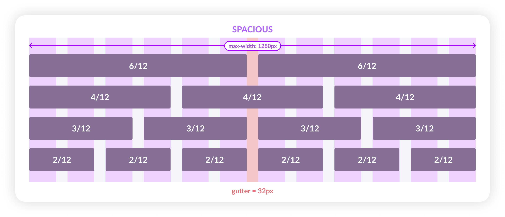

# Title of the RFC <!-- omit in toc -->

### Table Of Contents <!-- omit in toc -->
- [Summary](#summary)
- [Basic Example](#basic-example)
- [Motivation](#motivation)
- [Detailed Design](#detailed-design)
- [Drawbacks/Constraints](#drawbacksconstraints)
- [Alternatives](#alternatives)
- [Adoption strategy](#adoption-strategy)
- [How do we educate people?](#how-do-we-educate-people)
- [Open Questions](#open-questions)
- [References](#references)

# Summary
**Spatial System** is a system with a set of rules and principles on how to measure `size` & `spacing` of your UI elements. Spacing is important, generally which is overlooked as a part of the visual design.

# Motivation
### **Why do we need a spatial system?**
Without space none of your elements get seen, instead they become noise. There is a great relationship that exsist between space and elements. By controlling and shaping space in our designs, we create rhythm, direction, & motion.

Uniformity in spacing & sizing doesn't only allows the product to look more consistent but it also helps designers and developers to communicate better & reduce number of decisions a designer has to make on daily-basis.

There are so many inconsistencies which we see in the current UI, here are a few examples:

### **Expected Outcome**
Due to these inconsistencies the users using our product can get a feeling of untrustworthy, cheap design, & inconsistency. When everything looks aligned it creates a visual rhythm which in turns look pleasing and something our users expect from a brand like us especially in the fintech space.

To avoid this, we need to build a flexible **spatial system** that can drive minor everyday decisions and make our designs looks consistent, organised & pleasing to our users eyes.

# Detailed Design
### **Space ≠ Grid**
Industry generally considers space as grids, but these two are different things. Spaces are used to make grids (i.e. grids/containers/etc. are built using spaces).

### **8pt grid system**
Before diving into the **8pt grid system** we need to consider few things where this spatial system will be used. We'll use this in overall layout for `components` (molecules, organisms, templates) as well as on the `typography`.

>**📝Note:** This system will used across mobiles, tablets & desktops.

### **But why 8pt grid?**
There is no right or wrong answer here, but there are few reasons for choosing 8pt over all others (`5pt`, `6pt`, `7pt`...)
- It scales perfectly in all type of screen displays, be it Android or iOS (`@0.75` or `@1.5`).
- Apple & Google advice to use the same, without stating too many reasons though.
- It's simple for us to do the math. The `4` & `8` are simpler to calculate and they are flexible enough to setup a scale.

### **Base Unit**
We'll start with the base unit, this will allow us to create a scale of all the sizes in your spatial system. For us this also means using multiples of `x8` to define dimensions, padding, and margin of elements.

### **What system will work for Razorpay?**
We should consider few cases that will make the system flexible for us. Few things to consider here are the **user needs**.

As a merchant (user) do they want the interface to be spacious with large fonts and limited number of actions? Absolutely not, we need something that doesn't look *too-dense* or *too-spacious*. Therefore we'll consider **`4pt base unit`** which will give us the flexibility to scale the UI in multiples of `x4`.

We also need to focus on the number of variables we'll have in our scale. These are the variables/tokens developers will use to while defining a grid layout.

### **How to apply a spatial system?**
Applying a system can come in the form of `padding`, `margins`, `width` & `height`. So there are two things we can control here *main sizing* & *internal element sizing*.

- **Element-first (strict element sizing):** In this type the size takes the priority. For examples *buttons*, *form inputs*, *etc*.

- **Content first (strict internal padding):** This is to be used when the content is dynamic or less predictable. Therefore, we will enforce the strict internal padding to those components. Simply put, this is the spacing around the elements.

### **Grids**
The grid system helps align page elements based on sequenced columns and rows. Basically it helps you arrange your structure into structured manner. Here we'll look into 2D organisation of information.

### **Column Grid**
As the name suggests, this type of grid will help you organise content into evenly spaced vertical columns. The spacer which divide this grid is called as `gutter`. We'll use a **12 column grid** as it helps divide the area into *halfs*, *thirds*, *fourths*, *sixths*.

Here we'll have 3 types of column grids, these will be used depending on the use case.
1. **Default:** This has a gutter of `32px` & will be used on the internal dashboard.

2. **Condensed:** This has a gutter of `16px` & will be used on mobile layouts.

3. **Spacious:** This has a gutter of `48px` & will be used for landing/marketing pages.

These column grids can also be used internally based on the what component we are building. For example, let's say we are building inline form, then we'll use condensed col-grid for organising elements.

### **Spatial Scale**
Our spatial scale would look like this:
| Alias      | Value |
|------------|-------|
| $spacer-0  | 0px   |
| $spacer-1  | 4px   |
| $spacer-2  | 8px   |
| $spacer-3  | 12px  |
| $spacer-4  | 16px  |
| $spacer-5  | 20px  |
| $spacer-6  | 24px  |
| $spacer-7  | 32px  |
| $spacer-8  | 40px  |
| $spacer-9  | 48px  |
| $spacer-10 | 56px  |

# Drawbacks/Constraints
Why should we *not* do this? Maybe try to consider the following constraints
- Implementation cost, both in terms of code size and complexity.
- The impact of it on new as well as existing consumer projects.
- Cost of migration.

There are tradeoffs to choosing any path. Attempt to identify them here.

# Alternatives
What other designs/patterns/strategies have been considered?

# Adoption strategy
If we implement this proposal, how will existing consumer projects adopt it? 
- Is this a breaking change? 
- Can we write a codemod?
- How do we prioritise this with business and product folks?
- How do we communicate with other teams? Will updating docs suffice or do we need a dedicated interaction with them?

# How do we educate people?
- How should this be taught to other folks?
- What names and terminology work best for these concepts and why? 
- How is this idea best presented?

# Open Questions
- Any open questions that you have?
- Any undiscovered areas that you have encountered?
- Any dependencies on other teams(Design/Engineering) that needs to be resolved upfront?

# References
Any references that you can share for those who are curious to understand anything beyond the scope of this RFC in general but related to the topic of this RFC.

