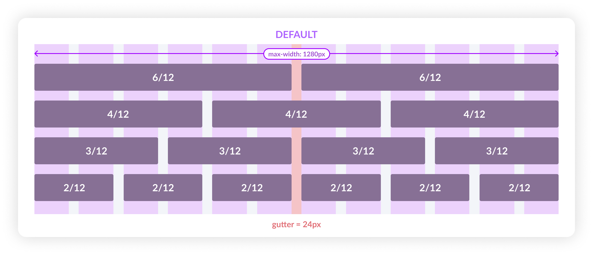
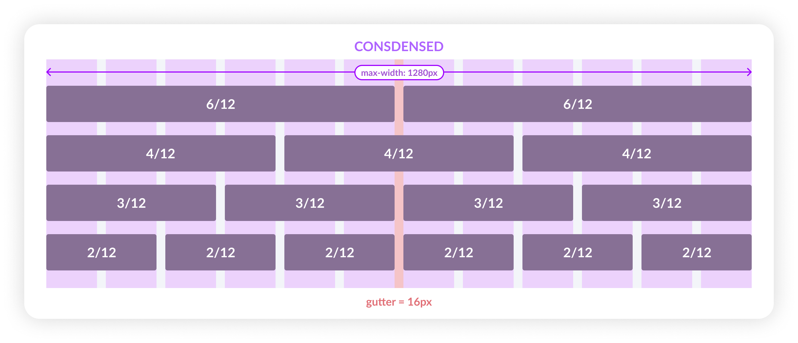

# Spatial System <!-- omit in toc -->

### Table Of Contents <!-- omit in toc -->
- [Summary](#summary)
- [Motivation](#motivation)
  - [Why do we need a spatial system?](#why-do-we-need-a-spatial-system)
  - [Expected Outcome](#expected-outcome)
- [Detailed Design](#detailed-design)
  - [Space ≠ Grid](#space--grid)
  - [8pt Grid System](#8pt-grid-system)
  - [But Why 8pt Grid?](#but-why-8pt-grid)
  - [Base Unit](#base-unit)
  - [What system will work for Razorpay?](#what-system-will-work-for-razorpay)
  - [How to apply a spatial system?](#how-to-apply-a-spatial-system)
  - [Grids](#grids)
  - [Column Grid](#column-grid)
  - [Spatial Scale](#spatial-scale)
- [Drawbacks/Constraints](#drawbacksconstraints)
- [Alternatives](#alternatives)
- [Adoption strategy](#adoption-strategy)
- [How do we educate people?](#how-do-we-educate-people)
- [Open Questions](#open-questions)
- [References](#references)

# Summary
**Spatial System** is a system with a set of rules and principles on how to measure `size` & `spacing` of your UI elements. Spacing is important, generally which is overlooked as a part of the visual design.

# Motivation
### **Why do we need a spatial system?**
Without space none of your elements get seen, instead they become noise. There is a great relationship that exsist between space and elements. By controlling and shaping space in our designs, we create rhythm, direction, & motion.

Uniformity in spacing & sizing doesn't only allows the product to look more consistent but it also helps designers and developers to communicate better & reduce number of decisions a designer has to make on daily-basis.

There are so many inconsistencies which we see in the current UI, here are a few examples:

### **Expected Outcome**
Due to these inconsistencies the users using our product can get a feeling of untrustworthy, cheap design, & inconsistency. When everything looks aligned it creates a visual rhythm which in turns look pleasing and something our users expect from a brand like us especially in the fintech space.

To avoid this, we need to build a flexible **spatial system** that can drive minor everyday decisions and make our designs looks consistent, organised & pleasing to our users eyes.

# Detailed Design
### **Space ≠ Grid**
Industry generally considers space as grids, but these two are different things. Spaces are used to make grids (i.e. grids/containers/etc. are built using spaces).

### **8pt grid system**
Before diving into the **8pt grid system** we need to consider few things where this spatial system will be used. We'll use this in overall layout for `components` (molecules, organisms, templates) as well as on the `typography`.

>**📝Note:** This system will used across mobiles, tablets & desktops.

### **But why 8pt grid?**
There is no right or wrong answer here, but there are few reasons for choosing 8pt over all others (`5pt`, `6pt`, `7pt`...)
- It scales perfectly in all type of screen displays, be it Android or iOS (`@0.75` or `@1.5`).
- Apple & Google advice to use the same, without stating too many reasons though.
- It's simple for us to do the math. The `4` & `8` are simpler to calculate and they are flexible enough to setup a scale.

### **Base Unit**
We'll start with the base unit, this will allow us to create a scale of all the sizes in your spatial system. For us this also means using multiples of `x8` to define dimensions, padding, and margin of elements.

### **What system will work for Razorpay?**
We should consider few cases that will make the system flexible for us. Few things to consider here are the **user needs**.

As a merchant (user) do they want the interface to be spacious with large fonts and limited number of actions? Absolutely not, we need something that doesn't look *too-dense* or *too-spacious*. Therefore we'll consider **`4pt base unit`** which will give us the flexibility to scale the UI in multiples of `x4`.

We also need to focus on the number of variables we'll have in our scale. These are the variables/tokens developers will use to while defining a grid layout.

### **How to apply a spatial system?**
Applying a system can come in the form of `padding`, `margins`, `width` & `height`. So there are two things we can control here *main sizing* & *internal element sizing*.

- **Element-first (strict element sizing):** In this type the size takes the priority. For examples *buttons*, *form inputs*, *etc*.

- **Content first (strict internal padding):** This is to be used when the content is dynamic or less predictable. Therefore, we will enforce the strict internal padding to those components. Simply put, this is the spacing around the elements.

### **Grids**
The grid system helps align page elements based on sequenced columns and rows. Basically it helps you arrange your structure into structured manner. Here we'll look into 2D organisation of information.

### **Column Grid**
As the name suggests, this type of grid will help you organise content into evenly spaced vertical columns. The spacer which divide this grid is called as `gutter`. We'll use a **12 column grid** as it helps divide the area into *halfs*, *thirds*, *fourths*, *sixths*.

Here we'll have 3 types of column grids, these will be used depending on the use case.
1. **Default:** This has a gutter of `32px` & will be used on the internal dashboard.

2. **Condensed:** This has a gutter of `16px` & will be used on mobile layouts.

3. **Spacious:** This has a gutter of `48px` & will be used for landing/marketing pages.

These column grids can also be used internally based on the what component we are building. For example, let's say we are building inline form, then we'll use condensed col-grid for organising elements.

### **Spatial Scale**
We'll follow a **8pt** linear scale for the elements with the **4pt** half-step for spacing smaller content (icons, etc.) and typography (line-heights).

This is how the scale will look like:

| Alias      | Value |
|------------|-------|
| $spacer-0  | 0px   |
| $spacer-1  | 4px   |
| $spacer-2  | 8px   |
| $spacer-3  | 12px  |
| $spacer-4  | 16px  |
| $spacer-5  | 20px  |
| $spacer-6  | 24px  |
| $spacer-7  | 32px  |
| $spacer-8  | 40px  |
| $spacer-9  | 48px  |
| $spacer-10 | 56px  |

>These are mixed values, it contains multiple of 4 as well as 8.

# Drawbacks/Constraints
There are no major drawbacks here,
- We need to make sure that all the spacing between the elements should not be hardcoded. They should use the spatial tokens whenever required.
- We might find few screens where it is difficult to organise the spacing. For example, iPhone 6 (`375x667`). For such scenarios we don't need to break the pixels, instead we need to keep the margins & paddings consistent. It's ok to have oodly-sized layout which keeps the grid consistent. Although, no user will likely see the actual measurements here.

# Alternatives
There are many other spatial systems we might have considered, such as **5pt grid**, **6pt grid**. But we are not using them because of already mentioned reason,
- With odd numbers like 5, it is hard to align things to center as the outcome will result in fraction values that will split the pixels. This can also result in blurry pixel.
- Similarly the scaling will also not work properly while scaling on mobile/tablets, which will again result into pixel blurriness.

# Adoption strategy
Spatial scale needs to be implemented as a core part of the DS in terms of the tokens which will automatically derive the adoption.
- Implement the [spatial scale](#spatial-scale) (as tokens).
- Implement the 3 types of [column-grid](#column-grid) structure using the same spatial scale.
- Make sure all the components are using the same spatial scale tokens while building them.

# How do we educate people?
Both **designers** & **developers** need to be educated.
- Designers should always use the spatial (multiple of 4pt) scale while working on any layout.
- Similarly, developers should always use the spatial tokens while defining the space between the adjacent elements inside the UI which should not be a problem as it is coming from a designer.

# Open Questions
- We can name the tokens in a better way, just like how we have did for colors.
- We already have static tokens (i.e. which works for both desktops & mobiles) in place, should be need dynamic tokens that changes with the device?

# References
- [Space in Design Systems](https://medium.com/eightshapes-llc/space-in-design-systems-188bcbae0d62) by *Nathan Curtis*
- [The 8pt Grid](https://spec.fm/specifics/8-pt-grid) by *spec[dot]fm*
- [How to create stronger layout with 8pt grid](https://marcandrew.me/how-to-create-stronger-layouts-with-the-8pt-grid/) by *Marc Andrew*
- [Spacing in Carbon Design System](https://www.carbondesignsystem.com/guidelines/spacing/overview/) by *IBM*
- [Global Tokens](https://spectrum.adobe.com/page/design-tokens/#Size-tokens) by *Adobe Spectrum*