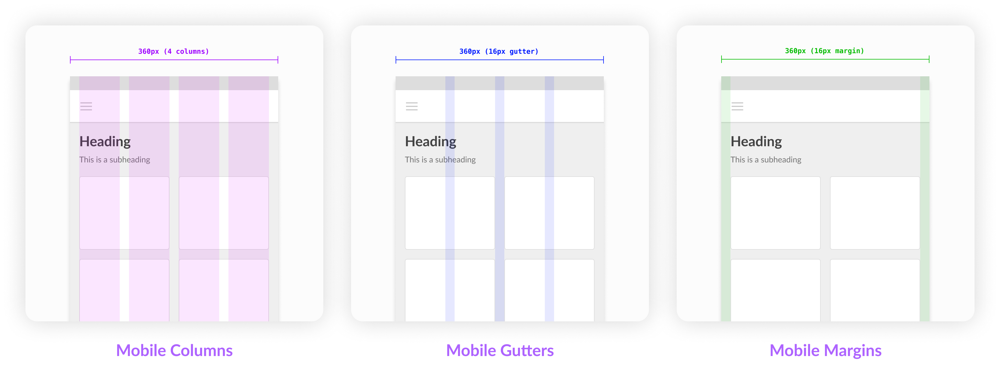
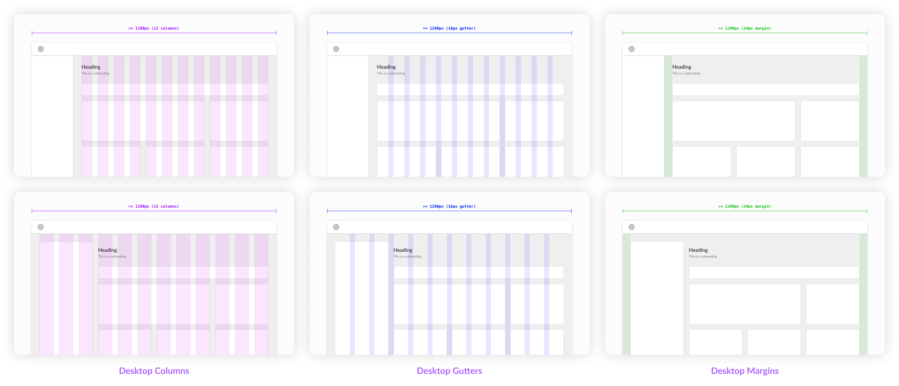

# Spatial System <!-- omit in toc -->

### Table Of Contents <!-- omit in toc -->
- [Summary](#summary)
- [Motivation](#motivation)
  - [Why do we need a spatial system?](#why-do-we-need-a-spatial-system)
  - [Expected Outcome](#expected-outcome)
- [Detailed Design](#detailed-design)
  - [The Box Model](#the-box-model)
  - [What is a pt?](#what-is-a-pt)
  - [Space ≠ Grid](#space--grid)
  - [8pt Grid System](#8pt-grid-system)
  - [But Why 8pt Grid?](#but-why-8pt-grid)
  - [Base Unit](#base-unit)
  - [What system will work for Razorpay?](#what-system-will-work-for-razorpay)
  - [How to apply a spatial system?](#how-to-apply-a-spatial-system)
  - [Spatial Scale](#spatial-scale)
  - [Grids](#grids)
  - [Column Grid](#column-grid)
  - [Columns, Gutters and Margins](#columns-gutters-and-margins)
- [Drawbacks/Constraints](#drawbacksconstraints)
  - [Type of Grid Usage](#type-of-grid-usage)
  - [Multi-platform Design](#multi-platform-design)
- [Alternatives](#alternatives)
- [Adoption strategy](#adoption-strategy)
- [How do we educate people?](#how-do-we-educate-people)
- [Open Questions](#open-questions)
- [References](#references)

# Summary
**Spatial System** is a system with a set of rules and principles on how to measure `size` & `spacing` of your UI elements. Spacing is important, generally which is overlooked as a part of the visual design.

# Motivation
### **Why do we need a spatial system?**
Without space none of your elements get seen, instead they become noise. There is a great relationship that exsist between space and elements. By controlling and shaping space in our designs, we create rhythm, direction, & motion.

Uniformity in spacing & sizing doesn't only allows the product to look more consistent but it also helps designers and developers to communicate better & reduce number of decisions a designer has to make on daily-basis.

There are so many inconsistencies which we see in the current UI, here are a few examples:


### **Expected Outcome**
Due to these inconsistencies the users using our product can get a feeling of untrustworthyness & inconsist design. When everything looks aligned it creates a visual rhythm which in turns look pleasing and something our users expect from a brand like us especially in the fintech space.

To avoid this, we need to build a flexible **spatial system** that can drive minor everyday decisions and make our designs looks consistent, organised & pleasing to our users eyes.

# Detailed Design
### **The Box Model**
A box-model is a representation of element's dimensions and spacing. It consists of four things *content (element)*, *padding*, *border*, & *margin*.

1. **Content:** The main element of the box that may contain text & images.

2. **Padding:** An area around the content's border and its child elements.

3. **Border:** A stroke/line that goes around the padding & content.

4. **Margin:** An area around the content's border and it's neighbouring element.


### **What is a pt?**
A point (`pt`) is a measurement of space that is dependent on screen resolution. Simply put, at a `1x` resolution (or `@1x`). That is,
```
1pt = 1px
```
>**📝Note:** It is always recommended to design in **`1x`** and then exporting your assets to different sizes (`@2x`, `@3x`, etc.) depending upon the use case.

### **Space ≠ Grid**
Industry generally considers space as grids, but these two are different things. Spaces are used to make grids (i.e. grids/containers/etc. are built using spaces).

### **8pt grid system**
Before diving into the **8pt grid system** we need to consider few things where this spatial system will be used. We'll use this in overall layout for `components` (molecules, organisms, templates) as well as on the `typography`.

>**📝Note:** This system will used across mobiles, tablets & desktops.

### **But why 8pt grid?**
There is no right or wrong answer here, but there are few reasons for choosing 8pt over all others (`5pt`, `6pt`, `7pt`...)
- It scales perfectly in all type of screen displays, be it Android or iOS (`@0.75` or `@1.5`).
- Apple & Google advice to use the same, without stating too many reasons though.
- It's simple for us to do the math. The `4` & `8` are simpler to calculate and they are flexible enough to setup a scale.

### **Base Unit**
We'll start with the base unit, this will allow us to create a scale of all the sizes in your spatial system. For us this also means using multiples of `x8` to define dimensions, **padding**, and **margin** of elements. But for our use-case multiple of `x8` won't work, as multiples of 8 can go too high (prctically) to work at a system-level.

### **What system will work for Razorpay?**
We should consider few cases that will make the system flexible for us. Few things to consider here are the **user needs**.

As a merchant (user) do they want the interface to be spacious with large fonts and limited number of actions? Absolutely not, we need something that doesn't look *too-dense* or *too-spacious*. Therefore we'll consider **`4pt base unit`** which will give us the flexibility to scale the UI in multiples of `x4`.

We also need to focus on the number of variables we'll have in our scale. These are the variables/tokens developers will use to while defining a grid layout.

### **How to apply a spatial system?**
Applying a system can come in the form of `padding`, `margins`, `width` & `height`. So there are two things we can control here *main sizing* & *internal element sizing*.

- **Element-first (strict element sizing):** In this type the size takes the priority. For examples *buttons*, *form inputs*, *etc*.


- **Content first (strict internal padding):** This is to be used when the content is dynamic or less predictable. Therefore, we will enforce the strict internal padding to those components. Simply put, this is the spacing around the elements.


### **Spatial Scale**
We'll follow a **8pt** linear scale for the elements with the **4pt** half-step for spacing smaller content (icons, etc.) and typography (line-heights).

This is how the scale will look like:

| Alias      | Value |
|------------|-------|
| spacing-0  | 0px   |
| spacing-1  | 4px   |
| spacing-2  | 8px   |
| spacing-3  | 12px  |
| spacing-4  | 16px  |
| spacing-5  | 20px  |
| spacing-6  | 24px  |
| spacing-7  | 32px  |
| spacing-8  | 40px  |
| spacing-9  | 48px  |
| spacing-10 | 56px  |

>These are mixed values, it contains multiple of `4` as well as `8`.

### **Grids**
The grid system helps align page elements based on sequenced columns and rows. Basically it helps you arrange your structure into structured manner. Here we'll look into 2D organisation of information.

### **Column Grid**
As the name suggests, this type of grid will help you organise content into evenly spaced vertical columns. The spacer which divide this grid is called as `gutter`. We'll use a **12 column grid** as it helps divide the area into *halfs*, *thirds*, *fourths*, *sixths*.

Here we'll have 3 types of column grids, these will be used depending on the use case. All of them are following the same maximum width of `1280px` and can be variable depending upon the screen size. Also, we are not considering margins in the below grid system to make it simpler.
1. **Default:** This has a gutter of `24px` & will be used on the internal dashboard for spacing the main layout containers. For example, dividing sidebars from the main content view.


2. **Condensed:** This has a gutter of `16px` & will be used on the internal dashboards ( mostly on mobile layouts) and can also be used inside component-level elements. For example, in-between the elements of a form.


3. **Spacious:** This has a gutter of `32px` & will be used for landing/marketing pages *(on desktop)* which helps in better and clean representation of information.


> **📝 Note:** These column grids can also be used internally based on the what component we are building. For example, let's say we are building inline form, then we'll use condensed col-grid for organising elements.

### **Marketing Pages**
For marketing pages, the UI is more spacious. Therefore, we can go ahead and use the **spacious system** (gutter of `48px`) and on mobiles the same system will be converterd to a default system (gutter of `24px`).
### **Columns, Gutters and Margins**
A place where the content is placed inside a layout. These vary depending on the screen size or device you are designing on. Here are few examples,

- **Mobile Layout**


- **Tablet Layout**


- **Desktop Layout**


# Drawbacks/Constraints
### **Type of Grid Usage**
Grids can be used in two ways,

- **Hard Grid:** In this type, everything snaps into a `8x8` grid and typography sits on a `baseline`. This sounds ideal but while implementing on the development side it create several issues which end up into the spacing between elements that is not divisible by 4 or 8.

- **Soft Grid:** Here everything still follows the 8-pt grid but we remove the baseline and horizontal grid line to a strict `8x8` grid. This creates a uniform spacing between elements which is always divisible by 4 or 8 which also helps developers on the implementation side.
### **Multi-platform design**
Also, we might find few screens where it is difficult to organise the spacing. For example, iPhone 6 (`375x667`). For such scenarios we don't need to break the pixels, instead we need to keep the margins & paddings consistent. It's ok to have oddly sized layout which keeps the grid consistent. Although, no user will likely see the actual measurements here.


>**📝 Note:** We'll use the **Soft Grid** across all our products.

### **Drawbacks**
There are no major drawbacks as such, although we need to make sure that all the spacing between the elements should not be hardcoded. They should use the spatial tokens whenever required.

# Alternatives
There are many other spatial systems we might have considered, such as **5pt grid**, **6pt grid**. But we are not using them because of already mentioned reason,
- With odd numbers like 5, it is hard to align things to center as the outcome will result in fraction values that will split the pixels. This can also result in blurry pixel.
- Similarly the scaling will also not work properly while scaling on mobile/tablets, which will again result into pixel blurriness.

# Adoption strategy
Spatial scale needs to be implemented as a core part of the DS in terms of the tokens which will automatically derive the adoption.
- Implement the [spatial scale](#spatial-scale) (as tokens).
- Implement the 3 types of [column-grid](#column-grid) structure using the same spatial scale.
- Make sure all the **components** are using the same spatial scale tokens while building them.
- Every **product icon** is being made using the same spatial system canvas as defined inside Figma.
- The `line-height` for **typography** should follow the same spatial system (of 8-pt grid) so that it aligns well with each other.

# How do we educate people?
Both **designers** & **developers** need to be educated.
- Designers should always use the spatial (multiple of 4pt) scale while working on any layout.
- Similarly, developers should always use the spatial tokens while defining the space between the adjacent elements inside the UI which should not be a problem as it is coming from a designer.

# Open Questions
- *We can name the tokens in a better way, just like how we have did for colors.*
  - This has already been considered and as we are only mapping spatial scales as of now. We are going with `spacing` for now which is more direct and self-explanatory.
- *We already have static tokens (i.e. which works for both desktops & mobiles) in place, should be need dynamic tokens that changes with the device?*
  - We don't need dynamic sizing of tokens. Scaling happens according to device size. Going forwards we are opting for adaptive layout and dynamic scaling doesn't help in any way for that.
- *Scaling System for Emails*
  - We haven't think of a system for mailer till yet. But that will also fall under the same 8pt grid system. Not investing on that as of now. Once we are there, will pick this up.

# References
- [Space in Design Systems](https://medium.com/eightshapes-llc/space-in-design-systems-188bcbae0d62) by *Nathan Curtis*
- [The 8pt Grid](https://spec.fm/specifics/8-pt-grid) by *spec[dot]fm*
- [Hard and Soft 8 Point Grids](https://www.youtube.com/watch?v=aPwwv-6pRWY) by *Christopher Deane (Youtube Video)*
- [How to create stronger layout with 8pt grid](https://marcandrew.me/how-to-create-stronger-layouts-with-the-8pt-grid/) by *Marc Andrew*
- [Spacing in Carbon Design System](https://www.carbondesignsystem.com/guidelines/spacing/overview/) by *IBM*
- [Global Tokens](https://spectrum.adobe.com/page/design-tokens/#Size-tokens) by *Adobe Spectrum*