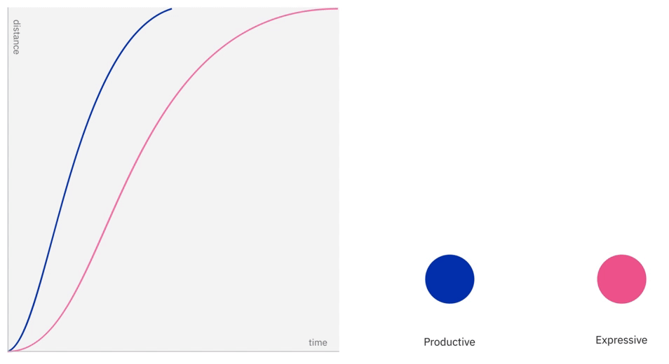
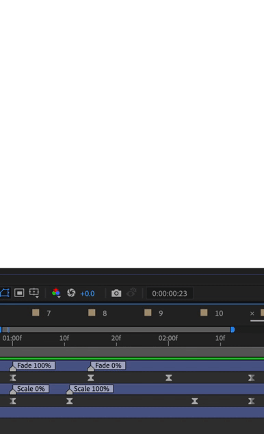
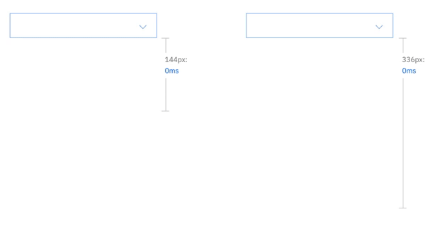
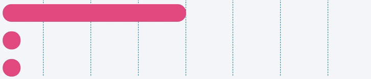
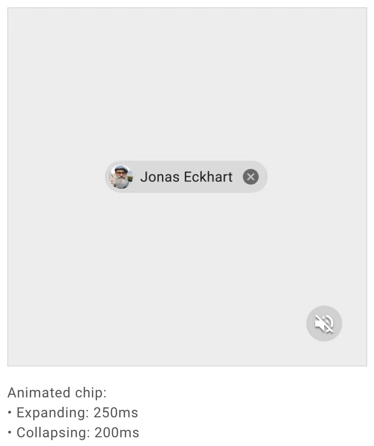
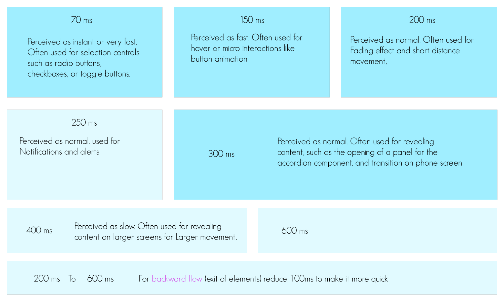
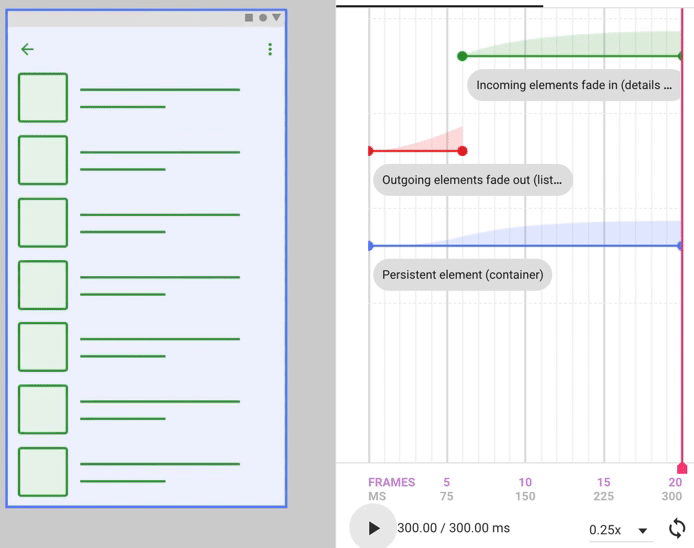

# Duration - Motion Design <!-- omit in toc -->

### Table Of Contents <!-- omit in toc -->
- [Summary](#summary)
- [Basic Example](#basic-example)
- [Motivation](#motivation)
- [Detailed Design](#detailed-design)
- [Drawbacks/Constraints](#drawbacksconstraints)
- [Alternatives](#alternatives)
- [Adoption Strategy](#adoption-strategy)
- [Open Questions](#open-questions)
- [References](#references)

# Summary
Duration is the time taken to complete any transition, interaction and animation. We need to make sure it scales slow/fast depending on various factors i.e.
- Size
- Distance
- Easing style
- Core actions
- Forward/Backward Flow

# Basic Example
Time taken by a card opening and closing transition. i.e. 300ms and 250ms

# Motivation
### Why are we doing this?
Duration is one of the elements of motion (out of 3 core actions, easing).

1. For consistency and branding, we need to define what kind of actions we can use within an animation in our products. Defining these properties will help us in guiding the designers and communicating with the developers. Also, developers can optimize performance by using correct properties if these core actions are pre-defined.
2. Assigning a static duration to all the elements can affect the brand's feel & seamless behavior. Instead, the duration should depend upon the screen size, scaling & positioning of the UI elements which are present on the screen and the timing increases or decreases with some logic in place.

### What is the expected outcome?
We shall be able to answer following questions as a conclusion to this RFC
1. What durations we'll be using for any motion?
2. How will we ensure accessibility in terms of motion?
3. How all duration dependencies will relate to each other in order to render the animation on a particular platform in a generic way without making motion too fast or too slow.
4. How/where we will store the different durations as design tokens?

# Detailed Design
## Duration dependencies
Duration is dependent on the following factors:
1. Easing Style
2. Core Action
3. Size of element 
4. Effective displacement 
5. Flow Direction

#### Let's discuss in details:
1. **Easing style:** Depending on easing type duration should also vary. For effective easing, duration is less than for Revealing easing. (Ref: [Carbon Easing styles](https://www.carbondesignsystem.com/guidelines/motion/overview/#style))
blur represent Effective, red represents revealing. 
 

2. **Core actions (link it to the core-action-rfc) (move, fill, scale, morph, fade):** Depending on the type of movement duration should also vary. 
For ex- Fade requires more attention than scale, so to maintain a seamless experience on a particular element. Fade should have a larger duration as compared to scale. 
 

3. **Size of element:** Depending on size, duration should vary most of the time. For bigger elements, it takes more time to scale down. 
 

4. **Effective displacement:** Depending on [Distance]:[Effective Size] ratio, Larger distance should take a larger time to move (2 Circle in ex), Larger elements take lesser time to reach a position than smaller elements (Rectangle moves 4 blocks and circle moves 2 blocks). 
For lower ration-> less time   

5. **Flow Direction:** Depending on size, duration should vary most of the time. For bigger elements, it takes more time to scale down.   

## Approach

1. **Step duration:** For easier and quick implementation, we will be defining a few tokens of durations.
After researching various Design systems and exploring them on UI elements i.e toggle, card hover, Page transitions. We defined these Duration values. 

2. **Auto duration:** Motion’s duration should be dynamic based on different dependencies. For example: the larger the change in distance (traveled) or size (scaling) of the element, the longer the animation takes. For that, we need to build a relation between all the above 5 dependencies and make duration dynamic. For ex: A relationship that I am trying to build. I tried to use If/else statement and a range of duration, so that by using this logic and relation one can get a duration to use.   

### **Accessibility**
* For [reduced Motion](https://www.smashingmagazine.com/2020/09/design-reduced-motion-sensitivities/) (for motion sensitivities) - We can use relatively longer durations.

# Drawbacks/Constraints
1. In this, we didn’t consider animation of Icons, Loaders and Typography.
* Icons and loaders will have a library and designers will not be creating these occasionally, that’s why we didn’t include rotation property in core actions.
* Special animations related to typography is rare and will be covered separately, **Ex:** appearing of letters one by one. Otherwise, typeface can be considered as UI element only and can have properties like fade, etc.
2. These Durations are for [Non-real time interactions](https://images.squarespace-cdn.com/content/v1/546aeb13e4b06c7939161700/1491323190291-Y65KBIBB8LIX00JJFLVZ/image-asset.gif?format=1500w), As [real-time interaction](https://images.squarespace-cdn.com/content/v1/546aeb13e4b06c7939161700/1491323167574-FMS8AP2Z9CZ3E6F51O1Y/image-asset.gif?format=1500w) is directly related to user’s behavior/gestures on the interface and depending on how user is interacting with the interface can lead to different durations. For ex: Scroll (user can scroll quickly and slowly)

3. These Durations are the total time taken in transition or interaction but a transition is built by multiple small elements animation and those small animation’s durations are variable. There is no way to define those small animation’s durations for now. it comes by hit and trial method what suits best in a transition, although in a transition disappearing UI part should have less duration ex.0.4T(red)  and appearing part should have a larger part ex: 0.6T (green) out of total duration part i.e. T and UI elements which don't disappear have duration T(blue). [calling it Sub-duration]  

# Alternatives
1. [For Real-time interaction](https://images.squarespace-cdn.com/content/v1/546aeb13e4b06c7939161700/1491323167574-FMS8AP2Z9CZ3E6F51O1Y/image-asset.gif?format=1500w), the duration depends on the gesture strength, For ex: if user scroll quickly elements moves quickly where duration is less. Delay or smoothing in these interactions will increase the duration interval.
2. Peak Movement: within a transition, when most of the UI elements have the largest movement/speed, called peak movement. This moment of peak movement can help us decide sub-duration. (For fade core action, [check out peak velocity](https://material.io/design/motion/choreography.html#sequencing))

# Adoption strategy
 **For developers** 
-  Implement step duration tokens
- All these decisions shouldn't matter, as this will be stored in our tokens as an abstraction. The end consumers will just use the tokens for their purpose and not the actual values. **Exampe:** `bladeMotionSpeedSlow: 200ms`
- Build a relation between dependencies and figure out the auto duration function.
- Developers use the dynamic/Auto duration function to get the duration of the element.
- Migration of existing projects is out of the scope of this RFC since that will be a breaking change.

**For designers** 
- We can develop a tool for Figma which can help designers choose animation presets. Although, these should be baked inside the components itself.
- Ex: animation presets in this tool [jitter.video](https://jitter.video/)

# Open Questions
1. How can we generalize the peak movement for different transitions and interactions?
2. How can we build relation between all thses denpendencies?
3. How can we help designers choose these animation tokens on Figma. Is it possible, or should we look for some other tool?

# References
* [Motion design system ](https://design-system.pluralsight.com/core/motion) *by Pluralsight*
* [Motion tool](https://ibm.github.io/motion/) *by IBM*
* [Carbon design system](https://www.carbondesignsystem.com/guidelines/motion/overview/#duration) *by IBM*
* [Duration funtion](https://github.com/IBM/motion/blob/master/dist/getDuration.js) *by IBM*
* [Material design system](https://material.io/design/motion/speed.html#duration) *by Google*
* [Peak velocity](https://material.io/design/motion/choreography.html#sequencing) *by Google*
* [Design for reduced motion sensitivities](https://www.smashingmagazine.com/2020/09/design-reduced-motion-sensitivities/) *by Smashing Magazine*
