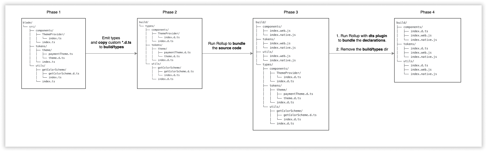

# 🛳 Shipping Blade <!-- omit in toc -->

### Table Of Contents <!-- omit in toc -->
- [Summary](#summary)
- [Basic Example](#basic-example)
- [Motivation](#motivation)
- [Detailed Design](#detailed-design)
  - [What do we want to actually ship?](#what-do-we-want-to-actually-ship)
  - [How will the consumers import things from blade?](#how-will-the-consumers-import-things-from-blade)
    - [1. `import` individual components](#1-import-individual-components)
      - [Pros](#pros)
      - [Cons](#cons)
    - [2. `import` everything from root package](#2-import-everything-from-root-package)
      - [Pros](#pros-1)
      - [Cons](#cons-1)
    - [3. `import` from each category(components, tokens,types, utils) from root package](#3-import-from-each-categorycomponents-tokenstypes-utils-from-root-package)
      - [Pros](#pros-2)
      - [Cons](#cons-2)
    - [4. `import` named components from each category(components, tokens,types, utils) from root package](#4-import-named-components-from-each-categorycomponents-tokenstypes-utils-from-root-package)
      - [Pros](#pros-3)
      - [Cons](#cons-3)
    - [Which approach we'll take?](#which-approach-well-take)
  - [What strategy to take for packaging?](#what-strategy-to-take-for-packaging)
    - [1. Multi-package](#1-multi-package)
    - [2. Mono-package](#2-mono-package)
    - [Conclusion](#conclusion)
  - [How to package?](#how-to-package)
    - [Shall we Transpile(using babel)?](#shall-we-transpileusing-babel)
    - [Shall we Bundle(using rollup/similar tools)?](#shall-we-bundleusing-rollupsimilar-tools)
    - [Difference between library authors doing tree shaking vs consumer apps doing tree shaking.](#difference-between-library-authors-doing-tree-shaking-vs-consumer-apps-doing-tree-shaking)
      - [Library authors doing tree shaking](#library-authors-doing-tree-shaking)
      - [Consumer apps doing tree shaking](#consumer-apps-doing-tree-shaking)
    - [Conclusion](#conclusion-1)
  - [What module system to target?](#what-module-system-to-target)
    - [CommonJS(a.k.a cjs)](#commonjsaka-cjs)
    - [ES Modules(a.k.a esm)](#es-modulesaka-esm)
    - [Conclusion](#conclusion-2)
  - [Package consumption information in `package.json`](#package-consumption-information-in-packagejson)
    - [`exports` map field](#exports-map-field)
    - [`main`, `module`, `browser`, `react-native` fields in `package.json`](#main-module-browser-react-native-fields-in-packagejson)
    - [Conclusion](#conclusion-3)
  - [Generating TS types for consumers](#generating-ts-types-for-consumers)
    - [Phase 1](#phase-1)
    - [Phase 2](#phase-2)
    - [Phase 3](#phase-3)
    - [Phase 4](#phase-4)
    - [In a nutshell](#in-a-nutshell)
- [Drawbacks/Constraints](#drawbacksconstraints)
- [Alternatives](#alternatives)
- [Adoption strategy](#adoption-strategy)
- [Open Questions](#open-questions)
- [References](#references)

# Summary

We can't ship the raw code to the consumers so we need to ship/publish blade. But to make it publishable there are certain things we need to keep in mind and answer relevant questions.

# Basic Example
We should be able to install and use blade in our code without any overhead.
```js
import { Button, Text } from '@razorpay/blade/components'
import { overrideTheme, paymentTheme } from '@razorpay/blade/theme'
import { getColorScheme, useColorScheme } from '@razorpay/blade/utils'
```

# Motivation
- We can't ship raw source code to our consumers since we are not aware about the build tool chains they use, what config do they support.
- We need to prevent access to certain parts of the codebase. There might be certain files/functionality which are just used for internal purpose and we don't want to expose them to our consumers. So we want to publish few things and not publish few.

In the end we should be able to ship the code in such a way that:
* It doesn't increases the bundle size of our consumer apps.
* There's no compilation issue on their end.
* We restrict them to only use what is useful for them and hide away unnecessary underlying details.

# Detailed Design
This problem has multiple pieces to it and in order to come up with a solution I have tried to break it down into questions that we must ask to ourselves and then conclude every question.

Here's the visual representation for decision making of bundling. 
> You can look at the actual source [file of the diagram here](https://drive.google.com/file/d/1AM0ryQCXMbfP4z2PUWpt86KUU5iE8rvR/view?usp=sharing) if you can't see things properly in attached image


## What do we want to actually ship?
* components
* tokens/themes(need to decide on the naming)
* types
* utils

## How will the consumers import things from blade?
There are multiple ways that consumers can import components, themes, types, utils from blade. Let's look into it one by one

### 1. `import` individual components
```js
/* multi-package */
import Button from '@razorpay-blade/Button' 
import Text from '@razorpay-blade/Text'
import overrideTheme from '@razorpay-blade/overrideTheme'
import paymentTheme from '@razorpay-blade/paymentTheme'
import getColorScheme from '@razorpay-blade/getColorScheme'
import useColorScheme from '@razorpay-blade/useColorScheme'
```

#### Pros
As maintainers of Blade, we don't need to maintain a top level re-exports. Just write the component and be done with it.

```js
// example: top level re-exports "packages/blade/index.ts"
export * from 'src/components/Button'
export * from 'src/components/Text'
export * from 'src/tokens/theme'
```

#### Cons
We have to write the whole `import` statement for every component we want. Not a good DX. Imagine importing 15 components and writing 15 import statements for each of them.

### 2. `import` everything from root package
```js
/* mono-package */
import { Button, Text, overrideTheme, paymentTheme, getColorScheme, useColorScheme } from '@razorpay/blade'
```

#### Pros
As a consumer, we don't have to write the whole import statement for every component we want in our app. If there's an import statement already we just add our thing to the existing named import statement.

#### Cons
* As a maintainer, every time we add anything we need to ensure that we re-export it from the top level.
  >It can be automated with scripts but not recommended because as maintainer we need to pick consciously what to re-export as there might be some internal things which we might not want to re-export

  ```js
  // packages/blade/index.ts
  export * from 'src/components/Button'
  export * from 'src/components/Text'
  export * from 'src/tokens/theme'
  ```
* As a consumer, over time the imports will be long running in the app and might mix concerns. For example you might want to import `Button`, `Text`, `overrideTheme`, `paymentTheme`, `getColorScheme`, `useColorScheme` all these will be part of one single import statement and consumers might get confused looking at all these things mixing up. Not problem from performance point but could bring down the DX and also the readability of imports.

### 3. `import` from each category(components, tokens,types, utils) from root package
```js
/* mono-package with per category import */
import { Button, Text } from '@razorpay/blade/components'
import { overrideTheme, paymentTheme } from '@razorpay/blade/theme'
import { getColorScheme, useColorScheme } from '@razorpay/blade/utils'
```

#### Pros
* As a consumer it provides better readability with categorized imports. Consumers will know what they want and from where will it come. For example, if as a consumer I just want the `tokens` then I can import it from `tokens`, similarly If I just want to import `components`(which will be majority of the use case) I know as a consumer that I can import it from `components` directly and same goes for `utils`
  ```js
  // every import statement is meaningful and consumers will be able to 
  import { Button, Text } from '@razorpay/blade/components'
  import { overrideTheme, paymentTheme } from '@razorpay/blade/theme'
  import { getColorScheme, useColorScheme } from '@razorpay/blade/utils'

  import { Button, Text, overrideTheme, paymentTheme, getColorScheme, useColorScheme } from '@razorpay/blade'
  ```
* No long running import statements for consumers with mixed concerns.
  >P.S the imports for a particular category might grow longer over time but at least the categories won't be mixed
  ```js
  // example of long running import
  import { Button, Text, overrideTheme, paymentTheme, getColorScheme, useColorScheme } from '@razorpay/blade'
  ```


#### Cons
As a maintainer, we need to maintain top level re-exports per category
>It can be automated with scripts but not recommended because as maintainer we need to pick consciously what to re-export as there might be some internal things which we might not want to re-export
```js
// packages/blade/src/components/index.ts
export * from 'src/components/Button'
export * from 'src/components/Text'

// packages/blade/src/tokens/theme/index.ts
export * from 'src/tokens/theme/paymentTheme'
export * from 'src/tokens/theme/bankingTheme'
export * from 'src/tokens/theme/overrideTheme'

// packages/blade/src/utils/index.ts
export * from 'src/tokens/utils/getColorScheme'
export * from 'src/tokens/utils/useColorScheme'
```

### 4. `import` named components from each category(components, tokens,types, utils) from root package
```js
/* mono-package with per category per component import */
import Button from '@razorpay/blade/components/Button'
import Text from '@razorpay/blade/components/Text'
import paymentTheme from '@razorpay/blade/theme/paymentTheme'
```

#### Pros
No need to maintain top level re-exports per category. Just write your components and be done with it.

```js
// example of top level re-exports
// packages/blade/src/components/index.ts
export * from 'src/components/Button'
export * from 'src/components/Text'

// packages/blade/src/tokens/theme/index.ts
export * from 'src/tokens/theme/paymentTheme'
export * from 'src/tokens/theme/bankingTheme'
export * from 'src/tokens/theme/overrideTheme'

// packages/blade/src/utils/index.ts
export * from 'src/tokens/utils/getColorScheme'
export * from 'src/tokens/utils/useColorScheme'
```

#### Cons
* We have to write the whole named `import` statement for everything we want to import and with every category
* As a consumer it will be overkill to import each component from each category. It'll slow things down and hamper the DX.

### Which approach we'll take?
We'll go with approach [#3](#3-import-from-each-categorycomponents-tokenstypes-utils-root-package) because I believe we can a have mono-package with per category exports so consumer can import things from a particular category i.e. `components`, `tokens`, `utils`, based on what they need. It's similar to importing `renderToString` from `react-dom/server` and not `react-dom`. This approach will require consumers to read usage documentation but IMO that's acceptable.

## What strategy to take for packaging?

### 1. Multi-package
We can have each component as individual packages. Each of them will have their own `package.json` and versioning.

```js
// package.json.name: "@razorpay-blade/button" 
import Button from '@razorpay-blade/button'

// package.json.name: "@razorpay-blade/text" 
import Text from '@razorpay-blade/text'

// package.json.name: "@razorpay-blade/tokens" 
import { overrideTheme, paymentTheme } from '@razorpay-blade/tokens'
```

### 2. Mono-package
We can have mono package i.e only one `package.json` for whole blade
```js
// package.json.name: "@razorpay/blade"
import { Button, Text } from '@razorpay/blade/components'
import { overrideTheme, paymentTheme } from '@razorpay/blade/tokens'
```

Let's understand the difference by taking a use case(note: there's no performance concern in either of the styles of packaging)

Payment and Banking teams both start using blade at 1.0.0(assuming we publish a mono package). 

Now, we add more features to blade and bump the version to 1.0.2

➡️ **Banking team** was using 1.0.0 and updated to 1.0.2.

➡️ **Payment team** is still using 1.0.0.

we made fixes/features and couple of releases in between and now our version stands at 1.0.7.

➡️ **Banking team** regularly updated versions and they are at 1.0.7.

➡️ **Payment team** is still using 1.0.0 and now they want to upgrade.

With the mono-package approach once they update to **1.0.7** they need to test their code to ensure nothing is breaking for them(even though we'll ensure we don't do breaking changes but still you never know).

Now, if we go with multi-package version, each component is versioned so **Payment team** can only update the components that they really need to upgrade without worrying about all the components. A lot of big companies follow this approach. Sounds like a good deal right?

Using individually versioned packages does have some downsides that we should look into as it might lead to bloat.

1. Manual upgrades

    * You must manage versioning yourself. Unlike the mono-package, multi-package versioned packages must be manually upgraded to ensure compatibility between components. Upgrading a component that depends on another component may require that component to also be updated to ensure compatibility.
    * Assume Payment's team is using `Modal` component and they need to just upgrade `Modal`.
    * But, `Modal` might have other components like `Button`, `Icon` and `Theme` which also would have undergone changes so they need to bump those packages too, now `Button` might depend on `Text` so they need to update `Text` too.

2. Avoid duplicate versions(accidentally increasing bundle size)

   * You should ensure that you do not unintentionally introduce multiple versions of the same component into your app. While this does technically work, it will cause your application to include more code than necessary, so it should only be used as a temporary fix if at all.

   * For eg: You might use `Modal@1.0.2` which internally might have dependency on `Button@1.0.2`. Now what happens if you accidentally have `Button@1.0.1` as a dependency already? It might lead to inconsistent behaviors. Even though package managers can take care of it to extent but if you different pinned versions of the same component then the package manager is going to install 2 different versions.

### Conclusion
* In theory the multi-package does looks appealing but has inherent consequences that are not worth the efforts on publishing team as well as consuming team side.
* Would we like teams to buy into blade as a whole and upgrade versions regularly? Yes, since there's no performance implication as such of mono-package. If teams are not regularly upgrading to newer versions then we'll figure out a way to solve that problem in a different way.

Hence, I believe we should go ahead with the simplest and more maintainable approach i.e mono-package and come to multi-package versions once we see a need.

## How to package?
We have different tools at hand to package:
* **Babel**: It'll just transpile the code and won't bundle things
* **Rollup**: It'll bundle the code into one single file/multiple(depending on our config)
* **Parcel**: It'll bundle the code into one single file/multiple(depending on our config)
* **Webpack**: It'll bundle the code into one single file/multiple(depending on our config).
* **Bob**: This under the hood transpile source files using babel and is more suitable for complex libraries built for react native apps and esp ones interacting with native side(android/iOS). Don't yet see a use case for this so not considering it at the moment.

### Shall we Transpile(using babel)?
It'll just transpile the code and won't bundle things. Before we take a call let's see a checklist of what transpiling can/can't do.

1. We can't use library with the script tag in html(umd bundle).
    ```html
    <script src="https://unpkg.com/@razorpay/blade@0.1.1/index.js" crossorigin></script>
    ```
2. Consumers are allowed to import anything from anywhere.
    ```js
    // this is allowed
    import { Button } from '@razorpay/blade'
    // this is allowed too
    import Button from '@razorpay/blade/_SomeInternalButton'
    ```
3. As library authors we are not responsible for tree shaking, we depend on the consumer applications to take care of that. We'll just give them transpiled code so their app tools can understand.
4. Working of library totally depends on the tools config and different versions of consumer apps. It should at least have the configs(babel presets/plugins) in which the library is built.
> 📝 We can create our custom plugins and ask consumers to import it but that's again too much effort to maintain another piece.

### Shall we Bundle(using rollup/similar tools)?
It'll bundle the code into one single file/multiple(depending on our config).Before we take a call let's see a checklist of what bundling can/can't do.
1. We can use library with the script tag in html(umd bundle).
    ```html
    <script src="https://unpkg.com/@razorpay/blade@0.1.1/index.js" crossorigin></script>
    ```
2. The imports are restricted to what we re-export and bundle.
    ```js
    // this is allowed
    import { Button } from '@razorpay/blade'
    // this is not allowed as it's not re-exported
    import Button from '@razorpay/blade/_SomeInternalButton'
    ```
3. As library authors we are responsible for tree shaking since we'll be bundling the code which will be ready to be used by the consumers.
4. Since we ship the packaged code we don't care what tools config or versions the consumer app is using. We'll ship code that they just need to plug in and it would work.

### Difference between library authors doing tree shaking vs consumer apps doing tree shaking.

First things first, what is tree shaking?
* Tree shaking is a term commonly used within a JavaScript context to describe the removal of dead code.

The principle behind tree shaking is as follows:
* You declare all of your imports and exports for each of your modules.
* Your bundler (Webpack, Rollup, and so on) analyzes your dependency tree during the compilation step.
* Any unused code is dropped from the final bundle, or ‘tree-shaken’.

#### Library authors doing tree shaking
* We give out a concise version of our library to our consumers which they can just plug and play without worrying about performance.
* The tools we use might remove all the `imports` and `export` statements so there can't be further tree shaking in our library code itself on consumer side. But since we library authors are doing it we can control it and make it tree shakeable even further.


#### Consumer apps doing tree shaking
* The consumer tools/configs are unpredictable which means a small issue on their end and the code will bloat up and to some extent our library will also be part of that blunder since even we didn't tree shake things before publishing.
* Our library performance is highly dependent on consumers bundler configs and tool chains. They need to care about tree shaking even for our library. If we screw up somewhere in transpile our consumers will be in dangling state that whether it's their fault or ours but in the end the performance of the app suffers which means our end users suffer.

Hence, I believe it's better if we take care of all these things, at least our consumers will have one less problem to worry about.
### Conclusion
I feel below is the checklist that we need.

✅ Can use library with the script tag in html(umd bundle).

✅ Library author responsible for tree shaking

✅ Restricted imports(depends on what we re-export and bundle)

✅ Make the library work regardless of the consumer apps build tools chains or config

And this can be achieved by going with the approach of bundling using rollup.

> Not choosing **parcel** for following reasons:
> 1. Not familiar with the tool
> 2. We need to bundle react-native as well so I'm not too sure how smooth it will be with parcel.

> Not choosing **webpack** for following reasons:
> 1. Can't build ESM as output target
> 2. Well suited for apps and not libraries.

## What module system to target?

### CommonJS(a.k.a cjs)
* Everything that we see using `require` or `module.exports` is commonjs
* Not great at tree shaking capabilities because when you import you get an object.
* More code shipped to the browsers which means more download, parse execute times.
### ES Modules(a.k.a esm)
* Everything that we see using `import` or `export` is esm.
* It's great at tree shaking as you can determine imports and exports at compile time (statically) — the tools only have to look at the source code, they don’t have to execute it.
* Less code shipped to the browsers which means better download, parse execute times.

### Conclusion
We should definitely go with ESM. There might be few gotchas and unknowns that might pop up but we'll move ahead and fix them instead of taking a back seat and ship CJS.

## Package consumption information in `package.json`
Once we have bundled our package and it's ready to be shipped, we need to add some information for resolution in our `package.json` so that the tools on the consumer apps understand how to resolve things from our package.

For example, our bundles `components`, `tokens`, `utils` are generated inside `blade/build` directory so if our consumers need to consume our packages then they need to do
```js
import {ThemeProvider, useTheme} from '@razorpay/blade/build/components';
import {paymentTheme, globalColors} from '@razorpay/blade/build/tokens';
```

Can you see that extra `/build` path? That's unnecessary. So how do we fix it?

`package.json` has a lot of fields that can describe the entry points or resolutions for certain paths of our package. Let's see how we can use them

### `exports` map field 

This is introduced by node js from node v12.7+ where we can define paths and subpaths in our `package.json` for our package. Here's an example

```json
{
  "exports": {
    "./components": {
      "react-native": "./build/components/index.native.js",
      "default": "./build/components/index.web.js"
    },
    "./tokens": {
      "react-native": "./build/tokens/index.native.js",
      "default": "./build/tokens/index.web.js"
    },
    "./utils": {
      "react-native": "./build/tokens/index.native.js",
      "default": "./build/tokens/index.web.js"
    }
  }
}
```

With the above approach we tell tools like webpack, metro, node on how to resolve subpaths. Now after above addition we should be able to do like following:
```js
import {ThemeProvider, useTheme} from '@razorpay/blade/components';
import {paymentTheme, globalColors} from '@razorpay/blade/tokens';
```
The downside of `exports` map is that not all the bundler tools have implemented it. Webpack has [it in v5+](https://github.com/webpack/webpack/pull/10953) and metro [hasn't implemented](https://github.com/facebook/metro/issues/670) this yet.

> You can read more about the [exports map here](https://docs.skypack.dev/package-authors/package-checks#export-map). I've added few more links in the [references section](#references) below.

### `main`, `module`, `browser`, `react-native` fields in `package.json`

The older way to define this consumption information used to be via `main`, `module`, `browser`, `react-native` fields in `package.json`.
* `main`: defines entry point for commonjs bundle
* `module`: defines entry point for esm bundle.
* `browser`: defines entry point for browser specific bundle. If not provided, then fallback to `main` or `module`.
* `react-native`: defines entry point for react-native bundle. If not provided, then fallback to `main`.
* The problem with all of the above fields is that they accept a single string value and can be useful if you have single bundle of your package. For our use case we have multiple bundles. Hence, this won't be useful for us.

### Conclusion
Now based on the above discussions we definitely want to go ahead with `exports` map to define subpaths for our package but that is not supported by all the tools. So what do we do? We need to provide fallback for backward compatibility. So how do we do that? We generate `components`, `tokens`, `utils`  files at the root and re-export things from `build`.
```
blade/
├── build/
│   ├── components/
│   │   ├── index.web.js
│   │   └── index.native.js
│   ├── tokens/
│   │   ├── index.web.js
│   │   └── index.native.js
│   └── utils/
│       ├── index.web.js
│       └── index.native.js
├── src/
├── components.js/
│   └── export * from './build/components';
├── tokens.js/
│   └── export * from './build/tokens';
└── utils.js/
    └── export * from './build/utils';
```

With the above we would still be able to import in following way:
```js
import {ThemeProvider, useTheme} from '@razorpay/blade/components';
import {paymentTheme, globalColors} from '@razorpay/blade/tokens';
```

One common question you might have: If exports is not supported by all the tools, then why do we even need `exports` map support in the package.json?

The answer to that is because in new versions of webpack(5.x.x) it’s supported. Plus all the new tools are supporting it. Node already supports it. So we want to support modern tools but also have escape hatch/fallback for legacy tools until they upgrade(because we can’t guarantee what versions consumer apps are using)

## Generating TS types for consumers
I wish generating types was as simple as bundling our source code with rollup. But unfortunately it isn't. There are multiple steps involved for generating types which is of same structure as our output bundle.

Here's the visual representation of the entire process


Let's see the step by step process of generating types. 

### Phase 1
First let's begin by looking at our source code. Now if you look at it we have custom declarations files which we also want to be bundled in the output.
```
blade/
└── src/
    ├── components/
    │   ├── ThemeProvider/
    │   │   └── index.ts
    │   └── index.ts
    ├── tokens/
    │   ├── theme/
    │   │   ├── paymentTheme.ts
    │   │   └── theme.d.ts
    │   └── index.ts
    └── utils/
        ├── getColorScheme/
        │   ├── getColorScheme.d.ts  
        │   └── index.ts
        └── index.ts
```

### Phase 2
We need to now emit types for our source files. So we'll run `tsc` and pass it a typescript config with following options
```json
{
  "compilerOptions": {
    "declaration": true,
    "emitDeclarationOnly": true,
    "noEmit": false,
    "declarationDir": "build/types"
  }
}
```
If you look at it we are telling TS compiler to only emit declarations(because we use rollup with babel to transpile and bundle our code) and we also mention that emit the declarations to `build/types` directory. After running the `tsc` compiler we'll get something like below in the `build` directory.
```
build/
└── types/
    ├── components/
    │   ├── ThemeProvider/
    │   │   └── index.d.ts
    │   └── index.d.ts
    ├── tokens/
    │   ├── theme/
    │   │   ├── paymentTheme.d.ts
    │   └── index.d.ts
    └── utils/
        ├── getColorScheme/
        │   └── index.d.ts
        └── index.d.ts
```
If you look closely it emitted the types but it didn't copy our custom declarations file(`theme.d.ts`, `getColorScheme.d.ts` etc.) that we had written by hand in our source code. This is by design in TS compiler that it doesn't considers the `.d.ts` files while emitting. [Here's the explanation](https://github.com/Microsoft/TypeScript/issues/5112#issuecomment-145633791) from the maintainer. 

So what do we do?

We need to run a script that does this for us. In simpler terms we need to copy these files ourselves. We'll use [`copyfiles`](https://www.npmjs.com/package/copyfiles) for this which will copy our custom `*.d.ts` files to the exact location under `build/types` as in source. Following is the script that we need to run
```bash
copyfiles -u 1 \"src/**/*.d.ts\" build/types
```
So here are the steps in a nutshell we need to perform to emit types and copy our custom `.d.ts` files:
1. Run `tsc` to emit types to `build/types`
2. Run `copyfiles` to copy our custom `*.d.ts` files to `build/types`

After doing the above steps here's the build directory structure that we'll get
```
build/
└── types/
    ├── components/
    │   ├── ThemeProvider/
    │   │   └── index.d.ts
    │   └── index.d.ts
    ├── tokens/
    │   ├── theme/
    │   │   ├── paymentTheme.d.ts
    │   │   └── theme.d.ts
    │   └── index.d.ts
    └── utils/
        ├── getColorScheme/
        │   ├── getColorScheme.d.ts 
        │   └── index.d.ts
        └── index.d.ts
```
So we have our types emitted as well as our custom `*.d.ts` files copied under `build/types`

### Phase 3
The next step is to run rollup to bundle our source code. Once we run rollup here's how the `build` directory will look like.
```
build/
├── components/
│   ├── index.web.js
│   └── index.native.js
├── tokens/
│   ├── index.web.js
│   └── index.native.js
├── utils/
│   ├── index.web.js
│   └── index.native.js  
└── types/
    ├── components/
    │   ├── ThemeProvider/
    │   │   └── index.d.ts
    │   └── index.d.ts
    ├── tokens/
    │   ├── theme/
    │   │   ├── paymentTheme.d.ts
    │   │   └── theme.d.ts
    │   └── index.d.ts
    └── utils/
        ├── getColorScheme/
        │   ├── getColorScheme.d.ts 
        │   └── index.d.ts
        └── index.d.ts
```
Now do you see any issues?

The issue is our source code got bundled into `components`, `tokens` and `utils` but we have our `types` structure same as our source code. So how will TS map types when the consumers will consume our library? It won't. 

So what do we do?

### Phase 4
We need to bundle our declarations so that it maps to `components`, `tokens` and `utils`. We'll use rollup to bundle our declarations with [`rollup-plugin-dts`](https://github.com/Swatinem/rollup-plugin-dts).

Here's how our rollup config will look like:
```js
const exportCategories = ['components', 'tokens', 'utils'];

const getDeclarationsConfig = ({ exportCategory }) => ({
  input: `${outputRootDirectory}/types/${exportCategory}/index.d.ts`,
  output: [
    {
      file: `${outputRootDirectory}/${exportCategory}/index.d.ts`,
      format: 'esm',
    },
  ],
  plugins: [pluginDeclarations()],
});

const config = exportCategories.map((exportCategory) => getDeclarationsConfig({ exportCategory }))

```

### In a nutshell
Here's what all we need to do to generate types for consumers:
1. Emit types with `tsc` to `build/types`.
2. Copy custom `*.d.ts` from `src` to `build/types` using `copyfiles`.
3. Bundle our declarations from `build/types` to match the library output using rollup.
4. Remove `build/types` as a cleanup process.

This will bundle our declarations from `build/types` for each category and place the respective declarations files under `build/components/index.d.ts`, `build/tokens/index.d.ts`, `build/utils/index.d.ts`. 

Now since we have our types bundled we don't need `build/types` directory so we'll clean it up. Here's how our final output will look like:
```
build/
├── components/
│   ├── index.d.ts
│   ├── index.web.js
│   └── index.native.js
├── tokens/
│   ├── index.d.ts
│   ├── index.web.js
│   └── index.native.js
└── utils/
    ├── index.d.ts
    ├── index.web.js
    └── index.native.js
```

# Drawbacks/Constraints
I've already spoken about multiple approaches and constraints of each of them in the respective sections.

# Alternatives
I've already spoken about multiple approaches and constraints of each of them in the respective sections.

# Adoption strategy
Based on the above approaches we will be bundling blade, have top level exports like `@razorpay/blade/components`, `@razorpay/blade/tokens`, `@razorpay/blade/utils` and we'll be publishing it as a mono-package. Now for these things there's no adoption strategy but the only thing that will help document the usage of design system and the imports once it's published.

# Open Questions
1. Do we need any changes in our src directory structure to support our needs?
2. We have custom types defined at a lot of place so how do we merge them with the types generated by tsconfig? - _Resolved in [Generating TS types for consumers](#generating-ts-types-for-consumers) section_
   * Maybe use something similar to [this library](https://www.npmjs.com/package/npm-dts).

# References
* [NodeJS packages support](https://nodejs.org/api/packages.html)
* [`exports` map](https://docs.skypack.dev/package-authors/package-checks#export-map)
* [Webpack `exports` field handling and examples](https://webpack.js.org/guides/package-exports/)
* [`exports` implementation PR in webpack](https://github.com/webpack/webpack/pull/10953)
* [`exports` field issue in metro](https://github.com/facebook/metro/issues/670)